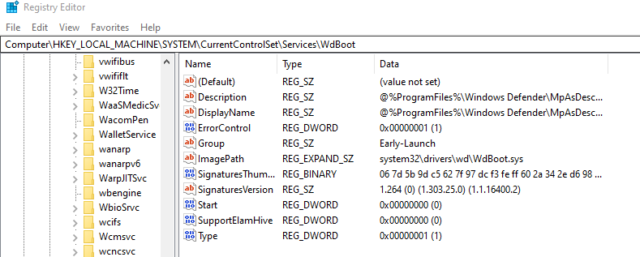

### Resources

1. msdn
2. Windows Internals book 

## Concepts

Specter malware -  privilege escalation, hardware exploit

EFI & UEFI

The EFI (Extensible Firmware Interface) system partition or ESP is a partition on a data storage device (usually a hard disk drive or solid-state drive) that is used by computers having the Unified Extensible Firmware Interface (UEFI).

UEFI has microsoft backup and repair. Grub is loaded in linux

in windows BCDLOADER is loaded.
Windows\Boot\EFI - memtest.efi efi

bcdedit - cmdline for boot loader

GUID number - unique GUID

Windows prefetch - 

System, System32, SysWOW64 - windows on windows

WinSxS- What is WinSxS?
Image result for winSxs
The WinSxS folder, stores multiple copies of dll, exe, and other system files to let multiple applications run in Windows without any compatibility problem. If you browse inside, you will see what looks like a lot of duplicate files, each having the same name

Shims used to create compatiblesoftware that works in WinSXS

shims application manager to spoof the application - APPCompat Toolkit 
https://techcommunity.microsoft.com/t5/ask-the-performance-team/demystifying-shims-or-using-the-app-compat-toolkit-to-make-your/ba-p/374947

USB - nowdays defines HID norms for usb devices which helps it to communicate with the computer

sys file for drivers

Windows defender files -
WdBoot.sys
WdFIleter.sys
WdLdr.sys

Ndis.sys - network filter driver 

mountmgr.sys

### Disable windows defender using registry
in registry
Computer\HKEY_LOCAL_MACHINE\SYSTEM\CurrentControlSet\Services\WdBoot
wdboot- start 0  - starts at lige system



### Singature in windows

https://www.thewindowsclub.com/catroot-catroot2-folder-reset-windows

signature are refered to CatRoot file

on x64 signing is mandatory for drivers. 

### Looking at an executable

MZ - windows executable
Cannot execute in DOS mode - to show that the program cannot run in 64 bit
EICAR test string - 16 bit string to check for antivirus chcek

PE - portable executable

.text - code the program itself
.data - content of program / strings
IAT - import address table contains dll that are loaded
EAT - the functions exported by the prigram

IAT populated by linker. 

.sys file can have an EAT that can export

ntoskrnl.exe  - can by accessible by .sys file can access kernel function.

### Windows

OS convergence - Windows are trying to create a unified os for all devices.

### User mode components

smss.exe: Session manager
wininit.exe: Part of boot time of  the system
Lasass.exe: hooked by mimikatz using privilege debug 
Service.exe : Service COntrol Manager
Services:

microsoft drivers list certificate msdn mimikatz

`tree` command

### Services

ACPI - can be used to burn the system also

services are hosted in srvhost.exe

Third party services run their own processes

csrss.exe service

WInlogon

`Get-Service | fl`

`Get-Process | fl`

`!process 0 0` 


### prefetch files

currently goes by the name SysMain

## Objects and handlers

Windows is objcet based operating system
while linux is file based

an object can be a file , process , thread and each object is represented by a handle
a handle is a number index refernecing in a table the object it represents
list of handles is given to processes
handle values are private to each process since the handle table is process defined

### UNicode

can work with multiple values

### msdn documentation

CopyFileEx function or any other FUnction isprovides additional capabilities - extended compatiibilities

all msdn use SAL (Saoftware annotation langugae) 

CopyFileA - for ascii
CopyFileU - for unicode

lpctstr type break down -
lp means long pointer
c is constatn
t stands for tchar - text string
STR - string

>Read remarks : if things dont work. 

movefile_fail_if_not_reboot - move file until reboot, can be used to move file during reboot, and then scheduled automatic startup

## Vocabulary

### Sessions
sessions - represent a group of rproesses that share windowing resources and a namespace 

security descriptor - this is part of an object that describes object security rights 

`Get-Acl "C:\Program Files (x86)\" | Format-List`

session 0 is system

session 1 is for interactive application - initialised by csrss.exe at boot-time

other sessions come from other users 

inside sessions we have processes

### Processes

different process may have different data in their respective address space

A process is composed of 

private virtual address
an executable program

list of open handle
a thread 


### Thread

thread is an entity within a process that Windows schedules for execution

thread has 
information about the cpu
two stacks : one for kernel and one for user mode
private storage area called thead local storage for use by subsutems
A unique number called thread ID
their own security context or token
fill access to the address space fo the process

allocating memory - we use calloc and malloc and ntmap, virtual alloc, stack,.

GetTHeradCOntext to get access to thread

### Fibers

Fibers allows an application to schedule its own threads of execution

### User mode threads

in windows 11 user mode scheduling is not supported

### Jobs

a list of process encapsulated in a single job. Example web browser like firefox.
its a process and has a process ID

`CreateRemoteThread` is used for dll injection.

### Kernel mode vs User mode

Ring 0 to RIng 3: 

kernel mode refers to a mode of execution in a process in which a processor grants acess to all system memory and all CPU instructions.

kernel32.dll and KernelBase - interfaes users with kernel
user32.dll - this is for gui

ntdll.dll - fundamental dll makes the transition from ntdll.dll

```
for example in am exe - that calls fread() - 
    will call ReadFile() -
        will call NtReadFile() usermode ring 3 has ntdll.dll
            which will call ZWReadFIle() ->
                IoReadFile() will finally accesss file system
                    Disk Manager
                        Bus Driver
                    
```

function prefixes - mm , ss , nt(new technology) , zw represent code family, rtl - run time library

shared source code initiative - microsoft is sharing its source code
https://www.microsoft.com/en-us/sharedsource/

microsoft keeps changing the syscall numbers so that no one can really call

### how antivirus hoook

They hook onto function so that they can monitor the buffer

but now it has a driver that is a pass through driver which is also called a mini filter
looking at an altitude (altitude means where the driver is placed in the assembly code)
https://learn.microsoft.com/en-us/windows-hardware/drivers/ifs/allocated-altitudes

if you are administrator can we remove the antivirus

preoperation - before accessing hardware
and post operation -  after accessing hardware

### NT Authority SYSTEM vs Process HAcker

we can convert to SYSTEM by OpenTokenPRivilge token

to convert into admin we need SeDebugPrivilege

trusted installer privilege - for windows update

### Virtual memory mapping on RAM

memory is accessed 4kb at a time

using page fold mechanism part of the memory is loaded into ram 
so the entire memory of the code is not loaded into a ram

if memory is laready loaded it acesses the memory otherwise it loads from the disk its called demand paging

in forensics we can look at pagefile to get the data 

When we use hybernation , our ram is pushed into the Disk and then is loaded from the disk when trying to start


### Reverse engineering with ida

1. find the all the entry point in IDA WinMAIN in terms of gui application
2. always change the literal
3. you can switch to psuedocode instead of assembly
4. 


                                                                                                                                                                                                                                                                                                                                                                                                                                                                                                                                                        

### Question 

what is a security descriptor?

how do we sync ida and windbg?

how dows microsoft develop such complex operating system and still remain error free

The zwReadFile that we have is the code written in C# and C?


