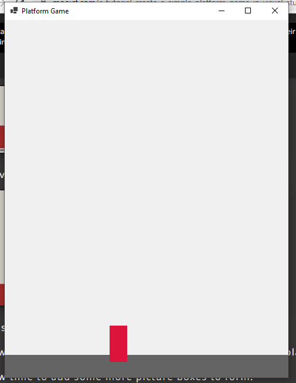
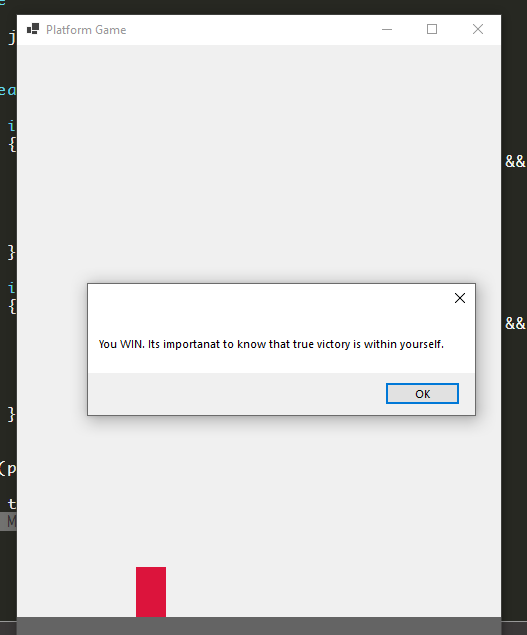

# bulding an rpg 

https://scottlilly.com/learn-c-by-building-a-simple-rpg-index/


# platform game

https://www.mooict.com/c-tutorial-create-a-simple-platform-game-in-visual-studio/

problem with form1


modified code and finally 

`(x is PictureBox && (string) x.Tag == "platform")`



added a win condition



```
namespace platformgame
{
    public partial class Form1 : Form
    {

        bool goleft = false;
        bool goright = false;
        bool jumping = false;

        int jumpSpeed = 10;
        int force = 8;
        int score = 0;
        public Form1()
        {
            InitializeComponent();
        }

        private void timer1_Tick(object sender, EventArgs e)
        {
            player.Top += jumpSpeed;

            if (jumping && force < 0)
            {
                jumping = false;
            }

            if (goleft)
            {
                player.Left -= 5;
            }

            if (goright)
            {
                player.Left += 5;
            }

            if (jumping)
            {
                jumpSpeed = -12;
                force -= 1;
            }
            else
            {
                jumpSpeed = 12;
            }

            foreach (Control x in this.Controls)
            {
                if (x is PictureBox && (string) x.Tag == "platform")
                {
                    if (player.Bounds.IntersectsWith(x.Bounds) && !jumping)
                    {
                        force = 8;
                        player.Top = x.Top - player.Height;
                    }
                }
            }

        }

        private void keyisdown(object sender, KeyEventArgs e)
        {
            if (e.KeyCode == Keys.Left)
            {
                goleft = true;
            }
            if (e.KeyCode == Keys.Right)
            {
                goright = true;
            }
            if (e.KeyCode == Keys.Space && !jumping)
            {
                jumping = true;
            }
        }

        private void keyisup(object sender, KeyEventArgs e)
        {
            if (e.KeyCode == Keys.Left)
            {
                goleft = false;
            }

            if (e.KeyCode == Keys.Right)
            {
                goright = false;
            }
            if (jumping)
            {
                jumping = false;
            }
        }

        private void Form1_Load(object sender, EventArgs e)
        {

        }

        private void player_Click(object sender, EventArgs e)
        {
            MessageBox.Show("You WIN. Its importanat to know that true victory is within yourself.");
        }
    }
}
```

