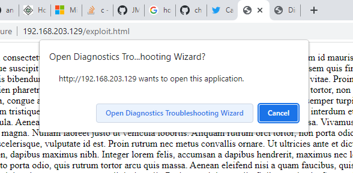

# For random tools/ pocs

## tornado 

https://www.kitploit.com/2022/05/tornado-anonymously-reverse-shell-over.html?m=1

Tornado is implements tor network with metasploit-framework tool and msfvenom module, you can easily create hidden services for your localhost .onion domain without portforwarding. If you have experience different remote administration tools, probably you know you need forward port with virtual private network or ngrok but in this sense with tornado, the tor network offers the possibility of making services in a machine accessible as hidden services without portforwarding, by taking advantage of the anonymity it offers and thereby preventing the real location of the machine from being exposed.

tornado can do

create hidden service with tor network
generate cross platform msfvenom payload with fully undetectable shellcode execution not shikata_ga_nai things
hidden service becomes available outside tor network and ready to reverse shell connection

https://github.com/samet-g/tornado/blob/main/tornado/core/undetectable.py

The undetectable payload used was xor and uptick

## Follina cve 2022

https://github.com/chvancooten/follina.py

Dont have word to verify however it is opening up troubleshooting wizrd.




## CVE 3025 3306

This exploit lets an attacker to write or read a PHP file present in ProFTPd server.
The mod_copy module in ProFTPD 1.3.5 allows remote attackers to read and write to
arbitrary files via the site cpfr and site cpto commands


https://github.com/t0kx/exploit-CVE-2015-3306

## POC of Windows Update Orchestrator Service Elevation of Privilege
Vulnerability (CVE-2020-1313)

doesnt work - access is denied error

https://github.com/irsl/CVE-2020-1313

## Analysis of Vulnerability in Apache CouchDB
(CVE-2022-24706)

Apache CouchDB < 3.2.2

https://github.com/XmasSnowISBACK/CVE-2022-24706

## Analysis of Visual Studio Tools for Office(VSTO) Vulnerability

not an exploit but a methodology

```
Exploit Procedure
a. Open the .sln file of the project and open the properties of the project.
b. In the Publish option (Figure 1), write the name of the folder where you want to deploy the
project and in the installation folder url, write the address where the entire project will be
hosted.
c. In the signing tab (Figure 2), add the certificate to bypass the mitigation.
d. In the POC folder, replace the decoy.docx with your story document and save as a
decoy.docx.
e. The C# code present inside ThisDocument.cs, write a payload in the form of hex string
and build the project.
f. Decoy.docx present inside the installation folder will be converted to an iso file to bypass
Mark of the Web.
```