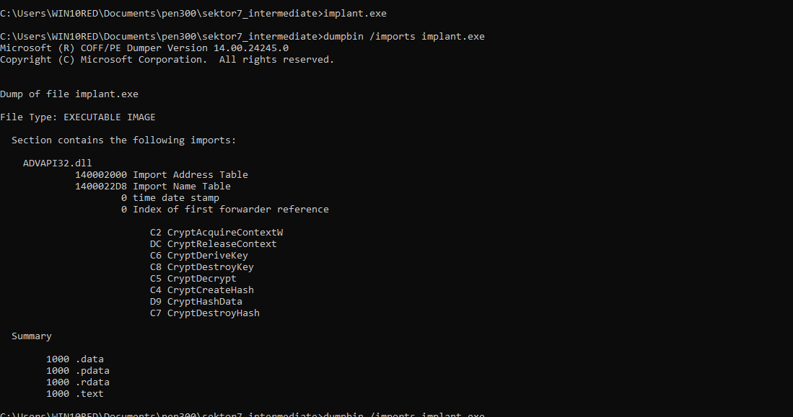

# sektor techniques

1. using custom function
2. using process injection
3. using encryption for payload and function name


# video 4

Lookinng at the functions exported by a dll.

Loader gets the PE header information of the dll, gets to the export directory
```
typedef struct _IMAGE_EXPORT_DIRECTORY {
    DWORD characteristics;
    DWORD TimeDateStamp;
    WORD MajorVersion;
    WORD MinorVersion;
    DWORD Name; // name of the dll
    DWORD Base; // first ordinal number
    DWORD NUmberOfFunctions // number of functions in the EXPORT ADDRESS TABLE (EAT)
    DWORD NumberOfNames // Number of entries in (1) (2)
    DWORD AddressOfFunctions // export address function
    DWORD AddressOfNames // pointer to names
    DWORD AddressOfNameOrdinals //array of index to eat


} IMAGE_EXPORT_DIRECTORY, *PIMAGE_EXPORT_DIRECTORY

```
in order to find the an exported function

we loop around AddressOfNames, find the string that matches, then look at the index of the string, check the address at the index in AddressOfNameOrdinals and go to the address in address of functions.

addressOfNamedOrdinals contains the address of the where the particular function is loaded.  

### looking at kernel32 with PE Bear

optional header, data directory, export functions

if you go to the address pointed by rhe export directory, then at that location you will find the strings.


We can look at exports to see everything parsed.

withou using pe bear we can also use dumpbin
`dumpbin /exports C:/Windows/System32/kernel32.dll `
  

# video 5

The relationship between import lookup table > hint name  < import address table

whenever the dll is loaded into memory it will look for imports in the import lookup table and then look at hints wheneveer the function is found it updates address in import address table. its a bit confusing in video actually.

firstthunk points ot import address table

in pe bear you can look at any process, in imports tab you can look at the what dlls are loaded and then in those dll you can look at firstthunk to look at the lookup table address.

 
```
typedef struct IMAGE_IMPORT_DESCRIPTOR {
    union {
        DWORD Characteristics;
        DWORD OriginalFirstThunk; // RVA of import lookup tbl  
    } DUMMYUNIONNAME;

    DWORD TimeStampStamp;
    DWORD ForwarderChain;
    DWORD Name;                     // name of imported dll
    DWORD FirstThunk;               //RVA of imported address tbl 
} IMAGE_IMPORT_DESCRIPTOR;
```

all of them can be found in winnt.h
 
need to go back to this.

# video 6

Things to try
try using array method to hide the function name - tried
add vm check - not checked
use process injection - this worked

The problem was with the way the functions we were trying to define virtually- done

starter code is ready

Now we need to define our own functions for getprocaddress and gemodulehandle.

TEB and PEB is discussed in getting getting handle to module
in wininternl.h

in windbg open notepad,

!PEB to look at PEB content 

dt _PEB for the structure of PEB block

the information came from pdb files and are stored in symbols file in vm.
    
$peb to look at current address of peb

dt _LDR_DATA_TABLE_ENTRY - to define any structure.

dt _LDR_DATA_TABLE_ENTRY address  

in dt _Teb at offset 0x60 we have pointer to _   PEB

captial L is for unicode strings.

The program works but is very complex.

# video 7  

Gerprocaddress and Gemodule handle would still be in our import tables as other functions use it
in order to avoid it we put in a pragma comment to our code such that the entrypoint is winmain.

using dumpbin you will see that there are no exports or imports.

however in helpers.cpp we still use certain functions. in order to not use them as well we can
1. get the getprocaddress and gemoduleHandle first and then resolve rest of functions
2. make an implementation of your own

when you directly put the winmain it gives you multiple errors

```
C:\Users\WIN10RED\Documents\pen300\sektor7_intermediate>compile.bat
helpers.cpp
starter_code.cpp
Generating Code...
helpers.obj : error LNK2019: unresolved external symbol strchr referenced in function "__int64 (__cdecl*__cdecl hlpGetProcAddress(struct HINSTANCE__ *,char *))(void)" (?hlpGetProcAddress@@YAP6A_JXZPEAUHINSTANCE__@@PEAD@Z)
helpers.obj : error LNK2019: unresolved external symbol _strdup referenced in function "__int64 (__cdecl*__cdecl hlpGetProcAddress(struct HINSTANCE__ *,char *))(void)" (?hlpGetProcAddress@@YAP6A_JXZPEAUHINSTANCE__@@PEAD@Z)
helpers.obj : error LNK2019: unresolved external symbol __imp_lstrcmpiW referenced in function "struct HINSTANCE__ * __cdecl hlpGetModuleHandle(wchar_t const *)" (?hlpGetModuleHandle@@YAPEAUHINSTANCE__@@PEB_W@Z)
helpers.obj : error LNK2019: unresolved external symbol free referenced in function "__int64 (__cdecl*__cdecl hlpGetProcAddress(struct HINSTANCE__ *,char *))(void)" (?hlpGetProcAddress@@YAP6A_JXZPEAUHINSTANCE__@@PEAD@Z)
starter_code.obj : error LNK2019: unresolved external symbol __imp_WaitForSingleObject referenced in function WinMain
starter_code.obj : error LNK2019: unresolved external symbol __imp_CreateThread referenced in function WinMain
starter_code.obj : error LNK2019: unresolved external symbol __imp_VirtualProtect referenced in function WinMain
starter_code.obj : error LNK2019: unresolved external symbol __acrt_iob_func referenced in function printf
starter_code.obj : error LNK2019: unresolved external symbol __stdio_common_vfprintf referenced in function _vfprintf_l
implant.exe : fatal error LNK1120: 9 unresolved externals
```
after removing all references with typedef



after using payload


