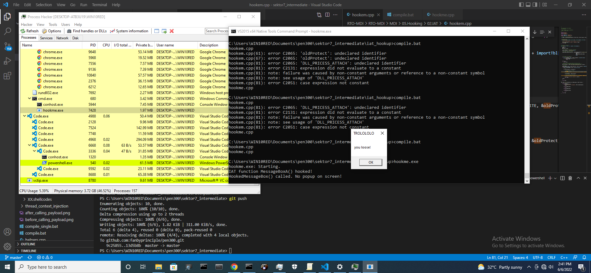
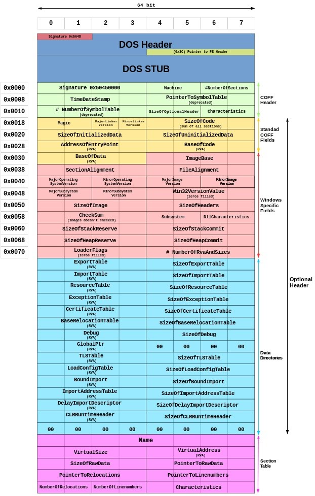

# sektor techniques

1. using custom function
2. using process injection
3. using encryption for payload and function name
4. using our own definition of getProcAddress, getModuleHandle
5. linking start with winmain 
6. thread context injection - may crash the process
7. Section Map view injection - also closes the host process.
8. Early bird APC call - spawns a new process.
9. reflective dll loader

# video 4

Lookinng at the functions exported by a dll.

Loader gets the PE header information of the dll, gets to the export directory
```
typedef struct _IMAGE_EXPORT_DIRECTORY {
    DWORD characteristics;
    DWORD TimeDateStamp;
    WORD MajorVersion;
    WORD MinorVersion;
    DWORD Name; // name of the dll
    DWORD Base; // first ordinal number
    DWORD NUmberOfFunctions // number of functions in the EXPORT ADDRESS TABLE (EAT)
    DWORD NumberOfNames // Number of entries in (1) (2)
    DWORD AddressOfFunctions // export address function
    DWORD AddressOfNames // pointer to names
    DWORD AddressOfNameOrdinals //array of index to eat


} IMAGE_EXPORT_DIRECTORY, *PIMAGE_EXPORT_DIRECTORY

```
in order to find the an exported function

we loop around AddressOfNames, find the string that matches, then look at the index of the string, check the address at the index in AddressOfNameOrdinals and go to the address in address of functions.

addressOfNamedOrdinals contains the address of the where the particular function is loaded.  

### looking at kernel32 with PE Bear

optional header, data directory, export functions

if you go to the address pointed by rhe export directory, then at that location you will find the strings.


We can look at exports to see everything parsed.

withou using pe bear we can also use dumpbin
`dumpbin /exports C:/Windows/System32/kernel32.dll `
  

# video 5

The relationship between import lookup table > hint name  < import address table

whenever the dll is loaded into memory it will look for imports in the import lookup table and then look at hints wheneveer the function is found it updates address in import address table. its a bit confusing in video actually.

firstthunk points ot import address table

in pe bear you can look at any process, in imports tab you can look at the what dlls are loaded and then in those dll you can look at firstthunk to look at the lookup table address.

 
```
typedef struct IMAGE_IMPORT_DESCRIPTOR {
    union {
        DWORD Characteristics;
        DWORD OriginalFirstThunk; // RVA of import lookup tbl  
    } DUMMYUNIONNAME;

    DWORD TimeStampStamp;
    DWORD ForwarderChain;
    DWORD Name;                     // name of imported dll
    DWORD FirstThunk;               //RVA of imported address tbl 
} IMAGE_IMPORT_DESCRIPTOR;
```

all of them can be found in winnt.h
 
need to go back to this.

# video 6

Things to try
try using array method to hide the function name - tried
add vm check - not checked
use process injection - this worked

The problem was with the way the functions we were trying to define virtually- done

starter code is ready

Now we need to define our own functions for getprocaddress and gemodulehandle.

TEB and PEB is discussed in getting getting handle to module
in wininternl.h

in windbg open notepad,

!PEB to look at PEB content 

dt _PEB for the structure of PEB block

the information came from pdb files and are stored in symbols file in vm.
    
$peb to look at current address of peb

dt _LDR_DATA_TABLE_ENTRY - to define any structure.

dt _LDR_DATA_TABLE_ENTRY address  

in dt _Teb at offset 0x60 we have pointer to _   PEB

captial L is for unicode strings.

The program works but is very complex.

# video 7  

Gerprocaddress and Gemodule handle would still be in our import tables as other functions use it
in order to avoid it we put in a pragma comment to our code such that the entrypoint is winmain.

using dumpbin you will see that there are no exports or imports.

however in helpers.cpp we still use certain functions. in order to not use them as well we can
1. get the getprocaddress and gemoduleHandle first and then resolve rest of functions
2. make an implementation of your own

when you directly put the winmain it gives you multiple errors

```
C:\Users\WIN10RED\Documents\pen300\sektor7_intermediate>compile.bat
helpers.cpp
starter_code.cpp
Generating Code...
helpers.obj : error LNK2019: unresolved external symbol strchr referenced in function "__int64 (__cdecl*__cdecl hlpGetProcAddress(struct HINSTANCE__ *,char *))(void)" (?hlpGetProcAddress@@YAP6A_JXZPEAUHINSTANCE__@@PEAD@Z)
helpers.obj : error LNK2019: unresolved external symbol _strdup referenced in function "__int64 (__cdecl*__cdecl hlpGetProcAddress(struct HINSTANCE__ *,char *))(void)" (?hlpGetProcAddress@@YAP6A_JXZPEAUHINSTANCE__@@PEAD@Z)
helpers.obj : error LNK2019: unresolved external symbol __imp_lstrcmpiW referenced in function "struct HINSTANCE__ * __cdecl hlpGetModuleHandle(wchar_t const *)" (?hlpGetModuleHandle@@YAPEAUHINSTANCE__@@PEB_W@Z)
helpers.obj : error LNK2019: unresolved external symbol free referenced in function "__int64 (__cdecl*__cdecl hlpGetProcAddress(struct HINSTANCE__ *,char *))(void)" (?hlpGetProcAddress@@YAP6A_JXZPEAUHINSTANCE__@@PEAD@Z)
starter_code.obj : error LNK2019: unresolved external symbol __imp_WaitForSingleObject referenced in function WinMain
starter_code.obj : error LNK2019: unresolved external symbol __imp_CreateThread referenced in function WinMain
starter_code.obj : error LNK2019: unresolved external symbol __imp_VirtualProtect referenced in function WinMain
starter_code.obj : error LNK2019: unresolved external symbol __acrt_iob_func referenced in function printf
starter_code.obj : error LNK2019: unresolved external symbol __stdio_common_vfprintf referenced in function _vfprintf_l
implant.exe : fatal error LNK1120: 9 unresolved externals
```
after removing all references with typedef


after using payload


runtime may detect, next thing to do is try process injection with no imports.

first lets try to refine getting process id programme.

# video 9

thread context injection - we inject into the thread and change context into starting our shellcode. 

this may crash the process itself.

but calc.exe spawn

# video 10

Mapview code injection

using mechanism of interprocess communication when two processes want to use a shared memory section.

We create a local view in our code section, we use create remote view to share the memeory, and then we execute the code.

closes the host process after injection.

# video 11

Early bird APC call variation 
workds but detection.
also doesnt seem very useful.

# video 13 - 

reflective loader introduction

there is an attack dll and a target process

attack dll first resolves kernel 32 and ntdll, then it looks for all imports of the dll and then resolves and calls dllmain to execute.

originally by stephenfewer in his github. 

# video 15 -

walkthrough of how the dll is injected

# video 16 - 

A new method of converting the entire thing into a shellcode.

https://github.com/monoxgas/sRDI

# video 14 - 

explantation of reflective dll injection

https://github.com/stephenfewer/ReflectiveDLLInjection  

explanation of this code here. need to do it again.

image relocations - our PE might have imagebaseaddress however it might also have an image relocation section. It basically means that our PE dowsn't need to comply with image base addresses. 

in order to understand the reflective loader, ill have to start from scratch understand the binary imports exports etc and the structure of PE. Its a long grind dude.

# video 17 

- checking the compatibility of code injection.   

64 bit implant can work in 32 bit
but 32 bit implant cannot work in 64 bit implant.

how 32 bit application run on windows system
wow64 is a windows on windows subsytem through which you can run 32 bit applications on 64 bit windows.
wow dll serve as the interface between the 32 bit program and the 64 bit program. THis is through a common address which is called the heavens gate.


# looking at all the compiler options

```
@ECHO OFF

cl.exe /nologo /Ox /MT /W0 /GS- /DNDEBUG /Tp *.cpp /link /OUT:implant.exe /SUBSYSTEM:WINDOWS
del *.obj
```

/nologo	Suppresses display of sign-on banner.
/MT	Compiles to create a multithreaded executable file, by using LIBCMT.lib.
/W0, /W1, /W2, /W3, /W4	Set output warning level.
/GS[-]	Checks buffer security.
/Tp	Specifies a C++ source file.
/Tc specifies a C source file
/link	Passes the specified option to LINK.
/OUT: - name of output file 
/SUBSYSTEM:WINDOWS creates a win32 application
/SUBSYSTEM:CONSOLE creates a console application

only mt and gs seem like valid options. thats not true see subsystem.

# video 18 

how to load a 32 bit payload into a 64 bit application. need to do

# video 19 

API hooking

how to make changes to the process at runtime when the shellcode isnt available.

even debugger use api hooking to debug the process. it adds an exception and the control is given back to the debugger.

Well explained. 

# video 20

Detours for api hooking.

 There will bea detour function that will replace 5 statements with a jmp so that it goes to a tramplone 

 func1 -> func2
 after detour ,

 func1 -> detour func ->  trampoline func -> func2


# video 21

using import address table to replace the function. didnt aunderstand.



# video 22

inline hooking of the functions, we use a jmp followed by our address to get the control from the program to hook after injecting the dll.

# video 23

Multipayload control to ensure that only one versino of the payload is running at one time, mutex works.

# video 24

Veracrypt hacking - hands on ot get password of the volume. 

using all mechanisms combined.

# to do 

1. need to understand the structure of PE using PE bear.

looking at various videos for that

## rto video 2

PE is composed of 

signature, Dos Header, pointer to PE header, DOS Stub

in detail:



compare corkami pe headers to one shown by pe bear.


so pe contains file headers and followed by sections

dos header
dos stub
nt header
section header

trying to work through export section.

able to work thorugh c code. but how to get the output.
This is resolved by changing the subsyttem of cto wiconsole from wins to console.

