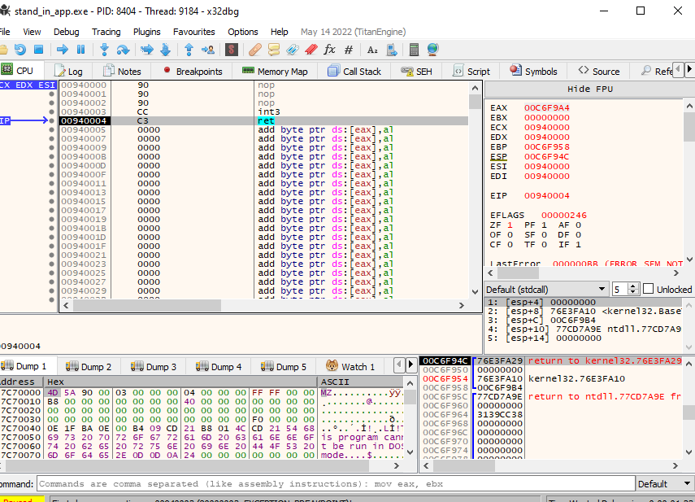

Hasherzade - creates really interesting tools.

6 different section -

.text

.rdata

.data

.pdata

.rsrc

.reloc

dumpbin in windows also performs the same activity as the metadata

 headers - metadata
 section - content of PE

we can make dll through clang
`
//cl.exe /D_USRDLL /D_WINDLL stand_in_app.cpp /MT /link /DLL /OUT:implant.dll`

### places to put your payload

in order to put shellcode in text section we need to put it in someplace like `.text` section that is the main program.

to put it in data we need to tell the compiler that `.shellcode` is read only memory

to put in `.rsrc` section,  we need to use certain api calls to call the shellcoden 

### putting payload in  data section

our variable ended in the data section because we delared it as a global variable.

looking at the address
38a000 addr of payload
7d0000 exec memory address

Address  Data       
00940001 90 90 CC C3
00B63019 90 90 CC C3

